# Software Analysis: Dynamic Views

**Guardian Escolar**

*Analysis of the dynamic views of the Guardian Escolar system — safe school transportation platform*

**Project team members:**

- Juan Pablo Chala Ramírez
- Johan Smith Santamaria Fernández
- Sharik Dayanna Rojas Ibarra

**Program:** Technology in Software Analysis and Development
**Cohort (Ficha):** 3145556
**Training center:** La Industria, La Empresa y Los Servicios (SENA)
**Location:** Neiva, Huila, Colombia
**Date:** October 2026

---

## Table of contents

1. [Introduction](#1-introduction)
2. [General system description](#2-general-system-description)
3. [Use-case model](#3-use-case-model)
4. [Sequence diagrams](#4-sequence-diagrams)
5. [Activity diagrams](#5-activity-diagrams)
6. [State diagrams](#6-state-diagrams)
7. [Data flow model](#7-data-flow-model)
8. [Process logic description](#8-process-logic-description)
9. [Event, error, and exception handling](#9-event-error-and-exception-handling)
10. [Concurrency and communication aspects](#10-concurrency-and-communication-aspects)
11. [Prototypes and screen flow](#11-prototypes-and-screen-flow)
12. [Traceability matrix](#12-traceability-matrix)
13. [Annexes](#13-annexes)
14. [References](#14-references)

---

# 1. Introduction

## 1.1 Purpose

This document describes the **dynamic views** of the Guardian Escolar system, a platform created to manage, monitor, and improve the safety of school transportation in the municipality of Neiva (Huila, Colombia). The dynamic view complements the static view (domain and class model) by describing **how** the system behaves over time: who interacts with each use case, in which order operations are executed, how data is transformed among the services, which events are generated, and how the platform reacts to errors, exceptions, and concurrency conditions.

The purpose of this document is:

- To establish the system's **use-case model** with complete functional specifications.
- To represent, through **sequence, activity, and state diagrams**, the critical business flows (QR boarding and alighting, real-time GPS monitoring, notifications, trips, and incidents).
- To describe the **data flow** among actors, processes, and data stores.
- To document the **process logic**, business rules, event, error, and exception handling, and the concurrency and inter-service communication aspects.
- To serve as an input for development, verification, and software quality testing.

## 1.2 Scope

The scope of this analysis covers the dynamic processes of the following functional modules of the Guardian Escolar system:

- User, family, and student–guardian linkage management.
- Authentication, password recovery, and session management.
- School, campus, bus fleet, driver, route, stop, and assignment management (bus–route and student–route).
- Boarding and alighting control of students through QR codes.
- Real-time notifications and alerts to guardians.
- Bus location monitoring through GPS devices.
- Trip management (starting and finishing the execution of a route).
- Incident or emergency reporting during the trip.
- Interface customization (theme and language) in the client applications.

Out of scope: the modeling of physical data persistence, infrastructure deployment details, and the static view of the system (complete class diagram), which is referenced as an input but is not replaced.

## 1.3 Audience

This document is intended for:

| Audience | Expected use |
|----------|--------------|
| **Analysts** | Validate the functional coherence and traceability of the requirements |
| **Developers** | Guide the implementation of flows, services, events, and validations |
| **Client** | Understand the system behavior and the school transportation process flows |
| **Quality assurance (QA) team** | Design test cases and verify alternative and exception flows |
| **Architects** | Review communication, concurrency, and event-handling patterns |

## 1.4 Definitions, acronyms, and abbreviations

| Term / acronym | Definition |
|----------------|------------|
| **Guardian (parent)** | Adult responsible for one or more students, authorized to consult their transportation information and to receive notifications. |
| **Boarding** | Operational event that records a student getting on a bus. |
| **Alighting** | Operational event that records a student getting off the bus. |
| **Alert** | High-priority communication generated by an event or operational condition (e.g., GPS signal loss, deviation, prolonged stop). |
| **QR code** | Individual visual identifier of each student, used to validate boarding and alighting. |
| **API** | Application Programming Interface. |
| **JWT** | JSON Web Token: token-based authentication mechanism based on a signed token. |
| **RBAC** | Role-Based Access Control. |
| **gRPC** | Typed and efficient synchronous communication mechanism between services. |
| **Kafka** | Asynchronous messaging platform (event broker). |
| **DLQ** | Dead Letter Queue: queue of failed messages for retries or analysis. |
| **GPS** | Global Positioning System; VT03F device integrated through the TCP protocol. |
| **DDD** | Domain-Driven Design. |
| **SLA/SLO** | Service level agreements and objectives. |

## 1.5 Reference documents

| Document | Description |
|----------|-------------|
| Software Requirements Specification | Defines the functional requirements (FR), non-functional requirements (NFR), and user stories of the system. |
| Static view of the system (domain and class model) | Defines the entities, aggregates, value objects, invariants, and domain services with which this document maintains strict naming consistency. |
| Software technical proposal | Defines the microservices architecture, communication patterns, and design decisions. |
| Software design | Defines the integration contracts, the data model, and the application interfaces. |
| APA guidelines (seventh edition) | Reference guide used for bibliographic citations. |

The complete list of bibliographic references is presented in section [14. References](#14-references).

## 1.6 Version control

| Version | Date | Author | Change description |
|---------|------|--------|--------------------|
| 1.0 | 10/10/2026 | Guardian Escolar team | Initial version of the document: dynamic views (use cases, sequence, activity, states, data flow, logic, events, concurrency, prototypes, and traceability). |

---

# 2. General system description

## 2.1 System summary

Guardian Escolar is a software platform that manages the daily transportation of students to and from their schools. It allows schools to organize buses, drivers, routes, stops, students, and families, and provides boarding and alighting control of students through QR codes, real-time monitoring of the buses' location, and immediate notification of the relevant transportation events to guardians (boarding, alighting, GPS signal loss, deviations, prolonged stops, and incidents).

The platform is composed of a set of independent microservices whose synchronous communication is carried out through gRPC and REST (through the gateway) and whose asynchronous communication is carried out through a message broker (Kafka). The client applications are a web application for administration (administrator and super-administrator panels) and a mobile application for guardians, drivers, and students.

## 2.2 System context

The following diagram illustrates the general context: the client applications and external systems interact with the platform through the API Gateway, the single public entry point; the domain services communicate with each other synchronously or asynchronously and persist in a relational database schema with logical isolation per service.

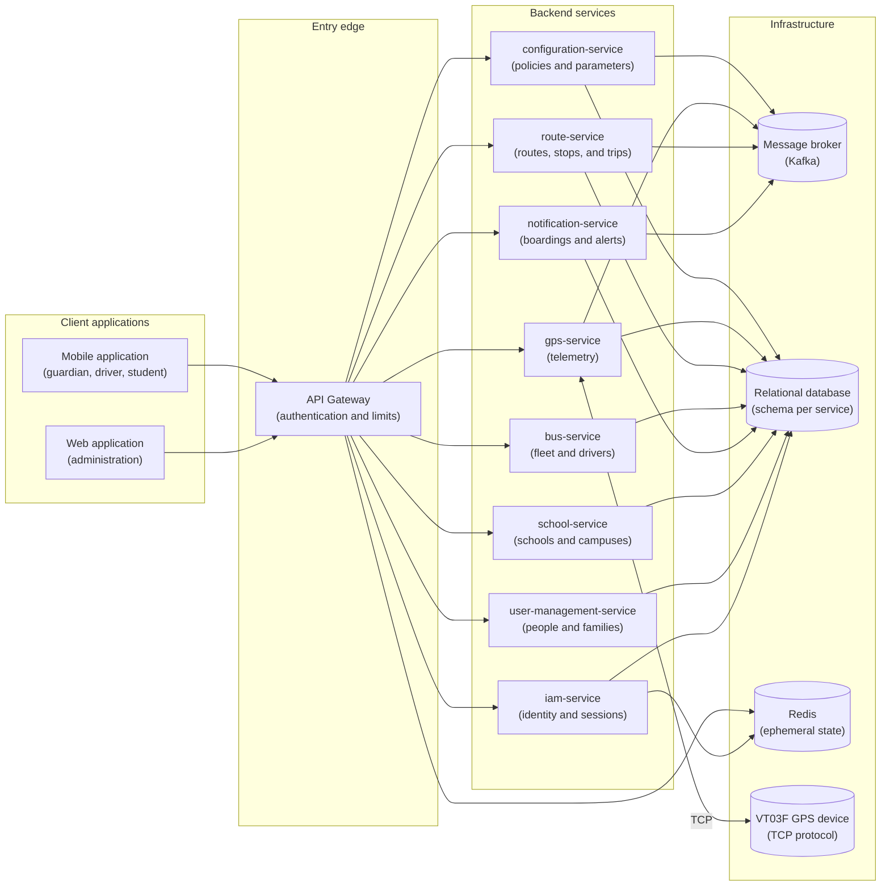

**Explanation.** All requests from the client applications enter through the gateway, which validates the access token and injects the user identity before routing the request to the corresponding service. The domain services are stateful regarding their own data (each persists in its schema) and communicate asynchronously through events for the processes that do not require an immediate response. The VT03F GPS device is integrated through the TCP protocol with the telemetry service, which processes the positions and publishes events so that other services update the bus location and evaluate alert conditions.

## 2.3 Main actors and roles

| Actor | Technical role | Description |
|-------|----------------|-------------|
| **SUPER_ADMIN** | Super-administrator | Global role: manages administrators and schools, and manages its own profile and contact data. |
| **ADMIN** | Administrator | Operational role: manages users (students, parents, drivers), families, buses, stops, routes, and assignments. |
| **Guardian** | Parent/Guardian | Consults the route of their students, receives notifications and alerts, and views the live location of the bus. |
| **Driver** | Driver | Consults their assigned route, starts and finishes the trip, scans the boarding and alighting QR codes, and reports incidents. |
| **Student** | Student | Views their personal QR code and consults their route. |
| **VT03F GPS device** | External system | Continuously sends the bus position (latitude, longitude, speed, course, and GPS date) through TCP. |
| **System** | Automatic actor | Executes automatic processes: event detection, generation, and sending of notifications and alerts. |
| **External providers** | External systems | Push notification sending, SMS messaging, email, and interactive maps. |

## 2.4 Assumptions and constraints

**Assumptions:**

1. User accounts are **not self-registered**: the administrator (ADMIN) or super-administrator (SUPER_ADMIN) creates all ecosystem accounts (FR-1.1).
2. The guardian is linked to one or more students through the family linkage managed by the administrator (FR-1.4).
3. The driver is assigned to the **bus**, and reaches their routes transitively through the bus assigned to the route; there is no direct driver–route table (decision FR-3.6).
4. Each bus has **a single active trip** at a time (FR-7.1).
5. The student must be assigned to the route to board; alighting requires a previous active boarding (FR-4.2, FR-4.3).
6. The initial operating environment is the municipality of Neiva, Huila (Colombia).
7. The user interface can be customized in theme and language; customization is resolved in the client applications (FR-10.1, FR-10.2).

**Constraints:**

1. All private endpoints require a valid JWT; tokens expire in 1 hour and refresh tokens in 7 days (NFR-004).
2. Inter-service communication is performed with gRPC (synchronous) and Kafka (asynchronous); another service's database is never accessed directly (ADR-002, ADR-004, ADR-005).
3. Each service persists in its own schema within a shared relational instance; foreign keys between schemas are maintained as direct references.
4. The processing of minors' personal data requires parental authorization according to Colombian regulations (Law 1581 of 2012 and Decree 1377 of 2013).
5. The mobile application and some notification flows may be under development or partially implemented; this document describes the target behavior of the system.

## 2.5 Relationship with the static view

The static view of the system defines the entities, aggregates, value objects, and invariants of the domain (DDD tactical model). This document maintains **strict naming consistency** with that view: the classes, attributes, and methods that appear in the dynamic diagrams are the same as those of the domain model.

The main domain aggregates are:

- `Person` and `Family` (user management context).
- `Profile` (security context).
- `School` (school management context).
- `Bus` and its assignments (fleet management context).
- `Route` with `RouteStop`, `RouteBusAssignment`, and `RouteStudentAssignment` (route management context).
- `GpsDevice` with `GpsLocation` (GPS telemetry context).
- `Boarding` (boarding context).
- `Alert` (alerts context).

The following class diagram summarizes the main entities and their relationships, as defined in the static view:

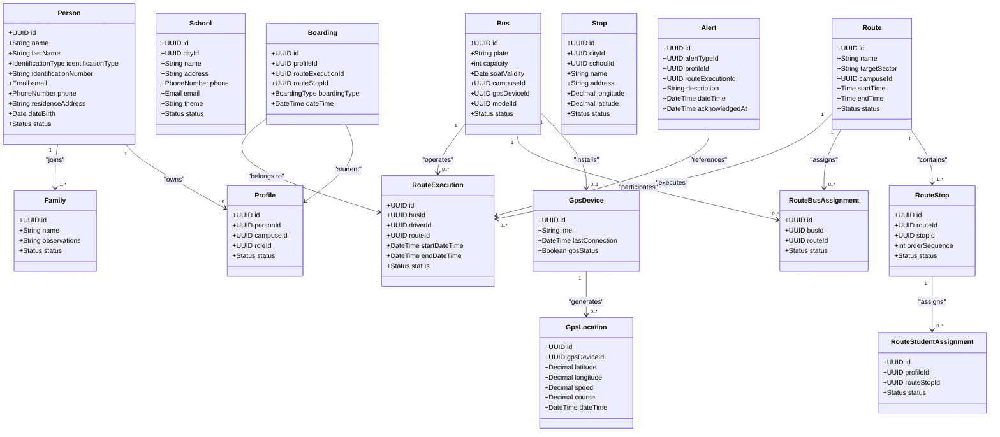

**Explanation.** The diagram summarizes the entities and aggregates defined in the static view; the relationships between contexts are implemented through identity references (shared identifiers) and, when a context needs another context's data, through APIs or events, never through direct database access. The dynamic flows described in sections 4 through 7 operate on these same entities and respect their invariants (see section 8.1).---

# 3. Use-case model

## 3.1 General use-case diagram

The following diagram presents the general use-case model of the system. The actors are represented on the left and the use cases inside the system boundary.

```mermaid
flowchart TB
    subgraph SYSTEM["Guardian Escolar system"]
        direction TB
        UC1(("UC-01 Sign in and renew session"))
        UC2(("UC-02 Recover password"))
        UC3(("UC-03 Manage user accounts"))
        UC4(("UC-04 Manage families and link students"))
        UC5(("UC-05 Manage schools and campuses"))
        UC6(("UC-06 Manage bus fleet"))
        UC7(("UC-07 Assign driver to bus"))
        UC8(("UC-08 Manage routes and stops"))
        UC9(("UC-09 Assign bus to route"))
        UC10(("UC-10 Assign students to route"))
        UC11(("UC-11 Query assigned route"))
        UC12(("UC-12 Start and finish trip"))
        UC13(("UC-13 Record QR boarding and alighting"))
        UC14(("UC-14 View QR code"))
        UC15(("UC-15 Receive notifications and alerts"))
        UC16(("UC-16 Monitor bus in real time"))
        UC17(("UC-17 Report incident"))
        UC18(("UC-18 Manage profile and contact data"))
        UC19(("UC-19 Customize theme and language"))
    end

    SADMIN(["Super-administrator"]) --> UC1
    SADMIN --> UC3
    SADMIN --> UC5
    SADMIN --> UC18

    ADMIN(["Administrator"]) --> UC1
    ADMIN --> UC3
    ADMIN --> UC4
    ADMIN --> UC6
    ADMIN --> UC7
    ADMIN --> UC8
    ADMIN --> UC9
    ADMIN --> UC10
    ADMIN --> UC18

    GUARDIAN(["Guardian"]) --> UC1
    GUARDIAN --> UC11
    GUARDIAN --> UC15
    GUARDIAN --> UC16

    DRIVER(["Driver"]) --> UC1
    DRIVER --> UC11
    DRIVER --> UC12
    DRIVER --> UC13
    DRIVER --> UC17

    STUDENT(["Student"]) --> UC1
    STUDENT --> UC11
    STUDENT --> UC14

    SYS(["System"]) --> UC15
    SYS --> UC16

    GPSDEV(["VT03F GPS device"]) --> UC16
```

**Explanation.** The model distinguishes five human actors (super-administrator, administrator, guardian, driver, and student) and two non-human actors (automatic system and GPS device). The authentication use cases (UC-01, UC-02) are common to all roles; the administration use cases (UC-03 through UC-10) correspond to the administrative roles; the operational use cases (UC-11 through UC-17) correspond to the driver, the student, and the guardian; and the customization use cases (UC-18, UC-19) are cross-cutting.

## 3.2 System actors

| Actor | Description | Associated use cases |
|-------|-------------|----------------------|
| **SUPER_ADMIN** | Global role that manages administrators and schools | UC-01, UC-03, UC-05, UC-18 |
| **ADMIN** | Operational role that manages the school and transportation ecosystem | UC-01, UC-03, UC-04, UC-06, UC-07, UC-08, UC-09, UC-10, UC-18 |
| **Guardian** | Responsible for one or more students | UC-01, UC-11, UC-15, UC-16 |
| **Driver** | Operator of the bus and the route | UC-01, UC-11, UC-12, UC-13, UC-17 |
| **Student** | Beneficiary of school transportation | UC-01, UC-11, UC-14 |
| **System** | Automatic actor that detects events and sends notifications and alerts | UC-15, UC-16 |
| **VT03F GPS device** | Telemetry hardware that reports the bus position | UC-16 |

## 3.3 Use-case catalog

| ID | Use case | Primary actor | Associated requirements | Priority |
|----|----------|---------------|-------------------------|----------|
| UC-01 | Sign in and renew session | All roles | FR-2.1, FR-2.2 | High |
| UC-02 | Recover password | All roles | FR-2.1 (derived: recovery flow) | Medium |
| UC-03 | Manage user accounts | ADMIN, SUPER_ADMIN | FR-1.1, FR-1.2, FR-1.3 | High |
| UC-04 | Manage families and link students | ADMIN | FR-1.4 | High |
| UC-05 | Manage schools and campuses | SUPER_ADMIN | Master data (School, SchoolCampus) | Medium |
| UC-06 | Manage bus fleet | ADMIN | FR-3.8 | Medium |
| UC-07 | Assign driver to bus | ADMIN | FR-3.6 | High |
| UC-08 | Manage routes and stops | ADMIN | FR-3.1, FR-3.2, FR-3.3, FR-3.4 | High |
| UC-09 | Assign bus to route | ADMIN | FR-3.5 | Medium |
| UC-10 | Assign students to route | ADMIN | FR-3.7 | High |
| UC-11 | Query assigned route | Guardian, Driver, Student | FR-9.1, FR-9.2 | High |
| UC-12 | Start and finish trip | Driver | FR-7.1, FR-7.2 | High |
| UC-13 | Record QR boarding and alighting | Driver | FR-4.2, FR-4.3, FR-5.1 | High |
| UC-14 | View QR code | Student | FR-4.1 | Medium |
| UC-15 | Receive notifications and alerts | Guardian (System as sender) | FR-5.2, FR-5.3, FR-5.4, FR-8.2 | High |
| UC-16 | Monitor bus in real time | Guardian (System, GPS) | FR-6.1, FR-6.2, FR-6.3 | High |
| UC-17 | Report incident | Driver | FR-8.1 | Medium |
| UC-18 | Manage profile and contact data | ADMIN, SUPER_ADMIN | Master authentication data (profile) | Medium |
| UC-19 | Customize theme and language | All roles (client) | FR-10.1, FR-10.2 | Low |

## 3.4 Use-case specifications

### UC-01 Sign in and renew session

| Field | Description |
|-------|-------------|
| **Actors** | All roles (SUPER_ADMIN, ADMIN, Guardian, Driver, Student) |
| **Description** | The user enters their credentials (identity document number and password), receives a JWT access token expiring in 1 hour and a refresh token valid for 7 days, and can renew the session or log out securely. |
| **Preconditions** | The user has an account created by an administrator and their profile is in `ACTIVE` status. |
| **Postconditions** | The token pair (access and refresh) is issued, the session is registered, and the user can invoke the operations authorized by their role (RBAC). |
| **Business rules** | INV-PRO-003 (an inactive profile cannot sign in); NFR-004 (token expiration). |
| **Traceability** | FR-2.1, FR-2.2 · HU-IAM-001 |

**Main flow:**

1. The user selects "Sign in" in the application and enters their identity document number and password.
2. The application sends the credentials to the identity service through the gateway.
3. The service validates the syntax of the credentials and verifies the profile status.
4. The service validates the password (secure hash) and queries the role and permissions of the profile.
5. If the validation succeeds, the service generates the JWT access token (1 hour) and the refresh token (7 days) and registers the session.
6. The application stores the tokens securely and presents the panel or main view according to the role.

**Alternative flows:**

- A1 (renewal): when the access token expires, the application requests renewal with the refresh token; the service validates that the token is not revoked, issues a new token pair, and marks the previous refresh token as used.
- A2 (logout): the user finishes the session; the service revokes the refresh token and adds the access token to the revocation list to prevent its reuse.

**Exceptions:**

- E1: Invalid credentials → the user is informed and the failed attempt is logged.
- E2: Inactive profile → access is rejected with the corresponding message.
- E3: Revoked or expired refresh token → authentication is requested again.

---

### UC-02 Recover password

| Field | Description |
|-------|-------------|
| **Actors** | All roles |
| **Description** | The user requests the recovery of their password by entering the registered email; the system validates their identity through a code sent by email or SMS, and allows setting a new password in accordance with the current security policy. |
| **Preconditions** | The user's account exists in the system and has a registered contact medium. |
| **Postconditions** | The password is reset, the recovery token is invalidated, and the user can sign in with the new password. |
| **Business rules** | Password policy of the configuration service (length, complexity, and expiration); request limit per IP address and per account. |
| **Traceability** | FR-2.1 (recovery flow) · HU-IAM-001 |

**Main flow:**

1. The user chooses "Forgot your password?" and enters their email.
2. The system validates that the account exists and generates a single-use recovery code with expiration.
3. The system sends the code to the registered email or phone.
4. The user enters the code; the system validates it.
5. The user defines the new password; the system validates the security policies.
6. The system updates the password hash, invalidates the active tokens of the account, and redirects to sign in.

**Exceptions:**

- E1: The account does not exist or the contact medium does not match → a generic message is shown to avoid revealing account information.
- E2: The code is incorrect or expired → a limited number of retries is allowed.
- E3: Request limit exceeded → rate limiting is applied per IP and per account.

---

### UC-03 Manage user accounts

| Field | Description |
|-------|-------------|
| **Actors** | ADMIN, SUPER_ADMIN |
| **Description** | The administrator creates, queries, updates, and activates or deactivates the accounts of students, parents, drivers, and administrators, assigning the corresponding role to each account. Deactivation blocks system access and assignments. |
| **Preconditions** | The authenticated user has the ADMIN or SUPER_ADMIN role with the account management permission. |
| **Postconditions** | The person and their profile are created or updated; the creation of the person triggers the domain event to generate the security profile. |
| **Business rules** | INV-PER-001 through INV-PER-003 (unique document, mandatory names, email format); INV-PRO-001 and INV-PRO-002 (profile with valid person and role). |
| **Traceability** | FR-1.1, FR-1.2, FR-1.3 · HU-USER-004 |

**Main flow:**

1. The administrator selects the account type (student, parent, driver, or administrator) and enters the person's data.
2. The user management service validates the document uniqueness, the email format, and the mandatory data, and persists the `Person` entity.
3. The system publishes the person creation event corresponding to the role (student, parent, driver, or administrator).
4. The identity service consumes the event and creates the `Profile` with the assigned role and its initial status.
5. The administrator can update the data; the system validates the business rules again.
6. The administrator can activate or deactivate the account; deactivation blocks access and assignments.

**Alternative flows:**

- A1 (deactivation): the account moves to `INACTIVE` status; the user's active assignments are invalidated and session tokens are revoked.

**Exceptions:**

- E1: Duplicate identity document → creation is rejected with the corresponding message.
- E2: Associated profile not found when deactivating → the audit event is logged and the process finishes without blocking.

---

### UC-04 Manage families and link students

| Field | Description |
|-------|-------------|
| **Actors** | ADMIN |
| **Description** | The administrator creates families and links one or more students to a guardian's (parent's) account, so that the guardian can consult their transportation information and receive notifications. |
| **Preconditions** | The guardian and the students exist as system accounts. |
| **Postconditions** | The students are associated with the guardian through the family relationship; the guardian views the transportation information of their students. |
| **Business rules** | INV-FAM-002 (an active family must have at least one valid member); FR-1.4. |
| **Traceability** | FR-1.4 · HU-USER-003 |

**Main flow:**

1. The administrator opens the family management and creates or selects a family.
2. The administrator adds the guardian as a member of the family.
3. The administrator adds the corresponding students.
4. The system validates the integrity of the relationships and persists the changes.
5. The guardian can query the route, the stops, and the notifications of their students.

**Exceptions:**

- E1: One of the members does not exist or is inactive → the user is informed and the linkage is not completed.

---

### UC-05 Manage schools and campuses

| Field | Description |
|-------|-------------|
| **Actors** | SUPER_ADMIN |
| **Description** | The super-administrator creates and updates schools and their campuses, associating each school with a city registered in the geographic context. |
| **Preconditions** | The user has the SUPER_ADMIN role. |
| **Postconditions** | The school or campus is registered and available to associate buses, routes, and administrators. |
| **Business rules** | INV-SCH-001 through INV-SCH-003 (name, city, and school identity uniqueness). |
| **Traceability** | Master data: `School`, `SchoolCampus`. |

**Main flow:**

1. The super-administrator selects "School management".
2. Enters the school name and selects the city.
3. The system validates uniqueness and the city and persists the school.
4. The super-administrator adds the campuses and the school administrators.
5. The system confirms the registration and publishes it as a domain event for the transportation contexts.

---

### UC-06 Manage bus fleet

| Field | Description |
|-------|-------------|
| **Actors** | ADMIN |
| **Description** | The administrator creates, edits, and activates or deactivates the school's buses, registering the plate, the model, and the associated GPS device; the plate must be unique and the capacity greater than zero. |
| **Preconditions** | The user has the ADMIN role; the school and the model exist. |
| **Postconditions** | The bus is registered with its unique plate and available for assignment to routes. |
| **Business rules** | INV-BUS-001 through INV-BUS-004 (unique plate, valid school, valid driver, exclusive GPS device). |
| **Traceability** | FR-3.8 · HU-FLEET-001 |

**Main flow:**

1. The administrator opens the fleet management and selects "New bus".
2. Enters the plate, the model, the school, and the associated GPS device.
3. The system validates the plate uniqueness and that the GPS device is not assigned to another bus.
4. The system persists the bus and leaves it available for assignment to routes.

**Exceptions:**

- E1: Duplicate plate → the registration is rejected.
- E2: GPS device already assigned to another bus → another device is requested or the previous one is disassociated.

---

### UC-07 Assign driver to bus

| Field | Description |
|-------|-------------|
| **Actors** | ADMIN |
| **Description** | The administrator assigns or revokes the driver responsible for a bus. The driver is responsible for that bus until a new assignment is made; the driver's route coverage is derived from the bus assigned to the route. |
| **Preconditions** | The bus and the driver profile exist and are active. |
| **Postconditions** | The bus is associated with the driver; the driver queries their route through the bus assigned to the route. |
| **Business rules** | INV-BUS-003 (the assigned driver must be a valid driver profile); decision FR-3.6 (no direct driver–route table). |
| **Traceability** | FR-3.6 · HU-BUS-002 |

**Main flow:**

1. The administrator selects a bus and the "Assign driver" option.
2. The system presents the available active drivers.
3. The administrator selects the driver and confirms.
4. The system validates the driver profile and records the assignment; the previous assignment is finished.

**Exceptions:**

- E1: The driver is invalid or inactive → the assignment is rejected.

---

### UC-08 Manage routes and stops

| Field | Description |
|-------|-------------|
| **Actors** | ADMIN |
| **Description** | The administrator creates, queries, updates, and deletes school routes, defining the ordered stops and the associated schedules. A route can only be deleted if no active trip depends on it. |
| **Preconditions** | The user has the ADMIN role; the school and the stops exist. |
| **Postconditions** | The route is created or updated with its ordered stops and schedules, ready to assign a bus and students. |
| **Business rules** | INV-ROU-001 through INV-ROU-004; AGGR-INV-001 through AGGR-INV-004 (no duplicate stops in the same position, no duplicate assignments). |
| **Traceability** | FR-3.1, FR-3.2, FR-3.3, FR-3.4 · HU-ROUTE-001 |

**Main flow:**

1. The administrator opens the route management and selects "New route".
2. Enters the name and the school, and adds the stops in order.
3. Defines the schedules (departure and arrival) and the stop assignment by direction.
4. The system validates the route uniqueness, the absence of duplicate stops in the same position, and the schedules.
5. The system persists the route and publishes the corresponding domain event.

**Alternative flows:**

- A1 (update): the administrator modifies stops or schedules; the system validates that no active trips prevent the structural change.
- A2 (deletion): the system verifies that no active trip depends on the route; if it does, the deletion is rejected.

**Exceptions:**

- E1: Duplicate route or duplicate stops → the administrator is informed.
- E2: Deletion with active trip → the operation is rejected.

---

### UC-09 Assign bus to route

| Field | Description |
|-------|-------------|
| **Actors** | ADMIN |
| **Description** | The administrator assigns or revokes the bus that covers a route, with the restriction of one bus per route and one route per bus. |
| **Preconditions** | The route and the bus exist and belong to the same school context. |
| **Postconditions** | The route is covered by the bus; the telemetry service associates the bus GPS tracking with the route. |
| **Business rules** | INV-RBA-001 through INV-RBA-003; AGGR-INV-004 (a bus is not assigned to the same route more than once). |
| **Traceability** | FR-3.5 · HU-ROUTE-005 |

**Main flow:**

1. The administrator selects the route and the "Assign bus" option.
2. The system presents the available buses of the school.
3. The administrator selects the bus and confirms; the system validates uniqueness.
4. The system persists the assignment and notifies the telemetry context to associate the GPS device.

**Exceptions:**

- E1: The bus is already assigned to another route → the assignment is rejected or the previous assignment is requested to be revoked.

---

### UC-10 Assign students to route

| Field | Description |
|-------|-------------|
| **Actors** | ADMIN |
| **Description** | The administrator assigns students to a route indicating the boarding stop and the alighting stop; the stops must belong to the route. |
| **Preconditions** | The route has its stops defined; the students belong to the corresponding school context. |
| **Postconditions** | The student is enabled to board at the assigned stop; their alighting is validated against the configured stop. |
| **Business rules** | INV-RSA-001 through INV-RSA-003; AGGR-INV-003 (the student is not duplicated on the same route); FR-3.7. |
| **Traceability** | FR-3.7 · HU-ROUTE-008 |

**Main flow:**

1. The administrator selects the route and the "Assign students" option.
2. The system presents the school's students not assigned to the route.
3. The administrator selects each student and indicates their boarding and alighting stops.
4. The system validates that the stops belong to the route and that there is no duplication.
5. The system persists the assignments and enables the boarding authorization for QR code handling.

**Exceptions:**

- E1: Stop not belonging to the route → the student assignment is rejected.
- E2: Student already assigned → the administrator is informed.

---

### UC-11 Query assigned route

| Field | Description |
|-------|-------------|
| **Actors** | Guardian, Driver, Student |
| **Description** | The guardian queries the detail of their students' route (bus, driver, ordered stops, and schedules); the driver queries the route assigned to their bus; the student queries their personal route. |
| **Preconditions** | The user is authenticated and a valid assigned route exists. |
| **Postconditions** | The user views the route detail (ordered stops, schedules, bus, and driver). |
| **Business rules** | FR-9.1, FR-9.2. |
| **Traceability** | FR-9.1, FR-9.2 · HU-ROUTE-004, HU-ROUTE-002 |

**Main flow:**

1. The user signs in and selects "My route" (or "My child's route").
2. The system queries the current route according to the student assignment (guardian) or the bus (driver).
3. The system presents the bus, the driver, the stops in order, and the scheduled times.
4. In the driver's case, the query requires an active trip to show the operational information.

**Exceptions:**

- E1: There is no assigned route → an informational message is shown.

---

### UC-12 Start and finish trip

| Field | Description |
|-------|-------------|
| **Actors** | Driver |
| **Description** | The driver starts the execution of the route (trip) when the bus is on the road and finishes it when the journey is completed; only **one** active trip per bus can exist at a time, and finishing validates that no alightings are pending. |
| **Preconditions** | The bus has an assigned route; the driver is authenticated and associated with the bus. |
| **Postconditions** | A `RouteExecution` is created in `IN_PROGRESS` status; when finished, it moves to `FINISHED` (or is cancelled). |
| **Business rules** | FR-7.1 (one active trip per bus); FR-7.2 (no pending alightings when finishing). |
| **Traceability** | FR-7.1, FR-7.2 · HU-ROUTE-003 |

**Main flow:**

1. The driver opens the application and selects "Start trip" on their assigned route.
2. The system verifies that the bus does not have a previous active trip.
3. The system creates the `RouteExecution` in `IN_PROGRESS` status and notifies the start of the route.
4. During the trip, the driver records boardings and alightings through QR codes (UC-13).
5. When the journey is finished, the driver selects "Finish trip".
6. The system validates that there are no pending alightings (students on board without their alighting recorded).
7. The system finishes the execution and notifies the end of the route.

**Alternative flows:**

- A1 (cancellation): the driver cancels the trip before completing it; the system records the `CANCELLED` status, preserving the traceability of the recorded events.
- A2 (restart): after finishing or cancelling, the driver can start a new trip.

**Exceptions:**

- E1: There is already an active trip for the bus → the start is rejected.
- E2: Pending alightings remain → the missing drop-offs are requested to be recorded before finishing.

---

### UC-13 Record QR boarding and alighting

| Field | Description |
|-------|-------------|
| **Actors** | Driver (with the student as the code holder) |
| **Description** | The driver scans with the mobile application the individual QR code of each student to record their boarding or alighting. Boarding validates that the student is assigned to the active trip's route; alighting requires a previous active boarding. Each event generates an automatic notification to the guardian. |
| **Preconditions** | There is an active trip of the bus; the student carries their QR code; the student is assigned to the route (boarding) or has an active boarding (alighting). |
| **Postconditions** | The `Boarding` entity is created with type `BOARDING` or `EXIT`; the student's guardian is notified. |
| **Business rules** | INV-BRD-001 through INV-BRD-005; AGGR-INV-011 through AGGR-INV-014; FR-4.2, FR-4.3, FR-5.1. |
| **Traceability** | FR-4.2, FR-4.3, FR-5.1, FR-5.2, FR-5.3 · HU-QR-001, HU-QR-002 |

**Main flow:**

1. The driver selects "Scan" and the operation type (boarding or alighting).
2. The application reads the student's QR code.
3. The system validates the code validity and resolves the student's identity.
4. For boarding: validates that the student is assigned to the active trip's route and has no active boarding; for alighting: validates that the student has an active boarding.
5. The system records the `Boarding` with the current stop, the bus, the student, and the event time.
6. The system publishes the registered boarding/alighting event.
7. The notification service consumes the event and sends the real-time notification to the guardian with the time and the stop (or the location, on alighting).
8. The application confirms the operation to the driver.

**Alternative flows:**

- A1 (alighting without active boarding): the system rejects the alighting and asks to verify the boarding record.
- A2 (expired or invalid QR): the system asks to regenerate the student's code.

**Exceptions:**

- E1: Student not assigned to the route → the boarding is rejected.
- E2: Invalid or expired QR code → the driver is informed.

---

### UC-14 View QR code

| Field | Description |
|-------|-------------|
| **Actors** | Student |
| **Description** | The student views their individual QR code in the mobile application, which rotates or expires according to the configured security policy. |
| **Preconditions** | The student has an active account and a QR code generated by the system. |
| **Postconditions** | The student presents the valid code to be scanned by the driver. |
| **Business rules** | FR-4.1 (individual generation with rotation/expiration policy). |
| **Traceability** | FR-4.1 · HU-QR-004 |

**Main flow:**

1. The student signs in to the mobile application.
2. Selects the "My QR code" option.
3. The system shows the current code and its validity status.
4. The student presents it to the driver for scanning.
5. If the code is about to expire, the application renews it automatically.

**Exceptions:**

- E1: Expired code → the application regenerates it presenting a new code.

---

### UC-15 Receive notifications and alerts

| Field | Description |
|-------|-------------|
| **Actors** | Guardian (the System acts as sender) |
| **Description** | The guardian receives in real time the boarding and alighting notifications of their students, the prolonged-stop alerts, and the incident alerts; they can consult the history in the application inbox. |
| **Preconditions** | The guardian has linked students; a notification device or channel is registered. |
| **Postconditions** | The notification or alert is delivered through the preferred channel and is recorded for consultation. |
| **Business rules** | FR-5.2, FR-5.3, FR-5.4, FR-8.2; at-least-once delivery with idempotent processing. |
| **Traceability** | FR-5.2, FR-5.3, FR-5.4, FR-8.2 · HU-NOTIF-001, HU-NOTIF-005, HU-INCIDENT-001 |

**Main flow:**

1. The system detects the relevant event (boarding, alighting, prolonged stop, or incident).
2. The notification service resolves the guardian responsible for the student.
3. The service generates the message according to the event type and the preferred channel.
4. The service delivers the real-time notification and records the delivery status.
5. The guardian receives it in the application and can consult it in the inbox.

**Exceptions:**

- E1: Channel unavailable → retried with exponential backoff policy and, if it persists, the failure is recorded.
- E2: Destination not registered → the alert is recorded for later delivery.

---

### UC-16 Monitor bus in real time

| Field | Description |
|-------|-------------|
| **Actors** | Guardian (the System and the GPS Device as senders) |
| **Description** | The guardian views on an interactive map the real-time location of the bus transporting their students; the system continuously captures the GPS position and updates the map without manual refresh; on signal loss, it shows the last known position with a "no signal" marker. |
| **Preconditions** | The bus has a registered and connected GPS device; the guardian has students linked to the bus. |
| **Postconditions** | The bus position updates on the map; the positions are stored in the history. |
| **Business rules** | INV-GPS-001 through INV-GPS-003; INV-LOC-001 through INV-LOC-004; FR-6.1, FR-6.2, FR-6.3. |
| **Traceability** | FR-6.1, FR-6.2, FR-6.3 · HU-GPS-002 |

**Main flow:**

1. The VT03F GPS device sends the position (latitude, longitude, speed, course, and GPS date) through TCP.
2. The telemetry service validates the device, processes the position, and persists it as `GpsLocation`.
3. The service publishes the received-position event.
4. The service updates the current location of the bus and exposes it for consultation.
5. The guardian's application receives the real-time update and shows it on the map.
6. If no position arrives within the configured threshold, the telemetry service detects the signal loss and generates the corresponding alert.

**Exceptions:**

- E1: Signal loss → the signal-loss event is published and the last position is shown with a "no signal" marker.
- E2: Invalid position (latitude/longitude out of range) → discarded and recorded.

---

### UC-17 Report incident

| Field | Description |
|-------|-------------|
| **Actors** | Driver |
| **Description** | The driver reports an incident or emergency during the trip indicating the type, an optional description, and the GPS location; the system automatically notifies the school and the guardians of the students on board. |
| **Preconditions** | There is an active trip; the driver is authenticated. |
| **Postconditions** | An incident-type `Alert` is created with its recipients; the school and the guardians of the students on board are notified. |
| **Business rules** | INV-ALT-001 through INV-ALT-003 (valid type, bus, and message); FR-8.1, FR-8.2. |
| **Traceability** | FR-8.1, FR-8.2 · HU-INCIDENT-001 |

**Main flow:**

1. The driver selects "Report incident".
2. Selects the incident type, writes an optional description, and can attach the current location.
3. The system validates the data and creates the incident-type `Alert`.
4. The system resolves the school and the guardians of the students on board.
5. The system notifies the recipients and records the delivery traceability.

**Exceptions:**

- E1: No active trip → the system asks to start the trip before reporting.

---

### UC-18 Manage profile and contact data

| Field | Description |
|-------|-------------|
| **Actors** | ADMIN, SUPER_ADMIN |
| **Description** | The administrator views their personal information and manages the change of email, password, and phone through code verification flows, in accordance with the policies of the configuration service. |
| **Preconditions** | The user is authenticated with the ADMIN or SUPER_ADMIN role. |
| **Postconditions** | The personal data changes after code verification; session tokens are renewed or revoked accordingly. |
| **Business rules** | Password and code-verification policies of the configuration service; email and phone format validation. |
| **Traceability** | Master profile data (Security/UserManagement). |

**Main flow:**

1. The user opens their profile information.
2. Selects the desired change (email, password, or phone).
3. The system requests the verification code through the current medium; the user enters it.
4. The system validates the code, applies the change, and confirms the operation.

**Exceptions:**

- E1: Incorrect or expired code → a limited number of retries is allowed.
- E2: The new data already exists in the system (email or document) → the change is rejected.

---

### UC-19 Customize theme and language

| Field | Description |
|-------|-------------|
| **Actors** | All roles (client applications) |
| **Description** | The user customizes the interface colors (theme) and selects the language among at least four options; the customization is completely resolved in the client. |
| **Preconditions** | The user is authenticated (although the theme can also be allowed in public mode). |
| **Postconditions** | The interface shows the selected theme and language; the preference is saved on the device. |
| **Business rules** | FR-10.1, FR-10.2 (no interaction with services or messaging). |
| **Traceability** | FR-10.1, FR-10.2 · HU-UI-001, HU-UI-002 |

**Main flow:**

1. The user opens the application settings.
2. Selects the theme and the language.
3. The application applies the changes immediately and saves the preference.---

# 4. Sequence diagrams

The sequence diagrams represent the temporal interaction between the actors and the system components for the critical or complex use cases. The authentication, account creation, assignment, trip, QR scanning, telemetry, alert, and incident flows are prioritized.

## 4.1 SEQ-01 — Sign-in and session renewal

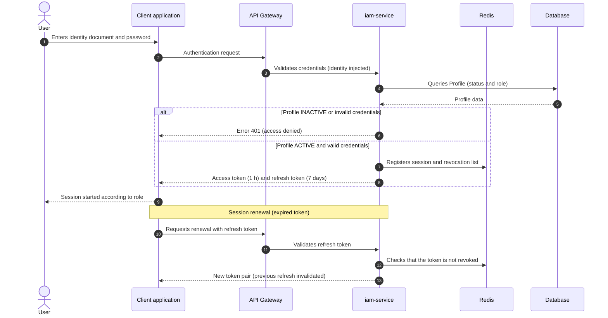

**Explanation.** The authentication flow validates the user's profile and role (RBAC), issues the access and refresh tokens, and registers the session in the ephemeral state (Redis). Renewal validates that the refresh token is not revoked and issues a new token pair, which prevents the concurrent reuse of the same refresh token (see section 10).

## 4.2 SEQ-02 — Account creation with events (person → profile)

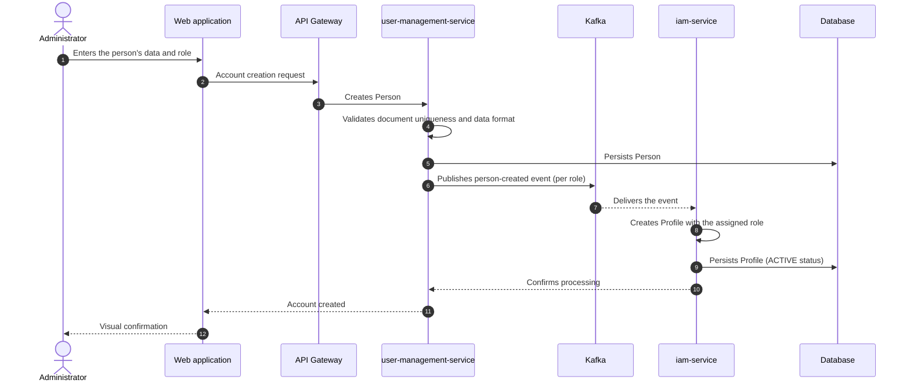

**Explanation.** Account creation is a distributed flow: the user management service persists the `Person` and publishes the event corresponding to the role (student, parent, driver, or administrator); the identity service consumes the event and creates the security `Profile`. This separation keeps the user management and security contexts decoupled.

## 4.3 SEQ-03 — Bus-to-route assignment and telemetry association

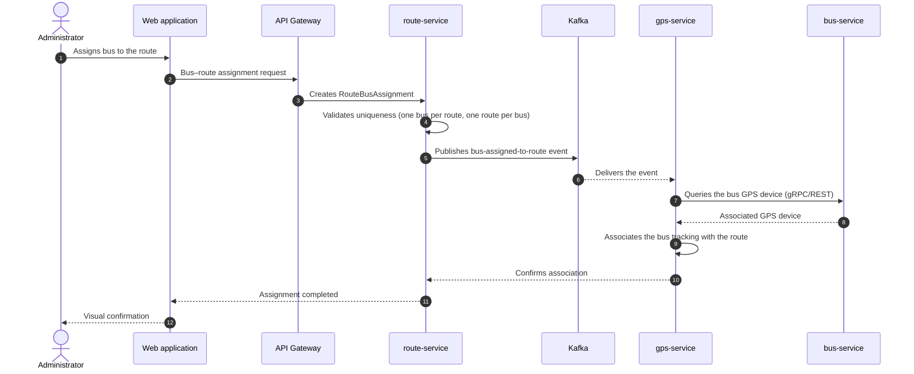

**Explanation.** The bus-to-route assignment validates the `Route` aggregate constraints (one bus per route and one route per bus) and, through an asynchronous event, the telemetry context associates the bus GPS device so that its position can be reported during the route execution.

## 4.4 SEQ-04 — Trip start (route execution)

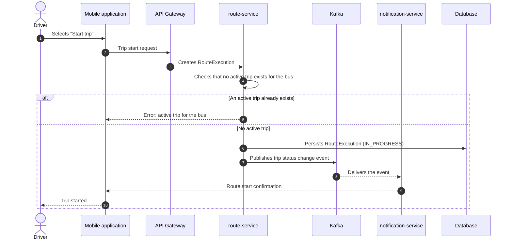

**Explanation.** Trip start applies the business rule of a single active trip per bus (FR-7.1). When the `RouteExecution` is created in `IN_PROGRESS` status, the status change event feeds the interested consumers (notifications) without coupling the route service to the communication channels.

## 4.5 SEQ-05 — QR boarding registration

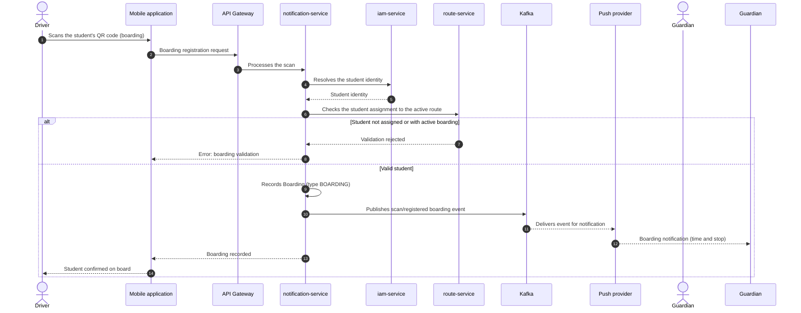

**Explanation.** The boarding scan crosses information from two contexts: the notification service resolves the student identity (security context) and validates the assignment to the active route (routes context). Once validated, the `Boarding` is recorded and the event that triggers the real-time notification to the guardian is published.

## 4.6 SEQ-06 — QR alighting registration

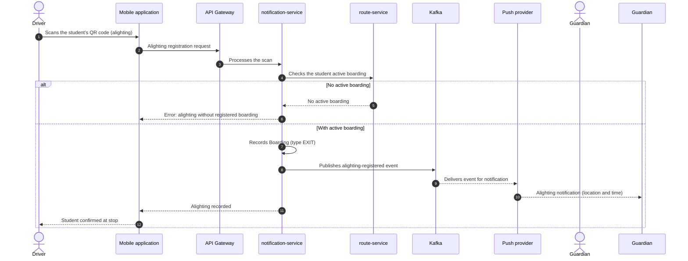

**Explanation.** Alighting requires that the student has a previous active boarding (FR-4.3); otherwise, the operation is rejected. On alighting, the notification to the guardian includes the location and time of the event. The alighting record is associated with the current stop of the bus in the route execution.

## 4.7 SEQ-07 — GPS position reception and live update

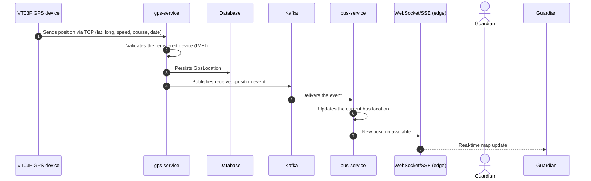

**Explanation.** The telemetry context receives the device positions, validates them against the registered devices, persists them in the history, and publishes the received-position event. The fleet context consumes the event to update the current bus location, which is exposed to the clients through a real-time channel (WebSocket or SSE) at the edge.

## 4.8 SEQ-08 — GPS signal-loss detection and alert

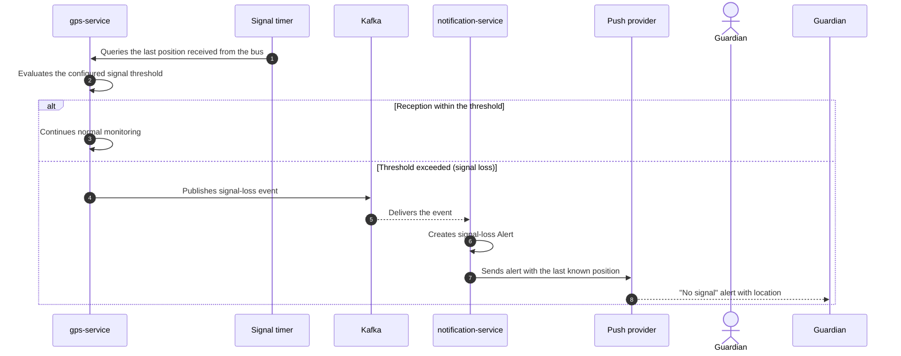

**Explanation.** The telemetry service evaluates the time elapsed since the last received position (domain service `GpsSignalService`). When the threshold is exceeded, the signal-loss event is published; the notification service creates the alert and delivers it to the guardian with the last known position and a "no signal" marker.

## 4.9 SEQ-09 — Incident report and notification

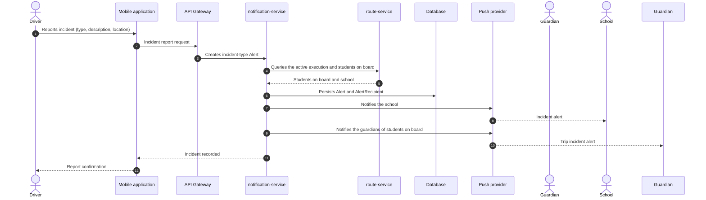

**Explanation.** The incident report creates an incident-type `Alert` and determines the recipients from the active route execution: the school and the guardians of the students on board. The delivery traceability is recorded through the `Alert` and `AlertRecipient` entities.

---

# 5. Activity diagrams

The activity diagrams describe the business process flows and the complex use cases, including lanes (swimlanes) per actor or component, decisions, forks, and parallel flows.

## 5.1 ACT-01 — Route management (creation with stops and schedules)

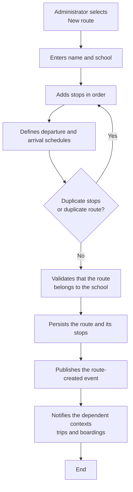

**Explanation.** The route creation flow walks through data capture, stop ordering, and schedule definition, and validates the `Route` aggregate rules (uniqueness, stops without duplicates in the same position). On persistence, the domain event notifies the contexts that depend on the route (boarding and telemetry).

## 5.2 ACT-02 — QR boarding and alighting (swimlanes)

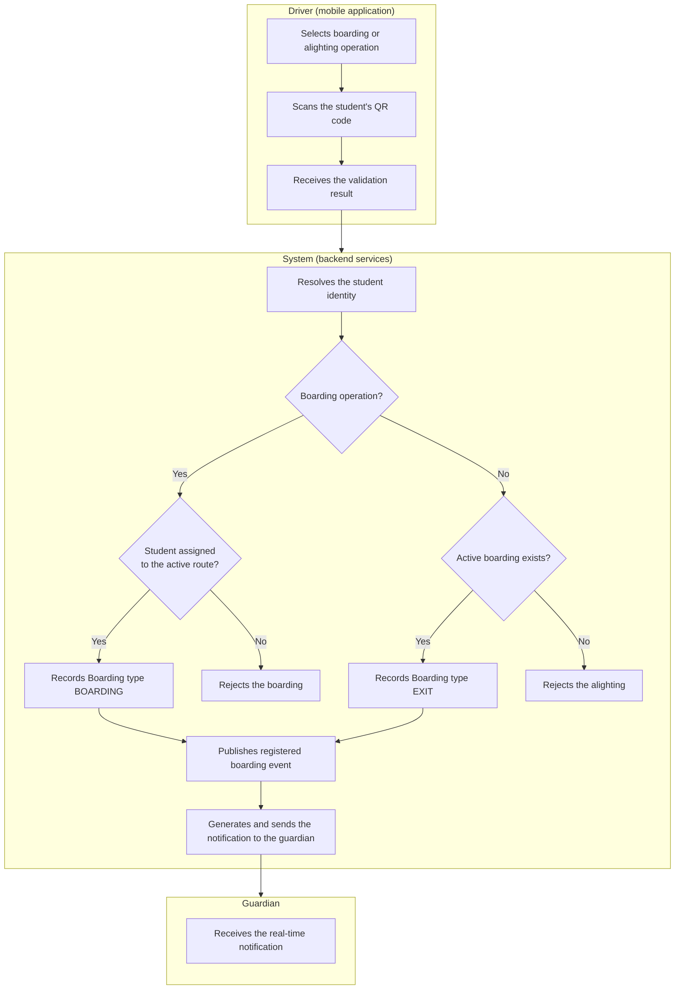

**Explanation.** The scanning flow is distributed in three lanes: the driver captures the code; the system validates the operation according to the type (boarding: assignment to the route; alighting: active boarding) and records the `Boarding`; and the guardian receives the real-time notification. The system decisions separate the success and rejection paths without blocking the driver's flow.

## 5.3 ACT-03 — Trip finish with pending-alighting validation

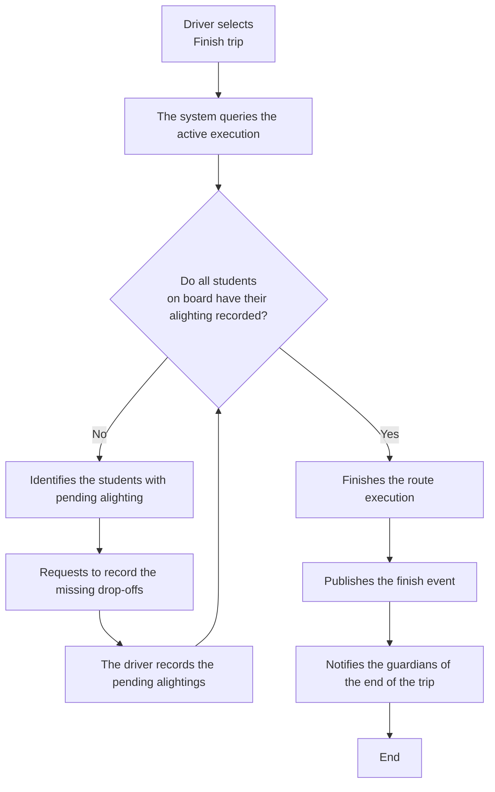

**Explanation.** Trip finish applies rule FR-7.2: no pending alightings may remain. The flow iterates until all students on board have their alighting recorded, and only then does the `RouteExecution` finish and the end of the trip get notified.

## 5.4 ACT-04 — GPS signal-loss alert detection

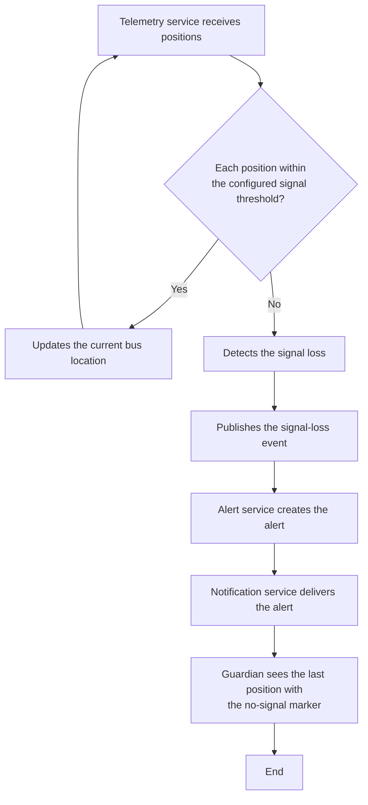

**Explanation.** Signal monitoring is a continuous process: while positions arrive within the threshold, the system updates the bus location; when the time since the last position exceeds the threshold, the domain service `GpsSignalService` detects the loss and the event → alert → guardian notification chain is triggered.

## 5.5 ACT-05 — Incident report and recipient notification

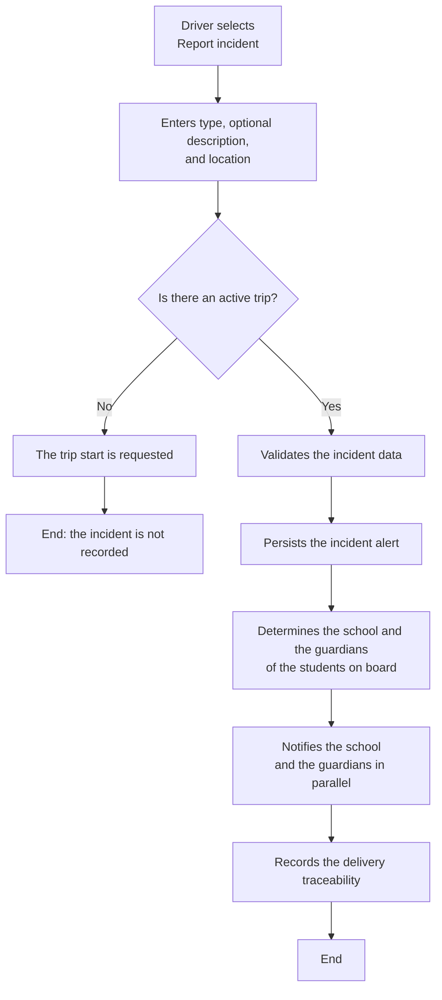

**Explanation.** The incident report requires an active trip; once validated, the alert is persisted and the recipient list is determined from the students on board. The sending to the school and to the guardians is performed in parallel, and the delivery is recorded for traceability.

## 5.6 ACT-06 — Password recovery

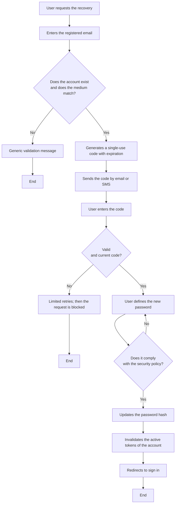

**Explanation.** The recovery flow combines contact-medium verification with a single-use code and the application of the password policy. The retry restrictions and per-IP limits protect the operation against brute-force attempts.

---

# 6. State diagrams

The state diagrams model the lifecycle of the system objects with relevant states, transitions, events, conditions (guards), and actions.

## 6.1 EST-01 — Profile lifecycle (`Profile`)

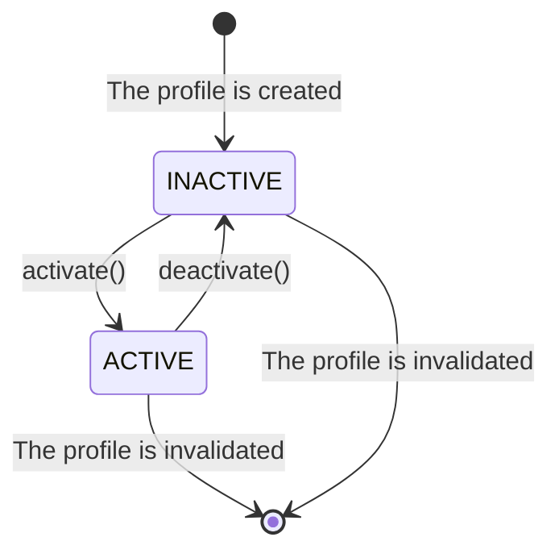

**Explanation.** The profile is born inactive and moves to `ACTIVE` through the `activate()` action; deactivation (action `deactivate()`) blocks the user's access to the system (INV-PRO-003) and their assignments. The profile is the object on which access control is based.

## 6.2 EST-02 — Route lifecycle (`Route`)

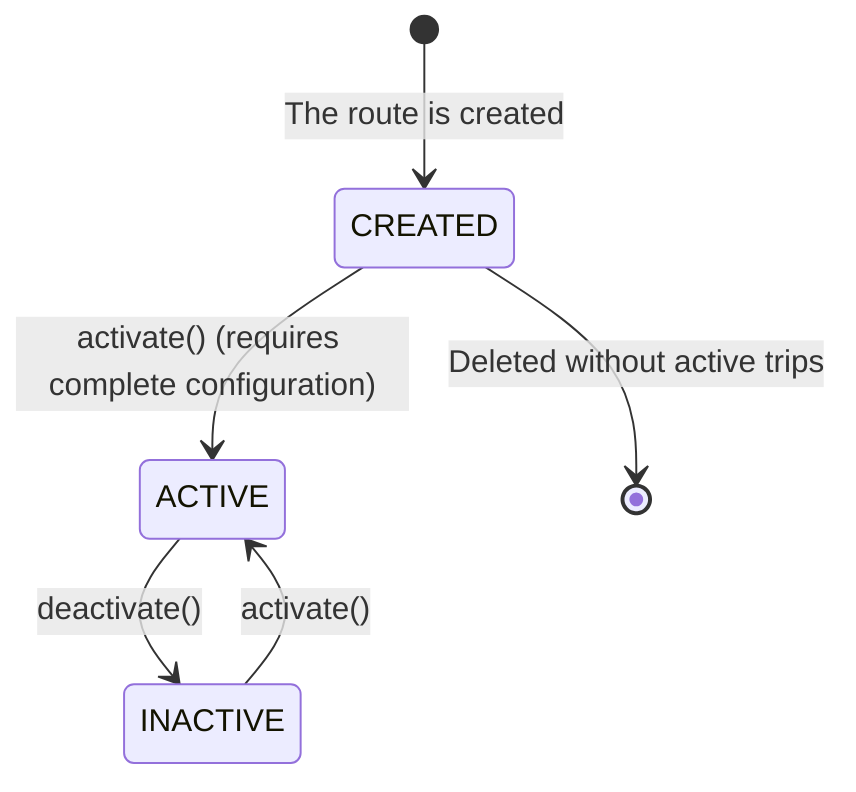

**Explanation.** The route is created in `CREATED` status and can only be activated when its configuration (stops, schedules, and assignments) is complete (INV-ROU-003). From the `ACTIVE` and `INACTIVE` states it can be activated again; deletion only proceeds if no active trip depends on it.

## 6.3 EST-03 — Route execution lifecycle (`RouteExecution` / trip)

```mermaid
stateDiagram-v2
    [*] --> SCHEDULED : The execution is scheduled
    SCHEDULED --> IN_PROGRESS : The driver starts the trip
    IN_PROGRESS --> FINISHED : The trip finishes (no pending alightings)
    IN_PROGRESS --> CANCELLED : The driver cancels the trip
    FINISHED --> SCHEDULED : A new execution is scheduled
    CANCELLED --> SCHEDULED : A new execution is scheduled
```

**Explanation.** The route execution (trip) moves from `SCHEDULED` to `IN_PROGRESS` when the driver starts the trip; only **one** active execution per bus exists (FR-7.1). The transition to `FINISHED` requires that no pending alightings remain (FR-7.2); cancellation preserves the traceability of the recorded events. Once finished or cancelled, a new execution can be scheduled.

## 6.4 EST-04 — Boarding lifecycle (`Boarding`)

```mermaid
stateDiagram-v2
    [*] --> QR_SCANNED : The driver scans the QR code
    QR_SCANNED --> BOARDING_REGISTERED : Validated registration (BOARDING or EXIT)
    QR_SCANNED --> [*] : Rejected scan (failed validation)
```

**Explanation.** The boarding is born when the QR code is scanned (`QR_SCANNED`) and, after the validation of the business rules (student assignment, active boarding for alighting, valid stop and bus), it is recorded (`BOARDING_REGISTERED`), belonging to the `Boarding` aggregate.

## 6.5 EST-05 — GPS device lifecycle (`GpsDevice`)

```mermaid
stateDiagram-v2
    [*] --> REGISTERED : The device is registered (IMEI)
    REGISTERED --> CONNECTED : connect() (receives positions)
    CONNECTED --> DISCONNECTED : disconnect() (signal loss)
    DISCONNECTED --> CONNECTED : reconnect() (reception resumes)
    CONNECTED --> [*] : The device is retired
```

**Explanation.** The GPS device is born `REGISTERED` and moves to `CONNECTED` when it starts receiving valid positions. In the event of signal loss, it moves to `DISCONNECTED` and can return to `CONNECTED` when reception is restored. Only registered devices can send valid location data (INV-GPS-002).

## 6.6 EST-06 — Alert lifecycle (`Alert`)

```mermaid
stateDiagram-v2
    [*] --> CREATED : The alert is created (type and recipients)
    CREATED --> DELIVERING : The delivery starts
    DELIVERING --> DELIVERED : Delivery confirmed
    DELIVERING --> FAILED : Channel failure (retries exhausted)
    FAILED --> DELIVERING : Retry with exponential backoff
    DELIVERED --> [*] : Alert attended or expired
```

**Explanation.** The alert is created from a significant event (signal loss, prolonged stop, or incident), is delivered through the corresponding channel, and remains `DELIVERED` once confirmed. If the channel fails, the alert is retried with exponential backoff; after exhausting the retries it moves to `FAILED` and is sent to the dead letter queue (DLQ) for analysis.

---

# 7. Data flow model

The data flow model (DFD) complements the analysis methodology; it is presented as an optional model that describes the transformation of the data among the actors, processes, and data stores of the system.

## 7.1 Context diagram (level 0)

```mermaid
flowchart LR
    ADMIN["Administrator"] -->|Management data| S(((Guardian Escolar)))
    SADMIN["Super-administrator"] -->|Management data| S
    GUARD["Guardian"] -->|Route queries and notifications| S
    DRIVER["Driver"] -->|Trip and scanning operations| S
    STUDENT["Student"] -->|QR code and queries| S
    GPSDEV["VT03F GPS device"] -->|Position via TCP| S
    S -->|Notifications and alerts| GUARD
    S -->|Notifications and alerts| DRIVER
    S -->|Incident notifications| SCHOOL["School"]
    S -->|Current QR code| STUDENT
    S -->|Status and confirmations| ADMIN
    S -->|Status and confirmations| SADMIN
    S -->|Sending request| PUSH["Push / SMS / email provider"]
    S -->|Map data| MAP["Map service"]
```

**Explanation.** Level 0 shows the system boundary with seven external entities: administrator, super-administrator, guardian, driver, student, GPS device, and external providers (push/SMS/email and maps). All client application interactions pass through the gateway; the GPS device enters through the telemetry TCP protocol.

## 7.2 Level-1 data flow diagram

```mermaid
flowchart LR
    ADMIN["Administrator"] -->|People, families, buses, routes data| P3((P3 User and\nfamily management))
    ADMIN -->|Fleet, route, and assignment data| P4((P4 Fleet\nmanagement))
    ADMIN -->|Routes, stops,\nand assignments data| P5((P5 Route\nmanagement))
    ADMIN -->|School data| P6((P6 School\nmanagement))
    GUARD["Guardian"] -->|Credentials| P1((P1 Authentication))
    GUARD -->|Route query| P7((P7 Route\nquery))
    GUARD -->|Notification delegation| P8((P8 Notification\nand alerts))
    DRIVER["Driver"] -->|Credentials| P1
    DRIVER -->|Trip start and finish| P9((P9 Trip\nmanagement))
    DRIVER -->|Boarding and alighting QR scan| P10((P10 Boarding\nmanagement))
    DRIVER -->|Incident report| P11((P11 Incident\nmanagement))
    STUDENT["Student"] -->|QR code request| P10
    GPSDEV["GPS device"] -->|Position| P12((P12 GPS\ntelemetry))
    P3 --> D1[(People)]
    P3 --> D2[(Families)]
    P4 --> D3[(Buses)]
    P5 --> D4[(Routes)]
    P5 --> D5[(Stops)]
    P5 --> D6[(Assignments)]
    P6 --> D7[(Schools)]
    P1 --> D8[(Profiles and roles)]
    P7 --> D4
    P9 --> D9[(Route executions)]
    P10 --> D10[(Boardings)]
    P8 --> D11[(Alerts and notifications)]
    P11 --> D11
    P12 --> D12[(GPS positions)]
    P12 --> D13[(GPS devices)]
    P8 -->|Notifications and alerts| GUARD
    P8 -->|Incident notifications| SCHOOL["School"]
    P11 -->|Incident alert| P8
    P12 -->|Signal loss| P8
```

**Explanation.** Level 1 decomposes the system into twelve processes: authentication (P1), user and family management (P3), fleet (P4), routes (P5), schools (P6), route query (P7), notification and alerts (P8), trips (P9), boardings (P10), incidents (P11), and GPS telemetry (P12). Each process updates its data stores and communicates through data flows; the processes P8, P10, P11, and P12 exchange events asynchronously, which is represented with the flows between them.

## 7.3 Data dictionary

| Element | Type | Composition / description |
|---------|------|---------------------------|
| **CredentialsData** | Flow | identityDocument, password |
| **PersonData** | Flow | id, name, lastName, identificationNumber, email, phone |
| **RouteData** | Flow | id, name, campuseId, stopList (order), schedules (startTime, endTime) |
| **QRScan** | Flow | qrCode, operationType (ON_BOARD/OFF_BOARD), busId, timestamp |
| **GPSPosition** | Flow | gpsDeviceId, latitude, longitude, speed, course, dateTime |
| **Notification** | Flow | destinationProfileId, channel (push/SMS/email), message, sourceEvent |
| **D1 People** | Store | Person (id, name, lastName, identificationNumber, email, phone) |
| **D2 Families** | Store | Family, FamilyMember |
| **D3 Buses** | Store | Bus (id, plate, capacity, soatValidity, campuseId, gpsDeviceId, modelId) |
| **D4 Routes** | Store | Route (id, name, campuseId, startTime, endTime), RouteStop |
| **D5 Stops** | Store | Stop (id, name, address, cityId, schoolId) |
| **D6 Assignments** | Store | RouteBusAssignment, RouteStudentAssignment |
| **D7 Schools** | Store | School, SchoolCampus |
| **D8 Profiles and roles** | Store | Profile, Role, Permissions, SessionProfile |
| **D9 Route executions** | Store | RouteExecution (status: SCHEDULED/IN_PROGRESS/FINISHED/CANCELLED) |
| **D10 Boardings** | Store | Boarding (id, profileId, routeExecutionId, routeStopId, boardingType, dateTime) |
| **D11 Alerts and notifications** | Store | Alert, AlertType, AlertRecipient |
| **D12 GPS positions** | Store | GpsLocation (id, gpsDeviceId, latitude, longitude, speed, course, dateTime) |
| **D13 GPS devices** | Store | GpsDevice (id, imei, gpsStatus, lastConnection) |---

# 8. Process logic description

## 8.1 Business rules

The system's business rules are modeled as domain invariants (user management, security, schools, fleet, routes, telemetry, boardings, and alerts contexts) and as aggregate invariants.

### 8.1.1 Entity invariants

| Rule | Description |
|------|-------------|
| INV-PER-001 | A person's identity document number must be unique. |
| INV-PER-002 | The person's first and last names cannot be empty. |
| INV-PER-003 | The email address must have a valid format. |
| INV-PRO-001 | A profile must reference an existing person. |
| INV-PRO-002 | A profile must have a valid role. |
| INV-PRO-003 | An inactive profile cannot start an authenticated session. |
| INV-FAM-002 | An active family must have at least one valid member. |
| INV-SCH-001 | A school must have a valid name. |
| INV-BUS-001 | A bus plate must be unique. |
| INV-BUS-004 | A GPS device cannot be assigned to several buses simultaneously. |
| INV-ROU-004 | A route must not contain duplicate stops in the same position. |
| INV-GPS-002 | Only registered GPS devices can send valid location data. |
| INV-LOC-001 | Latitude must be between -90 and 90. |
| INV-LOC-002 | Longitude must be between -180 and 180. |
| INV-LOC-003 | Speed cannot be negative. |
| INV-BRD-004 | The boarding type must be BOARDING or EXIT. |
| INV-ALT-003 | The alert message cannot be empty. |

### 8.1.2 Aggregate invariants

| Rule | Description |
|------|-------------|
| AGGR-INV-001 | A route must belong to a school. |
| AGGR-INV-002 | A route cannot contain duplicate stops in the same position. |
| AGGR-INV-003 | A student cannot be assigned to the same route more than once. |
| AGGR-INV-004 | A bus cannot be assigned to the same route more than once. |
| AGGR-INV-005 | A bus must have a unique plate. |
| AGGR-INV-007 | A GPS device cannot be assigned simultaneously to several buses. |
| AGGR-INV-008 | A GPS device must have a unique IMEI. |
| AGGR-INV-009 | A GPS location must belong to a registered GPS device. |
| AGGR-INV-010 | Latitude and longitude must contain valid geographic values. |
| AGGR-INV-011 | A boarding event must reference a student. |
| AGGR-INV-012 | A boarding event must reference a bus. |
| AGGR-INV-013 | A boarding event must reference a stop. |
| AGGR-INV-014 | The boarding type must be valid. |

## 8.2 Key algorithms

### 8.2.1 Student-to-route assignment validation

```text
Domain service: RouteAssignmentService
Method: validateStudentAssignment(route, studentId)

1. If the route already has the student assigned (route.hasStudent(studentId)):
       Throw domain exception: "The student is already assigned to this route"
2. If the indicated stop does not belong to the route:
       Throw domain exception: "The boarding/alighting stop does not belong to the route"
3. If the student does not belong to the route's school context:
       Throw domain exception: "The student does not belong to the route's school"
4. Record the assignment (RouteStudentAssignment)
```

### 8.2.2 QR boarding and alighting scan validation

```text
Domain service: BoardingValidationService
Method: validateScan(student, bus, stop, operationType, activeTrip)

1. If no active trip exists for the bus:
       Throw exception: "There is no active trip for this bus"
2. If the student identity cannot be resolved from the QR code:
       Throw exception: "The QR code is invalid or has expired"
3. If operationType == BOARDING (boarding):
       3.1 If the student is not assigned to the active trip's route:
               Throw exception: "The student is not assigned to this route"
       3.2 If the student already has an active boarding (type BOARDING without alighting):
               Throw exception: "The student is already on board"
       3.3 Record Boarding(type = BOARDING)
4. If operationType == EXIT (alighting):
       4.1 If the student does not have an active boarding:
               Throw exception: "The student does not have an active boarding"
       4.2 Record Boarding(type = EXIT) at the current stop
5. Persist the event and publish the corresponding domain event
```

### 8.2.3 GPS signal-loss detection

```text
Domain service: GpsSignalService
Method: detectSignalLoss(lastReception, currentTime, thresholdMinutes)

1. difference = currentTime - lastReception
2. If difference > thresholdMinutes * 60 * 1000:
       Return true (signal loss)
   Else:
       Return false
3. When the loss is detected, the GpsSignalLost event is published,
   which is consumed by the alerts context to create the alert
   and notify the guardian with the last known position.
```

### 8.2.4 Trip finish with pending alightings

```text
Process: FinishTrip(routeExecutionId)

1. Get the active route execution (IN_PROGRESS)
2. Get the bus's active boardings (type BOARDING without a later EXIT)
3. If active boardings exist:
       3.1 Identify the students with pending alighting
       3.2 Return the list to the driver to record the drop-offs
       3.3 Finish without changing the status
4. If no active boardings exist:
       4.1 Change the execution status to FINISHED
       4.2 Publish the trip-finish event
       4.3 Notify the guardians of the trip finish
```

### 8.2.5 Session renewal with concurrency protection

```text
Process: RenewSession(refreshToken)

1. Validate the signature and validity of the refresh token
2. Verify in the revocation list that the token is not invalidated
3. Verify that the token has not been used (single-flight)
4. If it was already used: reject the renewal (possible reuse)
5. Mark the token as used and invalidate the previous session
6. Generate a new token pair (1-hour access and 7-day refresh)
7. Register the new session in the ephemeral state
```

## 8.3 Decision tables

### 8.3.1 QR scan decision

| Condition | Boarding (BOARDING) | Alighting (EXIT) |
|-----------|---------------------|------------------|
| An active trip of the bus exists | Required | Required |
| The QR code resolves to a valid student | Required | Required |
| The student is assigned to the trip's route | Required | Irrelevant |
| The student has an active boarding | Must not exist | Required |
| Result | Boarding record + notification | Alighting record + notification with location |

### 8.3.2 Trip start decision

| Condition | Start trip | Finish trip |
|-----------|------------|-------------|
| The bus has an assigned route | Required | — |
| No active execution of the bus exists | Required | — |
| An active execution (IN_PROGRESS) exists | — | Required |
| No pending alightings remain | — | Required |
| Result | `RouteExecution` in `IN_PROGRESS` | `RouteExecution` in `FINISHED` (or `CANCELLED`) |

### 8.3.3 Bus–route assignment decision

| Condition | Assign bus | Result |
|-----------|------------|--------|
| The bus exists and belongs to the school | Required | — |
| The bus is not assigned to another route | Required | — |
| The route does not have that bus assigned | Required | — |
| Result | — | `RouteBusAssignment` created; telemetry associated |

## 8.4 Important validations and calculations

| Validation / calculation | Description |
|--------------------------|-------------|
| Geographic values | Latitude must be between -90 and 90 and longitude between -180 and 180; speed cannot be negative. |
| GPS signal threshold | The time elapsed without reception is compared against the configured threshold; when exceeded, the signal-loss event is generated. |
| QR code validity | The student's code rotates or expires according to the configured policy; scan validations reject expired codes. |
| Master data uniqueness | Person document, bus plate, and GPS device IMEI are unique at the system level. |
| Password policy | Length, complexity, and expiration defined by the configuration service; validation before changing or resetting. |
| Request limits | Speed limits per token and IP applied at the gateway and in the recovery flows. |

---

# 9. Event, error, and exception handling

## 9.1 System event catalog

### 9.1.1 Domain events

| Event | Aggregate | Origin | Recipients / use |
|-------|-----------|--------|------------------|
| `PersonRegistered` | Person | User management | Security profile creation |
| `FamilyCreated` | Family | User management | Member linkage |
| `ProfileCreated` | Profile | Security | Profile availability |
| `SessionStarted` | Profile | Security | Session registration |
| `SchoolCreated` | School | School management | Transportation contexts |
| `BusRegistered` | Bus | Fleet management | Route and telemetry association |
| `RouteCreated` | Route | Route management | Route availability |
| `RouteBusAssigned` | Route | Route management | Telemetry association with the bus |
| `StudentAssignedToRoute` | Route | Route management | Boarding authorization |
| `RouteStopAdded` | Route | Route management | Available stops |
| `StudentQrCodeGenerated` | Boarding | Boarding | Student's current QR code |
| `BoardingQrScanned` | Boarding | Boarding | Validation and start of the record |
| `BoardingRegistered` | Boarding | Boarding | Notification to the guardian |
| `GpsDeviceRegistered` | GpsDevice | Telemetry | Device availability |
| `GpsLocationReceived` | GpsDevice | Telemetry | Bus location update |
| `GpsSignalLost` | GpsDevice | Telemetry | Signal-loss alert creation |
| `AlertCreated` | Alert | Alerts | Notification to responsible users |

### 9.1.2 Integration events (message broker)

| Topic | Producer | Consumers | Payload summary |
|-------|----------|-----------|-----------------|
| `student.created` | user-management-service | iam-service | New student person → profile/role |
| `driver.created` | user-management-service | iam-service | New driver person → profile/role |
| `admin.created` | user-management-service | iam-service | New administrator person → profile/role |
| `parent.created` | user-management-service | iam-service | New guardian person → profile/role |
| `profile.created` | iam-service | — | Profile created for a person |
| `student.scanned` | notification-service | notification-service | Boarding/alighting scan → guardian notification |
| `trip.status.changed` | route-service | notification consumers | Route execution lifecycle |
| `config.changed` | configuration-service | interested services | Parameter and policy changes |
| `notification.delivered` | notification-service | metrics | Notification delivery result |
| `user.access.revoked` | iam-service | gateways/sessions | Access revocation (ephemeral-state list) |

> All events include the standard envelope fields: `eventId` (idempotency key), `eventType`, `aggregateId`, `aggregateType`, `occurredAt`, `version`, `payload`, and the correlation metadata (`correlationId`, `causationId`, `userId`).

## 9.2 Error scenarios and their handling

| Scenario | Code | User message | Handling |
|----------|------|--------------|----------|
| Invalid credentials | 401 | "Incorrect credentials" | Authentication rejection; the failed attempt is recorded. |
| Inactive profile | 401 | "Your account is inactive; contact the administrator" | Access blocking (INV-PRO-003). |
| Expired or revoked token | 401 | "The session expired; sign in again" | Renewal or new authentication. |
| Student not assigned to the route | 400 | "The student is not assigned to this route" | Boarding scan rejection. |
| Alighting without active boarding | 400 | "The student does not have an active boarding" | Alighting scan rejection. |
| Invalid or expired QR code | 400 | "The QR code is invalid or has expired" | Request to regenerate the code. |
| Duplicate active trip | 409 | "An active trip already exists for this bus" | Trip start rejection. |
| Pending alightings when finishing | 409 | "There are students pending alighting" | The students on board are listed to record their drop-offs. |
| Route deletion with active trip | 409 | "The route cannot be deleted: it has an active trip" | Deletion rejection. |
| Duplicate plate, document, or IMEI | 409 | "The value is already registered" | Creation operation rejection. |
| Request limit exceeded | 429 | "Too many attempts; try again later" | Speed limit per token and IP. |
| Service unavailable | 503 | "The service is unavailable; try again" | Timeouts and circuit breakers in inter-service calls; client retry. |
| Notification channel failure | 500 | "The notification could not be sent" | Retry with exponential backoff; failure recorded. |

## 9.3 User messages

| Context | Typical messages |
|---------|------------------|
| Authentication | "Incorrect credentials", "Your account is inactive", "The session expired". |
| Boarding / alighting | "Student confirmed on board", "Student confirmed at the stop", "The student is not assigned to this route". |
| Trip | "Trip started", "Trip finished", "There are students pending alighting". |
| Notifications | "Your child boarded the bus at stop X at HH:MM", "Your child got off the bus at the indicated location", "The bus lost signal; last known position", "Incident reported on the trip". |
| Password recovery | "Code sent", "Incorrect or expired code", "Password updated". |
| Administration | "Account created", "Bus assigned to the route", "Student assigned to the route". |

## 9.4 Error handling and retries

- **At-least-once delivery + idempotency.** The broker guarantees at-least-once delivery; consumers store the processed `eventId` and discard duplicate events, which is critical for GPS positions, boardings, and alerts.
- **Outbox pattern.** When the transaction confirmation must coincide with the event publication, the service writes the event to an outbox table in the same transaction and a publisher routes it to the broker.
- **Dead letter queue (DLQ).** Events that fail after retries are sent to the dead letter queue with 7-day retention, and an alert is raised when the queue contains messages.
- **Exponential backoff retries.** Notification delivery and event consumption retries use exponential backoff (1 s → 2 s → 4 s → 8 s) with a maximum of 3 to 5 attempts.
- **Timeouts and circuit breakers.** Synchronous calls between services (gRPC) define timeouts and circuit breakers so that provider failures do not degrade availability.
- **Centralized exception handling.** Services expose a global exception handler that translates domain errors into standardized responses for the client and records the traceability with a correlation identifier.

---

# 10. Concurrency and communication aspects

## 10.1 Processes and threads

- Each microservice is deployed as an **independent process** (container), stateless in memory; the ephemeral state resides in Redis and the persistent data in the service's relational schema.
- The integration services (notifications, routes, telemetry) run **asynchronous consumers** (background processes) that subscribe to the broker topics and process the events idempotently.
- The gateway is the only component without its own database and keeps ephemeral cache in Redis for tokens and speed limits.
- Horizontal scaling is possible up to 10 instances per service (NFR-003); each instance is replaceable without state to replicate.

## 10.2 Synchronous communication

| Origin | Destination | Channel | Use |
|--------|-------------|---------|-----|
| Client applications | API Gateway | REST/HTTPS | Single entry point; token validation and speed limits. |
| API Gateway | Services | REST | Routing of authenticated requests. |
| notification-service | iam-service | REST | Profile identity resolution. |
| notification-service | route-service | REST | Reference of executions, stops, and trips. |
| notification-service | bus-service | REST | Bus fleet reference. |
| school-service | route-service | gRPC | School stop queries. |
| user-management-service | iam-service | gRPC | People identity resolution for profiles. |
| gps-service | bus-service | gRPC/REST | Query of the GPS device associated with the bus. |

Synchronous calls between services apply timeouts and circuit breakers and are never executed on the synchronous path without a defined failure plan.

## 10.3 Asynchronous communication

| Topic | Producer | Consumers | Purpose |
|-------|----------|-----------|---------|
| `student.created`, `driver.created`, `admin.created`, `parent.created` | User management | Identity service | Profile creation per role. |
| `profile.created` | Identity service | — | Profile availability. |
| `student.scanned` | Notification service | Notification service | Scan processing and guardian notification. |
| `trip.status.changed` | Route service | Notification consumers | Trip lifecycle. |
| `config.changed` | Configuration service | Interested services | Propagation of parameters and policies. |
| `notification.delivered` | Notification service | Metrics | Delivery results. |
| `user.access.revoked` | Identity service | Gateways / sessions | Access revocation. |

## 10.4 Concurrency and consistency

| Situation | Mechanism |
|-----------|-----------|
| A single active trip per bus | Uniqueness check in the `RouteExecution` creation with concurrency control (lock/version) to prevent two simultaneous starts. |
| Concurrent session renewal | Use of *single-flight*: a single refresh per token; the second attempt is rejected by marking the first use. |
| Session revocation | Revocation list in Redis; the access-revocation event notifies the gateways. |
| Duplicates from repeated delivery | Idempotent consumers that store the processed `eventId`. |
| Consistency between transaction and event | Outbox pattern in the flows that require publication after database confirmation. |
| Speed limits | Enforcement at the gateway per token and IP; specific limits in the password recovery (code by email/SMS) and authentication flows. |
| Write concurrency in aggregates | Aggregates are modified only through their aggregate root; a transaction does not directly modify multiple aggregates. |

## 10.5 Integration with external systems

| External system | Integration | Pattern |
|-----------------|-------------|---------|
| VT03F GPS device | Position ingestion through the TCP protocol (latitude, longitude, speed, course, GPS date) | Synchronous (TCP connection) + events |
| Push notification provider | Real-time notification sending (boarding, alighting, alerts, incidents) | Asynchronous |
| SMS and email messaging | Sending recovery codes and secondary notifications | Asynchronous |
| Map service | Location display on an interactive map | REST / WebSocket · SSE |
| Real-time channels | Map update without manual refresh | WebSocket / SSE at the edge |

---

# 11. Prototypes and screen flow

## 11.1 Navigation map

The following diagram presents the navigation map of the client applications. The web application corresponds to the administrative roles and the mobile application to guardians, drivers, and students.

```mermaid
flowchart TB
    subgraph WEB["Web application (administration)"]
        direction TB
        H["Public home"] --> LG["Sign in"]
        LG --> RF["Password recovery"]
        RF --> RA["Reset password"]
        LG --> DA["Administrator panel"]
        DA --> GU["User management"]
        DA --> GF["Family management"]
        DA --> GC["Driver management"]
        DA --> GB["Bus management"]
        DA --> GP["Stop management"]
        DA --> GR["Route management"]
        DA --> PG["Profile and contact data"]
        PG --> CE["Email change"]
        PG --> CP["Password change"]
        PG --> CT["Phone change"]
        LG --> DS["Super-administrator panel"]
        DS --> GAD["Administrator management"]
        DS --> GSC["School and campus management"]
        DS --> PG
    end

    subgraph MOBILE["Mobile application"]
        direction TB
        MLG["Sign in"] --> M1["Main view per role"]

        subgraph PAR2["Guardian"]
            direction TB
            A1["My students"] --> A2["My child's route"]
            A2 --> A3["Live bus map"]
            A1 --> A4["Notifications and alerts"]
            A3 --> A4
        end

        subgraph DRV2["Driver"]
            direction TB
            C1["My route (stops and schedules)"] --> C2["Active trip"]
            C2 --> C3["Scan QR code"]
            C2 --> C4["Report incident"]
            C2 --> C5["Notifications"]
        end

        subgraph STU2["Student"]
            direction TB
            E1["My QR code"] --> E2["My route"]
            E2 --> E3["Notifications"]
        end

        M1 --> A1
        M1 --> C1
        M1 --> E1
    end
```

**Explanation.** The web application organizes the administration of the ecosystem: the administrator and super-administrator panels concentrate the management of users, families, drivers, buses, stops, routes, schools, and the maintenance of their own profile. The mobile application is organized by role: the guardian queries the route, the live map, and the notifications of their students; the driver operates the trip, the QR scan, and the incident report; the student views their QR code and their route.

## 11.2 Relationship between screens and use cases

| Screen (web) | Use cases |
|--------------|-----------|
| Sign in | UC-01, UC-02 |
| Password recovery and reset | UC-02 |
| Administrator panel | UC-03 through UC-10, UC-18 |
| User / family / driver management | UC-03, UC-04 |
| Bus management | UC-06, UC-07 |
| Stop and route management | UC-08, UC-09, UC-10 |
| Super-administrator panel | UC-05, UC-03 |
| Profile and contact data | UC-18 |

| Screen (mobile) | Use cases |
|-----------------|-----------|
| Sign in | UC-01, UC-02 |
| My students / My child's route | UC-11, UC-15, UC-16 |
| Live map | UC-16 |
| My route (driver) | UC-11, UC-12 |
| Scan QR code | UC-13 |
| Report incident | UC-17 |
| My QR code (student) | UC-14 |
| Notifications and alerts | UC-15 |
| Theme and language settings | UC-19 |

## 11.3 Description of main screens

**Web application:**

- **Sign in:** credentials form; linked password recovery.
- **Administrator panel:** operational summary and access to the management of users, families, drivers, buses, stops, and routes.
- **User management:** card list (CardList) with creation, editing, activation, and deactivation; search and filters.
- **Route management:** route creation with ordered stops and schedules; bus and student assignment.
- **Super-administrator panel:** management of administrators and schools.
- **Profile and contact data:** display of personal information and email, password, and phone change flows with code verification and confirmation modals.

**Mobile application:**

- **My child's route (guardian):** detail of bus, driver, ordered stops, and schedules; link to the live map.
- **Live map:** interactive map with the bus's current position and a "no signal" marker on GPS loss.
- **Scan QR code (driver):** camera integration; shows the boarding or alighting validation result in real time.
- **Report incident (driver):** type selection, optional description, and location; sending confirmation.
- **My QR code (student):** individual current code with automatic renewal.
- **Notifications:** inbox with the history of boarding, alighting, alert, and incident events.

---

# 12. Traceability matrix

## 12.1 Requirements ↔ use cases ↔ dynamic diagrams matrix

| Requirement | Description | Use cases | Dynamic diagrams | HU |
|-------------|-------------|-----------|------------------|----|
| FR-1.1 | Account creation per role | UC-03 | SEQ-02 | HU-USER-004 |
| FR-1.2 | User data update | UC-03 | — | HU-USER-004 |
| FR-1.3 | Account activation/deactivation | UC-03 | EST-01 | HU-USER-004 |
| FR-1.4 | Student–guardian linkage | UC-04 | — | HU-USER-003 |
| FR-2.1 | Authentication and JWT issuance | UC-01 | SEQ-01 | HU-IAM-001 |
| FR-2.2 | Session logout and renewal | UC-01, UC-02 | SEQ-01, ACT-06 | HU-IAM-001 |
| FR-3.1 to 3.4 | Route, stop, and schedule management | UC-08 | ACT-01, EST-02 | HU-ROUTE-001 |
| FR-3.5 | Bus-to-route assignment | UC-09 | SEQ-03 | HU-ROUTE-005 |
| FR-3.6 | Driver-to-bus assignment | UC-07 | — | HU-BUS-002 |
| FR-3.7 | Student-to-route assignment | UC-10 | — | HU-ROUTE-008 |
| FR-3.8 | Bus fleet management | UC-06 | — | HU-FLEET-001 |
| FR-4.1 | Individual QR code generation | UC-14 | — | HU-QR-004 |
| FR-4.2 | QR boarding record | UC-13 | SEQ-05, ACT-02, EST-04 | HU-QR-001 |
| FR-4.3 | QR alighting record | UC-13 | SEQ-06, ACT-02, EST-04 | HU-QR-002 |
| FR-5.1 | Boarding/alighting event detection | UC-13 | SEQ-05, SEQ-06 | HU-QR-001 |
| FR-5.2 | Boarding notification to the guardian | UC-15 | SEQ-05, ACT-02 | HU-NOTIF-001 |
| FR-5.3 | Alighting notification to the guardian | UC-15 | SEQ-06, ACT-02 | HU-NOTIF-001 |
| FR-5.4 | Prolonged-stop alert | UC-15 | SEQ-08, ACT-04, EST-06 | HU-NOTIF-005 |
| FR-6.1 | Continuous GPS position capture | UC-16 | SEQ-07 | HU-GPS-002 |
| FR-6.2 | Interactive map without manual refresh | UC-16 | SEQ-07 | HU-GPS-002 |
| FR-6.3 | GPS signal-loss alert | UC-16 | SEQ-08, ACT-04 | HU-GPS-002 |
| FR-7.1 | Trip start (one active per bus) | UC-12 | SEQ-04, EST-03 | HU-ROUTE-003 |
| FR-7.2 | Trip finish without pending alightings | UC-12 | ACT-03, EST-03 | HU-ROUTE-003 |
| FR-8.1 | Incident report | UC-17 | SEQ-09, ACT-05, EST-06 | HU-INCIDENT-001 |
| FR-8.2 | School and guardian notification | UC-15 | SEQ-09, ACT-05 | HU-INCIDENT-001 |
| FR-9.1 | Route query by the guardian | UC-11 | — | HU-ROUTE-004 |
| FR-9.2 | Route query by the driver | UC-11 | — | HU-ROUTE-002 |
| FR-10.1 | Theme customization | UC-19 | — | HU-UI-001 |
| FR-10.2 | Language customization | UC-19 | — | HU-UI-002 |

## 12.2 Functional requirement coverage

| Requirements group | No. of FR | Coverage with diagrams |
|--------------------|-----------|------------------------|
| RF-01 User management | 4 | Complete (SEQ-02, EST-01) |
| RF-02 Authentication | 2 | Complete (SEQ-01, ACT-06) |
| RF-03 Routes | 6 | Complete (ACT-01, EST-02, SEQ-03) |
| RF-04 QR scanning | 3 | Complete (SEQ-05, SEQ-06, ACT-02, EST-04) |
| RF-05 Notifications | 4 | Complete (SEQ-08, ACT-04, EST-06) |
| RF-06 Real-time tracking | 3 | Complete (SEQ-07, SEQ-08, ACT-04) |
| RF-07 Trips | 2 | Complete (SEQ-04, ACT-03, EST-03) |
| RF-08 Incidents | 2 | Complete (SEQ-09, ACT-05, EST-06) |
| RF-09 Route queries | 2 | Partial: read-only query described in the UC-11 specification |
| RF-10 Customization | 2 | Client only: without service diagrams (UC-19) |

## 12.3 Traceability observations

- The institutional master-data processes (schools and campuses), exceptional transportation uses, and auditing are covered in the UC-04, UC-05, and UC-18 specifications; not all correspond to numbered functional requirements.
- Theme and language customization (RF-10) is resolved on the client and does not generate message exchange with the services.
- Event consumers process with idempotency and at-least-once delivery; the flows that depend on a consumer's confirmation (boardings and notifications) explicitly describe the retry and the dead letter queue in section 9.
- Synchronous communication between services uses timeouts and circuit breakers; all communication with clients passes through the gateway, which validates the token and injects the identity before invoking any service.

---

# 13. Annexes

## 13.1 Glossary

| Term | Definition |
|------|------------|
| **Guardian (parent)** | Adult responsible for one or more students, authorized to consult their transportation. |
| **Boarding** | Event that records a student getting on a bus. |
| **Alighting** | Event that records a student getting off the bus. |
| **Alert** | High-priority communication generated by an operational condition (signal loss, prolonged stop, incident). |
| **Route execution (trip)** | Operational occurrence of a route: scheduled, in progress, finished, or cancelled. |
| **Route** | Planned path that connects the school with the stops and the assigned students. |
| **Stop** | Place where students get on or off the bus. |
| **Assignment** | Relationship between a route and a student, bus, driver, or stop. |
| **QR code** | Student's individual identifier for validating transportation. |
| **GPS device** | Telemetry hardware (VT03F) installed on the bus. |
| **Notification** | Message to the user about a transportation event. |
| **Traceability** | Ability to know what happened, when, and in relation to which user, vehicle, route, or event. |

For the project's expanded glossary, consult the domain term dictionary.

## 13.2 Identified risks and open questions

| Type | Description | Handling |
|------|-------------|----------|
| Risk | The creation of routes, schedules, and assignments can remain incomplete without minimum configuration validation. | Rule INV-ROU-003: the route is not activated without its configuration. |
| Risk | A duplicate scan can generate duplicate notifications to the guardian. | Idempotent event processing with `eventId`. |
| Risk | GPS signal loss can generate false prolonged-stop alerts. | Configurable threshold and location validation. |
| Risk | Concurrent token renewal can allow reuse. | Refresh *single-flight* and revocation list. |
| Open question | To what extent does the mobile application cover the driver and student flows in the current version? | Under development; the document describes the target behavior. |
| Open question | Is the alerts service kept as an independent context or consolidated into notifications? | Pending architecture decision; the current model separates them. |

## 13.3 Change history and approvals

| Version | Date | Description | Status |
|---------|------|-------------|--------|
| 1.0 | 10/10/2026 | Initial version of the dynamic views | Approved by the team |

**Project team members:** Juan Pablo Chala Ramírez · Johan Smith Santamaria Fernández · Sharik Dayanna Rojas Ibarra.

---

# 14. References

- Booch, G., Rumbaugh, J., y Jacobson, I. (2006). *El lenguaje unificado de modelado* (2.ª ed.). Pearson Educación.
- Dennis, A., Wixom, B. H., y Roth, R. M. (2015). *Systems analysis and design* (6.ª ed.). John Wiley & Sons.
- Evans, E. (2003). *Domain-driven design: Tackling complexity in the heart of software*. Addison-Wesley.
- Fowler, M. (2004). *UML distilled: Guía breve para el modelado estándar de objetos* (3.ª ed.). Addison-Wesley.
- International Organization for Standardization. (2018). *Ingeniería de sistemas y software — Procesos del ciclo de vida — Ingeniería de requisitos* (ISO/IEC/IEEE 29148:2018). ISO. https://www.iso.org/standard/72089.html
- Kendall, K. E., y Kendall, J. E. (2011). *Systems analysis and design* (8.ª ed.). Pearson.
- Object Management Group. (2017). *OMG Unified Modeling Language (OMG UML), version 2.5.1*. OMG. https://www.omg.org/spec/UML/2.5.1
- Pressman, R. S., y Maxim, B. R. (2021). *Ingeniería del software: Un enfoque práctico* (9.ª ed.). McGraw-Hill.
- Qiu, K. (s. f.). *Mermaid: Generation of diagrams and flowcharts from text in a similar manner as Markdown*. https://mermaid.js.org/
- República de Colombia. (2012). *Ley 1581 de 2012: Por la cual se dictan disposiciones generales para la protección de datos personales*. Diario Oficial.
- Richardson, C. (2018). *Microservices patterns: With examples in Java*. Manning Publications.
- Sommerville, I. (2011). *Ingeniería de software* (9.ª ed.). Pearson Educación.