# Análisis del Software: Vistas Dinámicas

**Guardian Escolar**

*Análisis de las vistas dinámicas del sistema Guardian Escolar — plataforma de transporte escolar seguro*

**Integrantes del proyecto:**

- Juan Pablo Chala Ramírez
- Johan Smith Santamaria Fernández
- Sharik Dayanna Rojas Ibarra

**Programa:** Tecnólogo en Análisis y Desarrollo de Software
**Ficha:** 3145556
**Centro de formación:** La Industria, La Empresa y Los Servicios (SENA)
**Lugar:** Neiva, Huila, Colombia
**Fecha:** Octubre de 2026

---

## Tabla de contenido

1. [Introducción](#1-introducción)
2. [Descripción general del sistema](#2-descripción-general-del-sistema)
3. [Modelo de casos de uso](#3-modelo-de-casos-de-uso)
4. [Diagramas de secuencia](#4-diagramas-de-secuencia)
5. [Diagramas de actividad](#5-diagramas-de-actividad)
6. [Diagramas de estados](#6-diagramas-de-estados)
7. [Modelo de flujo de datos](#7-modelo-de-flujo-de-datos)
8. [Descripción de la lógica de procesos](#8-descripción-de-la-lógica-de-procesos)
9. [Manejo de eventos, errores y excepciones](#9-manejo-de-eventos-errores-y-excepciones)
10. [Aspectos de concurrencia y comunicación](#10-aspectos-de-concurrencia-y-comunicación)
11. [Prototipos y flujo de pantallas](#11-prototipos-y-flujo-de-pantallas)
12. [Matriz de trazabilidad](#12-matriz-de-trazabilidad)
13. [Anexos](#13-anexos)
14. [Referencias](#14-referencias)

---

# 1. Introducción

## 1.1 Propósito

Este documento describe las **vistas dinámicas** del sistema Guardian Escolar, una plataforma creada para gestionar, monitorear y mejorar la seguridad del transporte escolar en el municipio de Neiva (Huila, Colombia). La vista dinámica complementa la vista estática (modelo de dominio y de clases) al describir **cómo** se comporta el sistema en el tiempo: quién interactúa con cada caso de uso, en qué orden se ejecutan las operaciones, cómo se transforman los datos entre los servicios, qué eventos se generan y cómo reacciona la plataforma ante errores, excepciones y condiciones de concurrencia.

El propósito del documento es:

- Establecer el **modelo de casos de uso** del sistema con sus especificaciones funcionales completas.
- Representar mediante **diagramas de secuencia, actividad y estados** los flujos críticos del negocio (abordaje y descenso por código QR, monitoreo GPS en tiempo real, notificaciones, viajes e incidentes).
- Describir el **flujo de datos** entre actores, procesos y almacenes.
- Documentar la **lógica de procesos**, las reglas de negocio, el manejo de eventos, errores y excepciones, y los aspectos de concurrencia y comunicación entre servicios.
- Servir de insumo para el desarrollo, la verificación y las pruebas de calidad del software.

## 1.2 Alcance

El alcance de este análisis comprende los procesos dinámicos de los siguientes módulos funcionales del sistema Guardian Escolar:

- Gestión de usuarios, familias y vinculación de estudiantes con acudientes.
- Autenticación, recuperación de contraseña y administración de sesiones.
- Gestión de colegios, sedes, flota de buses, conductores, rutas, paradas y asignaciones (bus–ruta y estudiante–ruta).
- Control de abordaje y descenso de estudiantes mediante códigos QR.
- Notificaciones y alertas en tiempo real hacia los acudientes.
- Monitoreo de la ubicación de los buses mediante dispositivos GPS.
- Gestión de viajes (inicio y finalización de la ejecución de una ruta).
- Reporte de incidentes o emergencias durante el viaje.
- Personalización de la interfaz (tema e idioma) en las aplicaciones cliente.

Quedan fuera del alcance: el modelado de la persistencia física de datos, los detalles de despliegue en infraestructura y la vista estática del sistema (diagrama de clases completo), la cual se referencia como insumo pero no se reemplaza.

## 1.3 Audiencia

Este documento está dirigido a:

| Audiencia | Uso esperado |
|-----------|--------------|
| **Analistas** | Validar la coherencia funcional y la trazabilidad de los requisitos |
| **Desarrolladores** | Guiar la implementación de los flujos, servicios, eventos y validaciones |
| **Cliente** | Conocer el comportamiento del sistema y los flujos de los procesos de transporte escolar |
| **Equipo de aseguramiento de calidad (QA)** | Diseñar casos de prueba y verificar los flujos alternativos y de excepción |
| **Arquitectos** | Revisar los patrones de comunicación, concurrencia y manejo de eventos |

## 1.4 Definiciones, acrónimos y abreviaturas

| Término / acrónimo | Definición |
|--------------------|------------|
| **Acudiente** | Adulto responsable de uno o más estudiantes, autorizado para consultar su información de transporte y recibir notificaciones. |
| **Abordaje (boarding)** | Evento operativo que registra la subida de un estudiante a un bus. |
| **Descenso (alighting/exit)** | Evento operativo que registra la bajada de un estudiante del bus. |
| **Alerta** | Comunicación de alta prioridad generada por un evento o condición operativa (p. ej., pérdida de señal GPS, desviación, detención prolongada). |
| **Código QR** | Identificador visual individual de cada estudiante, usado para validar el abordaje y el descenso. |
| **API** | Application Programming Interface: interfaz de programación de aplicaciones. |
| **JWT** | JSON Web Token: mecanismo de autenticación basado en token firmado. |
| **RBAC** | Role-Based Access Control: control de acceso basado en roles. |
| **gRPC** | Mecanismo de comunicación síncrona entre servicios tipada y eficiente. |
| **Kafka** | Plataforma de mensajería asíncrona (broker de eventos). |
| **DLQ** | Dead Letter Queue: cola de mensajes fallidos para reintentos o análisis. |
| **GPS** | Sistema de Posicionamiento Global; dispositivo VT03F integrado por protocolo TCP. |
| **DDD** | Domain-Driven Design: diseño dirigido por el dominio. |
| **SLA/SLO** | Acuerdos y objetivos de nivel de servicio. |

## 1.5 Documentos de referencia

| Documento | Descripción |
|-----------|-------------|
| Especificación de Requisitos del Software | Define los requisitos funcionales (FR), no funcionales (NFR) e historias de usuario del sistema. |
| Vista estática del sistema (modelo de dominio y de clases) | Define las entidades, agregados, objetos de valor, invariantes y servicios de dominio con los cuales este documento mantiene consistencia estricta de nombres. |
| Propuesta técnica del software | Define la arquitectura de microservicios, los patrones de comunicación y las decisiones de diseño. |
| Diseño del software | Define los contratos de integración, el modelo de datos y las interfaces de las aplicaciones. |
| Normas APA (séptima edición) | Guía de referenciación utilizada para las citas bibliográficas. |

La lista completa de referencias bibliográficas se presenta en la sección [14. Referencias](#14-referencias).

## 1.6 Control de versiones

| Versión | Fecha | Autor | Descripción del cambio |
|---------|-------|-------|------------------------|
| 1.0 | 10/10/2026 | Equipo Guardian Escolar | Versión inicial del documento: vistas dinámicas (casos de uso, secuencia, actividad, estados, flujo de datos, lógica, eventos, concurrencia, prototipos y trazabilidad). |

---

# 2. Descripción general del sistema

## 2.1 Resumen del sistema

Guardian Escolar es una plataforma de software que administra el transporte diario de los estudiantes hacia y desde sus colegios. Permite a los colegios organizar buses, conductores, rutas, paradas, estudiantes y familias, y proporciona control del abordaje y del descenso de los estudiantes mediante códigos QR, monitoreo en tiempo real de la ubicación de los buses y notificación inmediata de los eventos relevantes del transporte a los acudientes (subida, bajada, pérdida de señal GPS, desviaciones, detención prolongada e incidentes).

La plataforma está compuesta por un conjunto de microservicios independientes cuya comunicación síncrona se realiza mediante gRPC y REST (a través de la puerta de enlace) y cuya comunicación asíncrona se realiza mediante un broker de mensajes (Kafka). Las aplicaciones cliente son una aplicación web para la administración (panel de administrador y superadministrador) y una aplicación móvil para acudientes, conductores y estudiantes.

## 2.2 Contexto del sistema

El diagrama siguiente ilustra el contexto general: las aplicaciones cliente y los sistemas externos interactúan con la plataforma a través de la puerta de enlace (API Gateway), que es el único punto de entrada público; los servicios de dominio se comunican entre sí de forma síncrona o asíncrona y persisten en un esquema de base de datos relacional con aislamiento lógico por servicio.

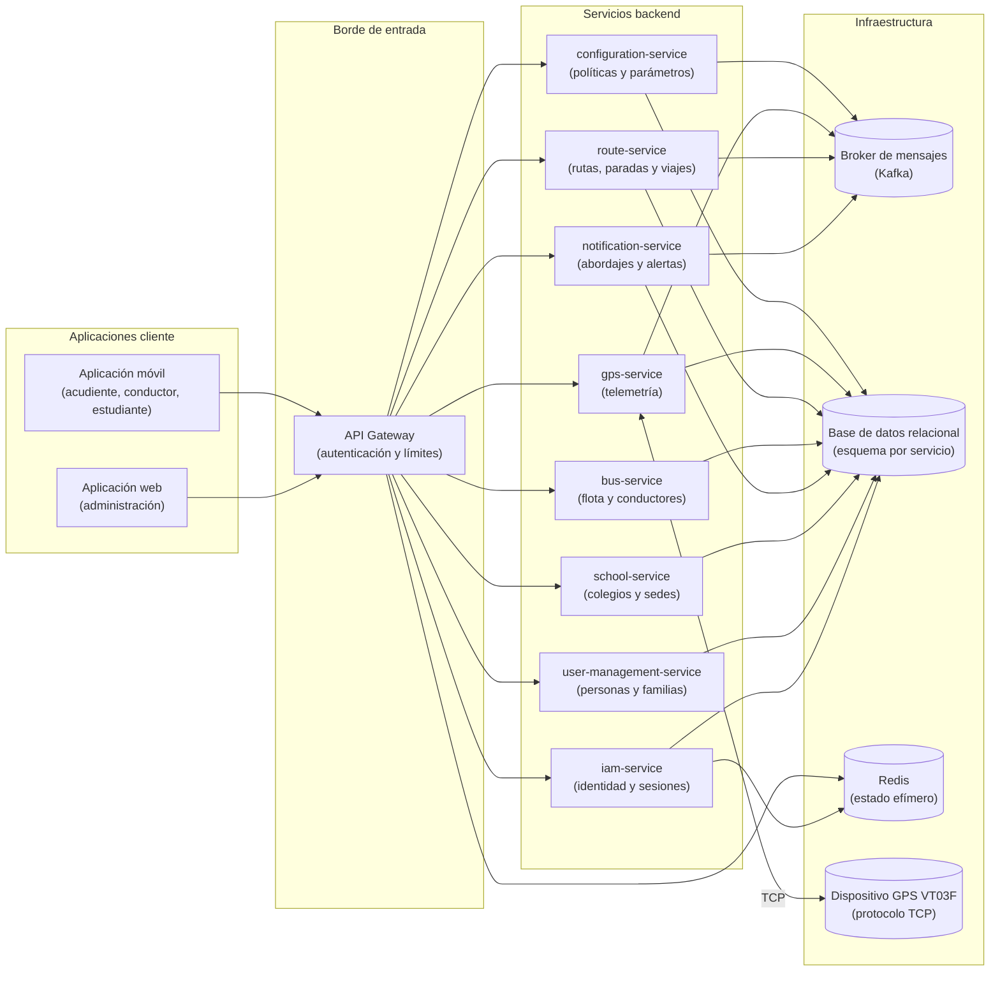

**Explicación.** Todas las peticiones de las aplicaciones cliente ingresan por la puerta de enlace, que valida el token de acceso e inyecta la identidad del usuario antes de enrutar la petición al servicio correspondiente. Los servicios de dominio son estatales respecto de sus datos (cada uno persiste en su esquema) y se comunican de forma asíncrona mediante eventos para los procesos que no requieren respuesta inmediata. El dispositivo GPS VT03F se integra por protocolo TCP con el servicio de telemetría, que procesa las posiciones y publica eventos para que otros servicios actualicen la ubicación del bus y evalúen condiciones de alerta.

## 2.3 Actores y roles principales

| Actor | Rol técnico | Descripción |
|-------|-------------|-------------|
| **SUPER_ADMIN** | Superadministrador | Rol global: gestiona administradores y colegios, y administra su propio perfil y datos de contacto. |
| **ADMIN** | Administrador | Rol operativo: gestiona usuarios (estudiantes, padres, conductores), familias, buses, paradas, rutas y asignaciones. |
| **Acudiente** | Parent/Guardian | Consulta la ruta de sus estudiantes, recibe notificaciones y alertas, y visualiza la ubicación en vivo del bus. |
| **Conductor** | Driver | Consulta su ruta asignada, inicia y finaliza el viaje, escanea los códigos QR de subida y bajada, y reporta incidentes. |
| **Estudiante** | Student | Visualiza su código QR personal y consulta su ruta. |
| **Dispositivo GPS VT03F** | Sistema externo | Envía continuamente la posición del bus (latitud, longitud, velocidad, rumbo y fecha GPS) mediante TCP. |
| **Sistema** | Actor automático | Ejecuta procesos automáticos: detección de eventos, generación y envío de notificaciones y alertas. |
| **Proveedores externos** | Sistemas externos | Envío de notificaciones push, mensajería SMS, correo electrónico y mapas interactivos. |

## 2.4 Supuestos y restricciones

**Supuestos:**

1. Las cuentas de usuario **no son de autoregistro**: el administrador (ADMIN) o el superadministrador (SUPER_ADMIN) crean todas las cuentas del ecosistema (FR-1.1).
2. El acudiente se vincula a uno o más estudiantes mediante la vinculación de familia gestionada por el administrador (FR-1.4).
3. El conductor se asigna al **bus**, y alcanza sus rutas de forma transitiva a través del bus asignado a la ruta; no existe una tabla directa conductor–ruta (decisión FR-3.6).
4. Cada bus tiene **un único viaje activo** a la vez (FR-7.1).
5. El estudiante debe estar asignado a la ruta para poder abordar; el descenso requiere un abordaje activo previo (FR-4.2, FR-4.3).
6. El entorno inicial de operación es el municipio de Neiva, Huila (Colombia).
7. La interfaz de usuario se puede personalizar en tema e idioma; la personalización se resuelve en las aplicaciones cliente (FR-10.1, FR-10.2).

**Restricciones:**

1. Todos los endpoints privados exigen un JWT válido; los tokens expiran en 1 hora y los tokens de refresco en 7 días (NFR-004).
2. La comunicación entre servicios se realiza con gRPC (síncrona) y Kafka (asíncrona); nunca se accede de forma directa a la base de datos de otro servicio (ADR-002, ADR-004, ADR-005).
3. Cada servicio persiste en un esquema propio dentro de una instancia relacional compartida; las llaves foráneas entre esquemas se mantienen de forma directa.
4. El tratamiento de datos personales de menores exige autorización de los padres conforme a la normativa colombiana (Ley 1581 de 2012 y Decreto 1377 de 2013).
5. La aplicación móvil y algunos flujos de notificación pueden encontrarse en desarrollo o parcialmente implementados; este documento describe el comportamiento objetivo del sistema.

## 2.5 Relación con la vista estática

La vista estática del sistema define las entidades, agregados, objetos de valor e invariantes del dominio (modelo táctico DDD). Este documento mantiene **consistencia estricta de nombres** con dicha vista: las clases, atributos y métodos que aparecen en los diagramas dinámicos son los mismos que los del modelo de dominio.

Los principales agregados del dominio son:

- `Person` y `Family` (contexto de gestión de usuarios).
- `Profile` (contexto de seguridad).
- `School` (contexto de gestión de colegios).
- `Bus` y sus asignaciones (contexto de gestión de flota).
- `Route` con `RouteStop`, `RouteBusAssignment` y `RouteStudentAssignment` (contexto de gestión de rutas).
- `GpsDevice` con `GpsLocation` (contexto de telemetría GPS).
- `Boarding` (contexto de abordaje).
- `Alert` (contexto de alertas).

El siguiente diagrama de clases resume las entidades principales y sus relaciones, tal como se definen en la vista estática:

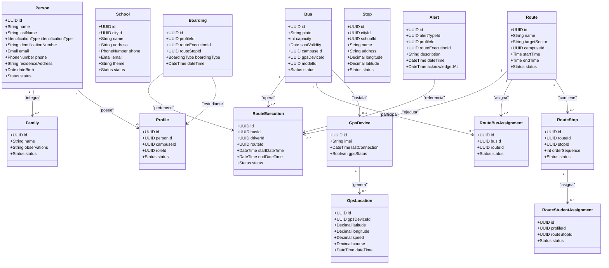

**Explicación.** El diagrama resume las entidades y los agregados definidos en la vista estática; las relaciones entre contextos se implementan mediante referencias de identidad (identificadores compartidos) y, cuando un contexto necesita los datos de otro, mediante APIs o eventos, nunca mediante acceso directo a la base de datos. Los flujos dinámicos descritos en las secciones 4 a 7 operan sobre estas mismas entidades y respetan sus invariantes (ver sección 8.1).---

# 3. Modelo de casos de uso

## 3.1 Diagrama general de casos de uso

El diagrama siguiente presenta el modelo general de casos de uso del sistema. Los actores se representan a la izquierda y los casos de uso dentro de la frontera del sistema.

```mermaid
flowchart TB
    subgraph SISTEMA["Sistema Guardian Escolar"]
        direction TB
        UC1(("UC-01 Iniciar sesión y renovar sesión"))
        UC2(("UC-02 Recuperar contraseña"))
        UC3(("UC-03 Gestionar cuentas de usuario"))
        UC4(("UC-04 Gestionar familias y vincular estudiantes"))
        UC5(("UC-05 Gestionar colegios y sedes"))
        UC6(("UC-06 Gestionar flota de buses"))
        UC7(("UC-07 Asignar conductor a bus"))
        UC8(("UC-08 Gestionar rutas y paradas"))
        UC9(("UC-09 Asignar bus a ruta"))
        UC10(("UC-10 Asignar estudiantes a ruta"))
        UC11(("UC-11 Consultar ruta asignada"))
        UC12(("UC-12 Iniciar y finalizar viaje"))
        UC13(("UC-13 Registrar subida y bajada por QR"))
        UC14(("UC-14 Visualizar código QR"))
        UC15(("UC-15 Recibir notificaciones y alertas"))
        UC16(("UC-16 Monitorear bus en tiempo real"))
        UC17(("UC-17 Reportar incidente"))
        UC18(("UC-18 Gestionar perfil y datos de contacto"))
        UC19(("UC-19 Personalizar tema e idioma"))
    end

    SADMIN(["Superadministrador"]) --> UC1
    SADMIN --> UC3
    SADMIN --> UC5
    SADMIN --> UC18

    ADMIN(["Administrador"]) --> UC1
    ADMIN --> UC3
    ADMIN --> UC4
    ADMIN --> UC6
    ADMIN --> UC7
    ADMIN --> UC8
    ADMIN --> UC9
    ADMIN --> UC10
    ADMIN --> UC18

    ACU(["Acudiente"]) --> UC1
    ACU --> UC11
    ACU --> UC15
    ACU --> UC16

    CON(["Conductor"]) --> UC1
    CON --> UC11
    CON --> UC12
    CON --> UC13
    CON --> UC17

    EST(["Estudiante"]) --> UC1
    EST --> UC11
    EST --> UC14

    SYS(["Sistema"]) --> UC15
    SYS --> UC16

    GPSD(["Dispositivo GPS VT03F"]) --> UC16
```

**Explicación.** El modelo distingue cinco actores humanos (superadministrador, administrador, acudiente, conductor y estudiante) y dos actores no humanos (sistema automático y dispositivo GPS). Los casos de uso de autenticación (UC-01, UC-02) son comunes a todos los roles; los casos de uso de administración (UC-03 a UC-10) corresponden a los roles administrativos; los casos de uso operativos (UC-11 a UC-17) corresponden al conductor, al estudiante y al acudiente; y los casos de uso de personalización (UC-18, UC-19) son transversales.

## 3.2 Actores del sistema

| Actor | Descripción | Casos de uso asociados |
|-------|-------------|------------------------|
| **SUPER_ADMIN** | Rol global que gestiona administradores y colegios | UC-01, UC-03, UC-05, UC-18 |
| **ADMIN** | Rol operativo que gestiona el ecosistema escolar y de transporte | UC-01, UC-03, UC-04, UC-06, UC-07, UC-08, UC-09, UC-10, UC-18 |
| **Acudiente** | Responsable de uno o más estudiantes | UC-01, UC-11, UC-15, UC-16 |
| **Conductor** | Operador del bus y de la ruta | UC-01, UC-11, UC-12, UC-13, UC-17 |
| **Estudiante** | Beneficiario del transporte escolar | UC-01, UC-11, UC-14 |
| **Sistema** | Actor automático que detecta eventos y envía notificaciones y alertas | UC-15, UC-16 |
| **Dispositivo GPS VT03F** | Hardware de telemetría que reporta la posición del bus | UC-16 |

## 3.3 Catálogo de casos de uso

| ID | Caso de uso | Actor principal | Requisitos asociados | Prioridad |
|----|-------------|-----------------|----------------------|-----------|
| UC-01 | Iniciar sesión y renovar sesión | Todos los roles | FR-2.1, FR-2.2 | Alta |
| UC-02 | Recuperar contraseña | Todos los roles | FR-2.1 (derivado: flujo de recuperación) | Media |
| UC-03 | Gestionar cuentas de usuario | ADMIN, SUPER_ADMIN | FR-1.1, FR-1.2, FR-1.3 | Alta |
| UC-04 | Gestionar familias y vincular estudiantes | ADMIN | FR-1.4 | Alta |
| UC-05 | Gestionar colegios y sedes | SUPER_ADMIN | Datos maestros (School, SchoolCampus) | Media |
| UC-06 | Gestionar flota de buses | ADMIN | FR-3.8 | Media |
| UC-07 | Asignar conductor a bus | ADMIN | FR-3.6 | Alta |
| UC-08 | Gestionar rutas y paradas | ADMIN | FR-3.1, FR-3.2, FR-3.3, FR-3.4 | Alta |
| UC-09 | Asignar bus a ruta | ADMIN | FR-3.5 | Media |
| UC-10 | Asignar estudiantes a ruta | ADMIN | FR-3.7 | Alta |
| UC-11 | Consultar ruta asignada | Acudiente, Conductor, Estudiante | FR-9.1, FR-9.2 | Alta |
| UC-12 | Iniciar y finalizar viaje | Conductor | FR-7.1, FR-7.2 | Alta |
| UC-13 | Registrar subida y bajada por QR | Conductor | FR-4.2, FR-4.3, FR-5.1 | Alta |
| UC-14 | Visualizar código QR | Estudiante | FR-4.1 | Media |
| UC-15 | Recibir notificaciones y alertas | Acudiente (Sistema emisor) | FR-5.2, FR-5.3, FR-5.4, FR-8.2 | Alta |
| UC-16 | Monitorear bus en tiempo real | Acudiente (Sistema, GPS) | FR-6.1, FR-6.2, FR-6.3 | Alta |
| UC-17 | Reportar incidente | Conductor | FR-8.1 | Media |
| UC-18 | Gestionar perfil y datos de contacto | ADMIN, SUPER_ADMIN | Datos maestros de autenticación (perfil) | Media |
| UC-19 | Personalizar tema e idioma | Todos los roles (cliente) | FR-10.1, FR-10.2 | Baja |

## 3.4 Especificación de casos de uso

### UC-01 Iniciar sesión y renovar sesión

| Campo | Descripción |
|-------|-------------|
| **Actores** | Todos los roles (SUPER_ADMIN, ADMIN, Acudiente, Conductor, Estudiante) |
| **Descripción** | El usuario ingresa sus credenciales (documento de identidad y contraseña), recibe un token de acceso JWT con expiración de 1 hora y un token de refresco con validez de 7 días, y puede renovar la sesión o cerrarla de forma segura. |
| **Precondiciones** | El usuario tiene una cuenta creada por un administrador y su perfil se encuentra en estado `ACTIVE`. |
| **Postcondiciones** | Se emite el par de tokens (acceso y refresco), se registra la sesión y el usuario puede invocar las operaciones autorizadas por su rol (RBAC). |
| **Reglas de negocio** | INV-PRO-003 (un perfil inactivo no puede iniciar sesión); NFR-004 (expiración del token). |
| **Trazabilidad** | FR-2.1, FR-2.2 · HU-IAM-001 |

**Flujo principal:**

1. El usuario selecciona "Iniciar sesión" en la aplicación e ingresa documento de identidad y contraseña.
2. La aplicación envía las credenciales al servicio de identidad a través de la puerta de enlace.
3. El servicio valida la sintaxis de las credenciales y verifica el estado del perfil.
4. El servicio valida la contraseña (hash seguro) y consulta el rol y los permisos del perfil.
5. Si la validación es correcta, el servicio genera el token de acceso JWT (1 hora) y el token de refresco (7 días) y registra la sesión.
6. La aplicación almacena los tokens de forma segura y presenta el panel o la vista principal según el rol.

**Flujos alternativos:**

- A1 (renovación): cuando el token de acceso expira, la aplicación solicita la renovación con el token de refresco; el servicio valida que el token no esté revocado, emite un nuevo par de tokens y marca el refresco anterior como usado.
- A2 (cierre de sesión): el usuario finaliza la sesión; el servicio revoca el token de refresco y agrega el token de acceso a la lista de revocación para impedir su reutilización.

**Excepciones:**

- E1: Credenciales inválidas → se informa al usuario y se registra el intento fallido.
- E2: Perfil inactivo → se rechaza el acceso con el mensaje correspondiente.
- E3: Token de refresco revocado o expirado → se solicita nuevamente la autenticación.

---

### UC-02 Recuperar contraseña

| Campo | Descripción |
|-------|-------------|
| **Actores** | Todos los roles |
| **Descripción** | El usuario solicita la recuperación de su contraseña ingresando el correo registrado; el sistema valida la identidad mediante un código enviado por correo o mensajería SMS, y permite establecer una nueva contraseña conforme a la política de seguridad vigente. |
| **Precondiciones** | La cuenta del usuario existe en el sistema y tiene un medio de contacto registrado. |
| **Postcondiciones** | La contraseña queda restablecida, el token de recuperación se invalida y el usuario puede iniciar sesión con la nueva contraseña. |
| **Reglas de negocio** | Política de contraseñas del servicio de configuración (longitud, complejidad y caducidad); límite de solicitudes por dirección IP y por cuenta. |
| **Trazabilidad** | FR-2.1 (flujo de recuperación) · HU-IAM-001 |

**Flujo principal:**

1. El usuario elige "¿Olvidó su contraseña?" e ingresa su correo.
2. El sistema valida que la cuenta exista y genera un código de recuperación de un solo uso con expiración.
3. El sistema envía el código al correo o teléfono registrado.
4. El usuario ingresa el código; el sistema lo valida.
5. El usuario define la nueva contraseña; el sistema valida las políticas de seguridad.
6. El sistema actualiza el hash de la contraseña, invalida los tokens activos de la cuenta y redirige al inicio de sesión.

**Excepciones:**

- E1: La cuenta no existe o el medio de contacto no coincide → se muestra un mensaje genérico para no revelar información de cuentas.
- E2: El código es incorrecto o expiró → se permite un número limitado de reintentos.
- E3: Límite de solicitudes excedido → se aplica límite de velocidad por IP y por cuenta.

---

### UC-03 Gestionar cuentas de usuario

| Campo | Descripción |
|-------|-------------|
| **Actores** | ADMIN, SUPER_ADMIN |
| **Descripción** | El administrador crea, consulta, actualiza y activa o desactiva las cuentas de estudiantes, padres, conductores y administradores, asignando a cada cuenta el rol correspondiente. La desactivación bloquea el acceso al sistema y las asignaciones. |
| **Precondiciones** | El usuario autenticado tiene rol ADMIN o SUPER_ADMIN con el permiso de gestión de cuentas. |
| **Postcondiciones** | La persona y su perfil quedan creados o actualizados; la creación de la persona dispara el evento de dominio para generar el perfil de seguridad. |
| **Reglas de negocio** | INV-PER-001 a INV-PER-003 (documento único, nombres obligatorios, formato de correo); INV-PRO-001 e INV-PRO-002 (perfil con persona y rol válidos). |
| **Trazabilidad** | FR-1.1, FR-1.2, FR-1.3 · HU-USER-004 |

**Flujo principal:**

1. El administrador selecciona el tipo de cuenta (estudiante, padre, conductor o administrador) e ingresa los datos de la persona.
2. El servicio de gestión de usuarios valida la unicidad del documento, el formato de correo y los datos obligatorios, y persiste la entidad `Person`.
3. El sistema publica el evento de creación de persona correspondiente al rol (estudiante, padre, conductor o administrador).
4. El servicio de identidad consume el evento y crea el `Profile` con el rol asignado y su estado inicial.
5. El administrador puede actualizar los datos; el sistema valida nuevamente las reglas de negocio.
6. El administrador puede activar o desactivar la cuenta; la desactivación bloquea el acceso y las asignaciones.

**Flujos alternativos:**

- A1 (desactivación): la cuenta pasa a estado `INACTIVE`; las asignaciones activas del usuario quedan invalidadas y los tokens de sesión se revocan.

**Excepciones:**

- E1: Documento de identidad duplicado → se rechaza la creación con el mensaje correspondiente.
- E2: Perfil asociado no encontrado al desactivar → se registra el evento de auditoría y se finaliza el proceso sin bloqueo.

---

### UC-04 Gestionar familias y vincular estudiantes

| Campo | Descripción |
|-------|-------------|
| **Actores** | ADMIN |
| **Descripción** | El administrador crea familias y vincula uno o más estudiantes a la cuenta de un acudiente (padre), de modo que este pueda consultar su transporte y recibir notificaciones. |
| **Precondiciones** | El acudiente y los estudiantes existen como cuentas en el sistema. |
| **Postcondiciones** | Los estudiantes quedan asociados al acudiente mediante la relación de familia; el acudiente visualiza la información de transporte de sus estudiantes. |
| **Reglas de negocio** | INV-FAM-002 (una familia activa debe tener al menos un miembro válido); FR-1.4. |
| **Trazabilidad** | FR-1.4 · HU-USER-003 |

**Flujo principal:**

1. El administrador abre la gestión de familias y crea o selecciona una familia.
2. El administrador agrega al acudiente como miembro de la familia.
3. El administrador agrega a los estudiantes correspondientes.
4. El sistema valida la integridad de las relaciones y persiste los cambios.
5. El acudiente puede consultar la ruta, las paradas y las notificaciones de sus estudiantes.

**Excepciones:**

- E1: Uno de los miembros no existe o está inactivo → se informa y no se completa la vinculación.

---

### UC-05 Gestionar colegios y sedes

| Campo | Descripción |
|-------|-------------|
| **Actores** | SUPER_ADMIN |
| **Descripción** | El superadministrador crea y actualiza colegios y sus sedes, asociando cada colegio a una ciudad registrada en el contexto geográfico. |
| **Precondiciones** | El usuario tiene rol SUPER_ADMIN. |
| **Postcondiciones** | El colegio o la sede quedan registrados y disponibles para asociar buses, rutas y administradores. |
| **Reglas de negocio** | INV-SCH-001 a INV-SCH-003 (nombre, ciudad y unicidad de identidad del colegio). |
| **Trazabilidad** | Datos maestros: `School`, `SchoolCampus`. |

**Flujo principal:**

1. El superadministrador selecciona "Gestión de colegios".
2. Ingresa el nombre del colegio y selecciona la ciudad.
3. El sistema valida la unicidad y la ciudad y persiste el colegio.
4. El superadministrador agrega las sedes y los administradores del colegio.
5. El sistema confirma el registro y lo publica como evento de dominio para los contextos de transporte.

---

### UC-06 Gestionar flota de buses

| Campo | Descripción |
|-------|-------------|
| **Actores** | ADMIN |
| **Descripción** | El administrador crea, edita y activa o desactiva los buses del colegio, registrando la placa, el modelo y el dispositivo GPS asociado; la placa debe ser única y la capacidad mayor que cero. |
| **Precondiciones** | El usuario tiene rol ADMIN; el colegio y el modelo existen. |
| **Postcondiciones** | El bus queda registrado con su placa única y disponible para asignación a rutas. |
| **Reglas de negocio** | INV-BUS-001 a INV-BUS-004 (placa única, colegio válido, conductor válido, dispositivo GPS exclusivo). |
| **Trazabilidad** | FR-3.8 · HU-FLEET-001 |

**Flujo principal:**

1. El administrador abre la gestión de flota y selecciona "Nuevo bus".
2. Ingresa la placa, el modelo, el colegio y el dispositivo GPS asociado.
3. El sistema valida la unicidad de la placa y que el dispositivo GPS no esté asignado a otro bus.
4. El sistema persiste el bus y lo deja disponible para asignación a rutas.

**Excepciones:**

- E1: Placa duplicada → se rechaza el registro.
- E2: Dispositivo GPS ya asignado a otro bus → se solicita otro dispositivo o se desasocia el anterior.

---

### UC-07 Asignar conductor a bus

| Campo | Descripción |
|-------|-------------|
| **Actores** | ADMIN |
| **Descripción** | El administrador asigna o revoca el conductor responsable de un bus. El conductor es responsable de ese bus hasta que se realice una nueva asignación; la cobertura de rutas del conductor se deriva del bus asignado a la ruta. |
| **Precondiciones** | El bus y el perfil del conductor existen y están activos. |
| **Postcondiciones** | El bus queda asociado al conductor; el conductor consulta su ruta a través del bus asignado a la ruta. |
| **Reglas de negocio** | INV-BUS-003 (el conductor asignado debe ser un perfil de conductor válido); decisión FR-3.6 (sin tabla conducdaor–ruta). |
| **Trazabilidad** | FR-3.6 · HU-BUS-002 |

**Flujo principal:**

1. El administrador selecciona un bus y la opción "Asignar conductor".
2. El sistema presenta los conductores activos disponibles.
3. El administrador selecciona el conductor y confirma.
4. El sistema valida el perfil del conductor y registra la asignación; la asignación anterior queda finalizada.

**Excepciones:**

- E1: El conductor es inválido o inactivo → se rechaza la asignación.

---

### UC-08 Gestionar rutas y paradas

| Campo | Descripción |
|-------|-------------|
| **Actores** | ADMIN |
| **Descripción** | El administrador crea, consulta, actualiza y elimina rutas escolares, definiendo las paradas ordenadas y los horarios asociados. Una ruta solo puede eliminarse si no depende de ella un viaje activo. |
| **Precondiciones** | El usuario tiene rol ADMIN; el colegio y las paradas existen. |
| **Postcondiciones** | La ruta queda creada o actualizada con sus paradas ordenadas y horarios, lista para asignar bus y estudiantes. |
| **Reglas de negocio** | INV-ROU-001 a INV-ROU-004; AGGR-INV-001 a AGGR-INV-004 (sin paradas duplicadas en la misma posición, sin asignaciones duplicadas). |
| **Trazabilidad** | FR-3.1, FR-3.2, FR-3.3, FR-3.4 · HU-ROUTE-001 |

**Flujo principal:**

1. El administrador abre la gestión de rutas y selecciona "Nueva ruta".
2. Ingresa el nombre y el colegio, y agrega las paradas en orden.
3. Define los horarios (salida y llegada) y la asignación de paradas por sentido.
4. El sistema valida la unicidad de la ruta, la ausencia de paradas duplicadas en la misma posición y los horarios.
5. El sistema persiste la ruta y publica el evento de dominio correspondiente.

**Flujos alternativos:**

- A1 (actualización): el administrador modifica paradas u horarios; el sistema valida que no existan viajes activos que impidan el cambio de estructura.
- A2 (eliminación): el sistema verifica que no exista un viaje activo dependiente; de existir, rechaza la eliminación.

**Excepciones:**

- E1: Ruta duplicada o paradas duplicadas → se informa al administrador.
- E2: Eliminación con viaje activo → se rechaza la operación.

---

### UC-09 Asignar bus a ruta

| Campo | Descripción |
|-------|-------------|
| **Actores** | ADMIN |
| **Descripción** | El administrador asigna o revoca el bus que cubre una ruta, con la restricción de un bus por ruta y una ruta por bus. |
| **Precondiciones** | La ruta y el bus existen y pertenecen al mismo contexto escolar. |
| **Postcondiciones** | La ruta queda cubierta por el bus; el servicio de telemetría asocia el seguimiento GPS del bus a la ruta. |
| **Reglas de negocio** | INV-RBA-001 a INV-RBA-003; AGGR-INV-004 (un bus no se asigna a la misma ruta más de una vez). |
| **Trazabilidad** | FR-3.5 · HU-ROUTE-005 |

**Flujo principal:**

1. El administrador selecciona la ruta y la opción "Asignar bus".
2. El sistema presenta los buses disponibles del colegio.
3. El administrador selecciona el bus y confirma; el sistema valida la unicidad.
4. El sistema persiste la asignación y notifica al contexto de telemetría para asociar el dispositivo GPS.

**Excepciones:**

- E1: El bus ya está asignado a otra ruta → se rechaza o se solicita revocar la asignación previa.

---

### UC-10 Asignar estudiantes a ruta

| Campo | Descripción |
|-------|-------------|
| **Actores** | ADMIN |
| **Descripción** | El administrador asigna estudiantes a una ruta indicando la parada de abordaje y la de descenso; las paradas deben pertenecer a la ruta. |
| **Precondiciones** | La ruta tiene definidas sus paradas; los estudiantes pertenecen al contexto escolar correspondiente. |
| **Postcondiciones** | El estudiante queda habilitado para abordar en la parada asignada; su descenso se valida contra la parada configurada. |
| **Reglas de negocio** | INV-RSA-001 a INV-RSA-003; AGGR-INV-003 (el estudiante no se duplica en la misma ruta); FR-3.7. |
| **Trazabilidad** | FR-3.7 · HU-ROUTE-008 |

**Flujo principal:**

1. El administrador selecciona la ruta y la opción "Asignar estudiantes".
2. El sistema presenta los estudiantes del colegio no asignados a la ruta.
3. El administrador selecciona cada estudiante e indica su parada de abordaje y de descenso.
4. El sistema valida que las paradas pertenezcan a la ruta y que no exista duplicidad.
5. El sistema persiste las asignaciones y habilita la autorización de abordaje para el manejo por código QR.

**Excepciones:**

- E1: Parada no perteneciente a la ruta → se rechaza la asignación del estudiante.
- E2: Estudiante ya asignado → se informa al administrador.

---

### UC-11 Consultar ruta asignada

| Campo | Descripción |
|-------|-------------|
| **Actores** | Acudiente, Conductor, Estudiante |
| **Descripción** | El acudiente consulta el detalle de la ruta de sus estudiantes (bus, conductor, paradas ordenadas y horarios); el conductor consulta la ruta asignada a su bus; el estudiante consulta su ruta personal. |
| **Precondiciones** | El usuario está autenticado y existe una ruta asignada vigente. |
| **Postcondiciones** | El usuario visualiza el detalle de la ruta (paradas ordenadas, horarios, bus y conductor). |
| **Reglas de negocio** | FR-9.1, FR-9.2. |
| **Trazabilidad** | FR-9.1, FR-9.2 · HU-ROUTE-004, HU-ROUTE-002 |

**Flujo principal:**

1. El usuario inicia sesión y selecciona "Mi ruta" (o "Ruta de mi hijo").
2. El sistema consulta la ruta vigente según la asignación del estudiante (acudiente) o del bus (conductor).
3. El sistema presenta el bus, el conductor, las paradas en orden y los horarios programados.
4. En el caso del conductor, la consulta requiere un viaje activo para mostrar la información operativa.

**Excepciones:**

- E1: No existe ruta asignada → se muestra un mensaje informativo.

---

### UC-12 Iniciar y finalizar viaje

| Campo | Descripción |
|-------|-------------|
| **Actores** | Conductor |
| **Descripción** | El conductor inicia la ejecución de la ruta (viaje) cuando el bus está en marcha y la finaliza al completar el recorrido; solo puede existir **un** viaje activo por bus a la vez, y la finalización valida que no queden descensos pendientes. |
| **Precondiciones** | El bus tiene una ruta asignada; el conductor está autenticado y asociado al bus. |
| **Postcondiciones** | Se crea una `RouteExecution` en estado `IN_PROGRESS`; al finalizar, pasa a `FINISHED` (o se cancela). |
| **Reglas de negocio** | FR-7.1 (un viaje activo por bus); FR-7.2 (sin descensos pendientes al finalizar). |
| **Trazabilidad** | FR-7.1, FR-7.2 · HU-ROUTE-003 |

**Flujo principal:**

1. El conductor abre la aplicación y selecciona "Iniciar viaje" sobre su ruta asignada.
2. El sistema verifica que el bus no tenga un viaje activo previo.
3. El sistema crea la `RouteExecution` en estado `IN_PROGRESS` y notifica el inicio de la ruta.
4. Durante el viaje, el conductor registra los abordajes y descensos por código QR (UC-13).
5. Al terminar el recorrido, el conductor selecciona "Finalizar viaje".
6. El sistema valida que no existan descensos pendientes (estudiantes a bordo sin registrar su bajada).
7. El sistema finaliza la ejecución y notifica la finalización de la ruta.

**Flujos alternativos:**

- A1 (cancelación): el conductor cancela el viaje antes de completarlo; el sistema registra el estado `CANCELLED` conservando la trazabilidad de los eventos registrados.
- A2 (reinicio): al finalizar o cancelar, el conductor puede iniciar un nuevo viaje.

**Excepciones:**

- E1: Ya existe un viaje activo para el bus → se rechaza el inicio.
- E2: Quedan descensos pendientes → se solicita registrar las bajadas faltantes antes de finalizar.

---

### UC-13 Registrar subida y bajada por QR

| Campo | Descripción |
|-------|-------------|
| **Actores** | Conductor (con el estudiante como portador del código) |
| **Descripción** | El conductor escanea con la aplicación móvil el código QR individual de cada estudiante para registrar su subida (abordaje) o su bajada (descenso). La subida valida que el estudiante esté asignado a la ruta del viaje activo; la bajada requiere un abordaje activo previo. Cada evento genera una notificación automática al acudiente. |
| **Precondiciones** | Existe un viaje activo del bus; el estudiante porta su código QR; el estudiante está asignado a la ruta (subida) o tiene un abordaje activo (bajada). |
| **Postcondiciones** | Se crea la entidad `Boarding` con tipo `BOARDING` o `EXIT`; se notifica al acudiente del estudiante. |
| **Reglas de negocio** | INV-BRD-001 a INV-BRD-005; AGGR-INV-011 a AGGR-INV-014; FR-4.2, FR-4.3, FR-5.1. |
| **Trazabilidad** | FR-4.2, FR-4.3, FR-5.1, FR-5.2, FR-5.3 · HU-QR-001, HU-QR-002 |

**Flujo principal:**

1. El conductor selecciona "Escanear" y el tipo de operación (subida o bajada).
2. La aplicación lee el código QR del estudiante.
3. El sistema valida la vigencia del código y resuelve la identidad del estudiante.
4. Para subida: valida que el estudiante esté asignado a la ruta del viaje activo y que no tenga un abordaje activo; para bajada: valida que el estudiante tenga un abordaje activo.
5. El sistema registra la `Boarding` con la parada actual, el bus, el estudiante y el instante del evento.
6. El sistema publica el evento de abordaje/descenso registrado.
7. El servicio de notificaciones consume el evento y envía la notificación en tiempo real al acudiente con la hora y la parada (o la ubicación, en el descenso).
8. La aplicación confirma la operación al conductor.

**Flujos alternativos:**

- A1 (bajada sin abordaje activo): el sistema rechaza el descenso y solicita verificar el registro de subida.
- A2 (QR vencido o inválido): el sistema solicita regenerar el código del estudiante.

**Excepciones:**

- E1: Estudiante no asignado a la ruta → se rechaza la subida.
- E2: Código QR inválido o expirado → se informa al conductor.

---

### UC-14 Visualizar código QR

| Campo | Descripción |
|-------|-------------|
| **Actores** | Estudiante |
| **Descripción** | El estudiante visualiza en la aplicación móvil su código QR individual, que rota o expira según la política de seguridad definida. |
| **Precondiciones** | El estudiante tiene una cuenta activa y un código QR generado por el sistema. |
| **Postcondiciones** | El estudiante presenta el código vigente para ser escaneado por el conductor. |
| **Reglas de negocio** | FR-4.1 (generación individual con política de rotación/expiración). |
| **Trazabilidad** | FR-4.1 · HU-QR-004 |

**Flujo principal:**

1. El estudiante inicia sesión en la aplicación móvil.
2. Selecciona la opción "Mi código QR".
3. El sistema muestra el código vigente y su estado de validez.
4. El estudiante lo presenta al conductor para el escaneo.
5. Si el código está próximo a vencer, la aplicación lo renueva automáticamente.

**Excepciones:**

- E1: Código expirado → la aplicación lo regenera presentando un nuevo código.

---

### UC-15 Recibir notificaciones y alertas

| Campo | Descripción |
|-------|-------------|
| **Actores** | Acudiente (el Sistema actúa como emisor) |
| **Descripción** | El acudiente recibe en tiempo real las notificaciones de abordaje y descenso de sus estudiantes, las alertas de detención prolongada y las alertas de incidentes; puede consultar el historial en la bandeja de la aplicación. |
| **Precondiciones** | El acudiente tiene estudiantes vinculados; existe un dispositivo o canal de notificación registrado. |
| **Postcondiciones** | La notificación o alerta se entrega por el canal preferido y queda registrada para consulta. |
| **Reglas de negocio** | FR-5.2, FR-5.3, FR-5.4, FR-8.2; entrega al menos una vez con procesamiento idempotente. |
| **Trazabilidad** | FR-5.2, FR-5.3, FR-5.4, FR-8.2 · HU-NOTIF-001, HU-NOTIF-005, HU-INCIDENT-001 |

**Flujo principal:**

1. El sistema detecta el evento relevante (abordaje, descenso, detención prolongada o incidente).
2. El servicio de notificaciones resuelve el acudiente responsable del estudiante.
3. El servicio genera el mensaje según el tipo de evento y el canal preferido.
4. El servicio entrega la notificación en tiempo real y registra el estado de la entrega.
5. El acudiente la recibe en la aplicación y puede consultarla en su bandeja.

**Excepciones:**

- E1: Canal no disponible → se reintenta con política de espera exponencial y, si persiste, se registra el fallo.
- E2: Destino no registrado → se registra la alerta para entrega posterior.

---

### UC-16 Monitorear bus en tiempo real

| Campo | Descripción |
|-------|-------------|
| **Actores** | Acudiente (el Sistema y el Dispositivo GPS como emisores) |
| **Descripción** | El acudiente visualiza en un mapa interactivo la ubicación en tiempo real del bus que transporta a sus estudiantes; el sistema captura continuamente la posición GPS y actualiza el mapa sin necesidad de actualización manual; ante pérdida de señal, muestra la última posición conocida con un marcador de sin señal. |
| **Precondiciones** | El bus tiene un dispositivo GPS registrado y conectado; el acudiente tiene estudiantes vinculados al bus. |
| **Postcondiciones** | La posición del bus se actualiza en el mapa; las posiciones quedan almacenadas en el historial. |
| **Reglas de negocio** | INV-GPS-001 a INV-GPS-003; INV-LOC-001 a INV-LOC-004; FR-6.1, FR-6.2, FR-6.3. |
| **Trazabilidad** | FR-6.1, FR-6.2, FR-6.3 · HU-GPS-002 |

**Flujo principal:**

1. El dispositivo GPS VT03F envía la posición (latitud, longitud, velocidad, rumbo y fecha GPS) mediante TCP.
2. El servicio de telemetría valida el dispositivo, procesa la posición y la persiste como `GpsLocation`.
3. El servicio publica el evento de posición recibida.
4. El servicio actualiza la ubicación actual del bus y la expone para consulta.
5. La aplicación del acudiente recibe la actualización en tiempo real y la muestra en el mapa.
6. Si no llega una posición dentro del umbral configurado, el servicio de telemetría detecta la pérdida de señal y genera la alerta correspondiente.

**Excepciones:**

- E1: Señal perdida → se publica el evento de pérdida de señal y se muestra la última posición con marcador de sin señal.
- E2: Posición inválida (latitud/longitud fuera de rango) → se descarta y se registra.

---

### UC-17 Reportar incidente

| Campo | Descripción |
|-------|-------------|
| **Actores** | Conductor |
| **Descripción** | El conductor reporta un incidente o emergencia durante el viaje indicando el tipo, una descripción opcional y la ubicación GPS; el sistema notifica automáticamente al colegio y a los acudientes de los estudiantes a bordo. |
| **Precondiciones** | Existe un viaje activo; el conductor está autenticado. |
| **Postcondiciones** | Se crea una `Alert` de tipo incidente con sus destinatarios; se notifica al colegio y a los acudientes de los estudiantes a bordo. |
| **Reglas de negocio** | INV-ALT-001 a INV-ALT-003 (tipo, bus y mensaje válidos); FR-8.1, FR-8.2. |
| **Trazabilidad** | FR-8.1, FR-8.2 · HU-INCIDENT-001 |

**Flujo principal:**

1. El conductor selecciona "Reportar incidente".
2. Selecciona el tipo de incidente, escribe una descripción opcional y permite adjuntar la ubicación actual.
3. El sistema valida los datos y crea la `Alert` de tipo incidente.
4. El sistema resuelve el colegio y los acudientes de los estudiantes a bordo.
5. El sistema notifica a los destinatarios y registra la trazabilidad de la entrega.

**Excepciones:**

- E1: Sin viaje activo → el sistema solicita iniciar el viaje antes de reportar.

---

### UC-18 Gestionar perfil y datos de contacto

| Campo | Descripción |
|-------|-------------|
| **Actores** | ADMIN, SUPER_ADMIN |
| **Descripción** | El administrador visualiza su información personal y gestiona el cambio de correo, contraseña y teléfono mediante flujos de verificación por código, conforme a las políticas del servicio de configuración. |
| **Precondiciones** | El usuario está autenticado con rol ADMIN o SUPER_ADMIN. |
| **Postcondiciones** | El dato personal cambia previa verificación del código; los tokens de sesión se renuevan o revocan según corresponda. |
| **Reglas de negocio** | Políticas de contraseñas y de verificación por código del servicio de configuración; validación de formato de correo y teléfono. |
| **Trazabilidad** | Datos maestros de perfil (Security/UserManagement). |

**Flujo principal:**

1. El usuario abre su información de perfil.
2. Selecciona el cambio deseado (correo, contraseña o teléfono).
3. El sistema solicita el código de verificación al medio vigente; el usuario lo ingresa.
4. El sistema valida el código, aplica el cambio y confirma la operación.

**Excepciones:**

- E1: Código incorrecto o expirado → se permite un número limitado de reintentos.
- E2: El nuevo dato ya existe en el sistema (correo o documento) → se rechaza el cambio.

---

### UC-19 Personalizar tema e idioma

| Campo | Descripción |
|-------|-------------|
| **Actores** | Todos los roles (aplicaciones cliente) |
| **Descripción** | El usuario personaliza los colores de la interfaz (tema) y selecciona el idioma entre al menos cuatro opciones; la personalización se resuelve completamente en el cliente. |
| **Precondiciones** | El usuario está autenticado (aunque el tema puede permitirse también en modo público). |
| **Postcondiciones** | La interfaz muestra el tema y el idioma seleccionados; la preferencia queda guardada en el dispositivo. |
| **Reglas de negocio** | FR-10.1, FR-10.2 (sin interacción con servicios ni mensajería). |
| **Trazabilidad** | FR-10.1, FR-10.2 · HU-UI-001, HU-UI-002 |

**Flujo principal:**

1. El usuario abre la configuración de la aplicación.
2. Selecciona el tema y el idioma.
3. La aplicación aplica los cambios de forma inmediata y guarda la preferencia.---

# 4. Diagramas de secuencia

Los diagramas de secuencia representan la interacción temporal entre los actores y los componentes del sistema para los casos de uso críticos o complejos. Se priorizan los flujos de autenticación, alta de cuentas, asignaciones, viajes, escaneo QR, telemetría, alertas e incidentes.

## 4.1 SEQ-01 — Inicio de sesión y renovación de sesión

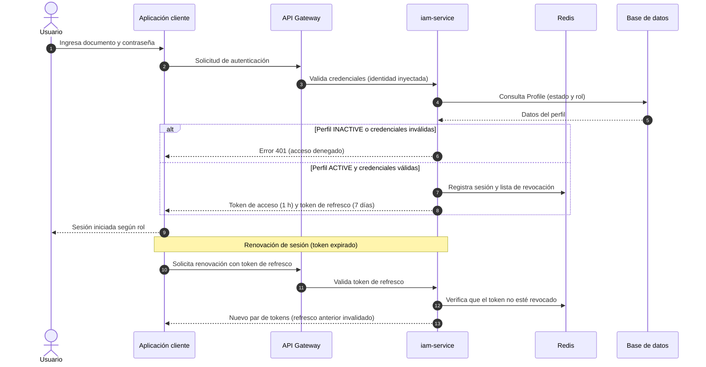

**Explicación.** El flujo de autenticación valida el perfil y el rol del usuario (RBAC), emite los tokens de acceso y refresco, y registra la sesión en el estado efímero (Redis). La renovación valida que el token de refresco no esté revocado y emite un nuevo par de tokens, lo que impide la reutilización de un mismo refresco de forma concurrente (ver sección 10).

## 4.2 SEQ-02 — Creación de cuenta con eventos (persona → perfil)

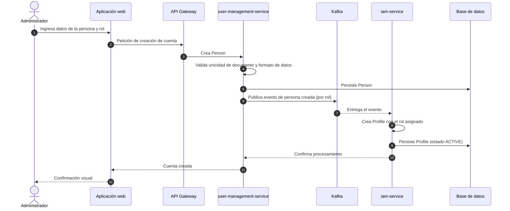

**Explicación.** La creación de una cuenta es un flujo distribuido: el servicio de gestión de usuarios persiste la `Person` y publica el evento correspondiente al rol (estudiante, padre, conductor o administrador); el servicio de identidad consume el evento y crea el `Profile` de seguridad. Esta separación mantiene el desacoplamiento entre los contextos de gestión de usuarios y de seguridad.

## 4.3 SEQ-03 — Asignación de bus a ruta y asociación de telemetría

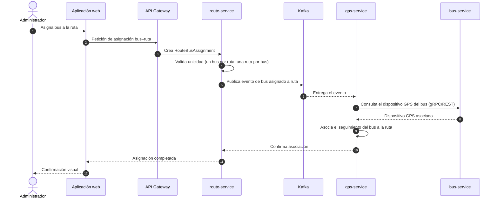

**Explicación.** La asignación del bus a la ruta valida las restricciones del agregado `Route` (un bus por ruta y una ruta por bus) y, mediante un evento asíncrono, el contexto de telemetría asocia el dispositivo GPS del bus para poder reportar su posición durante la ejecución de la ruta.

## 4.4 SEQ-04 — Inicio del viaje (ejecución de ruta)

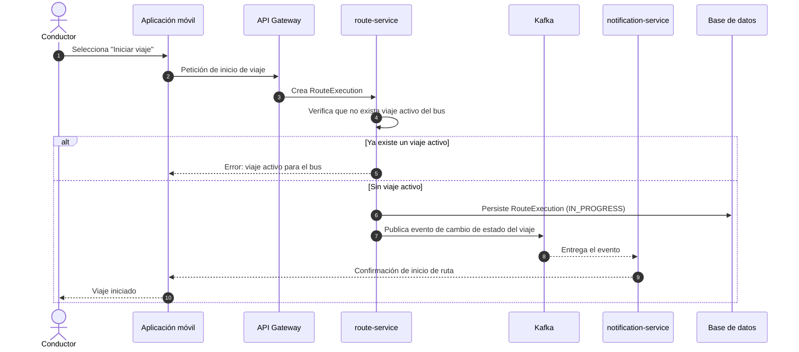

**Explicación.** El inicio del viaje aplica la regla de negocio de un único viaje activo por bus (FR-7.1). Cuando se crea la `RouteExecution` en estado `IN_PROGRESS`, el evento de cambio de estado alimenta a los consumidores interesados (notificaciones) sin acoplar al servicio de rutas con los canales de comunicación.

## 4.5 SEQ-05 — Registro de subida por código QR (abordaje)

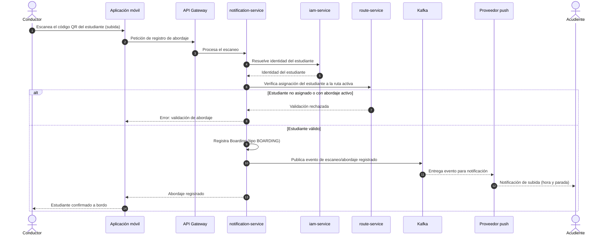

**Explicación.** El escaneo de subida cruza información de dos contextos: el servicio de notificaciones resuelve la identidad del estudiante (contexto de seguridad) y valida su asignación a la ruta activa (contexto de rutas). Una vez validado, se registra la `Boarding` y se publica el evento que dispara la notificación en tiempo real al acudiente.

## 4.6 SEQ-06 — Registro de bajada por código QR (descenso)

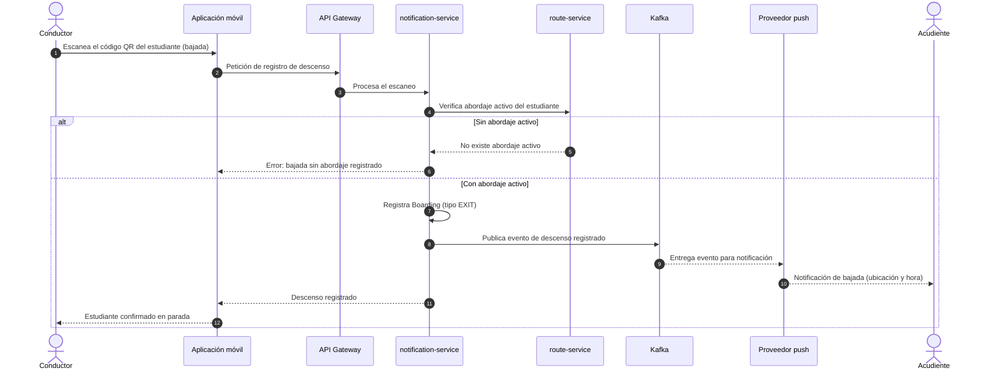

**Explicación.** El descenso requiere que el estudiante tenga un abordaje activo previo (FR-4.3); de lo contrario, la operación se rechaza. En el descenso, la notificación al acudiente incluye la ubicación y la hora del evento. El registro del descenso queda asociado a la parada actual del bus en la ejecución de la ruta.

## 4.7 SEQ-07 — Recepción de posición GPS y actualización en vivo

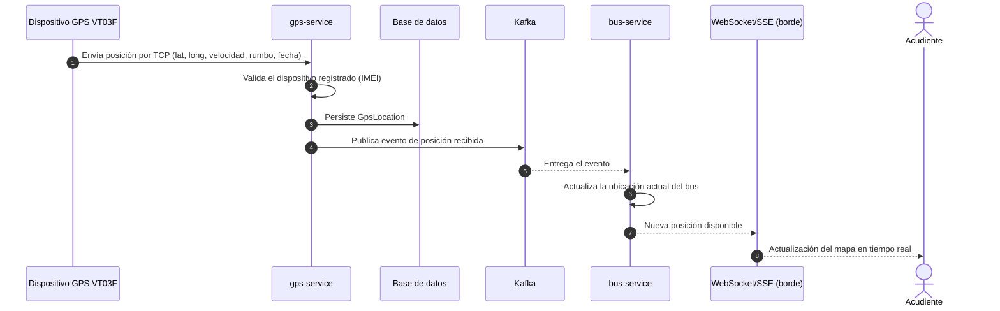

**Explicación.** El contexto de telemetría recibe las posiciones del dispositivo, las valida contra los dispositivos registrados, las persiste en el historial y publica el evento de posición recibida. El contexto de flota consume el evento para actualizar la ubicación actual del bus, que se expone a los clientes mediante un canal de tiempo real (WebSocket o SSE) en el borde.

## 4.8 SEQ-08 — Detección de pérdida de señal GPS y alerta

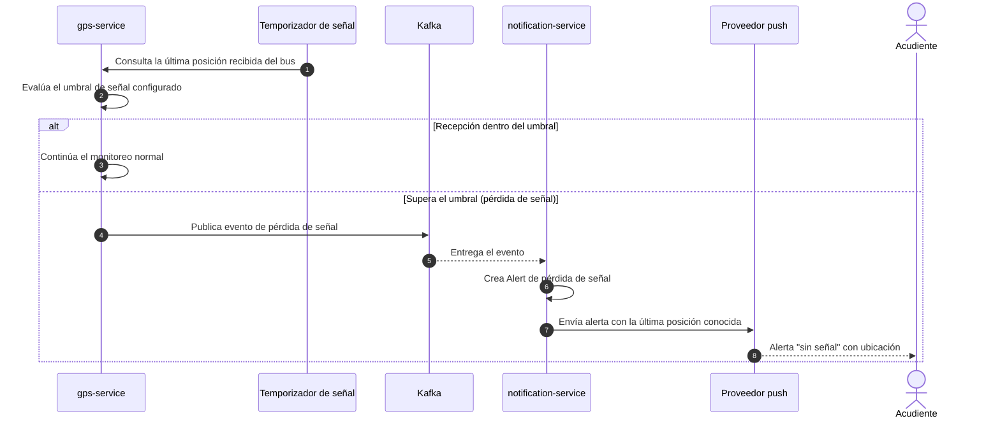

**Explicación.** El servicio de telemetría evalúa el tiempo transcurrido desde la última posición recibida (servicio de dominio `GpsSignalService`). Cuando se supera el umbral, se publica el evento de pérdida de señal; el servicio de notificaciones crea la alerta y la entrega al acudiente con la última posición conocida y un marcador de "sin señal".

## 4.9 SEQ-09 — Reporte de incidente y notificación

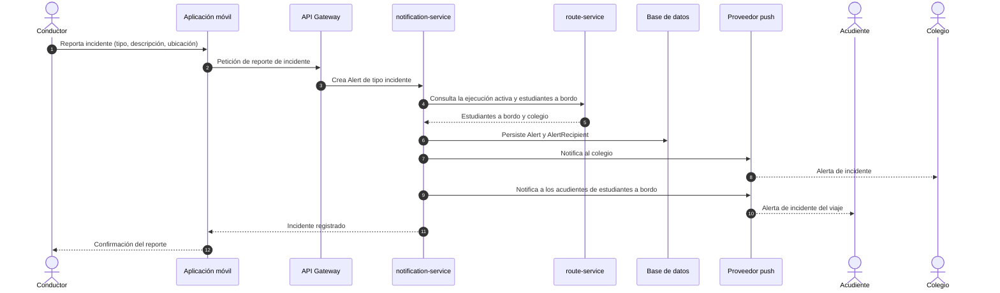

**Explicación.** El reporte de incidente crea una `Alert` de tipo incidente y determina los destinatarios a partir de la ejecución activa de la ruta: el colegio y los acudientes de los estudiantes a bordo. La trazabilidad de la entrega queda registrada mediante las entidades `Alert` y `AlertRecipient`.

---

# 5. Diagramas de actividad

Los diagramas de actividad describen los flujos de los procesos de negocio y de los casos de uso complejos, incluyendo calles (swimlanes) por actor o componente, decisiones, bifurcaciones y flujos paralelos.

## 5.1 ACT-01 — Gestión de rutas (creación con paradas y horarios)

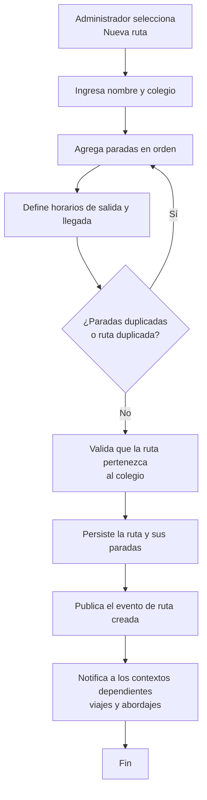

**Explicación.** El flujo de creación de la ruta recorre la captura de datos, el ordenamiento de paradas y la definición de horarios, y valida las reglas del agregado `Route` (unicidad, paradas sin duplicados en la misma posición). Al persistir, el evento de dominio notifica a los contextos que dependen de la ruta (boarding y telemetría).

## 5.2 ACT-02 — Subida y bajada por código QR (swimlanes)

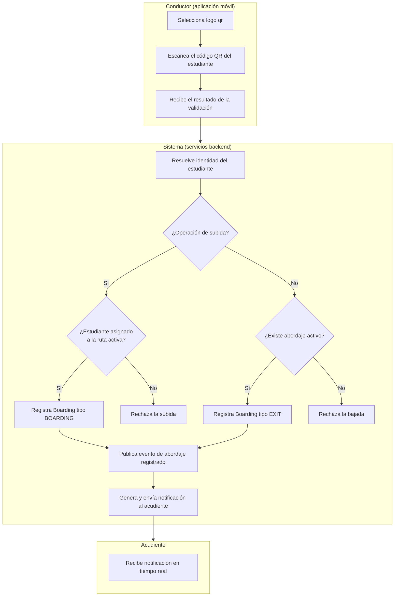

**Explicación.** El flujo de escaneo se distribuye en tres calles: el conductor captura el código; el sistema valida la operación según el tipo (subida: asignación a la ruta; bajada: abordaje activo) y registra la `Boarding`; y el acudiente recibe la notificación en tiempo real. Las decisiones del sistema separan los caminos de éxito y de rechazo sin bloquear el flujo del conductor.

## 5.3 ACT-03 — Finalización del viaje con validación de descensos pendientes

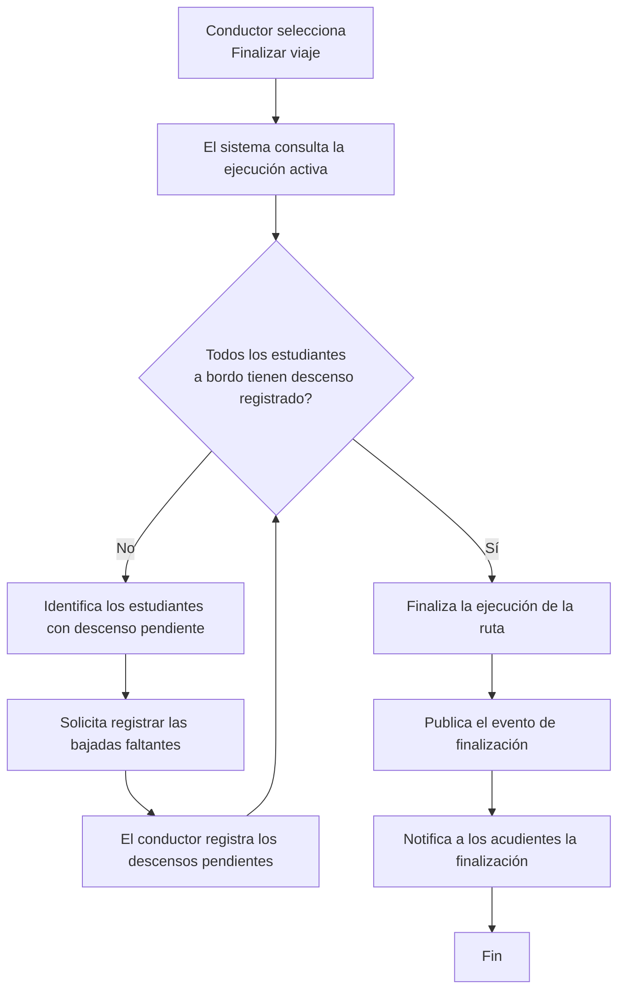

**Explicación.** La finalización del viaje aplica la regla FR-7.2: no pueden quedar descensos pendientes. El flujo itera hasta que todos los estudiantes a bordo tengan su bajada registrada, y solo entonces finaliza la `RouteExecution` y notifica el fin de la ruta.

## 5.4 ACT-04 — Detección de alerta por pérdida de señal GPS

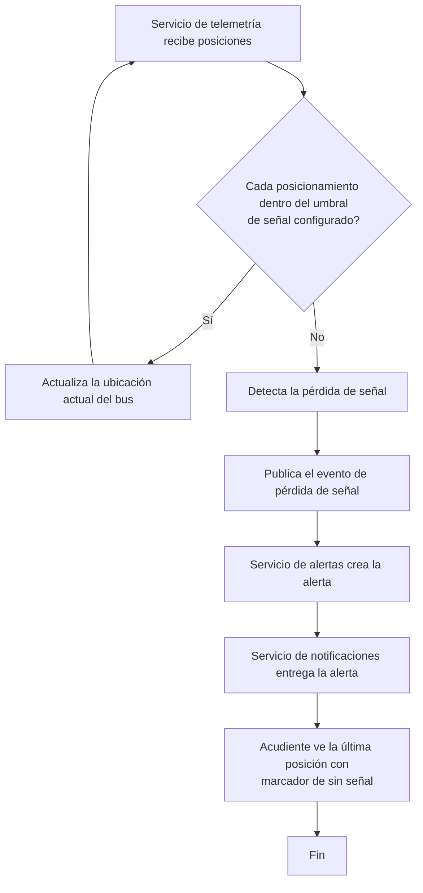

**Explicación.** El monitoreo de señal es un proceso continuo: mientras las posiciones llegan dentro del umbral, el sistema actualiza la ubicación del bus; cuando el tiempo desde la última posición supera el umbral, el servicio de dominio `GpsSignalService` detecta la pérdida y se desencadena la cadena evento → alerta → notificación al acudiente.

## 5.5 ACT-05 — Reporte de incidente y notificación a destinatarios

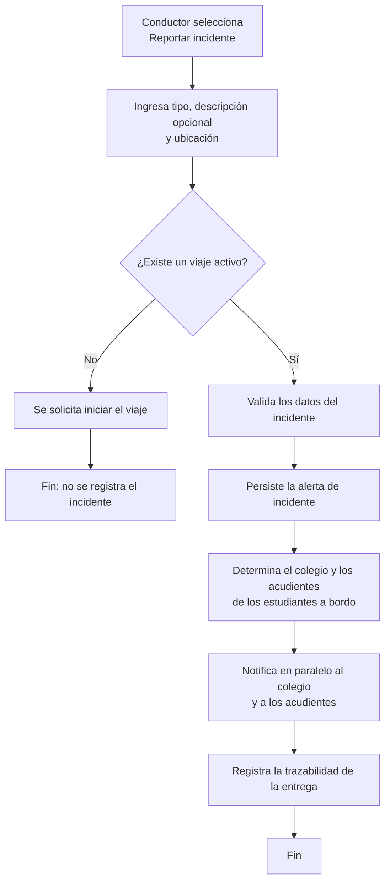

**Explicación.** El reporte de incidente requiere un viaje activo; una vez validado, la alerta se persiste y se determina la lista de destinatarios a partir de los estudiantes a bordo. El envío al colegio y a los acudientes se realiza en paralelo, y la entrega queda registrada para trazabilidad.

## 5.6 ACT-06 — Recuperación de contraseña

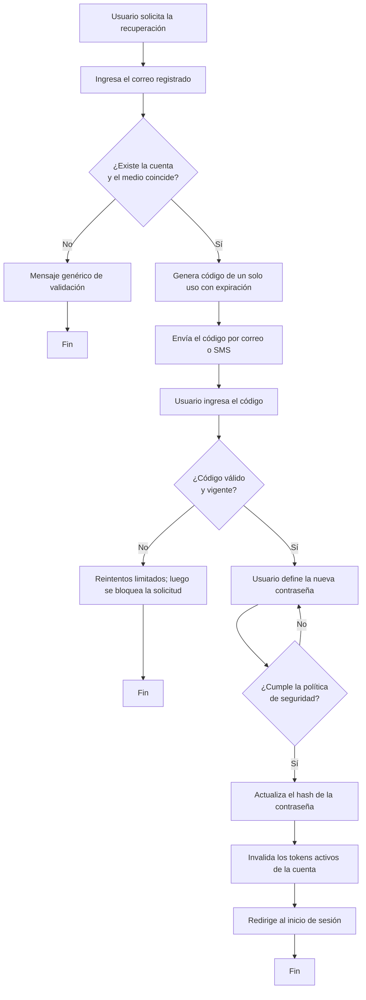

**Explicación.** El flujo de recuperación combina la verificación del medio de contacto con un código de un solo uso y la aplicación de la política de contraseñas. Las restricciones de reintentos y límites por IP protegen la operación frente a intentos de fuerza bruta.

---

# 6. Diagramas de estados

Los diagramas de estados modelan el ciclo de vida de los objetos del sistema con estados relevantes, transiciones, eventos, condiciones (guardas) y acciones.

## 6.1 EST-01 — Ciclo de vida del perfil (`Profile`)

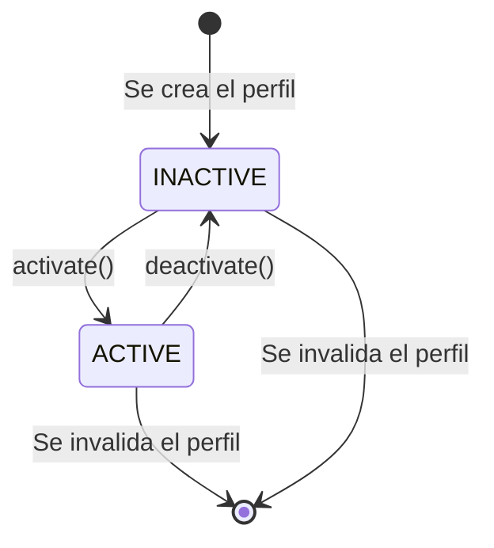

**Explicación.** El perfil nace inactivo y pasa a `ACTIVE` mediante la acción `activate()`; la desactivación (acción `deactivate()`) bloquea el acceso del usuario al sistema (INV-PRO-003) y sus asignaciones. El perfil es el objeto sobre el que se sustenta el control de acceso.

## 6.2 EST-02 — Ciclo de vida de la ruta (`Route`)

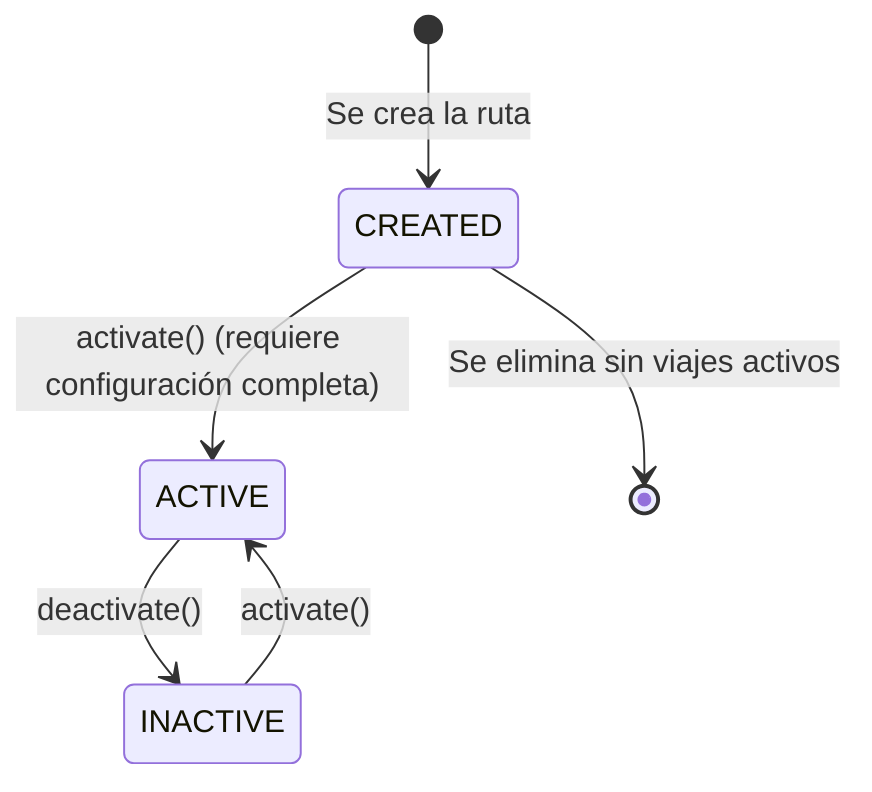

**Explicación.** La ruta se crea en estado `CREATED` y solo puede activarse cuando su configuración (paradas, horarios y asignaciones) está completa (INV-ROU-003). De los estados `ACTIVE` e `INACTIVE` puede volver a activarse; la eliminación solo procede si no depende de ella un viaje activo.

## 6.3 EST-03 — Ciclo de vida de la ejecución de ruta (`RouteExecution` / viaje)

```mermaid
stateDiagram-v2
    [*] --> SCHEDULED : Se programa la ejecución
    SCHEDULED --> IN_PROGRESS : El conductor inicia el viaje
    IN_PROGRESS --> FINISHED : Finaliza el viaje (sin descensos pendientes)
    IN_PROGRESS --> CANCELLED : El conductor cancela el viaje
    FINISHED --> SCHEDULED : Se programa una nueva ejecución
    CANCELLED --> SCHEDULED : Se programa una nueva ejecución
```

**Explicación.** La ejecución de la ruta (viaje) transita de `SCHEDULED` a `IN_PROGRESS` cuando el conductor inicia el viaje; solo existe **una** ejecución activa por bus (FR-7.1). La transición a `FINISHED` exige que no queden descensos pendientes (FR-7.2); la cancelación conserva la trazabilidad de los eventos registrados. Una vez finalizada o cancelada, puede programarse una nueva ejecución.

## 6.4 EST-04 — Ciclo de vida del abordaje (`Boarding`)

```mermaid
stateDiagram-v2
    [*] --> QR_SCANNED : El conductor escanea el código QR
    QR_SCANNED --> BOARDING_REGISTERED : Registro validado (BOARDING o EXIT)
    QR_SCANNED --> [*] : Escaneo rechazado (validación fallida)
```

**Explicación.** El abordaje nace cuando el código QR es escaneado (`QR_SCANNED`) y, tras la validación de las reglas de negocio (asignación del estudiante, abordaje activo para descenso, parada y bus válidos), queda registrado (`BOARDING_REGISTERED`), perteneciendo al agregado `Boarding`.

## 6.5 EST-05 — Ciclo de vida del dispositivo GPS (`GpsDevice`)

```mermaid
stateDiagram-v2
    [*] --> REGISTERED : Se registra el dispositivo (IMEI)
    REGISTERED --> CONNECTED : connect() (recibe posiciones)
    CONNECTED --> DISCONNECTED : disconnect() (pérdida de señal)
    DISCONNECTED --> CONNECTED : reconnect() (se reanuda la recepción)
    CONNECTED --> [*] : Se retira el dispositivo
```

**Explicación.** El dispositivo GPS nace `REGISTERED` y pasa a `CONNECTED` cuando comienza a recibir posiciones válidas. Ante una pérdida de señal, transita a `DISCONNECTED` y puede volver a `CONNECTED` cuando se restablece la recepción. Solo los dispositivos registrados pueden enviar datos de ubicación válidos (INV-GPS-002).

## 6.6 EST-06 — Ciclo de vida de la alerta (`Alert`)

```mermaid
stateDiagram-v2
    [*] --> CREATED : Se crea la alerta (tipo y destinatarios)
    CREATED --> DELIVERING : Se inicia la entrega
    DELIVERING --> DELIVERED : Entrega confirmada
    DELIVERING --> FAILED : Fallo del canal (reintentos agotados)
    FAILED --> DELIVERING : Reintento con espera exponencial
    DELIVERED --> [*] : Alerta atendida o expirada
```

**Explicación.** La alerta se crea a partir de un evento significativo (pérdida de señal, detención prolongada o incidente), se entrega por el canal correspondiente y queda `DELIVERED` al confirmarse. Si el canal falla, la alerta se reintenta con espera exponencial; tras agotar los reintentos pasa a `FAILED` y se envía a la cola de mensajes fallidos (DLQ) para su análisis.

---

# 7. Modelo de flujo de datos

El modelo de flujo de datos (DFD) complementa la metodología de análisis; se presenta como un modelo opcional que describe la transformación de los datos entre los actores, los procesos y los almacenes del sistema.

## 7.1 Diagrama de contexto (nivel 0)

```mermaid
flowchart LR
    ADMIN["Administrador"] -->|Datos de gestión| S(((Guardian Escolar)))
    SADMIN["Superadministrador"] -->|Datos de gestión| S
    ACU["Acudiente"] -->|Consultas de ruta y notificaciones| S
    CON["Conductor"] -->|Operaciones de viaje y escaneo| S
    EST["Estudiante"] -->|Código QR y consultas| S
    GPSD["Dispositivo GPS VT03F"] -->|Posición por TCP| S
    S -->|Notificaciones y alertas| ACU
    S -->|Notificaciones y alertas| CON
    S -->|Notificaciones de incidentes| ESC["Colegio"]
    S -->|Código QR vigente| EST
    S -->|Estado y confirmaciones| ADMIN
    S -->|Estado y confirmaciones| SADMIN
    S -->|Solicitud de envío| PUSH["Proveedor de push / SMS / correo"]
    S -->|Datos del mapa| MAP["Servicio de mapas"]
```

**Explicación.** El nivel 0 muestra la frontera del sistema con siete entidades externas: administrador, superadministrador, acudiente, conductor, estudiante, dispositivo GPS y proveedores externos (push/SMS/correo y mapas). Todas las interacciones de las aplicaciones cliente pasan por la puerta de enlace; el dispositivo GPS ingresa por el protocolo TCP de telemetría.

## 7.2 Diagrama de flujo de datos de nivel 1

```mermaid
flowchart LR
    ADMIN["Administrador"] -->|Datos de personas, familias, buses, rutas| P3((P3 Gestión de\nusuarios y familias))
    ADMIN -->|Datos de flota, rutas y asignaciones| P4((P4 Gestión de\nflota))
    ADMIN -->|Datos de rutas, paradas\ny asignaciones| P5((P5 Gestión de\nrutas))
    ADMIN -->|Datos de colegios| P6((P6 Gestión de\ncolegios))
    ACU["Acudiente"] -->|Credenciales| P1((P1 Autenticación))
    ACU -->|Consulta de ruta| P7((P7 Consulta\nde ruta))
    ACU -->|Delegación de notificaciones| P8((P8 Notificación\ny alertas))
    CON["Conductor"] -->|Credenciales| P1
    CON -->|Inicio y fin de viaje| P9((P9 Gestión de\nviajes))
    CON -->|Escaneo QR de subida y bajada| P10((P10 Gestión de\nabordajes))
    CON -->|Reporte de incidente| P11((P11 Gestión de\nincidentes))
    EST["Estudiante"] -->|Solicitud de código QR| P10
    GPSD["Dispositivo GPS"] -->|Posición| P12((P12 Telemetría\nGPS))
    P3 --> D1[(Personas)]
    P3 --> D2[(Familias)]
    P4 --> D3[(Buses)]
    P5 --> D4[(Rutas)]
    P5 --> D5[(Paradas)]
    P5 --> D6[(Asignaciones)]
    P6 --> D7[(Colegios)]
    P1 --> D8[(Perfiles y roles)]
    P7 --> D4
    P9 --> D9[(Ejecuciones de ruta)]
    P10 --> D10[(Abordajes)]
    P8 --> D11[(Alertas y notificaciones)]
    P11 --> D11
    P12 --> D12[(Posiciones GPS)]
    P12 --> D13[(Dispositivos GPS)]
    P8 -->|Notificaciones y alertas| ACU
    P8 -->|Notificaciones de incidentes| ESC["Colegio"]
    P11 -->|Alerta de incidente| P8
    P12 -->|Pérdida de señal| P8
```

**Explicación.** El nivel 1 descompone el sistema en doce procesos: autenticación (P1), gestión de usuarios y familias (P3), flota (P4), rutas (P5), colegios (P6), consulta de ruta (P7), notificación y alertas (P8), viajes (P9), abordajes (P10), incidentes (P11) y telemetría GPS (P12). Cada proceso actualiza sus almacenes de datos y se comunica mediante flujos de datos; los procesos P8, P10, P11 y P12 intercambian eventos de forma asíncrona, lo cual se representa con los flujos entre ellos.

## 7.3 Diccionario de datos

| Elemento | Tipo | Composición / descripción |
|----------|------|---------------------------|
| **DatosCredenciales** | Flujo | documentoIdentidad, contraseña |
| **DatosPersona** | Flujo | id, name, lastName, identificationNumber, email, phone |
| **DatosRuta** | Flujo | id, name, campuseId, paradas (orden), horarios (startTime, endTime) |
| **EscaneoQR** | Flujo | códigoQR, tipoOperacion (ON_BOARD/OFF_BOARD), busId, instante |
| **PosiciónGPS** | Flujo | gpsDeviceId, latitud, longitud, velocidad, rumbo, dateTime |
| **Notificación** | Flujo | profileIdDestino, canal (push/SMS/correo), mensaje, eventoOrigen |
| **D1 Personas** | Almacén | Person (id, name, lastName, identificationNumber, email, phone) |
| **D2 Familias** | Almacén | Family, FamilyMember |
| **D3 Buses** | Almacén | Bus (id, plate, capacity, soatValidity, campuseId, gpsDeviceId, modelId) |
| **D4 Rutas** | Almacén | Route (id, name, campuseId, startTime, endTime), RouteStop |
| **D5 Paradas** | Almacén | Stop (id, name, address, cityId, schoolId) |
| **D6 Asignaciones** | Almacén | RouteBusAssignment, RouteStudentAssignment |
| **D7 Colegios** | Almacén | School, SchoolCampus |
| **D8 Perfiles y roles** | Almacén | Profile, Role, Permissions, SessionProfile |
| **D9 Ejecuciones de ruta** | Almacén | RouteExecution (estado: SCHEDULED/IN_PROGRESS/FINISHED/CANCELLED) |
| **D10 Abordajes** | Almacén | Boarding (id, profileId, routeExecutionId, routeStopId, boardingType, dateTime) |
| **D11 Alertas y notificaciones** | Almacén | Alert, AlertType, AlertRecipient |
| **D12 Posiciones GPS** | Almacén | GpsLocation (id, gpsDeviceId, latitude, longitude, speed, course, dateTime) |
| **D13 Dispositivos GPS** | Almacén | GpsDevice (id, imei, gpsStatus, lastConnection) |---

# 8. Descripción de la lógica de procesos

## 8.1 Reglas de negocio

Las reglas de negocio del sistema se modelan como invariantes del dominio (contexto de usuario, seguridad, colegios, flota, rutas, telemetría, abordajes y alertas) y como invariantes de agregado.

### 8.1.1 Invariantes de entidad

| Regla | Descripción |
|-------|-------------|
| INV-PER-001 | El número de documento de una persona debe ser único. |
| INV-PER-002 | El nombre y el apellido de la persona no pueden estar vacíos. |
| INV-PER-003 | El correo electrónico debe tener un formato válido. |
| INV-PRO-001 | Un perfil debe referenciar una persona existente. |
| INV-PRO-002 | Un perfil debe tener un rol válido. |
| INV-PRO-003 | Un perfil inactivo no puede iniciar una sesión autenticada. |
| INV-FAM-002 | Una familia activa debe tener al menos un miembro válido. |
| INV-SCH-001 | Un colegio debe tener un nombre válido. |
| INV-BUS-001 | La placa de un bus debe ser única. |
| INV-BUS-004 | Un dispositivo GPS no puede estar asignado a varios buses simultáneamente. |
| INV-ROU-004 | Una ruta no debe contener paradas duplicadas en la misma posición. |
| INV-GPS-002 | Solo los dispositivos GPS registrados pueden enviar datos de ubicación válidos. |
| INV-LOC-001 | La latitud debe estar entre -90 y 90. |
| INV-LOC-002 | La longitud debe estar entre -180 y 180. |
| INV-LOC-003 | La velocidad no puede ser negativa. |
| INV-BRD-004 | El tipo de abordaje debe ser BOARDING o EXIT. |
| INV-ALT-003 | El mensaje de una alerta no puede estar vacío. |

### 8.1.2 Invariantes de agregado

| Regla | Descripción |
|-------|-------------|
| AGGR-INV-001 | Una ruta debe pertenecer a un colegio. |
| AGGR-INV-002 | Una ruta no puede contener paradas duplicadas en la misma posición. |
| AGGR-INV-003 | Un estudiante no puede estar asignado a la misma ruta más de una vez. |
| AGGR-INV-004 | Un bus no puede estar asignado a la misma ruta más de una vez. |
| AGGR-INV-005 | Un bus debe tener una placa única. |
| AGGR-INV-007 | Un dispositivo GPS no puede estar asignado simultáneamente a varios buses. |
| AGGR-INV-008 | Un dispositivo GPS debe tener un IMEI único. |
| AGGR-INV-009 | Una ubicación GPS debe pertenecer a un dispositivo GPS registrado. |
| AGGR-INV-010 | La latitud y la longitud deben contener valores geográficos válidos. |
| AGGR-INV-011 | Un evento de abordaje debe referenciar un estudiante. |
| AGGR-INV-012 | Un evento de abordaje debe referenciar un bus. |
| AGGR-INV-013 | Un evento de abordaje debe referenciar una parada. |
| AGGR-INV-014 | El tipo de abordaje debe ser válido. |

## 8.2 Algoritmos clave

### 8.2.1 Validación de asignación de estudiante a ruta

```text
Servicio de dominio: RouteAssignmentService
Método: validateStudentAssignment(ruta, idEstudiante)

1. Si la ruta ya tiene asignado al estudiante (ruta.tieneEstudiante(idEstudiante)):
       Lanzar excepción de dominio: "El estudiante ya está asignado a esta ruta"
2. Si la parada indicada no pertenece a la ruta:
       Lanzar excepción de dominio: "La parada de abordaje/descenso no pertenece a la ruta"
3. Si el estudiante no pertenece al contexto escolar de la ruta:
       Lanzar excepción de dominio: "El estudiante no pertenece al colegio de la ruta"
4. Registrar la asignación (RouteStudentAssignment)
```

### 8.2.2 Validación del escaneo QR de subida y bajada

```text
Servicio de dominio: BoardingValidationService
Método: validarEscaneo(estudiante, bus, parada, tipoOperacion, viajeActivo)

1. Si no existe un viaje activo para el bus:
       Lanzar excepción: "No hay un viaje activo para este bus"
2. Si no se resuelve la identidad del estudiante desde el código QR:
       Lanzar excepción: "El código QR es inválido o ha expirado"
3. Si tipoOperacion == BOARDING (subida):
       3.1 Si el estudiante no está asignado a la ruta del viaje activo:
               Lanzar excepción: "El estudiante no está asignado a esta ruta"
       3.2 Si el estudiante ya tiene un abordaje activo (tipo BOARDING sin descenso):
               Lanzar excepción: "El estudiante ya se encuentra a bordo"
       3.3 Registrar Boarding(tipo = BOARDING)
4. Si tipoOperacion == EXIT (bajada):
       4.1 Si el estudiante no tiene un abordaje activo:
               Lanzar excepción: "El estudiante no tiene un abordaje activo"
       4.2 Registrar Boarding(tipo = EXIT) en la parada actual
5. Persistir el evento y publicar el evento de dominio correspondiente
```

### 8.2.3 Detección de pérdida de señal GPS

```text
Servicio de dominio: GpsSignalService
Método: detectarPerdidaSenal(ultimaRecepcion, tiempoActual, umbralMinutos)

1. diferencia = tiempoActual - ultimaRecepcion
2. Si diferencia > umbralMinutos * 60 * 1000:
       Devolver true (pérdida de señal)
   Si no:
       Devolver false
3. Cuando se detecta la pérdida, se publica el evento GpsSignalLost,
   que es consumido por el contexto de alertas para crear la alerta
   y notificar al acudiente con la última posición conocida.
```

### 8.2.4 Finalización del viaje con descensos pendientes

```text
Proceso: FinalizarViaje(idEjecucionRuta)

1. Obtener la ejecución de ruta activa (IN_PROGRESS)
2. Obtener los abordajes activos del bus (tipo BOARDING sin EXIT posterior)
3. Si existen abordajes activos:
       3.1 Identificar los estudiantes con descenso pendiente
       3.2 Devolver la lista al conductor para registrar las bajadas
       3.3 Terminar sin cambiar el estado
4. Si no existen abordajes activos:
       4.1 Cambiar el estado de la ejecución a FINISHED
       4.2 Publicar el evento de finalización de viaje
       4.3 Notificar la finalización a los acudientes
```

### 8.2.5 Renovación de sesión con protección de concurrencia

```text
Proceso: RenovarSesion(tokenRefresco)

1. Validar la firma y la vigencia del token de refresco
2. Verificar en la lista de revocación que el token no esté invalidado
3. Verificar que el token no haya sido utilizado (single-flight)
4. Si ya fue utilizado: rechazar la renovación (posible reutilización)
5. Marcar el token como utilizado e invalidar la sesión anterior
6. Generar un nuevo par de tokens (acceso de 1 hora y refresco de 7 días)
7. Registrar la nueva sesión en el estado efímero
```

## 8.3 Tablas de decisión

### 8.3.1 Decisión del escaneo QR

| Condición | Subida (BOARDING) | Bajada (EXIT) |
|-----------|-------------------|----------------|
| Existe viaje activo del bus | Requerida | Requerida |
| El código QR resuelve un estudiante válido | Requerida | Requerida |
| El estudiante está asignado a la ruta del viaje | Requerida | Irrelevante |
| El estudiante tiene un abordaje activo | No debe existir | Requerido |
| Resultado | Registro de abordaje + notificación | Registro de descenso + notificación con ubicación |

### 8.3.2 Decisión de inicio de viaje

| Condición | Iniciar viaje | Finalizar viaje |
|-----------|---------------|-----------------|
| El bus tiene una ruta asignada | Requerida | — |
| No existe una ejecución activa del bus | Requerida | — |
| Existe una ejecución activa (IN_PROGRESS) | — | Requerida |
| No quedan descensos pendientes | — | Requerido |
| Resultado | `RouteExecution` en `IN_PROGRESS` | `RouteExecution` en `FINISHED` (o `CANCELLED`) |

### 8.3.3 Decisión de asignación bus–ruta

| Condición | Asignar bus | Resultado |
|-----------|-------------|-----------|
| El bus existe y pertenece al colegio | Requerida | — |
| El bus no está asignado a otra ruta | Requerida | — |
| La ruta no tiene ese bus asignado | Requerida | — |
| Resultado | — | `RouteBusAssignment` creada; telemetría asociada |

## 8.4 Validaciones y cálculos importantes

| Validación / cálculo | Descripción |
|----------------------|-------------|
| Valores geográficos | La latitud debe estar entre -90 y 90 y la longitud entre -180 y 180; la velocidad no puede ser negativa. |
| Umbral de señal GPS | El tiempo transcurrido sin recepción se compara contra el umbral configurado; al superarlo se genera el evento de pérdida de señal. |
| Vigencia del código QR | El código del estudiante rota o expira según la política configurada; las validaciones de escaneo rechazan códigos vencidos. |
| Unicidad de datos maestros | Documento de persona, placa de bus e IMEI del dispositivo GPS son únicos a nivel de sistema. |
| Política de contraseñas | Longitud, complejidad y caducidad definidas por el servicio de configuración; validación previa al cambio o restablecimiento. |
| Límites de solicitudes | Límites de velocidad por token e IP aplicados en la puerta de enlace y en los flujos de recuperación. |

---

# 9. Manejo de eventos, errores y excepciones

## 9.1 Catálogo de eventos del sistema

### 9.1.1 Eventos de dominio

| Evento | Agregado | Origen | Destinatarios / uso |
|--------|----------|--------|---------------------|
| `PersonRegistered` | Person | Gestión de usuarios | Creación del perfil de seguridad |
| `FamilyCreated` | Family | Gestión de usuarios | Vinculación de miembros |
| `ProfileCreated` | Profile | Seguridad | Disponibilidad del perfil |
| `SessionStarted` | Profile | Seguridad | Registro de sesión |
| `SchoolCreated` | School | Gestión de colegios | Contextos de transporte |
| `BusRegistered` | Bus | Gestión de flota | Asociación de rutas y telemetría |
| `RouteCreated` | Route | Gestión de rutas | Disponibilidad de la ruta |
| `RouteBusAssigned` | Route | Gestión de rutas | Asociación de telemetría al bus |
| `StudentAssignedToRoute` | Route | Gestión de rutas | Autorización de abordaje |
| `RouteStopAdded` | Route | Gestión de rutas | Paradas disponibles |
| `StudentQrCodeGenerated` | Boarding | Abordaje | Código QR vigente del estudiante |
| `BoardingQrScanned` | Boarding | Abordaje | Validación e inicio del registro |
| `BoardingRegistered` | Boarding | Abordaje | Notificación al acudiente |
| `GpsDeviceRegistered` | GpsDevice | Telemetría | Disponibilidad del dispositivo |
| `GpsLocationReceived` | GpsDevice | Telemetría | Actualización de ubicación del bus |
| `GpsSignalLost` | GpsDevice | Telemetría | Creación de alerta de pérdida de señal |
| `AlertCreated` | Alert | Alertas | Notificación a usuarios responsables |

### 9.1.2 Eventos de integración (broker de mensajes)

| Tema | Productor | Consumidores | Resumen de la carga útil |
|------|-----------|--------------|--------------------------|
| `student.created` | user-management-service | iam-service | Nueva persona estudiante → perfil/rol |
| `driver.created` | user-management-service | iam-service | Nueva persona conductor → perfil/rol |
| `admin.created` | user-management-service | iam-service | Nueva persona administrador → perfil/rol |
| `parent.created` | user-management-service | iam-service | Nueva persona acudiente → perfil/rol |
| `profile.created` | iam-service | — | Perfil creado para una persona |
| `student.scanned` | notification-service | notification-service | Escaneo de subida/bajada → notificación al acudiente |
| `trip.status.changed` | route-service | consumidores de notificación | Ciclo de vida de la ejecución de ruta |
| `config.changed` | configuration-service | servicios interesados | Cambios de parámetros y políticas |
| `notification.delivered` | notification-service | métricas | Resultado de la entrega de notificaciones |
| `user.access.revoked` | iam-service | puertas de enlace/sesiones | Revocación de acceso (lista en estado efímero) |

> Todos los eventos incluyen los campos estándar del sobre: `eventId` (clave de idempotencia), `eventType`, `aggregateId`, `aggregateType`, `occurredAt`, `version`, `payload`, y los metadatos de correlación (`correlationId`, `causationId`, `userId`).

## 9.2 Escenarios de error y su tratamiento

| Escenario | Código | Mensaje al usuario | Tratamiento |
|-----------|--------|--------------------|-------------|
| Credenciales inválidas | 401 | "Credenciales incorrectas" | Rechazo de la autenticación; registro del intento fallido. |
| Perfil inactivo | 401 | "Su cuenta se encuentra inactiva; contacte al administrador" | Bloqueo de acceso (INV-PRO-003). |
| Token expirado o revocado | 401 | "La sesión expiró; inicie sesión nuevamente" | Renovación o nueva autenticación. |
| Estudiante no asignado a la ruta | 400 | "El estudiante no está asignado a esta ruta" | Rechazo del escaneo de subida. |
| Bajada sin abordaje activo | 400 | "El estudiante no tiene un abordaje activo" | Rechazo del escaneo de bajada. |
| Código QR inválido o vencido | 400 | "El código QR es inválido o ha expirado" | Solicitud de regeneración del código. |
| Viaje activo duplicado | 409 | "Ya existe un viaje activo para este bus" | Rechazo del inicio del viaje. |
| Descensos pendientes al finalizar | 409 | "Hay estudiantes pendientes de descenso" | Se lista a los estudiantes a bordo para registrar sus bajadas. |
| Eliminación de ruta con viaje activo | 409 | "La ruta no puede eliminarse: tiene un viaje activo" | Rechazo de la eliminación. |
| Placa, documento o IMEI duplicados | 409 | "El valor ya se encuentra registrado" | Rechazo de la operación de creación. |
| Límite de solicitudes superado | 429 | "Demasiados intentos; intente más tarde" | Límite de velocidad por token e IP. |
| Servicio no disponible | 503 | "El servicio no está disponible; intente nuevamente" | Tiempo de espera y cortacircuito en llamadas entre servicios; reintento del cliente. |
| Fallo del canal de notificación | 500 | "No fue posible enviar la notificación" | Reintento con espera exponencial; registro del fallo. |

## 9.3 Mensajes al usuario

| Contexto | Mensajes típicos |
|----------|------------------|
| Autenticación | "Credenciales incorrectas", "Su cuenta se encuentra inactiva", "La sesión expiró". |
| Abordaje / descenso | "Estudiante confirmado a bordo", "Estudiante confirmado en la parada", "El estudiante no está asignado a esta ruta". |
| Viaje | "Viaje iniciado", "Viaje finalizado", "Hay estudiantes pendientes de descenso". |
| Notificaciones | "Su hijo subió al bus en la parada X a las HH:MM", "Su hijo bajó del bus en la ubicación indicada", "El bus perdió señal; última posición conocida", "Incidente reportado en el viaje". |
| Recuperación de contraseña | "Código enviado", "Código incorrecto o expirado", "Contraseña actualizada". |
| Administración | "Cuenta creada", "Bus asignado a la ruta", "Estudiante asignado a la ruta". |

## 9.4 Manejo de errores y reintentos

- **Entrega al menos una vez + idempotencia.** El broker garantiza la entrega al menos una vez; los consumidores almacenan el `eventId` procesado y descartan eventos duplicados, lo que resulta crítico para posiciones GPS, abordajes y alertas.
- **Patrón de caja de salida (outbox).** Cuando la confirmación de la transacción debe coincidir con la publicación del evento, el servicio escribe el evento en una tabla de salida en la misma transacción y un publicador lo enruta al broker.
- **Cola de mensajes fallidos (DLQ).** Los eventos que fallan tras los reintentos se envían a la cola de mensajes fallidos con retención de 7 días y se alerta cuando la cola contiene mensajes.
- **Reintentos con espera exponencial.** Los reintentos de entrega de notificaciones y consumo de eventos usan espera exponencial (1 s → 2 s → 4 s → 8 s) con un máximo de 3 a 5 intentos.
- **Tiempos de espera y cortacircuitos.** Las llamadas síncronas entre servicios (gRPC) definen tiempos de espera y cortacircuitos para no degradar la disponibilidad ante fallos del proveedor.
- **Manejo centralizado de excepciones.** Los servicios exponen un manejo global de excepciones que traduce los errores de dominio en respuestas estandarizadas para el cliente y registra la trazabilidad con identificador de correlación.

---

# 10. Aspectos de concurrencia y comunicación

## 10.1 Procesos e hilos

- Cada microservicio se despliega como un **proceso independiente** (contenedor), sin estado en memoria; el estado efímero reside en Redis y los datos persistentes en el esquema relacional del servicio.
- Los servicios de integración (notificaciones, rutas, telemetría) ejecutan **consumidores asíncronos** (procesos en segundo plano) que suscriben los temas del broker y procesan los eventos de forma idempotente.
- La puerta de enlace es el único componente sin base de datos propia y mantiene caché efímera en Redis para tokens y límites de velocidad.
- El escalado horizontal es posible hasta 10 instancias por servicio (NFR-003); cada instancia es reemplazable sin estado que replicar.

## 10.2 Comunicación síncrona

| Origen | Destino | Canal | Uso |
|--------|---------|-------|-----|
| Aplicaciones cliente | API Gateway | REST/HTTPS | Único punto de entrada; validación de token y límites de velocidad. |
| API Gateway | Servicios | REST | Enrutamiento de peticiones autenticadas. |
| notification-service | iam-service | REST | Resolución de identidad de perfiles. |
| notification-service | route-service | REST | Referencia de ejecuciones, paradas y viajes. |
| notification-service | bus-service | REST | Referencia de la flota de buses. |
| school-service | route-service | gRPC | Consulta de paradas del colegio. |
| user-management-service | iam-service | gRPC | Resolución de identidad de personas para perfiles. |
| gps-service | bus-service | gRPC/REST | Consulta del dispositivo GPS asociado al bus. |

Las llamadas síncronas entre servicios aplican tiempos de espera y cortacircuitos, y nunca se ejecutan en el camino síncrono sin un plan de fallo definido.

## 10.3 Comunicación asíncrona

| Tema | Productor | Consumidores | Finalidad |
|------|-----------|--------------|-----------|
| `student.created`, `driver.created`, `admin.created`, `parent.created` | Gestión de usuarios | Servicio de identidad | Creación de perfiles según rol. |
| `profile.created` | Servicio de identidad | — | Disponibilidad del perfil. |
| `student.scanned` | Servicio de notificaciones | Servicio de notificaciones | Procesamiento del escaneo y notificación al acudiente. |
| `trip.status.changed` | Servicio de rutas | Consumidores de notificación | Ciclo de vida del viaje. |
| `config.changed` | Servicio de configuración | Servicios interesados | Propagación de parámetros y políticas. |
| `notification.delivered` | Servicio de notificaciones | Métricas | Resultado de entregas. |
| `user.access.revoked` | Servicio de identidad | Puertas de enlace / sesiones | Revocación de acceso. |

## 10.4 Concurrencia y consistencia

| Situación | Mecanismo |
|-----------|-----------|
| Un único viaje activo por bus | Verificación de unicidad en la creación de la `RouteExecution` con control de concurrencia (bloqueo/versión) para impedir dos inicios simultáneos. |
| Renovación de sesión concurrente | Uso de *single-flight*: un solo refresco por token; el segundo intento se rechaza al marcar el primer uso. |
| Revocación de sesiones | Lista de revocación en Redis; el evento de revocación de acceso notifica a las puertas de enlace. |
| Duplicados por entrega repetida | Consumidores idempotentes que almacenan el `eventId` procesado. |
| Consistencia entre transacción y evento | Patrón de caja de salida (outbox) en los flujos que requieren publicación tras confirmación de base de datos. |
| Límites de velocidad | Limpieza en la puerta de enlace por token e IP; límites específicos en flujos de recuperación de contraseña (código por correo/SMS) y de autenticación. |
| Concurrencia de escritura en agregados | Los agregados se modifican solo a través de su raíz de agregado; una transacción no modifica directamente múltiples agregados. |

## 10.5 Integración con sistemas externos

| Sistema externo | Integración | Patrón |
|-----------------|-------------|--------|
| Dispositivo GPS VT03F | Ingesta de posiciones por protocolo TCP (latitud, longitud, velocidad, rumbo, fecha GPS) | Síncrona (conexión TCP) + eventos |
| Proveedor de notificaciones push | Envío de notificaciones en tiempo real (abordaje, descenso, alertas, incidentes) | Asíncrona |
| Mensajería SMS y correo electrónico | Envío de códigos de recuperación y notificaciones secundarias | Asíncrona |
| Servicio de mapas | Visualización de la ubicación en mapa interactivo | REST / WebSocket · SSE |
| Canales de tiempo real | Actualización del mapa sin refresco manual | WebSocket / SSE en el borde |

---

# 11. Prototipos y flujo de pantallas

## 11.1 Mapa de navegación

El siguiente diagrama presenta el mapa de navegación de las aplicaciones cliente. La aplicación web corresponde a los roles administrativos y la aplicación móvil a acudientes, conductores y estudiantes.

```mermaid
flowchart TB
    subgraph WEB["Aplicación web (administración)"]
        direction TB
        H["Inicio público"] --> LG["Inicio de sesión"]
        LG --> RF["Recuperación de contraseña"]
        RF --> RA["Restablecer contraseña"]
        LG --> DA["Panel del administrador"]
        DA --> GU["Gestión de usuarios"]
        DA --> GF["Gestión de familias"]
        DA --> GC["Gestión de conductores"]
        DA --> GB["Gestión de buses"]
        DA --> GP["Gestión de paradas"]
        DA --> GR["Gestión de rutas"]
        DA --> PG["Perfil y datos de contacto"]
        PG --> CE["Cambio de correo"]
        PG --> CP["Cambio de contraseña"]
        PG --> CT["Cambio de teléfono"]
        LG --> DS["Panel del superadministrador"]
        DS --> GAD["Gestión de administradores"]
        DS --> GSC["Gestión de colegios y sedes"]
        DS --> PG
    end

    subgraph MOVIL["Aplicación móvil"]
        direction TB
        MLG["Inicio de sesión"] --> M1["Vista principal según rol"]

        subgraph ACU2["Acudiente"]
            direction TB
            A1["Mis estudiantes"] --> A2["Ruta de mi hijo"]
            A2 --> A3["Mapa en vivo del bus"]
            A1 --> A4["Notificaciones y alertas"]
            A3 --> A4
        end

        subgraph CON2["Conductor"]
            direction TB
            C1["Mi ruta (paradas y horarios)"] --> C2["Viaje activo"]
            C2 --> C3["Escanear código QR"]
            C2 --> C4["Reportar incidente"]
            C2 --> C5["Notificaciones"]
        end

        subgraph EST2["Estudiante"]
            direction TB
            E1["Mi código QR"] --> E2["Mi ruta"]
            E2 --> E3["Notificaciones"]
        end

        M1 --> A1
        M1 --> C1
        M1 --> E1
    end
```

**Explicación.** La aplicación web organiza la administración del ecosistema: los paneles del administrador y del superadministrador concentran las gestiones de usuarios, familias, conductores, buses, paradas, rutas, colegios y el mantenimiento del perfil propio. La aplicación móvil se organiza por rol: el acudiente consulta la ruta, el mapa en vivo y las notificaciones de sus estudiantes; el conductor opera el viaje, el escaneo QR y el reporte de incidentes; el estudiante visualiza su código QR y su ruta.

## 11.2 Relación entre pantallas y casos de uso

| Pantalla (web) | Casos de uso |
|----------------|--------------|
| Inicio de sesión | UC-01, UC-02 |
| Recuperación y restablecimiento de contraseña | UC-02 |
| Panel del administrador | UC-03 a UC-10, UC-18 |
| Gestión de usuarios / familias / conductores | UC-03, UC-04 |
| Gestión de buses | UC-06, UC-07 |
| Gestión de paradas y rutas | UC-08, UC-09, UC-10 |
| Panel del superadministrador | UC-05, UC-03 |
| Perfil y datos de contacto | UC-18 |

| Pantalla (móvil) | Casos de uso |
|------------------|--------------|
| Inicio de sesión | UC-01, UC-02 |
| Mis estudiantes / Ruta de mi hijo | UC-11, UC-15, UC-16 |
| Mapa en vivo | UC-16 |
| Mi ruta (conductor) | UC-11, UC-12 |
| Escanear código QR | UC-13 |
| Reportar incidente | UC-17 |
| Mi código QR (estudiante) | UC-14 |
| Notificaciones y alertas | UC-15 |
| Configuración de tema e idioma | UC-19 |

## 11.3 Descripción de pantallas principales

**Aplicación web:**

- **Inicio de sesión:** formulario de credenciales; recuperación de contraseña enlazada.
- **Panel del administrador:** resumen operativo y accesos a las gestiones de usuarios, familias, conductores, buses, paradas y rutas.
- **Gestión de usuarios:** listado en tarjetas (CardList) con creación, edición, activación y desactivación; búsqueda y filtros.
- **Gestión de rutas:** creación de rutas con paradas ordenadas y horarios; asignación de buses y estudiantes.
- **Panel del superadministrador:** gestión de administradores y colegios.
- **Perfil y datos de contacto:** visualización de información personal y flujos de cambio de correo, contraseña y teléfono con verificación por código y modales de confirmación.

**Aplicación móvil:**

- **Ruta de mi hijo (acudiente):** detalle de bus, conductor, paradas ordenadas y horarios; enlace al mapa en vivo.
- **Mapa en vivo:** mapa interactivo con la posición actual del bus y marcador de "sin señal" ante pérdida de GPS.
- **Escanear código QR (conductor):** integración con la cámara; muestra el resultado de la validación de subida o bajada en tiempo real.
- **Reportar incidente (conductor):** selección de tipo, descripción opcional y ubicación; confirmación del envío.
- **Mi código QR (estudiante):** código individual vigente con renovación automática.
- **Notificaciones:** bandeja con el historial de eventos de abordaje, descenso, alertas e incidentes.

---

# 12. Matriz de trazabilidad

## 12.1 Matriz requisitos ↔ casos de uso ↔ diagramas dinámicos

| Requisito | Descripción | Casos de uso | Diagramas dinámicos | HU |
|-----------|-------------|--------------|---------------------|----|
| FR-1.1 | Creación de cuentas por rol | UC-03 | SEQ-02 | HU-USER-004 |
| FR-1.2 | Actualización de datos de usuario | UC-03 | — | HU-USER-004 |
| FR-1.3 | Activación/desactivación de cuentas | UC-03 | EST-01 | HU-USER-004 |
| FR-1.4 | Vinculación de estudiantes a acudiente | UC-04 | — | HU-USER-003 |
| FR-2.1 | Autenticación y emisión de JWT | UC-01 | SEQ-01 | HU-IAM-001 |
| FR-2.2 | Cierre y renovación de sesión | UC-01, UC-02 | SEQ-01, ACT-06 | HU-IAM-001 |
| FR-3.1 a 3.4 | Gestión de rutas, paradas y horarios | UC-08 | ACT-01, EST-02 | HU-ROUTE-001 |
| FR-3.5 | Asignación de bus a ruta | UC-09 | SEQ-03 | HU-ROUTE-005 |
| FR-3.6 | Asignación de conductor a bus | UC-07 | — | HU-BUS-002 |
| FR-3.7 | Asignación de estudiantes a ruta | UC-10 | — | HU-ROUTE-008 |
| FR-3.8 | Gestión de la flota de buses | UC-06 | — | HU-FLEET-001 |
| FR-4.1 | Generación del código QR individual | UC-14 | — | HU-QR-004 |
| FR-4.2 | Registro de subida por QR | UC-13 | SEQ-05, ACT-02, EST-04 | HU-QR-001 |
| FR-4.3 | Registro de bajada por QR | UC-13 | SEQ-06, ACT-02, EST-04 | HU-QR-002 |
| FR-5.1 | Detección del evento de subida/bajada | UC-13 | SEQ-05, SEQ-06 | HU-QR-001 |
| FR-5.2 | Notificación de subida al acudiente | UC-15 | SEQ-05, ACT-02 | HU-NOTIF-001 |
| FR-5.3 | Notificación de bajada al acudiente | UC-15 | SEQ-06, ACT-02 | HU-NOTIF-001 |
| FR-5.4 | Alerta de detención prolongada | UC-15 | SEQ-08, ACT-04, EST-06 | HU-NOTIF-005 |
| FR-6.1 | Captura continua de posición GPS | UC-16 | SEQ-07 | HU-GPS-002 |
| FR-6.2 | Mapa interactivo sin refresco manual | UC-16 | SEQ-07 | HU-GPS-002 |
| FR-6.3 | Alerta de pérdida de señal GPS | UC-16 | SEQ-08, ACT-04 | HU-GPS-002 |
| FR-7.1 | Inicio de viaje (uno activo por bus) | UC-12 | SEQ-04, EST-03 | HU-ROUTE-003 |
| FR-7.2 | Finalización de viaje sin descensos pendientes | UC-12 | ACT-03, EST-03 | HU-ROUTE-003 |
| FR-8.1 | Reporte de incidente | UC-17 | SEQ-09, ACT-05, EST-06 | HU-INCIDENT-001 |
| FR-8.2 | Notificación a colegio y acudientes | UC-15 | SEQ-09, ACT-05 | HU-INCIDENT-001 |
| FR-9.1 | Consulta de ruta por el acudiente | UC-11 | — | HU-ROUTE-004 |
| FR-9.2 | Consulta de ruta por el conductor | UC-11 | — | HU-ROUTE-002 |
| FR-10.1 | Personalización de tema | UC-19 | — | HU-UI-001 |
| FR-10.2 | Personalización de idioma | UC-19 | — | HU-UI-002 |

## 12.2 Cobertura de requisitos funcionales

| Grupo de requisitos | N.º de FR | Cobertura con diagramas |
|---------------------|-----------|-------------------------|
| RF-01 Gestión de usuarios | 4 | Completa (SEQ-02, EST-01) |
| RF-02 Autenticación | 2 | Completa (SEQ-01, ACT-06) |
| RF-03 Rutas | 6 | Completa (ACT-01, EST-02, SEQ-03) |
| RF-04 Escaneo QR | 3 | Completa (SEQ-05, SEQ-06, ACT-02, EST-04) |
| RF-05 Notificaciones | 4 | Completa (SEQ-08, ACT-04, EST-06) |
| RF-06 Rastreo en tiempo real | 3 | Completa (SEQ-07, SEQ-08, ACT-04) |
| RF-07 Viajes | 2 | Completa (SEQ-04, ACT-03, EST-03) |
| RF-08 Incidentes | 2 | Completa (SEQ-09, ACT-05, EST-06) |
| RF-09 Consulta de rutas | 2 | Parcial: consulta de solo lectura descrita en la especificación de UC-11 |
| RF-10 Personalización | 2 | Solo cliente: sin diagramas de servicios (UC-19) |

## 12.3 Observaciones de trazabilidad

- Los procesos de datos maestros institucionales (colegios y sedes), usos excepcionales de transporte y auditoría se cubren en las especificaciones de UC-04, UC-05 y UC-18; no todos corresponden a requisitos funcionales numerados.
- La personalización de tema e idioma (RF-10) se resuelve en el cliente y no genera intercambio de mensajes con los servicios.
- Los consumidores de eventos procesan con idempotencia y entrega al menos una vez; los flujos que dependen de la confirmación de un consumidor (abordajes y notificaciones) describen explícitamente el reintento y la cola de mensajes fallidos en la sección 9.
- La comunicación síncrona entre servicios usa tiempos de espera y cortacircuitos; toda comunicación con los clientes pasa por la puerta de enlace, que valida el token e inyecta la identidad antes de invocar a cualquier servicio.

---

# 13. Anexos

## 13.1 Glosario

| Término | Definición |
|---------|------------|
| **Acudiente** | Adulto responsable de uno o más estudiantes, autorizado para consultar su transporte. |
| **Abordaje** | Evento que registra la subida de un estudiante a un bus. |
| **Descenso** | Evento que registra la bajada de un estudiante del bus. |
| **Alerta** | Comunicación de alta prioridad generada por una condición operativa (pérdida de señal, detención prolongada, incidente). |
| **Ejecución de ruta (viaje)** | Ocurrencia operativa de una ruta: programada, en curso, finalizada o cancelada. |
| **Ruta** | Trayecto planificado que conecta el colegio con las paradas y los estudiantes asignados. |
| **Parada** | Lugar donde los estudiantes suben o bajan del bus. |
| **Asignación** | Relación entre una ruta y un estudiante, bus, conductor o parada. |
| **Código QR** | Identificador individual del estudiante para validar el transporte. |
| **Dispositivo GPS** | Hardware de telemetría (VT03F) instalado en el bus. |
| **Notificación** | Mensaje al usuario sobre un evento de transporte. |
| **Trazabilidad** | Capacidad de conocer qué ocurrió, cuándo y con relación a qué usuario, vehículo, ruta o evento. |

Para el glosario ampliado del proyecto, consultar el diccionario de términos del dominio.

## 13.2 Riesgos identificados y preguntas abiertas

| Tipo | Descripción | Tratamiento |
|------|-------------|-------------|
| Riesgo | La creación de rutas, horarios y asignaciones puede quedar incompleta sin validación de configuración mínima. | Regla INV-ROU-003: la ruta no se activa sin su configuración. |
| Riesgo | Un escaneo duplicado puede generar notificaciones duplicadas al acudiente. | Procesamiento idempotente de eventos con `eventId`. |
| Riesgo | La pérdida de señal GPS puede generar falsas alertas de detención. | Umbral configurable y validación de ubicación. |
| Riesgo | La renovación concurrente del token puede permitir reutilización. | *Single-flight* de refresco y lista de revocación. |
| Pregunta abierta | ¿Hasta qué punto la aplicación móvil cubre los flujos de conductor y estudiante en la versión actual? | En desarrollo; el documento describe el comportamiento objetivo. |
| Pregunta abierta | ¿El servicio de alertas se mantiene como contexto independiente o se consolida en notificaciones? | Decisión pendiente de arquitectura; el modelo actual los separa. |

## 13.3 Historial de cambios y aprobaciones

| Versión | Fecha | Descripción | Estado |
|---------|-------|-------------|--------|
| 1.0 | 10/10/2026 | Versión inicial de las vistas dinámicas | Aprobada por el equipo |

**Participantes del equipo:** Juan Pablo Chala Ramírez · Johan Smith Santamaria Fernández · Sharik Dayanna Rojas Ibarra.

---

# 14. Referencias

- Booch, G., Rumbaugh, J., y Jacobson, I. (2006). *El lenguaje unificado de modelado* (2.ª ed.). Pearson Educación.
- Dennis, A., Wixom, B. H., y Roth, R. M. (2015). *Systems analysis and design* (6.ª ed.). John Wiley & Sons.
- Evans, E. (2003). *Domain-driven design: Tackling complexity in the heart of software*. Addison-Wesley.
- Fowler, M. (2004). *UML distilled: Guía breve para el modelado estándar de objetos* (3.ª ed.). Addison-Wesley.
- International Organization for Standardization. (2018). *Ingeniería de sistemas y software — Procesos del ciclo de vida — Ingeniería de requisitos* (ISO/IEC/IEEE 29148:2018). ISO. https://www.iso.org/standard/72089.html
- Kendall, K. E., y Kendall, J. E. (2011). *Systems analysis and design* (8.ª ed.). Pearson.
- Object Management Group. (2017). *OMG Unified Modeling Language (OMG UML), version 2.5.1*. OMG. https://www.omg.org/spec/UML/2.5.1
- Pressman, R. S., y Maxim, B. R. (2021). *Ingeniería del software: Un enfoque práctico* (9.ª ed.). McGraw-Hill.
- Qiu, K. (s. f.). *Mermaid: Generation of diagrams and flowcharts from text in a similar manner as Markdown*. https://mermaid.js.org/
- República de Colombia. (2012). *Ley 1581 de 2012: Por la cual se dictan disposiciones generales para la protección de datos personales*. Diario Oficial.
- Richardson, C. (2018). *Microservices patterns: With examples in Java*. Manning Publications.
- Sommerville, I. (2011). *Ingeniería de software* (9.ª ed.). Pearson Educación.