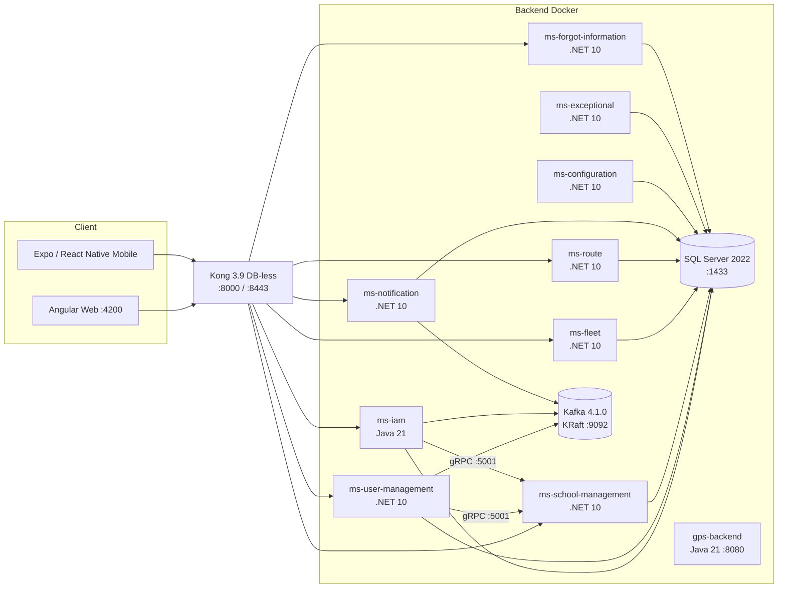
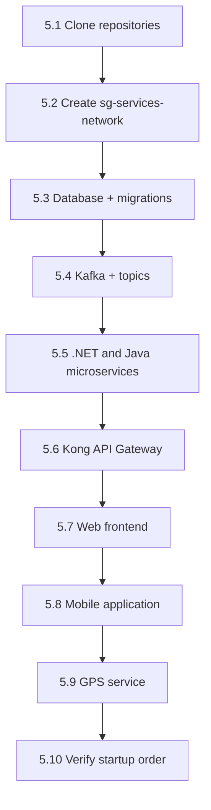

# Installation Manual — Guardian Escolar (Part B)

**Project:** Guardian Escolar (School Guardian)
**Program:** Software Analysis and Development Technologist — group 3145556
**Document:** Installation Manual (Part B)
**Language:** English
**Date:** October 10, 2026

---

## Version control

| Version | Date | Change description | Author(s) |
|---|---|---|---|
| 1.0 | Oct 10, 2026 | Initial version of the installation manual (Part B). Produced from direct analysis of the project's source code and deployment artifacts. | Project team |

> **Methodological note.** This manual was produced from a direct reading of the project's real code and artifacts (`backend/`, `database/` and `scholl-guardian-project/`): `docker-compose` files, `Dockerfile`s, `.env.example` files, `kong.yml`, Liquibase migration changelogs and verification scripts. Where a datum could not be verified in the repository, it is stated as **not defined in the repository** rather than assumed. Cited file paths act as evidence.

---

## 1. Introduction

### 1.1 Purpose and scope

This document describes, step by step, how to install, configure and verify the **Guardian Escolar** system from the project's real source code and deployment artifacts. The scope covers:

- The **backend microservices** (.NET 10 and Java 21), the **API Gateway** (Kong) and the **event broker** (Apache Kafka).
- The **SQL Server 2022 database** with its model and migrations (Liquibase).
- The **web frontend** (Angular), the **mobile application** (React Native / Expo) and the **GPS ingestion service** (Java 21).
- **Post-installation configuration**, **verification** and the **update and migration procedure**.

Cloud operation and infrastructure-as-a-service provisioning are out of scope; the deployment described is the **reference support** with Docker Compose on a single host.

**Deployment diagram (real topology):**



### 1.2 Audience

This manual is aimed at **system administrators and DevOps profiles** with knowledge of:

- Containers and local orchestration with **Docker** and **Docker Compose**.
- Networks, ports and environment variables.
- Basic operation of **SQL Server**, **Kafka** and an **API Gateway**.

No prior experience with the project is assumed. For developing new features, the Technical Manual (Part A) should be consulted.

### 1.3 Software version

The project **does not publish a single product version**; each artifact declares its own version. The installation is **anchored to each repository's commits** (see section 3.3). The versions of the real technologies are:

| Component | Technology / version | Evidence |
|---|---|---|
| Business microservices (.NET) | .NET **10** (`net10.0`) | `TargetFramework` in each `.csproj` |
| ms-iam | **Java 21** + Spring Boot **4.1.1** (Maven) | `backend/ms-iam/pom.xml` |
| gps-backend | **Java 21** + Spring Boot | `gps-backend/pom.xml` |
| Database | Microsoft **SQL Server 2022** (`2022-latest`) | `database/docker-compose.yaml` |
| Migrations | **Liquibase 4.29** | `database/docker-compose.yaml` |
| Messaging | Apache **Kafka 4.1.0** (KRaft) | `backend/kafka/docker-compose.yml` |
| API Gateway | **Kong 3.9** (DB-less mode) | `backend/ms-api-gateway/docker-compose.yml` |
| Web frontend | **Angular 21** (`@angular/core ^21.2.9`) on **Node 20** (`node:20-alpine`), npm 10.9.1 | `dvlp-front/dvlp-web/package.json`, `Dockerfile` |
| Mobile application | **Expo ~57** / **React Native 0.86.3** / React 19.2.3 | `dvlp-front/dvlp-movil/guardian-escolar/package.json` |
| Tunnel (optional) | **cloudflared 2026.9.3** | `docker-compose.yml` (frontend) |

> **Note.** `ms-iam` declares version `0.0.1-SNAPSHOT` in its `pom.xml`; the web frontend declares `0.0.0` and the mobile app `1.0.0`. These are internal versions of each artifact and do not represent a single product version.

### 1.4 Version control

The repositories use the **Conventional Commits** scheme (`feat:`, `fix:`, `chore:`). This manual is **Part B** and accompanies the Technical Manual (Part A). Section 3.3 lists the repositories that make up the installation.

---

## 2. Prerequisites

### 2.1 Hardware requirements

> **Note.** The repository **does not define** hardware requirements. The values below are **recommendations** based on the deployed services (SQL Server 2022, Kafka, Kong and nine containerized microservices).

| Resource | Minimum | Recommended |
|---|---|---|
| CPU | 4 cores | 8 cores |
| RAM | 8 GB | 16 GB |
| Free disk | 20 GB | 40 GB (SSD) |
| Network | 1 interface with Internet access to pull images | Stable local network |

SQL Server 2022 requires at least 2 GB of RAM for the container; the other services are lightweight, but the full set (base images for .NET 10 SDK, Java 21, SQL Server and Kafka) requires considerable disk space.

### 2.2 Base software (exact versions)

For the containerized deployment, only **Docker** and **Git** are required on the host. The other tools are only needed to run the services outside Docker.

| Software | Required version | Needed on the host? | Use |
|---|---|---|---|
| Docker Engine | 24 or higher | Yes | Run containers |
| Docker Compose | v2 (`docker compose`) | Yes | Orchestrate services |
| Git | 2.30 or higher | Yes | Clone repositories |
| Node.js + npm | Node 20 / npm 10.9.1 | Only for web/mobile development without Docker | Build frontend |
| .NET SDK | 10.0 | Only for backend development without Docker | Compile .NET microservices |
| Java JDK | 21 | Only for ms-iam and GPS development without Docker | Compile Java services |
| Maven | 3.9 | Only for ms-iam without Docker | Package ms-iam |

These versions are those declared in the repository artifacts (`node:20-alpine`, `mcr.microsoft.com/dotnet/sdk:10.0`, `maven:3.9-eclipse-temurin-21`, `eclipse-temurin:21-jre`, `liquibase/liquibase:4.29`, `apache/kafka:4.1.0`, `kong:3.9`).

### 2.3 Network: ports, firewall, DNS and SSL

**Internal Docker network.** All containers communicate over the external Docker network **`sg-services-network`**, which must be created **before** bringing up the services (see section 5.2). Inside the network, services resolve by **container name** (`sqlserver`, `kafka`, `ms-iam`, etc.).

**Ports.** The project **does not include a firewall rules file**; the following table documents the ports actually published by the `docker-compose` files:

| Component | Host port | Container port | Description |
|---|---|---|---|
| Kong (HTTP proxy) | `8000` | `8000` | Single API entry point |
| Kong (HTTPS proxy) | `8443` | `8443` | API TLS entry point |
| Kong (admin) | `8001` / `8444` | `8001` / `8444` | Kong administration API |
| Kong (admin GUI) | `8002` / `8445` | `8002` / `8445` | Administration interface |
| SQL Server | `1433` | `1433` | Database |
| Kafka | `9092` | `9092` | Event broker |
| ms-notification | `8081` | `8080` | Only service with a fixed host port |
| ms-school-management (gRPC) | assigned by Docker | `5001` | Internal gRPC h2c |
| Remaining microservices | assigned by Docker | `8080` | Consumed through Kong |
| Web frontend (dev) | `4200` | `4200` | Angular development server |
| gps-backend | `8080` | `8080` | GPS ingestion (Java process outside Compose) |

> **Exposure note.** For a production environment, only the **Kong** ports (`8000`/`8443`) and the **frontend** (through a reverse proxy) should be published. Ports `1433` (SQL Server) and `9092` (Kafka) should **not** be exposed outside the host.

**DNS.** The repository **does not define** DNS records. External resolution appears only in the optional tunnels (`cloudflared`) and in Kong's CORS origins, which point to temporary development domains.

**SSL/TLS.** The repository **does not include** custom certificates. Kong runs in DB-less mode and exposes HTTPS port `8443` with its default self-signed certificate. Service connections to SQL Server are **unencrypted** (`encrypt=false;trustServerCertificate=true`). For production, provision your own certificates and terminate TLS at Kong or at a reverse proxy.

### 2.4 Accesses and permissions

| Resource | Required access |
|---|---|
| Docker | Membership in the `docker` group (or `sudo`) on the host |
| Git / GitHub | Read access to the `school-guardian-project` organization and to `code-sena` |
| SQL Server | Instance user and password (variables `MSSQL_USER` / `MSSQL_SA_PASSWORD`) |
| Email (password recovery) | SMTP credentials of the sender account |
| Twilio (optional, SMS OTP) | `Account SID`, `API Key`, `API Secret` and `Verify Service SID` |

> **Security.** Real credentials are **not included** in this manual; they must be configured in the local `.env` files (excluded from Git). The SQL Server `sa` password, the shared internal key (`INTERNAL_API_KEY` / `APP_INTERNAL_API_KEY`), the OTP pepper (`OTP_HASH_PEPPER`) and the SMTP/Twilio secrets **must be treated as sensitive data**.

### 2.5 Tools (Git, Docker, package managers)

- **Git** to clone and update the repositories.
- **Docker + Docker Compose v2** to build images and bring up the stack.
- **Node.js 20 + npm 10.9.1** for the web and mobile frontends.
- **.NET SDK 10.0** to compile and run the tests (with **NUnit**) of the .NET microservices.
- **JDK 21 + Maven 3.9** for `ms-iam`; the `gps-backend` service includes the `./mvnw` wrapper.
- **Expo CLI** (via `npx expo`) for the mobile application.

---

## 3. Installation package contents

### 3.1 File list (relevant structure)

The project is **not distributed as a binary package**: it is installed from source code and locally built images. The structure relevant to the installation is:

```
backend/
├── ms-api-gateway/          # Kong (docker-compose.yml + kong/kong.yml)
├── kafka/                   # Kafka broker + init/ (create-topics.sh, topics.conf)
├── ms-iam/                  # Java 21 + Spring Boot (Dockerfile, docker-compose.yml, .env.example)
├── ms-user-management/      # .NET 10 (Dockerfile, docker-compose.yml, .env.example)
├── ms-school-management/    # .NET 10 (REST + gRPC h2c :5001)
├── ms-fleet/                # .NET 10
├── ms-route/                # .NET 10
├── ms-notification/         # .NET 10 (host port 8081)
├── ms-configuration/        # .NET 10
├── ms-exceptional/          # .NET 10
└── sg-ms-forgot-information/# .NET 10 (SMTP + Twilio + OTP)
database/
├── docker-compose.yaml      # SQL Server 2022 + Liquibase containers + init
├── .env.example             # connection variables
├── db-school-guardian.dbml  # data model (DBML)
└── ms-*-db/                 # Liquibase changelogs per service
scholl-guardian-project/
├── docker-compose.yml       # web frontend + cloudflared tunnels
├── dvlp-front/dvlp-web/     # Angular (Dockerfile, dev.Dockerfile, nginx.conf, .env)
├── dvlp-front/dvlp-movil/   # Expo / React Native (app.json, eas.json, .env.example)
├── gps-backend/gps-backend/ # Java 21 (application.properties)
└── scripts/verify-api.sh    # route verification through Kong
```

### 3.2 Download location / repository

Each component is an **independent Git repository**:

| Repository | URL | Contents |
|---|---|---|
| `sg-ms-api-gateway` | `https://github.com/school-guardian-project/sg-ms-api-gateway.git` | Kong API Gateway |
| `broker-kafka` | `https://github.com/school-guardian-project/broker-kafka.git` | Kafka broker + topics |
| `sg-ms-iam` | `https://github.com/school-guardian-project/sg-ms-iam.git` | Authentication (Java) |
| `sg-ms-user-management` | `https://github.com/school-guardian-project/sg-ms-user-management.git` | Users (people/profiles) |
| `sg-ms-school-management` | `https://github.com/school-guardian-project/sg-ms-school-management.git` | Schools and campuses |
| `sg-ms-fleet` | `https://github.com/school-guardian-project/sg-ms-fleet.git` | Fleet (buses, types) |
| `sg-ms-route` | `https://github.com/school-guardian-project/sg-ms-route.git` | Routes, stops and cities |
| `sg-ms-notification` | `https://github.com/school-guardian-project/sg-ms-notification.git` | Notifications |
| `sg-ms-configuration` | `https://github.com/school-guardian-project/sg-ms-configuration.git` | Configuration |
| `sg-ms-exceptional` | `https://github.com/school-guardian-project/sg-ms-exceptional.git` | Exceptional usage log |
| `sg-ms-forgot-information` | `https://github.com/school-guardian-project/sg-ms-forgot-information.git` | Password / email / phone recovery |
| `sg-db` | `https://github.com/code-sena/sg-db.git` | Database model and migrations |
| `GuardianEscolar` | `https://github.com/school-guardian-project/GuardianEscolar.git` | Web frontend, mobile app and `gps-backend` |

### 3.3 Integrity verification (hash / checksum)

> **Finding.** The repositories **do not publish** checksum files (`SHA256SUMS`, `*.sha256`, `*.sig`), **nor** signed installation scripts (`Makefile`, `install.sh`). Integrity verification must rely on the native Git and Docker mechanisms:

- **Git origin integrity:** anchor the installation to a specific **commit** and verify its traceability with:

  ```bash
  git clone <URL>
  git -C <repo> rev-parse HEAD          # SHA of the installed commit
  git -C <repo> log -1 --format='%H %an %ad %s'
  # Optional, if the commit is signed:
  git -C <repo> verify-commit HEAD
  ```

- **Docker image integrity:** obtain the *digest* of each built image and pin it for reproducible deployments:

  ```bash
  docker inspect --format '{{index .RepoDigests 0}}' ms-iam:latest
  ```

- **Checksum of generated artifacts** (if distributed manually):

  ```bash
  sha256sum dist/*.tar.gz
  ```

Recording the resulting SHAs and digests lets you reproduce exactly the same installation and detect tampering.

---

## 4. Environment preparation

### 4.1 Dependencies

1. Install **Docker Engine 24+** and **Docker Compose v2**.
2. Install **Git 2.30+**.
3. (Optional, development without Docker) Install **Node.js 20**, **.NET SDK 10**, **JDK 21** and **Maven 3.9**.
4. Verify the versions:

   ```bash
   docker --version
   docker compose version
   git --version
   ```

### 4.2 Users and directories

- The project consists of **several repositories**. A working root folder is recommended, cloning them into subfolders consistent with the paths in this manual:

  ```bash
  mkdir -p ~/school-guardian/backend ~/school-guardian/database
  mkdir -p ~/school-guardian/scholl-guardian-project
  ```

- Inside the containers, services run as **non-privileged users** when the base image defines it (for example, .NET images use `USER $APP_UID`). No system users need to be created on the host.
- The **scripts** (`backend/kafka/init/create-topics.sh`, `scholl-guardian-project/scripts/verify-api.sh`) must keep their execution permission:

  ```bash
  chmod +x backend/kafka/init/create-topics.sh
  chmod +x scholl-guardian-project/scripts/verify-api.sh
  ```

### 4.3 Database preparation

The database is **not created manually**: the `database/` `docker-compose.yaml` brings up SQL Server 2022 and an initialization container (`sqlserver-init`) that **creates the** `school-guardian` database if it does not exist, before running the Liquibase migrations.

1. Create the environment file from the example and **set your own values** (do not use the example values in production):

   ```bash
   cd ~/school-guardian/database
   cp .env.example .env
   # Edit .env: MSSQL_DATABASE, MSSQL_USER, MSSQL_SA_PASSWORD
   ```

   Real variables defined in `database/.env.example`:

   | Variable | Description |
   |---|---|
   | `MSSQL_DATABASE` | Database name (for example, `school-guardian`) |
   | `MSSQL_USER` | Instance user (in the example, the `sa` user) |
   | `MSSQL_SA_PASSWORD` | User password |
   | `DATABASE_URL` | Reference connection string |
   | `DEMO_PASSWORD` | Password used by the demonstration profiles |
   | `SCHOOL_GUARDIAN_DB_DIR` | Changelogs directory (defaults to `.`) |

2. Database creation and migrations are run in section 5.3.

### 4.4 Ports and firewall

1. Confirm that the ports from section 2.3 are free on the host:

   ```bash
   ss -tulpn | grep -E ':(8000|8001|8002|8081|1433|9092|4200)\b'
   ```

2. (Recommended) Restrict public access to `1433` (SQL Server) and `9092` (Kafka). The project **does not include** firewall rules; they must be defined on the host or at the perimeter.
3. Ensure outbound Internet connectivity (443) to pull base images (`mcr.microsoft.com`, `docker.io`, `apache`, `kong`, etc.).

---

## 5. Step-by-step installation procedure



### 5.1 Cloning repositories

```bash
mkdir -p ~/school-guardian/backend && cd ~/school-guardian/backend

git clone https://github.com/school-guardian-project/sg-ms-api-gateway.git ms-api-gateway
git clone https://github.com/school-guardian-project/broker-kafka.git kafka
git clone https://github.com/school-guardian-project/sg-ms-iam.git ms-iam
git clone https://github.com/school-guardian-project/sg-ms-user-management.git ms-user-management
git clone https://github.com/school-guardian-project/sg-ms-school-management.git ms-school-management
git clone https://github.com/school-guardian-project/sg-ms-fleet.git ms-fleet
git clone https://github.com/school-guardian-project/sg-ms-route.git ms-route
git clone https://github.com/school-guardian-project/sg-ms-notification.git ms-notification
git clone https://github.com/school-guardian-project/sg-ms-configuration.git ms-configuration
git clone https://github.com/school-guardian-project/sg-ms-exceptional.git ms-exceptional
git clone https://github.com/school-guardian-project/sg-ms-forgot-information.git sg-ms-forgot-information

cd ~/school-guardian
git clone https://github.com/code-sena/sg-db.git database
git clone https://github.com/school-guardian-project/GuardianEscolar.git scholl-guardian-project
```

### 5.2 Creating the Docker network

All `docker-compose` files declare the network as **external**; it must therefore be created once:

```bash
docker network create sg-services-network
# Verify:
docker network ls | grep sg-services-network
```

### 5.3 Database and migrations

```bash
cd ~/school-guardian/database
cp .env.example .env      # first time only; edit the values
docker compose up -d
```

This command:

1. Brings up **SQL Server 2022** and waits for its *healthcheck* (`SELECT 1` with `sqlcmd`) to pass.
2. Runs **`sqlserver-init`**, which creates the `school-guardian` database if it does not exist.
3. Runs the **Liquibase 4.29** containers in foreign-key dependency order: **Geographic / Gps / Settings → School → Iam → Fleet → Route → UserManagement → Notification**. Each container applies its `changelog/changelog-master.yaml`.

Verify the result:

```bash
docker compose ps -a                       # the liquibase-* containers should be "exited (0)"
docker compose logs liquibase-iam          # look for "Liquibase: Update has been successful"
docker compose logs liquibase-route
```

> **Note.** `ms-audit-db` exists as a folder but **has no changelog** (auditing was removed from scope); `ms-exceptional` has no database folder of its own. The real migrations cover **nine schemas**.

### 5.4 Messaging (Kafka)

```bash
cd ~/school-guardian/backend/kafka
docker compose up -d
```

The `kafka-init` container automatically creates the topics defined in `init/topics.conf`:

| Topic | Partitions | Replication factor |
|---|---|---|
| `student.created` | 1 | 1 |
| `driver.created` | 1 | 1 |
| `admin.created` | 1 | 1 |
| `parent.created` | 1 | 1 |
| `profile.created` | 1 | 1 |
| `student.scanned` | 1 | 1 |

Verify:

```bash
docker exec kafka /opt/kafka/bin/kafka-topics.sh --bootstrap-server kafka:9092 --list
```

### 5.5 Backend microservices

Each service is deployed with its own `docker-compose.yml`. **Prepare the `.env`** for each one before bringing it up (copy from `.env.example` where available and fill in the values). This order is recommended:

**a) `ms-school-management`** (exposes REST `:8080` and gRPC h2c `:5001`; it is consumed by `ms-iam` and `ms-user-management`):

```bash
cd ~/school-guardian/backend/ms-school-management
cp .env.example .env      # fill in ConnectionStrings__DefaultConnection, Kafka, Kestrel, Grpc
docker compose up -d --build
```

Real variables (see `ms-school-management/.env`):

| Variable | Description |
|---|---|
| `ConnectionStrings__DefaultConnection` | SQL Server connection string |
| `Kafka__BootstrapServers` | Kafka address (for example, `kafka:9092`) |
| `ASPNETCORE_Kestrel__Endpoints__Http__Url` / `__Protocols` | REST endpoint (HTTP/1.1) |
| `ASPNETCORE_Kestrel__Endpoints__Grpc__Url` / `__Protocols` | gRPC h2c endpoint (`:5001`) |
| `Grpc__SchoolManagement__Host` / `__Port` | Internal gRPC host and port |

**b) `ms-iam`** (Java 21; JWT authentication):

```bash
cd ~/school-guardian/backend/ms-iam
cp .env.example .env      # fill in MSSQL_*, KAFKA_BOOTSTRAP_SERVERS, JWT_SECRET, APP_INTERNAL_API_KEY
docker compose up -d --build
```

**c) Remaining .NET microservices** (same `--build` pattern):

```bash
for svc in ms-user-management ms-fleet ms-route ms-notification ms-configuration ms-exceptional sg-ms-forgot-information; do
  ( cd ~/school-guardian/backend/$svc && cp -n .env.example .env 2>/dev/null; docker compose up -d --build )
done
```

Relevant variables per service (according to the real `.env` files):

| Service | Main variables |
|---|---|
| `ms-user-management` | `ConnectionStrings__DefaultConnection`, `Kafka__BootstrapServers`, `SchoolManagement__GrpcAddress` |
| `ms-fleet` | `ConnectionStrings__DefaultConnection`, `Kafka__BootstrapServers` |
| `ms-route` | `ConnectionStrings__DefaultConnection`, `Kafka__BootstrapServers`, `ASPNETCORE_Kestrel__Endpoints__Http__*` |
| `ms-notification` | `ConnectionStrings__DefaultConnection`, `Kafka__BootstrapServers`, `Services__UserManagement__BaseUrl`, `Services__Route__BaseUrl` |
| `ms-configuration` | `ConnectionStrings__DefaultConnection`, `Kafka__BootstrapServers` |
| `ms-exceptional` | `ConnectionStrings__DefaultConnection` |
| `sg-ms-forgot-information` | `ConnectionStrings__DefaultConnection`, `INTERNAL_API_KEY`, `OTP_HASH_PEPPER`, `SMTP_*`, `TWILIO_*` |

**Running tests (NUnit).** The .NET services include a test service under the `tests` profile:

```bash
cd ~/school-guardian/backend/ms-route
docker compose run --rm ms-route.tests     # runs `dotnet test` (NUnit)
```

### 5.6 API Gateway (Kong)

```bash
cd ~/school-guardian/backend/ms-api-gateway
docker compose up -d
```

Kong starts in **DB-less mode** with the declarative configuration `kong/kong.yml` mounted read-only (`/opt/kong/kong.yml`). The file defines the services and routes to the internal microservices, the **CORS** policy and **rate-limiting** (per token with `limit_by: header` plus a global per-service ceiling).

> **Finding.** Kong's configuration **does not define a `/health` route**. Verification is performed against the API's real routes (section 7.2).

### 5.7 Web frontend (Angular)

```bash
cd ~/school-guardian/scholl-guardian-project
# The dvlp-front/dvlp-web/.env file must point to Kong:
#   API_URL=http://localhost:8000
#   API_FORGOT_INFORMATION_URL=http://localhost:8000
docker compose up -d --build frontend-web
```

- **Development:** the `dev.Dockerfile` uses `node:20-alpine` and runs `ng serve` on `0.0.0.0:4200`, with `src/`, `public/` and `.env` mounted.
- **Production:** the `Dockerfile` builds with `ng build --configuration spa --output-mode=static` and serves the result with **nginx** (`nginx.conf`).

> **Finding (divergence).** In the production image, the `location /api` block of `nginx.conf` forwards to `http://backend:8080`, a host that **does not exist** in the current stack (the real entry point is `kong:8000`). To deploy the production image, that *upstream* must be fixed.

### 5.8 Mobile application (Expo / React Native)

Requires Node 20 and the Expo CLI. It is not containerized in the repository.

```bash
cd ~/school-guardian/scholl-guardian-project/dvlp-front/dvlp-movil/guardian-escolar
cp .env.example .env      # adjust the values
npm install
npm run start             # or: npm run start:lan
```

Real variables (`.env.example`):

| Variable | Use |
|---|---|
| `EXPO_LAN_IP` | Host LAN IP for the development server |
| `EXPO_PUBLIC_API_URL` | API URL (Kong) |
| `EXPO_PUBLIC_FORGOT_INFORMATION_API_URL` | Recovery service URL |
| `NGROK_DOMAIN` | Tunnel domain for device access |

Mobile build/delivery is managed with **EAS** (`eas.json` defines the `development`, `preview` and `production` profiles).

### 5.9 GPS service (`gps-backend`)

It is an independent Java 21 service that does **not** use Compose. Its persistence is **in memory** and database autoconfiguration is **disabled**:

```bash
cd ~/school-guardian/scholl-guardian-project/gps-backend/gps-backend
./mvnw spring-boot:run
# Exposes HTTP on port 8080
```

> **Finding.** By design, `gps-backend` does not persist to a database (`spring.autoconfigure.exclude` disables DataSource and JPA). Its state is lost on restart.

### 5.10 Startup order summary

| # | Step | Base command |
|---|---|---|
| 1 | Docker network | `docker network create sg-services-network` |
| 2 | Database + migrations | `docker compose up -d` in `database/` |
| 3 | Kafka + topics | `docker compose up -d` in `backend/kafka` |
| 4 | ms-school-management | `docker compose up -d --build` |
| 5 | ms-iam | `docker compose up -d --build` |
| 6 | Remaining .NET microservices | `docker compose up -d --build` |
| 7 | Kong | `docker compose up -d` |
| 8 | Web frontend | `docker compose up -d --build frontend-web` |
| 9 | Mobile / GPS | `npm run start` / `./mvnw spring-boot:run` |

---

## 6. Post-installation configuration

### 6.1 Environment variables and configuration files

Configuration is split across **`.env` files** (one per service, excluded from Git) and property files inside each service:

- `.NET`: variables prefixed with `ConnectionStrings__`, `Kafka__`, `Services__`, `Grpc__`, `SchoolManagement__`, `ASPNETCORE_Kestrel__` (double underscore as the hierarchy separator).
- `ms-iam` (Java): `application.properties` consumes `${MSSQL_DATABASE}`, `${MSSQL_USER}`, `${MSSQL_SA_PASSWORD}`, `${KAFKA_BOOTSTRAP_SERVERS}` and `${JWT_SECRET}`.
- `sg-ms-forgot-information`: receives configuration via `environment` in `docker-compose.yml` with required values (validated with `${VAR:?message}`).

Example configuration (**fictitious** values):

```json
{
  "ConnectionStrings__DefaultConnection": "Server=sqlserver;Database=school-guardian;User Id=<user>;Password=<REDACTED>;TrustServerCertificate=True",
  "Kafka__BootstrapServers": "kafka:9092",
  "SchoolManagement__GrpcAddress": "http://ms-school-management:5001",
  "Services__UserManagement__BaseUrl": "http://ms-user-management:8080",
  "Services__Route__BaseUrl": "http://ms-route:8080"
}
```

> **Security.** Replace `<user>` and `<REDACTED>` with real values managed securely (secret manager). Never commit the `.env` files.

### 6.2 Database and external service connections

- **Database:** the .NET services point to `sqlserver:1433` with `Database=school-guardian`; `ms-iam` uses `jdbc:sqlserver://sqlserver:1433;databaseName=${MSSQL_DATABASE}`. The nine schemas coexist in a **single database** (`school-guardian`), one schema per service.
- **Kafka:** `version 4.1.0` in KRaft mode, listening on `kafka:9092` inside the network.
- **Internal gRPC:** `ms-iam` and `ms-user-management` query `ms-school-management` via gRPC h2c on port `5001`.

> **Finding (ms-iam).** `application.properties` declares `grpc.school-management.*`, but the `pom.xml` does **not** include a gRPC dependency or client: `ms-iam`'s gRPC integration is **declared but not implemented**.

### 6.3 Email, storage and SSL

- **Email (password recovery):** configured in `sg-ms-forgot-information` with `SMTP_HOST`, `SMTP_PORT` (587), `SMTP_ENABLE_SSL` (`true`), `SMTP_USER`, `SMTP_PASSWORD`, `SMTP_FROM`. The example recommends **Gmail** (`smtp.gmail.com`) with an **app password**.
- **Twilio (optional, SMS OTP):** `TWILIO_ACCOUNT_SID`, `TWILIO_API_KEY`, `TWILIO_API_SECRET`, `TWILIO_VERIFY_SERVICE_SID`. If not configured, email flows keep working and the phone change responds `503`.
- **OTP:** the `OTP_HASH_PEPPER` salt must be generated randomly (`openssl rand -base64 32`).
- **Storage:** the project **does not integrate** an object storage service; images/logos are handled as URLs. No buckets are defined in the repository.
- **SSL:** Kong uses its default self-signed certificate; there are no custom certificates. For production, terminate TLS at Kong (`8443`) or at a reverse proxy.

### 6.4 Initial administrator user

The initial administrator user is created via **seed data** loaded by Liquibase; there is **no** creation wizard. Real seed data:

| Role | Email (seed) | Password |
|---|---|---|
| Administrator | `admin@school-guardian.com` | The profile's **identification number** (`99000000001`) |
| Driver | `driver@school-guardian.com` | `99000000002` |
| Parent | `parent@school-guardian.com` | `99000000003` |
| Student | `student@school-guardian.com` | `99000000004` |

> **How it works.** The migration comments state that the `PasswordHash` is the **bcrypt (rounds=10) of each person's identification number**. The verification script `scripts/verify-api.sh` confirms this behavior. The `DEMO_PASSWORD=Demo2026!` value in `database/.env.example` corresponds to the **demonstration profiles** and must be changed.

Roles seeded in `Iam.Role`: **`Admin`**, `Student`, `Driver`, `Parent` and `SuperAdmin`. **Mandatory action in production:** change the seed passwords and disable the demonstration users.

### 6.5 Reverse proxy / load balancer

- The project **does not include** a configured reverse proxy other than **nginx** inside the web frontend image.
- Kong acts as the API **entry point** and logical load balancer (per-service routing). It runs in DB-less mode, so its configuration is declarative (`kong.yml`), with no administration database.
- For production, a reverse proxy is recommended in front of Kong and the frontend, with TLS termination and *bindings* to `kong:8000` and the frontend container.

---

## 7. Installation verification

### 7.1 Running services

```bash
docker ps --format 'table {{.Names}}\t{{.Status}}\t{{.Ports}}'
```

Expected list (real container names): `school-guardian-db-dev`, `kafka`, `kong`, `ms-iam`, `ms-user-management`, `ms-school-management`, `ms-fleet`, `ms-route`, `ms-notification`, `ms-configuration`, `ms-exceptional`, `ms-forgot-information` and `frontend-container-dev`.

Verify the network:

```bash
docker network inspect sg-services-network --format '{{range .Containers}}{{.Name}} {{end}}'
```

### 7.2 Smoke tests

The repository includes a real verification script that tests the frontend routes through Kong:

```bash
cd ~/school-guardian/scholl-guardian-project
API_URL=http://localhost:8000 ./scripts/verify-api.sh
```

Requires `curl` and `jq`. The script:

1. Logs in with the seed users (obtains `accessToken` and `refreshToken`).
2. Traverses the real routes of `ms-iam`, `ms-school-management`, `ms-user-management`, `ms-route`, `ms-fleet` and `ms-notification` through Kong and compares the **expected HTTP status code**.
3. Checks that the services **without a Kong route** (`ms-exceptional`, `ms-configuration`) respond `404`.
4. Prints `OK: n  FAIL: m` and returns a non-zero exit code if there are failures.

> **Finding (verification).** Kong **does not** expose a `/health` route, and most .NET services **do not** publish `MapHealthChecks`. The only service with `/health` is `sg-ms-forgot-information`. For this reason, the valid verification is the one that exercises **real routes** (the script above).

Example direct *login* against Kong:

```bash
curl -s -X POST http://localhost:8000/api/v1/auth/login \
  -H 'Content-Type: application/json' \
  -d '{"email":"admin@school-guardian.com","password":"99000000001"}'
```

Expected response (abbreviated values):

```json
{
  "accessToken": "<jwt>",
  "refreshToken": "<jwt>",
  "tokenType": "Bearer"
}
```

### 7.3 Application access

| Interface | URL |
|---|---|
| API (Kong) | http://localhost:8000 |
| Web frontend | http://localhost:4200 |
| Kong Admin API | http://localhost:8001 |
| Kong Admin GUI | http://localhost:8002 |

### 7.4 Successful installation checklist

- [ ] The `sg-services-network` network exists.
- [ ] SQL Server is `healthy` and the `school-guardian` database was created.
- [ ] All `liquibase-*` containers finished with code `0`.
- [ ] Kafka responds and the six topics exist.
- [ ] All microservices and `kong` are in `Up` state.
- [ ] `verify-api.sh` reports `FAIL: 0`.
- [ ] Login with the seed administrator user returns `200`.
- [ ] The web frontend loads and consumes the API through Kong.

---

## 8. Update and migration

### 8.1 Update procedure

> **Numbering note.** This manual's outline follows a continuous sequence (1–8). The specification's section list skipped from 7 to 9; here it is resolved as **8. Update and migration**.

1. **Update the code** of each affected repository:

   ```bash
   for r in ~/school-guardian/backend/* ~/school-guardian/database ~/school-guardian/scholl-guardian-project; do
     git -C "$r" pull --ff-only
   done
   ```

2. **Back up the database** before migrating (section 8.3).
3. **Rebuild and recreate the affected services:**

   ```bash
   cd ~/school-guardian/backend/<service>
   docker compose up -d --build
   ```

4. **Apply new migrations:** run the Liquibase containers of `database/` again; Liquibase applies **only** the new *changesets* and records the history:

   ```bash
   cd ~/school-guardian/database
   docker compose up -d
   docker compose logs -f liquibase-iam liquibase-route
   ```

5. **Verify** with `scripts/verify-api.sh` (section 7.2).

> **Compatibility.** Schema changes must respect the foreign-key dependency order already encoded in `database/docker-compose.yaml` (Geographic/Gps/Settings → School → Iam → Fleet → Route → UserManagement → Notification).

### 8.2 Data migration

- Migrations are managed **exclusively with Liquibase**; there are no manual migration scripts in the repository.
- Between environments (for example, from development to production), the database is rebuilt by applying the *changesets* onto an empty database; to move existing data, a **backup restore** (section 8.3) is used instead of ad-hoc export.
- Schema identity is preserved: one schema per service within the **same database** `school-guardian`.

### 8.3 Prior backup

The repository **does not include** backup scripts or a retention policy. Using SQL Server's native capabilities is recommended before any update:

```bash
# Full backup (inside the SQL Server container)
docker exec school-guardian-db-dev /opt/mssql-tools18/bin/sqlcmd \
  -S localhost -U sa -P '<REDACTED>' -C \
  -Q "BACKUP DATABASE [school-guardian] TO DISK = N'/var/lib/mssql/data/school-guardian.bak' WITH INIT, COMPRESSION"

# Copy the backup out of the container
docker cp school-guardian-db-dev:/var/lib/mssql/data/school-guardian.bak ./backups/
```

Recommendations:

- Define a **recovery point objective (RPO)** and a **recovery time objective (RTO)** aligned with the business, and schedule **full + differential/transaction log** backups.
- Store backups **off the host** (external storage).
- The SQL Server container persists in the `school-guardian-sqlserver-data` volume; Kafka persists in the `kafka-data` volume (Kafka data is not critical for functional recovery).
- Periodically test **restoration** in an isolated environment.

---

## 9. References

Angular. (n.d.). *Angular documentation*. https://angular.dev/

Apache Software Foundation. (n.d.). *Apache Kafka documentation*. https://kafka.apache.org/documentation/

Docker Inc. (n.d.). *Docker Compose documentation*. https://docs.docker.com/compose/

Expo. (n.d.). *Expo documentation*. https://docs.expo.dev/

Kong Inc. (n.d.). *Kong Gateway documentation*. https://docs.konghq.com/gateway/

Liquibase. (n.d.). *Liquibase documentation*. https://docs.liquibase.com/

Microsoft. (n.d.). *.NET documentation*. https://learn.microsoft.com/dotnet/

Microsoft. (n.d.). *Microsoft SQL Server 2022 documentation*. https://learn.microsoft.com/sql/

OpenJS Foundation. (n.d.). *Node.js documentation*. https://nodejs.org/docs/

OWASP Foundation. (2021). *OWASP Top 10:2021 — The ten most critical web application security risks*. https://owasp.org/Top10/

Pivotal Software. (n.d.). *Spring Boot reference documentation*. https://docs.spring.io/spring-boot/

Tolk, A. (n.d.). *gRPC documentation*. https://grpc.io/docs/

---

*End of the Installation Manual — Part B.*
