# Technical Manual — Guardian Escolar (School Guardian)

**Program:** Software Analysis and Development Technologist (ADSO)
**Group code (ficha):** 3145556
**Training center:** Sede La Industria, La Empresa y Los Servicios — SENA (Neiva, Huila, Colombia)
**Authors:** Johan Smith Santamaria Fernández; Sharik Dayanna Rojas Ibarra; Juan Pablo Chala Ramírez
**Document version:** 1.0
**Date:** October 10, 2026
**Documented software status:** in development (architecture implemented; functionality partial)

> **Methodological note.** This manual was produced from a direct reading of the real code and artifacts of the project repositories (`backend/`, `database/` and `scholl-guardian-project/`). This manual documents **what the code actually does** and explicitly records the consistency findings detected. Where a datum could not be verified in the repository, it is stated as **not verifiable** rather than assumed. Cited file paths act as evidence.

---

## Version control

| Version | Date | Change description | Author(s) |
|---|---|---|---|
| 1.0 | Oct 10, 2026 | Initial version of the technical manual (Part A). Produced from direct analysis of the project's source code. | Project team |

---

## Table of contents

1. [Introduction](#1-introduction)
2. [System overview](#2-system-overview)
3. [System architecture](#3-system-architecture)
4. [Data model](#4-data-model)
5. [Source code structure](#5-source-code-structure)
6. [Modules and components](#6-modules-and-components)
7. [API and integration documentation](#7-api-and-integration-documentation)
8. [Configuration](#8-configuration)
9. [Security](#9-security)
10. [References](#10-references)

---

## 1. Introduction

### 1.1 Purpose and scope

This document is the **technical manual** for *Guardian Escolar* (English name: *School Guardian*), a school-transport management platform that integrates real-time GPS tracking, QR-based boarding/alighting control, route and fleet administration, and guardian notifications.

The manual describes **how the system is built and how it is operated**: its architecture, its data model, the code structure, the services that compose it, the interfaces (REST API, gRPC and messaging), configuration and security mechanisms. It is intended for anyone who must **understand, extend, deploy or maintain** the software.

**Scope included:**

- Software architecture and the rationale for its architectural style.
- Microservices backend (10 services + API Gateway + messaging broker).
- Database model (engine, schemas, tables, relationships and data dictionary).
- Web frontend (Angular), mobile app (React Native/Expo) and GPS ingestion service.
- API contracts, per-environment configuration and security controls.
- Limitations and verified findings (technical debt and code/documentation divergences).

**Scope excluded:**

- Commercial business content (pricing, school agreements), covered by other project documents.
- The full source code, which is referenced by path but not reproduced in full.
- SENA internal administrative procedures.

### 1.2 Audience

| Audience | Main use of the document |
|---|---|
| Backend developers | Create new use cases, adapters and migrations while respecting the hexagonal architecture and contracts. |
| Frontend developers (web/mobile) | Consume the APIs correctly, understand authentication, error codes and models. |
| Software architects | Evaluate the architectural style, patterns, inter-service integration and decisions made. |
| DevOps / technical support | Deploy with Docker/Compose, configure environment variables, diagnose the service network. |
| Platform administrators | Understand roles, permissions, security and general operation. |
| Academic reviewers | Verify consistency among requirements, design, implementation and tests. |

### 1.3 Definitions, acronyms and abbreviations

| Term | Definition |
|---|---|
| **ADSO** | Análisis y Desarrollo de Software (SENA software development program). |
| **API Gateway** | Single entry point that routes traffic to microservices (here, Kong). |
| **ACPM** | Corrective, Preventive and Improvement Actions. |
| **Adapter** | Infrastructure component that connects the domain to external technology (DB, HTTP, gRPC, Kafka). |
| **BCrypt** | Password hashing algorithm with a cost factor. |
| **DBML** | *Database Markup Language*; declarative notation for the data model. |
| **DTO** | *Data Transfer Object*; object for moving data between layers or services. |
| **EF Core** | *Entity Framework Core*; the .NET ORM. |
| **gRPC** | Remote procedure call framework over HTTP/2 with *Protocol Buffers*. |
| **Hexagonal (Ports & Adapters)** | Architectural style that isolates the domain from the outside via ports and adapters. |
| **HS256** | HMAC-SHA-256 signing algorithm for JWT. |
| **JWT** | *JSON Web Token*; signed credential with *claims*. |
| **Kafka** | Distributed event-oriented messaging platform. |
| **KRaft** | Kafka mode without ZooKeeper (integrated controller). |
| **Kong** | *Open source* API Gateway. |
| **Liquibase** | Database schema migration tool. |
| **OTP** | *One-Time Password*; temporary verification code. |
| **PII** | *Personally Identifiable Information*. |
| **Port** | Interface defining how the domain communicates with the outside (inbound or outbound). |
| **RNF / NFR** | Non-functional requirement. |
| **RF / FR** | Functional requirement. |
| **RFC 7807** | *Problem Details* standard for JSON error responses. |
| **SSR** | *Server-Side Rendering*. |
| **Tenant** | School (institution) as the unit of logical data isolation. |
| **TDD** | *Test-Driven Development*. |

### 1.4 References (project code)

Bibliographic and standards references follow APA 7th edition and are listed in section 10. The primary source of verification for this manual is the project's source code and real artifacts; it does not rely on auxiliary documents:

- **Backend:** `backend/` (.NET 10 and Java 21 microservices, Kong API Gateway and Kafka configuration).
- **Database:** `database/` (`db-school-guardian.dbml` model and Liquibase migration changelogs).
- **Frontend:** `scholl-guardian-project/` (Angular web application, React Native/Expo mobile app and GPS ingestion service).

### 1.5 Version control

The software uses **Conventional Commits** (for example, `feat:`, `fix:`, `chore:`) and purpose-based branches. This manual is versioned document-style with strict `es/`–`en/` parity: both languages must keep the same number of sections, tables and components. The branch strategy is detailed in section 5.1.

---

## 2. System overview

### 2.1 Objective and main features

Guardian Escolar centralizes school-transport operations. Its goal is for a school to be able to **plan routes, run them, track the bus live, record each student's boarding and alighting, and notify guardians**, with traceability of every event.

Main features (grouped by SRS functional requirement, with implementation status verified in code):

| Group | Feature | Services involved | Verified status |
|---|---|---|---|
| **RF-01** | User management: create, update, enable/disable accounts and link students to guardians | ms-user-management, ms-iam | Implemented (REST + Kafka) |
| **RF-02** | JWT authentication and session close/renewal | ms-iam | Implemented (login, refresh, logout) |
| **RF-03** | Routes, fleet and assignments: ordered routes and stops, buses, driver→bus, students→route | ms-route, ms-fleet, ms-user-management | Implemented |
| **RF-04** | QR boarding/alighting scan | ms-notification (scan register) | Partial (scan register implemented; QR generation/reading on clients) |
| **RF-05** | Guardian boarding notifications (Expo push) | ms-notification | Implemented (`student.scanned` consumer + push) |
| **RF-06** | Real-time tracking and interactive map | gps-backend (TCP ingestion), ms-route (gRPC), web/mobile (Leaflet/Map) | Partial (GPS ingestion and in-memory storage implemented; GPS backend service not exposed via Kong) |
| **RF-07** | Trip lifecycle (start/end) | ms-route | Implemented (`api/trips/start`, `api/trips/end`, `api/trips/current`) |
| **RF-08** | Incidents and alerts | ms-notification | Partial (`Alert`, `AlertType`, `AlertRecipient` model; alert endpoints not exposed) |
| **RF-09** | Route lookup by guardian and by driver | ms-route | Implemented (`api/routes/student/{id}`, `api/routes/current`) |
| **RF-10** | Personalization: themes and multi-language | web/mobile (client) | Implemented (themes and 4 languages) |

> **Documented limit:** where requirement numbering is ambiguous, this manual describes the **actual functionality of the code** rather than fixing a specific numbering.

### 2.2 Context and relation to other systems

Guardian Escolar has two clients (web and mobile) that consume a microservices backend through an API Gateway. It integrates with:

- **GPS devices** on the buses (trackers that send frames over **TCP** to the GPS ingestion service).
- **Expo push notification service** (`https://exp.host/--/api/v2/push/send`) to notify the mobile app.
- **Twilio Verify** (SMS) for phone-number verification in the recovery/change flows.
- **SMTP server** for sending emails (OTP codes).
- **Cloudflare tunnels** (`cloudflared`) used in the development environment to expose the gateway and the password service.

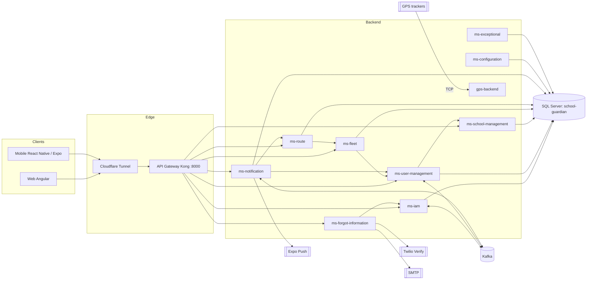

### 2.3 Technologies, languages, frameworks and versions

**Backend (microservices).** The backend is **polyglot**: most services are in **.NET 10 (C#)** and two are in **Java 21 (Spring Boot)**.

| Component | Language / Runtime | Key frameworks and versions | Evidence |
|---|---|---|---|
| ms-configuration, ms-exceptional, ms-fleet, ms-notification, ms-route, ms-school-management, ms-user-management, sg-ms-forgot-information | C# / .NET `net10.0` | ASP.NET Core; EF Core 10.0.12; AutoMapper 16.2.0; Confluent.Kafka 2.15.1; Grpc.AspNetCore 2.84.0; JwtBearer 10.0.12; Scalar.AspNetCore 2.17.10 | `backend/*/src/*/*.Api.csproj` |
| ms-iam | Java 21 | Spring Boot 4.1.1; Spring Data JPA; Spring Security; Spring Kafka; jjwt 0.12.5; springdoc-openapi 3.0.0; scalar-webmvc 0.6.63 | `backend/ms-iam/pom.xml` |
| gps-backend | Java 21 | Spring Boot 4.1.1; Spring Web MVC; Spring Data JPA; mssql-jdbc; Lombok | `scholl-guardian-project/gps-backend/gps-backend/pom.xml` |
| API Gateway | — | Kong 3.9 (DB-less, declarative config) | `backend/ms-api-gateway/docker-compose.yml` |
| Messaging | — | Apache Kafka 4.1.0 in KRaft mode | `backend/kafka/docker-compose.yml` |
| Database | — | Microsoft SQL Server 2022 | `database/docker-compose.yaml` |

**Frontend.**

| Component | Technology | Key versions | Evidence |
|---|---|---|---|
| Web | Angular (SPA + SSR) | Angular 21.2.9; Angular Material 21.2.3; Angular CDK 21.2.3; RxJS 7.8.2; TypeScript 5.9.x; NGX-Translate 17.0.0; Leaflet 1.9.4; Express 5.2.1 | `scholl-guardian-project/dvlp-front/dvlp-web/package.json` |
| Mobile | React Native + Expo | Expo 57.0.27; React 19.2.3; React Native 0.86.3; React Navigation 7; react-native-maps 1.27.2; i18next 26 | `scholl-guardian-project/dvlp-front/dvlp-movil/guardian-escolar/package.json` |
| Web testing | Vitest 4.1.0 on the `@ngx-env/builder:unit-test` builder (jsdom) | — | `package.json`, `angular.json` |

**Containers and infrastructure.**

| Element | Image / version | Evidence |
|---|---|---|
| .NET runtime | `mcr.microsoft.com/dotnet/aspnet:10.0` | `backend/*/src/*/Dockerfile` |
| .NET SDK (build) | `mcr.microsoft.com/dotnet/sdk:10.0` | same |
| Java runtime (build) | `maven:3.9-eclipse-temurin-21` → `eclipse-temurin:21-jre` | `backend/ms-iam/Dockerfile` |
| Node (web build) | `node:20-alpine`; production `nginx:alpine` | `dvlp-front/dvlp-web/{Dockerfile,dev.Dockerfile}` |
| Tunnel | `cloudflare/cloudflared:2026.9.3` | `scholl-guardian-project/docker-compose.yml` |
| Shared Docker network | `sg-services-network` (external) | each service's compose |

### 2.4 Architecture summary (general diagram)

The system is organized into **four planes**: clients, edge, domain (microservices) and infrastructure (messaging and data). Clients only know the **API Gateway** (Kong), which routes by prefix to each service. Services collaborate **synchronously** (REST and gRPC) and **asynchronously** (Kafka events). Each service owns its own schema within a single SQL Server database.

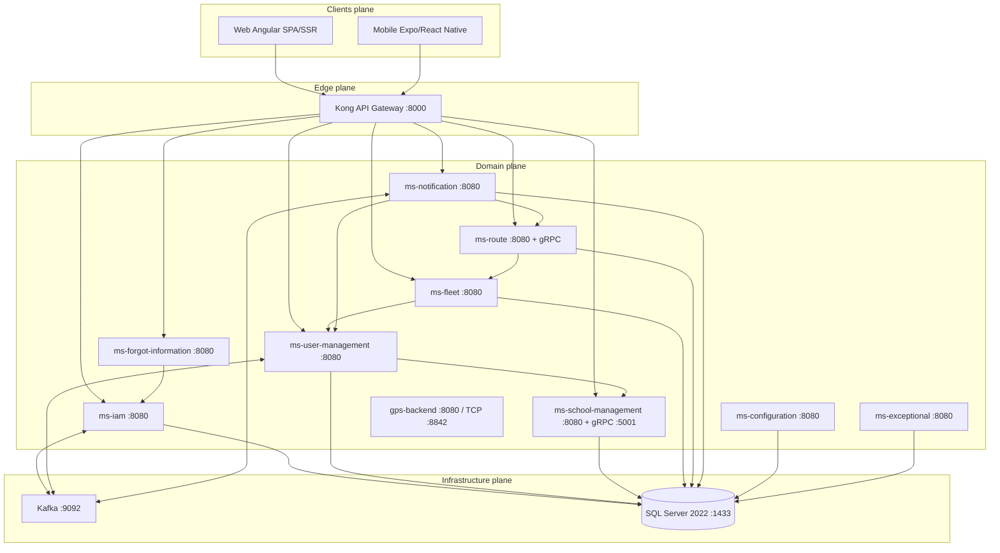

**Figure 2.1 — General architecture diagram.** Figure numbering follows the APA standard; each figure is cited in the text.

---

## 3. System architecture

### 3.1 Architectural style and rationale

The system combines three structural decisions:

1. **Microservices with hexagonal architecture (Ports & Adapters).** Each service strictly separates:
   - **Domain** (`Domain`): models and business rules, with no framework dependencies.
   - **Application** (`Application`): use cases that orchestrate the domain.
   - **Infrastructure** (`Infrastructure`): inbound adapters (REST controllers, gRPC, Kafka consumers) and outbound adapters (persistence, HTTP clients, Kafka producers).

   The folder structure evidences this in every service (for example, `backend/ms-user-management/src/ms-user-management.Api/{Domain,Application,Infrastructure}` and, in Java, `backend/ms-iam/src/main/java/com/school_guardian/ms_iam/{domain,application,infrastructure}`). The **rationale** is the testability of the business core, decoupling from technology, and the ability to swap an adapter (for example, database engine or broker) without touching the domain.

2. **Event-driven architecture for asynchronous integration.** Person-creation and boarding events travel over **Kafka**, decoupling producers and consumers and letting notifications not block the main operation.

3. **Single API Gateway (Kong).** Centralizes routing, CORS and rate control, and hides the internal service topology from clients.

Consistency findings (see sections 3.5 and 9): the actual ms-iam JWT issuer uses symmetric **HS256** (not RS256/JWKS), the token *deny-list* is **in memory** (there is no Redis in the repository), and ms-notification is implemented in **.NET**. This manual documents the reality of the code.

### 3.2 Component and deployment diagram

**Component diagram** (logical relations between services, their ports and their external adapters):

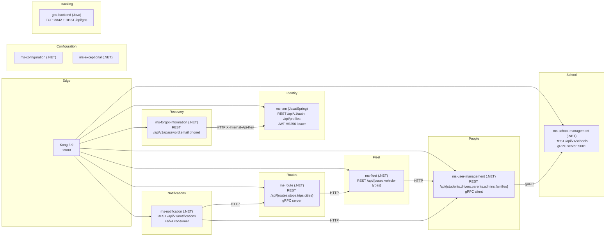

**Figure 3.1 — Component diagram.**

**Deployment diagram** (Docker containers on the `sg-services-network`):

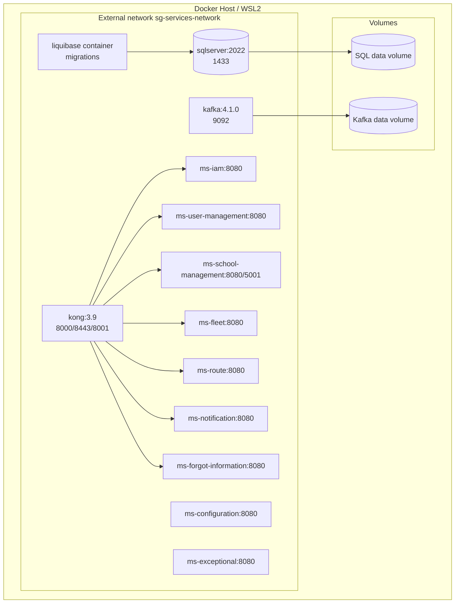

**Figure 3.2 — Deployment diagram.** Each service runs in its own container on the shared network; Kong resolves services by container DNS name, not by host ports.

### 3.3 Modules, layers and services

| Service | Bounded context | DB schema | Port(s) | Role |
|---|---|---|---|---|
| **ms-iam** | Identity and access | `Iam` | 8080 | Authentication, profiles, roles, terms, JWT issuer |
| **ms-user-management** | People and families | `UserManagement` | 8080 | Person, Profile (personal data), families, licenses |
| **ms-school-management** | Institutional | `School` (+`Geographic`) | 8080 / gRPC 5001 | Schools, campuses and admin↔school link |
| **ms-fleet** | Fleet | `Fleet` | 8080 | Buses, brands/models, driver assignment |
| **ms-route** | Routes and trips | `Route` | 8080 (+gRPC) | Routes, stops, assignments, executions and trips |
| **ms-notification** | Notifications | `Notification` | 8080 | Boarding alerts, recipients, push tokens |
| **ms-forgot-information** | Recovery | `Settings`(*) | 8080 | Email/SMS OTP and email/phone changes |
| **ms-configuration** | Configuration | `Settings` | 8080 | Platform settings and password policy |
| **ms-exceptional** | Exceptional usages | `Settings`(†) | 8080 | Driver/route incidents (driver-usages, route-usages) |
| **gps-backend** | Tracking | `Gps` | 8080 / TCP 8842 | GPS frame ingestion and position queries |
| **ms-api-gateway** | Edge | — | 8000 | Kong gateway |

(*) `sg-ms-forgot-information` uses its own connection; its associated schema is not explicitly isolated in the data documentation. (†) ms-exceptional persists on its own connection; its schema does not appear as an independent group in the DBML (see section 4.3).

**Internal layers per .NET service.** The standard layout is:

```
<service>/src/<service>.Api/
├── Domain/
│   ├── Model/          # Entities and value objects
│   └── Ports/          # Interfaces (In = use cases, Out = repositories/services)
├── Application/
│   ├── UseCase/        # Use-case implementations
│   ├── Mapper/         # AutoMapper profiles
│   └── Dto/            # Transfer objects
├── Infrastructure/
│   ├── Controller/     # Inbound REST adapters
│   ├── Persistence/    # EF Core DbContext and repositories
│   ├── External/       # HTTP clients to other services
│   ├── Messaging/      # Kafka producers/consumers
│   ├── Grpc/           # gRPC services and clients
│   ├── Security/       # Authentication/JWT
│   ├── Configuration/  # Tenant provider, DI
│   └── DependencyInjection/   # ServiceCollectionExtensions
├── Protos/             # .proto contracts (if any)
├── Program.cs          # Application composition
└── Dockerfile
```

### 3.4 Data flow between components

**Flow A — Authentication and authenticated consumption.**

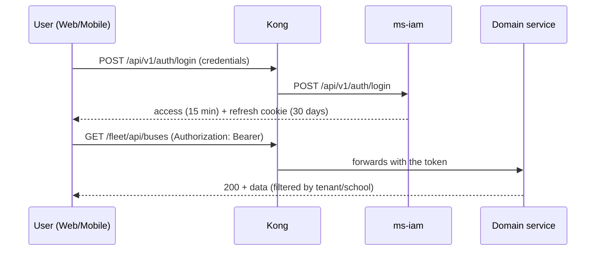

**Flow B — Person creation and identity sync (event-driven).**

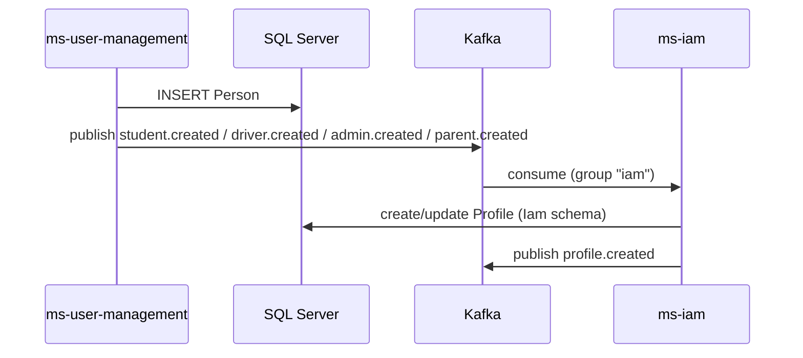

**Flow C — Boarding (scan) and guardian notification.**

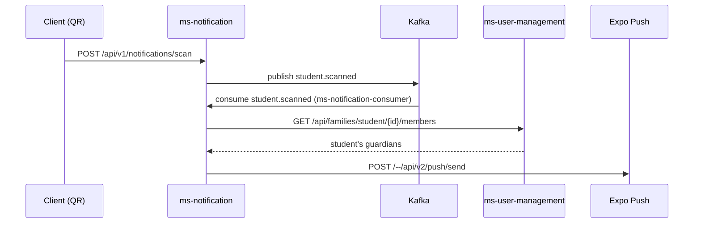

**Flow D — Real-time GPS tracking.**

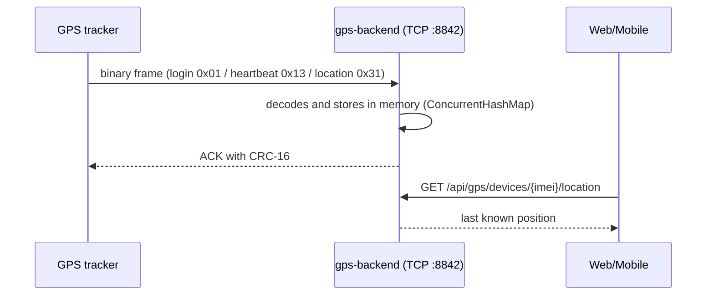

### 3.5 Applied design patterns

| Pattern | Where applied | Evidence |
|---|---|---|
| **Ports & Adapters (Hexagonal)** | All microservices | `Domain/Ports`, `Application/UseCase`, `Infrastructure/…` folders |
| **Dependency Injection** | .NET (`ServiceCollectionExtensions`) and Java (Spring) | `Infrastructure/DependencyInjection/ServiceCollectionExtensions.cs`; `@Service`, `@Repository` |
| **Repository** | Data access behind port interfaces | `IBusRepository`, `IPersonRepository`, Spring Data repositories |
| **DTO + Mapper (AutoMapper)** | Domain↔API translation | `Application/Mapper`, `AddAutoMapper` in `Program.cs` |
| **API Gateway** | Routing, CORS, rate limiting | `backend/ms-api-gateway/kong/kong.yml` |
| **Publish/Subscribe (events)** | Integration via Kafka | `KafkaEventPublisher`, `*.Consumer` |
| **gRPC (synchronous RPC)** | Inter-service communication | `SchoolManagementGrpcClient`, `RouteGrpcService`, `FamilyGrpcService` |
| **Strategy** | Search strategies | `PlateSearchStrategy`, `NameSearchStrategy` (ms-fleet/ms-user-management) |
| **Provider / Tenant resolver** | Multi-school filtering | `ITenantProvider`, `HttpContextTenantProvider`, `JwtTenantProvider` |
| **Hosted Service (Background)** | Background Kafka consumption | `StudentScannedConsumer` as `IHostedService` |
| **Problem Details (RFC 7807)** | Uniform API and client errors | Exception middleware; `core/http/problem-detail.ts` |
| **Rate Limiting** | Endpoint protection | ASP.NET Core middleware (`writes`, `registration`, `otp-public`) and Kong plugin |

> **Consistency findings** (recorded): (1) the ms-iam JWT issuer signs with symmetric **HS256** (not RS256/JWKS); (2) the token *deny-list* is **in memory** (`InMemoryTokenDenyList`), with no Redis; (3) the notification service is implemented in **.NET**; (4) ms-iam's gRPC configuration is **declared but not implemented** (`application.properties` references `grpc.school-management.*` with no gRPC dependency or client in `pom.xml`).

---

## 4. Data model

### 4.1 Entity–relationship diagram

The model is materialized in **one SQL Server database** named `school-guardian`, organized by **schema-per-service**. The canonical DBML is `database/db-school-guardian.dbml` (34 tables grouped into 9 schemas). Because of its size, the ER is presented by domain.

**Identity and access domain (`Iam` schema):**

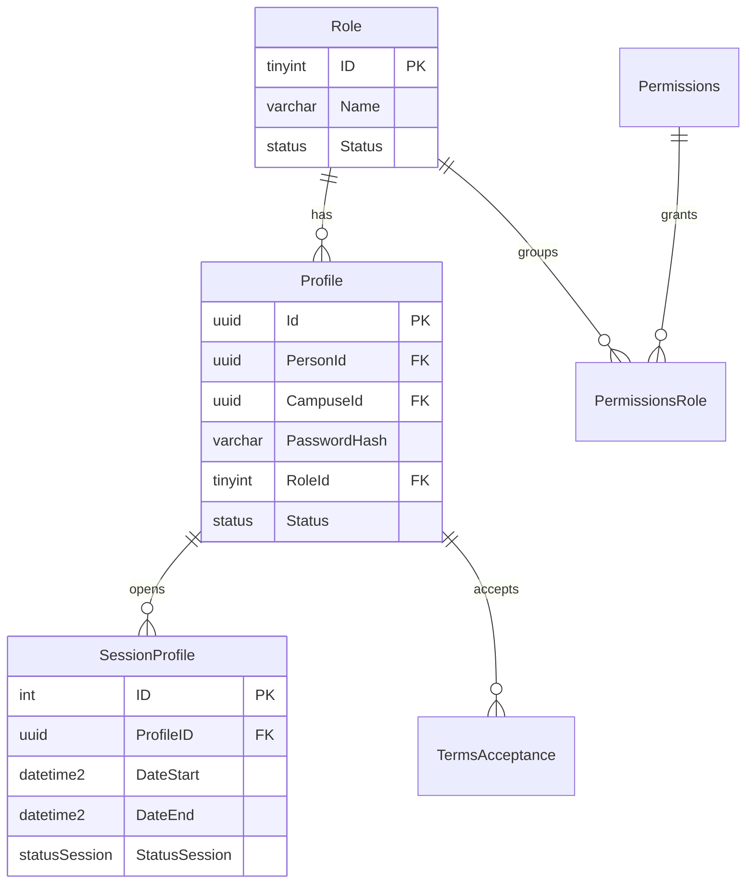

**Figure 4.1 — ER of the identity domain.**

**People and families domain (`UserManagement` schema):**

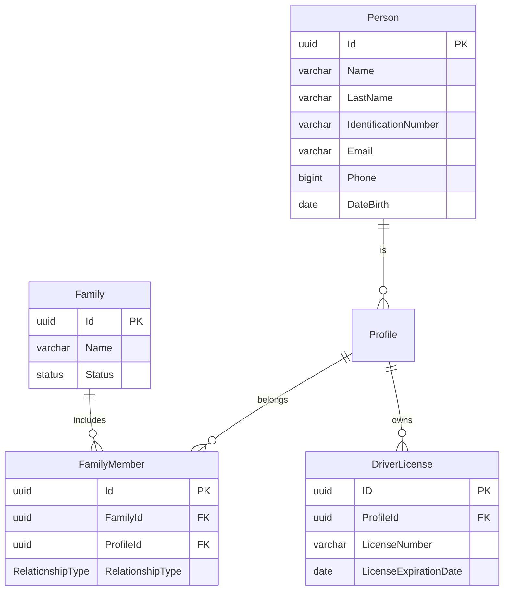

**Figure 4.2 — ER of people and families.**

**Institutional domain (`School` + `Geographic`):**

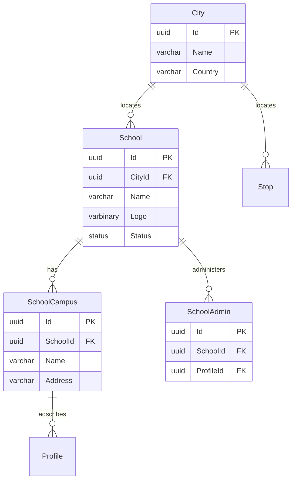

**Figure 4.3 — Institutional and geographic ER.**

**Routes, fleet and tracking domain (`Route`, `Bus`, `Gps`, `Notification`):**

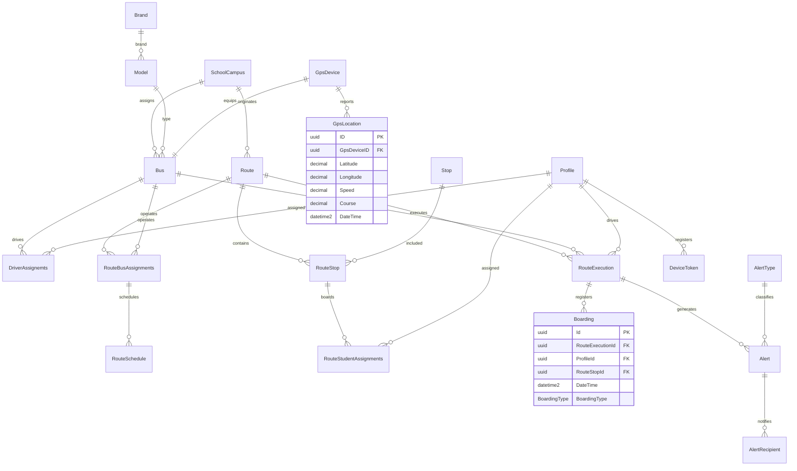

**Figure 4.4 — ER of routes, fleet, GPS and notifications.**

### 4.2 Data dictionary

The main tables are documented below with their fields, types and constraints. The single source is `database/db-school-guardian.dbml`.

**`Iam` schema.**

| Table | Field | Type | Constraints | Description |
|---|---|---|---|---|
| **Profile** | Id | uuid | PK, not null | Profile identifier (access account). |
| | PersonId | uuid | FK → Person.Id, not null | Associated person. |
| | CampuseId | uuid | FK → SchoolCampus.Id, null | Campus the profile is adscribed to. |
| | PasswordHash | varchar(100) | not null | Password hash (BCrypt). |
| | RoleId | tinyint | FK → Role.Id, not null | Profile role. |
| | Status | status | not null, default `Active` | Logical status. |
| **Role** | ID | tinyint | PK, not null | Role identifier (1=Admin, 2=Student, 3=Driver, 4=Parent, 5=SuperAdmin). |
| | Name | varchar(20) | not null, unique | Role name. |
| | Description | varchar(100) | not null | Description. |
| | Status | status | not null, default `Active` | Status. |
| **SessionProfile** | ID | int | PK, increment | Session identifier. |
| | ProfileID | uuid | FK → Profile.ID, not null | Profile. |
| | DateStart / DateEnd | datetime2 | not null | Session validity. |
| | IPAddress | varchar(50) | not null | Source IP. |
| | StatusSession | StatusSession | not null, default `Active` | Session status. |
| **Permissions** | Id | tinyint | PK, increment | Permission. |
| | TypePermissions | varchar(100) | not null | Permission type/name. |
| | Description | varchar(150) | not null | Description. |
| **PermissionsRole** | Id | tinyint | PK, increment | Permission-role relation. |
| | PermissionsId | tinyint | FK → Permissions.Id, not null | Permission. |
| | RoleId | tinyint | FK → Role.Id, not null | Role. |
| **TermsAcceptance** | Id | uuid | PK | Identifier. |
| | ProfileId | uuid | FK → Profile.Id, not null | Who accepts. |
| | StudentProfileId | uuid | FK → Profile.Id, null | Student on whose behalf acceptance occurs. |
| | TermsVersion | varchar(20) | not null | Terms version. |
| | AcceptedAt | datetime2 | not null | Acceptance date/time. |
| | IpAddress | varchar(50) | null | IP. |
| | Channel | varchar(20) | not null, default `mobile` | Channel (mobile/web). |

**`UserManagement` schema.**

| Table | Field | Type | Constraints | Description |
|---|---|---|---|---|
| **Person** | Id | uuid | PK, not null | Person identifier. |
| | Name / LastName | varchar(50) | not null | First and last names. |
| | IdentificationType | Identificationtype | not null, default `TI` | Document type. |
| | IdentificationNumber | varchar(20) | not null, unique | Document number. |
| | Email | varchar(50) | not null, unique | Email. |
| | Phone | bigint | not null | Phone. |
| | ResidenceAddress | varchar(50) | not null | Address. |
| | DateBirth | date | not null | Date of birth. |
| **Family** | Id | uuid | PK | Family identifier. |
| | Name | varchar(50) | not null | Name. |
| | Observations | varchar(100) | not null | Observations. |
| | Status | status | not null, default `Active` | Status. |
| **FamilyMember** | Id | uuid | PK | Member identifier. |
| | FamilyId | uuid | FK → Family.Id, not null | Family. |
| | ProfileId | uuid | FK → Profile.Id, not null | Member profile. |
| | RelationshipType | RelationshipType | default `Parent` | Parent or Student. |
| **DriverLicense** | ID | uuid | PK | License identifier. |
| | ProfileId | uuid | FK → Profile.Id, not null | Driver. |
| | LicenseNumber | varchar(20) | not null, unique | License number. |
| | LicenseExpirationDate | date | not null | Expiration. |

**`School` schema.**

| Table | Field | Type | Constraints | Description |
|---|---|---|---|---|
| **School** | Id | uuid | PK | School. |
| | CityId | uuid | FK → City.Id, not null | City. |
| | Logo | varbinary(max) | not null | Logo. |
| | Name | varchar(30) | not null | Name. |
| | Address | varchar(30) | not null | Address. |
| | Phone | int | not null | Phone. |
| | Email | varchar(50) | not null | Email. |
| | Website | varchar(100) | null | Website. |
| | Theme | varchar(20) | null | Visual theme. |
| **SchoolCampus** | Id | uuid | PK | Campus. |
| | SchoolId | uuid | FK → School.Id, not null | School. |
| | Name / Address | varchar(30) | not null | Name and address. |
| **SchoolAdmin** | Id | uuid | PK | Admin-school link. |
| | SchoolId | uuid | FK → School.Id, not null | School. |
| | ProfileId | uuid | FK → Profile.Id, not null, unique | Administrator. |

**`Geographic` schema.**

| Table | Field | Type | Constraints | Description |
|---|---|---|---|---|
| **City** | Id | uuid | PK | City. |
| | Name | varchar(40) | not null | Name. |
| | Country | varchar(30) | not null | Country. |

**`Fleet` schema (*Bus* group).**

| Table | Field | Type | Constraints | Description |
|---|---|---|---|---|
| **Bus** | Id | uuid | PK, not null | Bus. |
| | CampuseId | uuid | FK → SchoolCampus.Id, not null | Campus. |
| | SoatValidity | date | not null | SOAT (insurance) validity. |
| | GpsDeviceId | uuid | FK → GpsDevice.Id, not null, unique | GPS device. |
| | Capacity | tinyint | not null | Capacity. |
| | Plate | varchar(15) | not null, unique | Plate. |
| | ModelId | tinyint | FK → Model.Id, not null | Model. |
| **Brand** | Id / Name | tinyint / varchar(30) | PK / — | Brand. |
| **Model** | Id / BrandId / Name | tinyint / tinyint / varchar(30) | PK / FK / — | Model. |
| **DriverAssignemts** | Id | uuid | PK | Driver-bus assignment. |
| | ProfileId | uuid | FK → Profile.Id, not null | Driver. |
| | BusId | uuid | FK → Bus.Id, not null | Bus. |
| | AssignedFrom / AssignedTo | date | not null / null | Validity. |

> The physical name `DriverAssignemts` is preserved (as in the database and DBML), although it contains a spelling error.

**`Route` schema.**

| Table | Field | Type | Constraints | Description |
|---|---|---|---|---|
| **Route** | Id | uuid | PK | Route. |
| | CampuseId | uuid | FK → SchoolCampus.Id, not null | Campus. |
| | Name / TargetSector | varchar(30) | not null | Name and target sector. |
| | StartTime / EndTime | time | not null | Schedule. |
| **Stop** | Id | uuid | PK | Stop. |
| | CityId / SchoolId | uuid | FK, not null | City and school. |
| | Name | varchar(30) | not null | Name. |
| | Address | varchar(100) | not null | Address. |
| | Longitude / Latitude | decimal(10,7) | not null | Coordinates. |
| **RouteStop** | Id | uuid | PK | Stop within the route. |
| | RouteId / StopId | uuid | FK, not null | Route and stop. |
| | OrderSequence | int | not null | Stop order. |
| **RouteStudentAssignments** | Id | uuid | PK | Student→stop assignment. |
| | ProfileId | uuid | FK → Profile.Id, not null | Student. |
| | RouteStopId | uuid | FK → RouteStop.Id, not null | Stop. |
| **RouteBusAssignments** | Id | uuid | PK | Bus→route assignment. |
| | BusId / RouteId | uuid | FK, not null | Bus and route. |
| **RouteSchedule** | Id | uuid | PK | Schedule. |
| | RouteBusAssignmentsId | uuid | FK, not null | Bus-route assignment. |
| | DayOfWeek | DayOfWeek | not null, default `Monday` | Day. |
| | Direction | varchar(10) | not null | Direction. |
| | StartTime | time | not null | Time. |
| **RouteExecution** | ID | uuid | PK | Execution/trip. |
| | BusId / DriverId | uuid | FK, not null | Bus and driver. |
| | RouteId | uuid | FK, null | Route. |
| | StartDateTime / EndDateTime | datetime2 | not null / null | Start and end. |

**`Gps` schema.**

| Table | Field | Type | Constraints | Description |
|---|---|---|---|---|
| **GpsDevice** | ID | uuid | PK | GPS device. |
| | Imei | varchar(20) | not null, unique | IMEI. |
| | LastConnection | datetime2 | not null | Last connection. |
| | GpsStatus | bit | not null | Status. |
| **GpsLocation** | ID | uuid | PK | Position reading. |
| | GpsDeviceID | uuid | FK → GpsDevice.ID, not null | Device. |
| | Latitude / Longitude | decimal(10,7) | not null | Coordinates. |
| | Speed / Course | decimal(8,2) | not null | Speed and heading. |
| | DateTime | datetime2 | not null | Timestamp. |

**`Notification` schema.**

| Table | Field | Type | Constraints | Description |
|---|---|---|---|---|
| **Boarding** | Id | uuid | PK | Boarding/alighting. |
| | RouteExecutionId / ProfileId / RouteStopId | uuid | FK, not null | Execution, student and stop. |
| | DateTime | datetime2 | not null | Date/time (automatic). |
| | BoardingType | BoardingType | not null, default `ON_BOARD` | ON_BOARD / OFF_BOARD. |
| **Alert** | Id | uuid | PK | Alert. |
| | RouteExecutionId / ProfileId | uuid | FK, not null | Context and origin. |
| | AlertTypeId | tinyint | FK → AlertType.Id, not null | Type. |
| | Description / AcknowledgedAt | varchar(100) / datetime2 | null | Detail and acknowledgement. |
| **AlertType** | Id | tinyint | PK, increment | Alert type. |
| | Name / Description | varchar / varchar | not null | Detail. |
| | UrgencyLevel | tinyint | not null | Urgency. |
| **AlertRecipient** | ID | uuid | PK | Alert recipient. |
| | AlertId / ProfileId | uuid | FK, not null | Alert and profile. |
| | DateTimeRead | datetime2 | not null | Read time. |
| **DeviceToken** | Id | uuid | PK | Push token. |
| | ProfileId | uuid | FK → Profile.Id, not null | Profile. |
| | ExpoToken | varchar(300) | not null, unique | Expo token. |
| | UpdatedAt | datetime2 | not null | Update. |

**`Settings` schema (*Configuration* group).**

| Table | Field | Type | Constraints | Description |
|---|---|---|---|---|
| **SecuritySettings** | Id | tinyint | PK, increment | Setting. |
| | NameSettings | varchar(100) | not null, unique | Setting key. |
| | ValueSettings | varchar(100) | not null | Value. |
| | Description | varchar(150) | not null | Description. |
| **PasswordPolicies** | Id | tinyint | PK, increment | Policy. |
| | MinLongitude / MaxLongitude | tinyint | not null | Minimum/maximum length. |
| | RequiresCapitalLetters / RequiresNumbers / RequiresSymbols | tinyint | not null | Requirements. |
| | ExpirationDays | tinyint | not null | Expiration days. |

### 4.3 Indexes, views, stored procedures and triggers

The Liquibase *changelogs* of each module (`database/ms-*-db/`) were verified. The conclusion is explicit:

- **Views:** none exist. The `05-view` changelogs of all modules contain `databaseChangeLog: []`.
- **Functions:** none exist. `06-functions` changelogs empty.
- **Stored procedures:** none exist. `07-procedure` changelogs empty.
- **Triggers:** none exist. `08-triggers` changelogs empty.
- **User-defined types:** none exist. `02-types` changelogs empty.
- **Indexes:** no explicit indexes beyond the primary keys and the `unique` constraints declared in the table DDL. Foreign keys generate the engine's own implicit indexes.

> **Data model findings:** (1) there is an **empty** `ms-audit-db` folder (the audit service was removed from the project, see commits `58ddf08` and `102fbb2`), so **there is no `Audit` schema**; (2) there is no independent `Exceptional` group in the DBML although the ms-exceptional microservice persists data; (3) the dictionary is documented at the DBML type-and-constraint level; column-level collation, `NULL`/`NOT NULL` and precision details are preserved in the Liquibase changelogs.

### 4.4 Backup and recovery strategy

The repository does **not include** backup scripts or a documented retention policy for the database. For transparency, the limitation is documented and the following strategy is recommended, based on the engine's capabilities:

- **Daily full backup** of the `school-guardian` database (SQL Server `BACKUP DATABASE`).
- **Differential backups** every 6 hours and **log backups** every 15 minutes in full recovery mode (reduces the RPO to under 15 minutes).
- **Data volume persistence** via a dedicated Docker volume (the `database/` `docker-compose.yaml` uses a volume for the data).
- **Periodic restore validation** in an isolated environment.
- **Disaster recovery:** the SRS (RNF-08) sets **RTO/RPO** targets per scenario (service < 2 min / 0; primary DB < 5 min / < 1 s; availability zone < 15 min / < 5 min; region < 4 h / < 1 h). *Note:* these targets come from the requirement, not from a verified configuration in the repository.

---

## 5. Source code structure

### 5.1 Repositories and branch strategy

The project **does not live in a single repository**: the code is distributed across independent Git repositories (`backend`, `database`, `scholl-guardian-project`, among others). The project uses **Conventional Commits** and purpose-based branches: `main` (stable), `dev` (integration), `feat/*`, `fix/*`, `chore/*`, `hotfix/*`.

| Area | Content | Observed branch |
|---|---|---|
| Documentation | Bilingual deliverables and this manual | `main` |
| Database | DBML, Liquibase changelogs and SQL Server compose | work on a single branch (`database`) |
| Backend | 10 microservices, Kafka and gateway | per-microservice/feature branches |
| Frontend | Web, mobile and gps-backend | feature branches (e.g., `fix/legal-page-shared-imports`) |

### 5.2 Folder and package tree

**Backend (per service):**

```
backend/
├── ms-api-gateway/           # Kong (declarative kong/kong.yml, docker-compose.yml)
├── ms-iam/                   # Java 21 + Spring Boot 4.1.1 (hexagonal)
│   ├── pom.xml
│   ├── Dockerfile
│   └── src/main/java/com/school_guardian/ms_iam/
│       ├── domain/{model,port/{in,out},event,exception}
│       ├── application/{dto,usecase}
│       └── infrastructure/{config,messaging,persistence,security,web}
├── ms-user-management/       # .NET 10
├── ms-school-management/     # .NET 10 (+ gRPC server)
├── ms-fleet/                 # .NET 10
├── ms-route/                 # .NET 10 (+ gRPC server)
├── ms-notification/          # .NET 10 (Kafka consumer + Expo push)
├── sg-ms-forgot-information/ # .NET 10 (email/SMS OTP)
├── ms-configuration/         # .NET 10
├── ms-exceptional/           # .NET 10
└── kafka/                    # Broker + init/create-topics.sh + topics.conf
```

Every .NET service repeats the standard layout described in section 3.3.

**Database (`database/`):**

```
database/
├── db-school-guardian.dbml       # Canonical model (34 tables, 9 schemas)
├── docker-compose.yaml           # SQL Server 2022 + Liquibase containers
├── .env / .env.example
├── ms-iam-db/        {01-ddl,02-types,05-view,06-functions,07-procedure,08-triggers}/changelog.yaml
├── ms-user-management-db/
├── ms-school-db/
├── ms-geographic-db/
├── ms-fleet-db/
├── ms-route-db/
├── ms-gps-db/
├── ms-notification-db/
├── ms-settings-db/
└── ms-audit-db/                  # EMPTY (service removed)
```

**Frontend (`scholl-guardian-project/`):**

```
scholl-guardian-project/
├── dvlp-front/
│   ├── dvlp-web/                 # Angular 21 (src/app/{core,features,shared})
│   └── dvlp-movil/guardian-escolar/  # React Native + Expo
├── gps-backend/gps-backend/      # Java 21 + Spring Boot (TCP + REST /api/gps)
├── scripts/verify-api.sh         # Smoke test frontend→Kong→microservices
├── docs/                         # Management/analysis material
└── docker-compose.yml            # Web frontend only + Cloudflare tunnels
```

**Web frontend (Angular), `src/app/` structure:**

```
src/app/
├── core/
│   ├── guards/role.guard.ts
│   ├── services/  (auth, buses, routes, stops, students, …, auth.interceptor.ts)
│   ├── http/problem-detail.ts
│   ├── models/    (bus, city, family, route, school, stop, student)
│   └── validators/form-validators.ts
├── features/
│   ├── public/    (home, contact, auth/login, auth/forgot-password, legal/terms, legal/privacy)
│   ├── admin/     (users/pages/{students,guardians,drivers,families}, routes-buses/pages/{buses,routes,stops})
│   ├── dashboard/ (dashboard-admin, dashboard-superadmin)
│   ├── profile/pages/ (information-admin, change-email, change-password, change-contact)
│   └── superadmin/ (admins/pages/admins, schools/pages/schools)
├── shared/        (components/{cards,modal,navbar,location-map,…}, directives, footer, main)
├── app.config.ts  (router, Http with interceptor, hydration, i18n)
└── app.routes.ts  (routes with roleGuard)
```

### 5.3 Coding and naming conventions

| Aspect | Convention | Evidence |
|---|---|---|
| REST API | Plural nouns, version in the prefix (`/api/v1/…`) | controllers across all services |
| Internal Kong routes | Per-service prefix (`/user`, `/fleet`, `/school-management`, `/route`, `/notification`) | `kong.yml` |
| Entities/DB | PascalCase in tables and columns; schema-per-service | `db-school-guardian.dbml` |
| .NET | C# with `PascalCase` for types/methods; ports prefixed `I` (`IBusRepository`) | `Domain/Ports` |
| Java | Base package `com.school_guardian.ms_iam`; `camelCase` methods; Spring stereotypes | `ms-iam/src/main` |
| Angular | Standalone components; path aliases `@core/*`, `@features/*`, `@shared/*` | `tsconfig.json` |
| Commits | Conventional Commits (`feat:`, `fix:`, `chore:`) | repository history |
| Documentation | `kebab-case.md`, stable IDs (`RF`, `RNF`, `HU`, `UC`…) | project repositories |
| Frontend (mobile) | Components by type (`buttons`, `cards`, `inputs`, `modals`) and `features` | `guardian-escolar/src` |

### 5.4 Dependencies and libraries (version and license)

**.NET backend (common):** ASP.NET Core (`net10.0`), Entity Framework Core 10.0.12, AutoMapper 16.2.0, Confluent.Kafka 2.15.1, Grpc.AspNetCore 2.84.0, Microsoft.AspNetCore.Authentication.JwtBearer 10.0.12, Scalar.AspNetCore 2.17.10, Twilio 8.0.2 (forgot-information only). Licenses: most **MIT**; EF Core and ASP.NET Core **MIT**; AutoMapper **MIT**; Confluent.Kafka **Apache-2.0**; Grpc.AspNetCore **Apache-2.0**; Twilio **MIT**.

**Java backend:** Spring Boot 4.1.1 (Apache-2.0), Spring Data JPA / Security / Kafka (Apache-2.0), jjwt 0.12.5 (Apache-2.0), springdoc-openapi 3.0.0 (Apache-2.0), scalar-webmvc 0.6.63 (MIT), Lombok (MIT), mssql-jdbc (MIT).

**Web (Angular):**

| Package | Version | License |
|---|---|---|
| @angular/core, common, router, forms, platform-browser, platform-server | 21.2.9 | MIT |
| @angular/material / @angular/cdk | 21.2.3 | MIT |
| @angular/ssr | 21.2.10 | MIT |
| @angular/cli / @angular/build | 21.2.7 | MIT |
| @ngx-translate/core / http-loader | 17.0.0 | MIT |
| rxjs | 7.8.2 | Apache-2.0 |
| tslib | 2.8.1 | 0BSD |
| zone.js | 0.16.3 | MIT |
| leaflet | 1.9.4 | BSD-2-Clause |
| @phosphor-icons/web | 2.1.2 | MIT |
| express | 5.2.1 | MIT |
| typescript | 5.9.3 | Apache-2.0 |
| vitest | 4.1.0 | MIT |
| prettier | 3.8.1 | MIT |
| jsdom | 28.1.0 | MIT |

**Mobile (React Native / Expo):**

| Package | Version | License |
|---|---|---|
| expo | 57.0.27 | MIT |
| react / react-dom | 19.2.3 | MIT |
| react-native | 0.86.3 | MIT |
| @react-navigation/native / stack / bottom-tabs | 7.x | MIT |
| react-native-maps | 1.27.2 | MIT |
| react-native-svg | 15.15.4 | MIT |
| react-native-qrcode-svg | 6.3.26 | MIT |
| i18next / react-i18next | 26.x / 17.x | MIT |
| @react-native-async-storage/async-storage | 2.2.0 | MIT |
| expo-location | 57.0.20 | MIT |

**GPS backend:** Spring Boot (Apache-2.0), mssql-jdbc (MIT), Lombok (MIT).

> **License note:** the table above was verified directly in the project's `package.json`/`pom.xml`/`.csproj` files.

---

## 6. Modules and components

This section describes each service: its responsibility, main use cases and classes, inputs/outputs and dependencies. Concrete endpoints are detailed in section 7.

### 6.1 ms-iam (identity and access)

- **Responsibility:** authentication, JWT issuance and validation, profiles/roles, sessions, terms and acceptances; exposes internal profile-management endpoints.
- **Key use cases and classes:** `SignInService`/`AuthController` (login), `RefreshTokenService`, `LogoutService` (`TokenDenyList` → `InMemoryTokenDenyList`), `CreateProfileService` (publishes `profile.created`), `PersonCreatedConsumer` (consumes `*.created` and `admin.school.updated`), `JwtTokenProvider`, `InternalApiKeyFilter`, `SecurityConfig`.
- **Inputs/outputs:** REST input (`/api/v1/auth/*`, `/api/profiles/*`) and inbound/outbound Kafka events; output to the `Iam` database.
- **Dependencies:** Spring Data JPA (SQL Server), Spring Security, Spring Kafka, jjwt.
- **Business rules:** password encrypted with BCrypt and validated against a pattern (8–72 characters, at least one uppercase, lowercase, digit and symbol); access token 15 min and refresh 30 days; current terms version `2026.08`; `/api/profiles/**` endpoints require the internal role (`ROLE_INTERNAL_SERVICE`) via the `X-Internal-Api-Key` header.

### 6.2 ms-user-management (people and families)

- **Responsibility:** CRUD of people by role (students, drivers, guardians, administrators), families and driving licenses; it is the **owner of the person data**.
- **Use cases/controllers:** `Admin/Driver/Parent/Student` controllers; `FamilyController`; `DriverLicenseController`; `ProfileLookupController` (`/api/profiles/{id}/exists`, `/name`). Publishes `student.created`, `driver.created`, `parent.created`, `admin.created` and `admin.school.updated`.
- **Inputs/outputs:** REST (`/api/{students,drivers,parents,admins,families,driver-licenses}`); gRPC client `SchoolManagementGrpcClient`; Kafka producer.
- **Dependencies:** EF Core (pool 60), AutoMapper, Confluent.Kafka, Grpc.Net.Client.
- **Business rules:** the school/campus is validated against ms-school-management via gRPC before creation; data is filtered by the token's school (tenant). Example: an administrator is linked to a school (`LinkAdminSchool`).

### 6.3 ms-school-management (institutional)

- **Responsibility:** schools and campuses; admin↔school link; **school directory** consumed by other services.
- **Use cases/controllers:** `SchoolController` (`/api/v1/schools`, including `with-campuses`), `CampusController`; gRPC server `SchoolManagementService` (RPC `GetAdminSchool`, `GetCampus`, `GetCampusByName`, `LinkAdminSchool`, `GetSchool`).
- **Inputs/outputs:** REST and **gRPC on `:5001` (h2c)**; output to the `School` schema.
- **Dependencies:** EF Core (pool 64), AutoMapper, Grpc.AspNetCore.
- **Business rules:** a campus belongs to a school; an administrator is linked to a school via `SchoolAdmin`; the service is the **authoritative source** of campuses/schools for the rest of the system.

### 6.4 ms-fleet (fleet)

- **Responsibility:** vehicle fleet: buses, brands/models and driver-to-bus assignment.
- **Use cases/controllers:** `BusController` (`/api/buses`), `VehicleTypesController`/`VehicleTypeController` (`/api/vehicle-types`).
- **Inputs/outputs:** REST; HTTP output to ms-user-management (`IamService`, to validate profile/name) and to a GPS service (`GpsDeviceService`).
- **Dependencies:** EF Core, AutoMapper, typed HTTP client.
- **Business rules:** unique plate; a bus has a unique GPS and a capacity; driver assignment has validity (`AssignedFrom`/`AssignedTo`).
- **Findings:** duplicated controllers (`VehicleTypeController` and `VehicleTypesController`); `GpsDeviceService` without a configured `BaseAddress`; unused `Grpc.AspNetCore` dependency and `Protos/profile.proto`.

### 6.5 ms-route (routes and trips)

- **Responsibility:** routes, stops, assignments (bus, students), scheduling, executions and trips.
- **Use cases/controllers:** `RouteController`, `RouteDetailController`, `RouteAssignmentController`, `StopController`, `TripController`, `CityController`; **gRPC server** `RouteService` (12 RPCs).
- **Inputs/outputs:** REST (`/api/{routes,stops,trips,cities}`) and gRPC; HTTP output to ms-fleet (`/api/buses/assigned/{profileId}`).
- **Dependencies:** EF Core, AutoMapper, Grpc.AspNetCore, typed HTTP client.
- **Business rules:** route stops have an order (`OrderSequence`); a trip (`RouteExecution`) associates a bus and a driver; `GET /api/routes/current` returns the user's current route based on the token.
- **Finding:** `Confluent.Kafka` referenced but **not used** in code.

### 6.6 ms-notification (notifications)

- **Responsibility:** registering boarding scans and notifying guardians (Expo push); storage of device tokens.
- **Use cases/controllers:** `NotificationController` (`/api/v1/notifications`, `/scan`, `/guardian/{profileId}`, `/devices`); `ProcessScanService` (publishes `student.scanned`); `StudentScannedConsumer` (consumes `student.scanned` and pushes).
- **Inputs/outputs:** REST; Kafka consume/produce; HTTP to ms-user-management (`/api/families/student/{id}/members`) and to Expo.
- **Dependencies:** EF Core, Confluent.Kafka, HttpClient.
- **Business rules:** on receiving a scan, the set of recipients (the student's family) is determined and `AlertRecipient` rows are created; then the push notification is sent.
- **Finding:** `MapOpenApi()`/`MapScalarApiReference()` are registered twice (duplication).

### 6.7 sg-ms-forgot-information (recovery and data change)

- **Responsibility:** anonymous password recovery and email/phone change flows via OTP.
- **Use cases/controllers:** `PasswordController` (`/api/v1/password/{forgot,forgot/verify,reset}`), `EmailChangeController` (`/api/v1/email/change/*`), `PhoneChangeController` (`/api/v1/phone/change/*`), service `VerificationCodeService`.
- **Inputs/outputs:** REST (anonymous); HTTP output to ms-iam with the `X-Internal-Api-Key` header; SMTP and Twilio integration.
- **Dependencies:** EF Core, HttpClient, Twilio, SMTP.
- **Business rules:** OTP codes are validated with a *pepper* (`OTP_HASH_PEPPER`); limit of 10 req/min per IP plus an internal per-profile limiter; phone flows return `503` if Twilio is not configured; *fail-fast* validation of SMTP/internal key outside `Development`.

### 6.8 ms-configuration (configuration)

- **Responsibility:** platform settings and password policies.
- **Use cases/controllers:** `SettingController` (`/api/settings`), `PasswordPolicyController` (`/api/password-policies`).
- **Inputs/outputs:** REST; output to the `Settings` schema.
- **Dependencies:** EF Core.
- **Business rules:** write operations are limited to 30 req/min (`writes`).

### 6.9 ms-exceptional (exceptional usages)

- **Responsibility:** register driver and route incidents (exceptional events).
- **Use cases/controllers:** `DriverUsageController` (`/api/driver-usages`), `RouteUsageController` (`/api/route-usages`).
- **Inputs/outputs:** REST; own persistence.
- **Dependencies:** EF Core.
- **Note:** the service has no route in Kong (not reachable externally in the current configuration).

### 6.10 gps-backend (GPS ingestion)

- **Responsibility:** receive binary frames from GPS trackers over **TCP** and expose the last position over REST.
- **Key components:** `GpsTcpServer` (TCP port **8842**), `GpsFrameDecoder`, `GpsPacketRouter`, per-protocol handlers (`0x01` login, `0x13` heartbeat, `0x31` location, `0x32` alarm, `0x50` LBS, `0x80` command, `79 79` legacy), in-memory `GpsLocationService`/`GpsDeviceService`, `GpsAckService` (ACK with CRC-16).
- **Inputs/outputs:** TCP input from devices and REST `GET /api/gps/devices/{imei}/{connected|location|history}`.
- **Dependencies:** Spring Web MVC (the DataSource/JPA are **disabled** in `application.properties`).
- **Limitation:** persistence is **in memory** (concurrent maps), not SQL Server; the REST port is 8080 and TCP is 8842; it has no Dockerfile of its own.

### 6.11 API Gateway (Kong) and Kafka

- **Kong:** exposes 7 services (ms-iam, ms-user-management, ms-fleet, ms-school-management, ms-notification, ms-route, ms-forgot-information) with `cors` and `rate-limiting` plugins.
- **Kafka:** broker `apache/kafka:4.1.0` (KRaft, single node), topics declared in `kafka/init/topics.conf`: `student.created`, `driver.created`, `admin.created`, `parent.created`, `profile.created`, `student.scanned`. In addition, `admin.school.updated` is produced/consumed **without being declared** in `topics.conf`.

### 6.12 Web and mobile frontend

- **Web (Angular 21):** SPA with *roleGuard*; public routes (home, contact, login, recovery, terms, privacy), administrator routes (users, fleet, routes, profile, data changes) and super-administrator routes (admins, schools). REST services per domain against Kong. Configurable SSR/pre-render; i18n with 4 languages (es, en, fr, pt); an interceptor that adds the token and refreshes on 401.
- **Mobile (React Native/Expo):** login, personal data, family, notifications, route, profile, security, recovery, language and appearance; API consumption via `apiClient` with token refresh; map (`react-native-maps`), camera/QR (`expo-camera`, `react-native-qrcode-svg`) and location (`expo-location`).
- **Findings:** there is no real *lazy loading* in the web app (all components are imported directly); `core/interceptors/auth.interceptor.ts` is **empty** (the real interceptor is `core/services/auth.interceptor.ts`).

---

## 7. API and integration documentation

### 7.1 Endpoints

The public entry point is **Kong** at `http://<host>:8000`. Kong routes by prefix; services receive requests on their internal port `8080`. The following table summarizes the exposed services and their prefix.

| Service | Kong prefix | Upstream |
|---|---|---|
| ms-iam | `/api/v1/auth` (strip_path = false) | `http://ms-iam:8080` |
| ms-user-management | `/user` | `http://ms-user-management:8080` |
| ms-fleet | `/fleet` | `http://ms-fleet:8080` |
| ms-school-management | `/school-management` | `http://ms-school-management:8080` |
| ms-notification | `/notification` (GET/POST only) | `http://ms-notification:8080` |
| ms-route | `/route` | `http://ms-route:8080` |
| ms-forgot-information | `/api/v1/password` (strip_path = false) | `http://ms-forgot-information:8080` |

**ms-iam.**

| Method | Route | Description |
|---|---|---|
| GET | `/api/v1/auth/profile` | Authenticated user profile. |
| POST | `/api/v1/auth/login` | Signs in; returns access token and refresh cookie. |
| POST | `/api/v1/auth/refresh` | Renews the access token using the cookie. |
| POST | `/api/v1/auth/logout` | Signs out and invalidates the token. |
| GET | `/api/v1/auth/terms/status` | Terms acceptance status. |
| GET | `/api/v1/auth/terms/acceptances` | Acceptance history. |
| POST | `/api/v1/auth/terms/accept` | Accepts current terms. |
| GET | `/api/profiles/by-email` | (Internal) Look up profile by email. |
| PUT | `/api/profiles/{id}/password` | (Internal) Change password. |
| PUT | `/api/profiles/{id}/email` | (Internal) Change email. |
| POST | `/api/profiles/{id}/phone/matches` | (Internal) Verify phone match. |
| PUT | `/api/profiles/{id}/phone` | (Internal) Change phone. |

**ms-user-management** (prefix `/user`).

| Method | Route | Description |
|---|---|---|
| POST/GET | `/api/admins` | Create / list administrators. |
| GET/PUT/DELETE | `/api/admins/{id}` | Get / update / delete administrator. |
| GET | `/api/admins/search` | Search. |
| POST/GET | `/api/drivers` · `/api/parents` · `/api/students` | Same verbs as admins. |
| GET/PUT/DELETE | `/api/drivers/{id}` · `/api/parents/{id}` · `/api/students/{id}` | Detail/update/delete. |
| POST/GET | `/api/driver-licenses` | Create / list licenses. |
| GET/PUT/DELETE | `/api/driver-licenses/{id}` | Detail/update/delete. |
| POST/GET | `/api/families` | Create / list families. |
| GET | `/api/families/search` · `/api/families/{id}` | Search / detail. |
| GET | `/api/families/student/{studentProfileId}/members` | Guardian members of a student. |
| PUT/DELETE | `/api/families/{id}` | Update / delete family. |
| GET | `/api/profiles/{id}/exists` · `/api/profiles/{id}/name` | (Internal) Profile existence and name. |

**ms-school-management** (prefix `/school-management`).

| Method | Route | Description |
|---|---|---|
| POST | `/api/v1/schools` · `/api/v1/schools/with-campuses` | Create school (with or without campuses). |
| GET | `/api/v1/schools` · `/api/v1/schools/search` · `/api/v1/schools/{id}` | List / search / detail. |
| GET | `/api/v1/schools/{id}/campuses` · `/api/v1/schools/{schoolId}/campuses` | School campuses. |
| PUT | `/api/v1/schools/{id}` · `/with-campuses` | Update school. |
| DELETE | `/api/v1/schools/{id}` | Delete school. |

**ms-fleet** (prefix `/fleet`).

| Method | Route | Description |
|---|---|---|
| GET | `/api/vehicle-types/brands` · `/api/vehicle-types/models` | Brands and models. |
| POST/GET | `/api/buses` | Create / list buses. |
| GET | `/api/buses/search` · `/api/buses/{id}` · `/api/buses/assigned/{profileId}` | Search / detail / buses of a driver. |
| PUT/PATCH/DELETE | `/api/buses/{id}` · `/api/buses/{id}/status` | Update / change status / delete. |
| PUT/DELETE | `/api/buses/{busId}/driver` | Assign / remove driver. |

**ms-route** (prefix `/route`).

| Method | Route | Description |
|---|---|---|
| POST/GET | `/api/routes` · `/api/routes/search` · `/api/routes/{id}` | Create / list / search / route detail. |
| PUT/DELETE | `/api/routes/{id}` | Update / delete route. |
| GET | `/api/routes/current` · `/api/routes/today` · `/api/routes/student/{id}` | Current / today's / a student's route. |
| POST | `/api/routes/{routeId}/stops` · `/api/routes/{routeId}/students` | Add stop / student. |
| PUT | `/api/routes/{routeId}/bus` | Assign bus to the route. |
| GET | `/api/routes/{routeId}/students/{studentProfileId}` | Verify student assignment. |
| POST/GET | `/api/stops` · `/api/stops/search` · `/api/stops/{id}` | Stop CRUD. |
| POST | `/api/trips/start` · `/api/trips/end` | Start / end trip. |
| GET | `/api/trips/current` | Trip in progress. |
| GET | `/api/cities` | Cities. |

**ms-notification** (prefix `/notification`).

| Method | Route | Description |
|---|---|---|
| POST | `/api/v1/notifications/scan` | Register a scan (boarding) and trigger notification. |
| GET | `/api/v1/notifications/guardian/{profileId}` | A guardian's notifications. |
| POST | `/api/v1/notifications/devices` | Register device token (Expo). |

**sg-ms-forgot-information** (external prefix `/api/v1/password`; internally `/api/v1/{password,email/change,phone/change}`).

| Method | Route | Description |
|---|---|---|
| POST | `/api/v1/password/forgot` | Request recovery OTP. |
| POST | `/api/v1/password/forgot/verify` | Verify OTP. |
| POST | `/api/v1/password/reset` | Reset password. |
| POST | `/api/v1/email/change/request` · `/verify` · `/new` · `/resend-new` · `/verify-new` · `/confirm` | Email change flow. |
| POST | `/api/v1/phone/change/request` · `/verify` · `/verification/request` · `/verification/resend` · `/verification/check` | Phone change flow. |
| GET | `/health` | Service health. |

**ms-configuration** (not exposed by Kong).

| Method | Route | Description |
|---|---|---|
| GET | `/api/settings` · `/api/settings/{name}` | List / get setting. |
| PUT | `/api/settings/{name}` | Update setting. |
| GET/PUT | `/api/password-policies` · `/api/password-policies/{id}` | Password policies. |

**ms-exceptional** (not exposed by Kong).

| Method | Route | Description |
|---|---|---|
| GET/POST | `/api/driver-usages` | Driver incidents. |
| GET/POST | `/api/route-usages` | Route incidents. |

**gps-backend.**

| Method | Route | Description |
|---|---|---|
| GET | `/api/gps/devices/{imei}` | Device status. |
| GET | `/api/gps/devices/{imei}/connected` | Is it connected? |
| GET | `/api/gps/devices/{imei}/location` | Last location. |
| GET | `/api/gps/devices/{imei}/history` | History. |
| POST | `/api/gps/test/{imei}` | Test injection. |

**Example request and response — sign-in.**

Request:

```json
POST /api/v1/auth/login
Content-Type: application/json

{
  "email": "admin@school.edu.co",
  "password": "Adm1n!Secure"
}
```

`200 OK` response:

```json
{
  "token": "eyJhbGciOiJIUzI1NiJ9.eyJzdWIiOiI3YzE...",
  "expiresIn": 900,
  "roleId": 1,
  "personId": "3f2b8c10-...",
  "email": "admin@school.edu.co",
  "schoolId": "a1b2c3d4-..."
}
```

The response also sets the `refresh_token` cookie (`HttpOnly`, `Secure`, `SameSite=Strict`, path `/api/v1/auth/refresh`, 30 days).

**Example request and response — create a bus (through Kong).**

Request:

```json
POST /fleet/api/buses
Authorization: Bearer <access_token>
Content-Type: application/json

{
  "plate": "ABC123",
  "capacity": 40,
  "modelId": 3,
  "campuseId": "9d8c7b6a-...",
  "gpsDeviceId": "1a2b3c4d-...",
  "soatValidity": "2027-05-31"
}
```

`201 Created` response:

```json
{
  "id": "b7e6d5c4-...",
  "plate": "ABC123",
  "capacity": 40,
  "modelId": 3,
  "status": "Active"
}
```

**Example error response (RFC 7807).**

```json
{
  "type": "https://httpstatuses.com/400",
  "title": "Invalid request",
  "status": 400,
  "detail": "Plate 'ABC123' is already registered.",
  "instance": "/fleet/api/buses"
}
```

### 7.2 Status codes and errors

The backend follows a conventional REST scheme; application errors are exposed as **Problem Details (RFC 7807)** and the web client interprets them via `core/http/problem-detail.ts`.

| Code | Meaning | Typical use |
|---|---|---|
| 200 | OK | Successful query/update. |
| 201 | Created | Resource created (buses, routes, students…). |
| 204 | No Content | Successful deletion. |
| 400 | Bad Request | Input validation failed. |
| 401 | Unauthorized | Missing/expired token (client attempts *refresh*). |
| 403 | Forbidden | Insufficient role/permission or invalid internal key. |
| 404 | Not Found | Non-existent resource. |
| 409 | Conflict | Duplicate (plate, ID, email). |
| 429 | Too Many Requests | Rate limit exceeded (Kong or middleware). |
| 500 | Internal Server Error | Unhandled error. |
| 503 | Service Unavailable | External dependency not configured (e.g., Twilio). |

### 7.3 Authentication and authorization

- **Issuer:** ms-iam only; signs with **HS256** using a configurable symmetric key.
- **Access token claims:** `sub` (ProfileId), `personId`, `roleId`, `type=access`, `jti`, and where applicable `email`, `campusId`, `schoolId`.
- **Refresh token:** `sub`, `type=refresh`, no `jti`; travels in an `HttpOnly`/`Secure`/`SameSite=Strict` cookie.
- **Validity:** access **15 minutes**, refresh **30 days**.
- **Revocation:** **in-memory** token deny-list (`InMemoryTokenDenyList`); not shared across replicas (scaling limitation).
- **Consumption in .NET services:** all services validate the JWT with `JwtBearer` for **tenant filtering** (the token's school/campus), but **do not** declare `[Authorize]` policies or `UseAuthorization`. That is, authentication is used for data isolation, not to block the endpoint at the service level.
- **Internal authorization between services:** the `X-Internal-Api-Key` header protects ms-iam's `/api/profiles/**` (header validated in constant time with `MessageDigest.isEqual`), granting `ROLE_INTERNAL_SERVICE`. Used by `sg-ms-forgot-information`.
- **System roles:** `ADMIN=1`, `STUDENT=2`, `DRIVER=3`, `PARENT=4`, `SUPER_ADMIN=5` (seeds `001-insert-roles.sql` and `002-insert-rol-super-admin.sql`). The frontend applies `roleGuard` to restrict routes by role.

### 7.4 Integrations with external systems

| Integration | Protocol / Format | Credentials | Notes |
|---|---|---|---|
| GPS trackers → gps-backend | Binary TCP (proprietary protocol, frames with CRC-16) | — | Ports `0x01` login, `0x13` heartbeat, `0x31` location, `0x32` alarm, `0x50` LBS, `0x80` command, `79 79` legacy. |
| Services ↔ Kafka | TCP Kafka (KRaft) | — | Domain topics (section 7.5). |
| ms-user-management → ms-school-management | gRPC (HTTP/2) | — | `http://ms-school-management:5001`. |
| ms-fleet → ms-user-management | HTTP/JSON | JWT/tenant | Validates profile existence and name. |
| ms-route → ms-fleet | HTTP/JSON | JWT/tenant | Buses assigned to a driver. |
| ms-notification → ms-user-management | HTTP/JSON | JWT/tenant | Student's family members. |
| sg-ms-forgot-information → ms-iam | HTTP/JSON | `X-Internal-Api-Key` | Email/password/phone changes. |
| ms-notification → Expo | HTTPS/JSON | — | `https://exp.host/--/api/v2/push/send`. |
| sg-ms-forgot-information → Twilio | HTTPS/JSON | `TWILIO_*` | SMS verification; 503 if not configured. |
| sg-ms-forgot-information → SMTP | SMTP/TLS | `SMTP_*` | Sending OTP codes by email. |
| Clients → Edge | HTTPS (Cloudflare Tunnel in development) | — | `cloudflared` exposes Kong and the password service. |

**Credential management:** external credentials are injected via **environment variables** and are **not** exposed to clients. Sections 8.4 and 9 detail the state of secret management and associated findings.

### 7.5 Messaging (Kafka)

| Topic | Producer | Consumer | Purpose |
|---|---|---|---|
| `student.created` | ms-user-management | ms-iam | Synchronize the student profile. |
| `driver.created` | ms-user-management | ms-iam | Synchronize the driver profile. |
| `parent.created` | ms-user-management | ms-iam | Synchronize the guardian profile. |
| `admin.created` | ms-user-management | ms-iam | Synchronize the administrator profile. |
| `admin.school.updated` | ms-user-management | ms-iam | Update the admin↔school link (**not declared** in `topics.conf`). |
| `profile.created` | ms-iam | *(none in the repo)* | Notify profile creation (no consumer). |
| `student.scanned` | ms-notification | ms-notification | Trigger the boarding notification. |

Topics are declared with 1 partition and replication factor 1 (development environment). Serialization in .NET uses `System.Text.Json`; ms-iam uses a JSON deserializer with open trusted packages.

---

## 8. Configuration

### 8.1 Configuration files and their purpose

| File | Scope | Purpose |
|---|---|---|
| `appsettings.json` / `appsettings.Development.json` | .NET services | Configuration (connection strings, JWT, internal URLs, Kestrel). |
| `.env` / `.env.example` | Each service and the DB | Environment variables (injected into the container). |
| `docker-compose.yml` / `docker-compose.yaml` | Each service, Kafka and DB | Container definitions, ports, networks and variables. |
| `application.properties` | ms-iam and gps-backend | Spring configuration (datasource, JPA, JWT, Kafka). |
| `launchSettings.json` | Some .NET services | Local run profiles and development ports. |
| `kong/kong.yml` | ms-api-gateway | Kong DB-less declarative config (services, routes, plugins). |
| `kafka/init/topics.conf` + `create-topics.sh` | Kafka | Topic creation at startup. |
| `.env`, `environment.ts`, `angular.json` | Angular web | API URL and build configuration. |
| `.env`, `app.json`, `eas.json` | Expo mobile | API URL, permissions and EAS profiles. |

### 8.2 Environment variables

| Variable | Service(s) | Description | Default value | Required? |
|---|---|---|---|---|
| `ConnectionStrings__DefaultConnection` | .NET services | SQL Server connection string (`school-guardian`). | — | Yes |
| `Kafka__BootstrapServers` | Several .NET | Kafka broker address. | `kafka:9092` (per compose) | Per service |
| `Jwt__Secret` / `JWT_SECRET` | .NET / ms-iam | JWT signing key. | Example literal (`your-256-bit-...`) | Yes in production |
| `Services__UserManagement__BaseUrl` | ms-notification | ms-user-management URL. | — | Yes |
| `Services__Route__BaseUrl` | ms-notification | ms-route URL. | — | Yes |
| `Iam__BaseUrl` | ms-fleet | Profile service URL (points to ms-user-management). | `http://ms-user-management:8080` | Yes |
| `Fleet__BaseUrl` | ms-route | ms-fleet URL. | `http://ms-fleet:8080` | Yes |
| `SchoolManagement__GrpcAddress` | ms-user-management | ms-school-management gRPC address. | `http://ms-school-management:5001` | Yes |
| `APP_INTERNAL_API_KEY` / `INTERNAL_API_KEY` | ms-iam / forgot-information | Internal API key. | — | Yes (ms-iam requires it) |
| `OTP_HASH_PEPPER` | sg-ms-forgot-information | *Pepper* for OTP hashing. | — | Yes |
| `SMTP__*` (host, port, user, password) | sg-ms-forgot-information | Mail server. | — | Yes in prod |
| `TWILIO_*` (account Sid, api key, secret) | sg-ms-forgot-information | SMS verification. | — | No (503 if missing) |
| `CORS_ALLOWED_ORIGIN` | sg-ms-forgot-information | Allowed CORS origin. | `http://localhost:4200` | No |
| `MSSQL_DATABASE` / `MSSQL_USER` / `MSSQL_SA_PASSWORD` | ms-iam / DB | SQL Server parameters. | — | Yes |
| `KAFKA_BOOTSTRAP_SERVERS` | ms-iam | Broker for Spring Kafka. | — | Yes |
| `APP_URL` / `ASPNETCORE_URLS` | .NET services | Listen URL/endpoint. | `:8080` | No |
| `API_URL` | Angular web | Gateway URL (Kong). | `http://localhost:8000` | Yes |
| `EXPO_PUBLIC_API_URL` | Mobile | Public backend URL (tunnel). | — | Yes |
| `Kestrel__Endpoints__*` | ms-route / ms-school-management | HTTP/1 and HTTP/2 (gRPC) endpoints. | `8080` / `5001` | No |

### 8.3 Per-environment configuration

| Environment | Network | Database | Gateway | Notes |
|---|---|---|---|---|
| **Development** | Docker Compose + `sg-services-network` | SQL Server 2022 in a container (`1433`), `school-guardian` database | Kong `:8000` | Cloudflare tunnels; HTTPS not required; example JWT secret used. |
| **Testing** | Same as development; isolated data | Separate instance or schema recreated by Liquibase | Kong | Used in post-deployment verification. |
| **Production** | Orchestration (Docker/Kubernetes; K8s aspirational) | Managed SQL Server with backups; TLS | Kong with TLS | Requires real secrets, HTTPS/TLS 1.2+, scaling and observability. |

The application **is configured exclusively through environment variables** (RNF-07), which allows promoting the same artifact across environments.

### 8.4 Secret management

The design foresees injecting secrets per environment. **Critical finding:** the working tree contains `.env` files with **real credentials** (SQL Server `sa` password, internal API key, SMTP/Twilio secrets and OTP *pepper*). Although `.env` files are excluded by `.gitignore` in some cases, the finding is that **potentially compromised credentials must be rotated** and migrated to a secret manager (for example, Docker/Kubernetes secrets, Vault, or a cloud provider's secret store). The `.env.example` files use *placeholders* and are the correct reference.

---

## 9. Security

### 9.1 Roles, permissions and access control

- **Business roles:** `SUPER_ADMIN` (platform operator), `ADMIN` (school administrator), `DRIVER`, `PARENT` (guardian) and `STUDENT`. The database seed fixes their identifiers 1–5.
- **Client-side access control:** the web `roleGuard` restricts routes by role (`dashboard-admin` for ADMIN/SUPER_ADMIN, `dashboard-superadmin` and school/admin management for SUPER_ADMIN only).
- **Backend access control:** the JWT identifies the user and their school; services filter data by **tenant** (`ITenantProvider`). School isolation depends on this tenant resolution from the token.
- **Inter-service authorization:** internal key (`X-Internal-Api-Key`) for ms-iam's sensitive endpoints.
- **Documented limitation:** .NET services do not apply `[Authorize]` at the endpoint level; authentication is used for multi-tenancy, not as an explicit authorization barrier. Hardening this is recommended before production.

### 9.2 Data and communications encryption

- **Passwords:** stored with **BCrypt** (`PasswordEncoderConfig` in ms-iam) and validated against a policy (length 8–72 and a combination of uppercase, lowercase, digit and symbol).
- **Tokens:** the access token is a signed JWT; the refresh token travels in an `HttpOnly`/`Secure`/`SameSite=Strict` cookie (mitigates XSS and CSRF in the refresh flow).
- **OTP:** codes are stored hashed with a *pepper* (`OTP_HASH_PEPPER`).
- **Transport:** HTTPS/TLS 1.2+ is foreseen (RNF-04); in development, internal traffic is HTTP within the Docker network and external access is via Cloudflare Tunnel (HTTPS at the edge).
- **Minors' data (PII):** the SRS includes personal-data protection requirements (Colombian Law 1581 of 2012 and Decree 1377 of 2013) and terms acceptance with parental consent (`TermsAcceptance` with `StudentProfileId`).

### 9.3 Auditing and activity logging

- The original design contemplated an **audit** microservice (`Audit` schema and `ms-audit-db` folder), but it **was removed** from the project (the folder is empty and there is no `Audit` schema). Therefore, **there is no dedicated audit service** in the current version.
- Partial traceability mechanisms remain: `SessionProfile` (sessions with IP and validity), `TermsAcceptance` (acceptances with IP and channel), `AlertRecipient` (alert reads) and the date/time fields on entities.
- Services log through the standard logging system (.NET `ILogger`/Serilog and Spring `Logback`); **JSON format with a *correlation ID*** is foreseen in the observability requirement (RNF-05) but its implementation **could not be verified** in the code.

### 9.4 Good practices and mitigated vulnerabilities

**Applied good practices.**

- Hexagonal architecture and separation of concerns (reduced attack and change surface).
- Password hashing with BCrypt and a complexity policy.
- Internal key validated in **constant time** (`MessageDigest.isEqual`) to avoid *timing attacks*.
- Refresh cookies `HttpOnly`+`Secure`+`SameSite`.
- **Rate limiting** at two layers: Kong (300 req/min per credential; 10 req/min per IP on recovery) and per-service middleware (`writes` 30/min, `registration` 30/min, `otp-public` 10/min).
- Uniform error handling with Problem Details (avoids leaking *stack traces* to the client).
- Input validation (Spring Validation / DataAnnotations) and CORS restricted by origin.
- Multi-stage containers with official, minimal base images (runtime without SDK).

**Identified vulnerabilities and risks (technical debt).**

| # | Finding | Risk | Recommendation |
|---|---|---|---|
| 1 | Real secrets in `.env` files in the working tree | Credential compromise | Rotate and migrate to a secret manager. |
| 2 | Example JWT secret as default literal | Token forgery if not overridden | Require `JWT_SECRET` in production (fail-fast). |
| 3 | In-memory token *deny-list* | Logout ineffective with multiple replicas | Migrate to a shared store (e.g., Redis). |
| 4 | .NET services without `[Authorize]` | Endpoints protected only at the edge | Add per-service role/scope authorization. |
| 5 | GPS exposure not routed by Kong | Possible reliance on insecure direct access | Define a route/authentication for the GPS API. |
| 6 | **HS256** signing (symmetric) instead of the foreseen RS256 | Shared key in every validator | Adopt RS256/JWKS (private key only in ms-iam). |
| 7 | Duplicated controllers and dead config (ms-iam gRPC, ms-route Kafka) | Subtle surface/errors | Clean up unused routes and dependencies. |
| 8 | No transactional *outbox* in Kafka | Lost events if the broker fails after commit | Outbox pattern + `acks=all` + DLQ. |
| 9 | `admin.school.updated` outside `topics.conf` | Depends on topic auto-creation | Declare the topic explicitly. |
| 10 | GPS with in-memory persistence | Data loss on restart | Persist to SQL Server (JPA is disabled). |

---

## 10. References

References follow **APA 7th edition** style.

Becker, C., & Beck, K. (n.d.). *Conventional Commits 1.0.0*. https://www.conventionalcommits.org/

Fielding, R., & Reschke, J. (2014). *Hypertext Transfer Protocol (HTTP/1.1): Semantics and content* (RFC 7231). Internet Engineering Task Force. https://doi.org/10.17487/RFC7231

Google. (n.d.). *API design guide*. https://cloud.google.com/apis/design

International Organization for Standardization. (2011). *Systems and software quality requirements and evaluation (SQuaRE) — System and software quality models* (ISO/IEC 25010:2011). https://www.iso.org/standard/35733.html

International Organization for Standardization. (2017). *Systems and software engineering — Software life cycle processes* (ISO/IEC/IEEE 12207:2017). https://www.iso.org/standard/63712.html

Internet Engineering Task Force. (2015). *JSON Web Token (JWT)* (RFC 7519). https://doi.org/10.17487/RFC7519

Internet Engineering Task Force. (2016). *Problem Details for HTTP APIs* (RFC 7807). https://doi.org/10.17487/RFC7807

Kong Inc. (n.d.). *Kong Gateway documentation*. https://docs.konghq.com/

Liquibase. (n.d.). *Liquibase documentation*. https://docs.liquibase.com/

Microsoft. (n.d.). *ASP.NET Core documentation*. https://learn.microsoft.com/aspnet/core

Microsoft. (n.d.). *Entity Framework Core documentation*. https://learn.microsoft.com/ef/core

OWASP Foundation. (2021). *OWASP Top 10:2021 — The ten most critical web application security risks*. https://owasp.org/Top10/

Pivotal Software. (n.d.). *Spring Boot reference documentation*. https://docs.spring.io/spring-boot/

Tolk, A. (n.d.). *gRPC documentation*. https://grpc.io/docs/

Apache Software Foundation. (n.d.). *Apache Kafka documentation*. https://kafka.apache.org/documentation/

Apache Software Foundation. (n.d.). *Apache License 2.0*. https://www.apache.org/licenses/LICENSE-2.0

OpenJS Foundation. (n.d.). *Node.js documentation*. https://nodejs.org/docs/

---

*End of the Technical Manual — Part A.*
