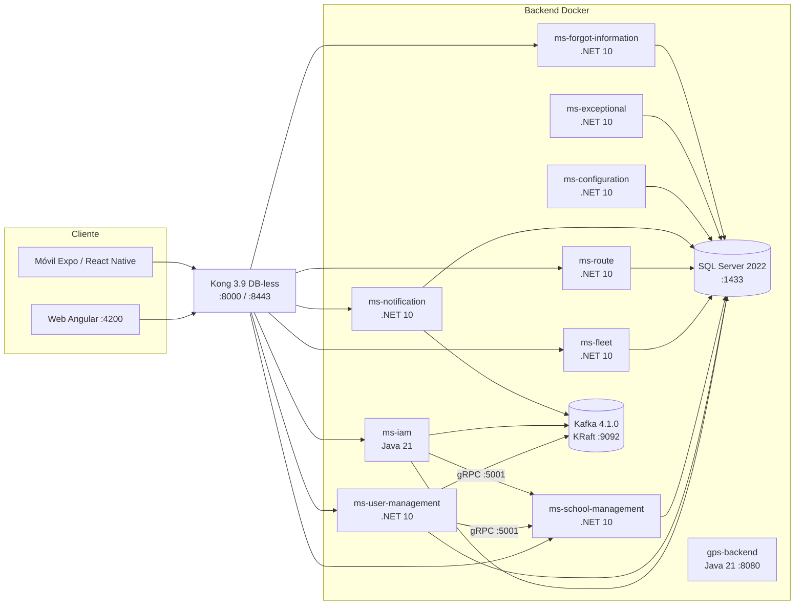
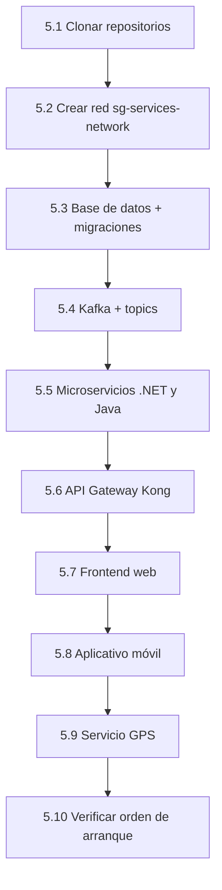

# Manual de Instalación — Guardián Escolar (Parte B)

**Proyecto:** Guardián Escolar (School Guardian)
**Programa:** Tecnólogo en Análisis y Desarrollo de Software — ficha 3145556
**Documento:** Manual de Instalación (Parte B)
**Idioma:** Español
**Fecha:** 10 de octubre de 2026

---

## Control de versiones

| Versión | Fecha | Descripción del cambio | Autor(es) |
|---|---|---|---|
| 1.0 | 10-oct-2026 | Versión inicial del manual de instalación (Parte B). Elaborada a partir del análisis directo del código fuente y de los artefactos de despliegue del proyecto. | Equipo del proyecto |

> **Nota metodológica.** Este manual se elaboró a partir de la lectura directa del código y de los artefactos reales del proyecto (`backend/`, `database/` y `scholl-guardian-project/`): archivos `docker-compose`, `Dockerfile`, `.env.example`, `kong.yml`, changelogs de migración Liquibase y scripts de verificación. Cuando un dato no pudo verificarse en el repositorio, se indica como **no definido en el repositorio** en lugar de suponerse. Las rutas de archivo citadas actúan como evidencia.

---

## 1. Introducción

### 1.1 Propósito y alcance

Este documento describe, paso a paso, cómo instalar, configurar y verificar el sistema **Guardián Escolar** a partir del código fuente y de los artefactos de despliegue reales del proyecto. El alcance cubre:

- Los **microservicios de backend** (.NET 10 y Java 21), el **API Gateway** (Kong) y el **broker de eventos** (Apache Kafka).
- La **base de datos** SQL Server 2022 con su modelo y sus migraciones (Liquibase).
- El **frontend web** (Angular), el **aplicativo móvil** (React Native / Expo) y el **servicio de ingesta GPS** (Java 21).
- La **configuración posterior**, la **verificación** de la instalación y el **procedimiento de actualización y migración**.

No forman parte del alcance la operación en la nube ni el aprovisionamiento de infraestructura como servicio; el despliegue descrito es el **soporte de referencia** con Docker Compose sobre un único host.

**Diagrama de despliegue (topología real):**



### 1.2 Audiencia

Este manual está dirigido a **administradores de sistemas y perfiles de DevOps** con conocimientos de:

- Contenedores y orquestación local con **Docker** y **Docker Compose**.
- Redes, puertos y variables de entorno.
- Operación básica de **SQL Server**, **Kafka** y **API Gateway**.

No se asume experiencia previa con el proyecto. Para el desarrollo de nuevas funcionalidades debe consultarse el Manual Técnico (Parte A).

### 1.3 Versión del software

El proyecto **no publica una única versión de producto**; cada artefacto declara su propia versión. La instalación se **ancla a los commits de cada repositorio** (ver sección 3.3). Las versiones de las tecnologías reales son:

| Componente | Tecnología / versión | Evidencia |
|---|---|---|
| Microservicios de negocio (.NET) | .NET **10** (`net10.0`) | `TargetFramework` en cada `.csproj` |
| ms-iam | **Java 21** + Spring Boot **4.1.1** (Maven) | `backend/ms-iam/pom.xml` |
| gps-backend | **Java 21** + Spring Boot | `gps-backend/pom.xml` |
| Base de datos | Microsoft **SQL Server 2022** (`2022-latest`) | `database/docker-compose.yaml` |
| Migraciones | **Liquibase 4.29** | `database/docker-compose.yaml` |
| Mensajería | Apache **Kafka 4.1.0** (KRaft) | `backend/kafka/docker-compose.yml` |
| API Gateway | **Kong 3.9** (modo DB-less) | `backend/ms-api-gateway/docker-compose.yml` |
| Frontend web | **Angular 21** (`@angular/core ^21.2.9`) sobre **Node 20** (`node:20-alpine`), npm 10.9.1 | `dvlp-front/dvlp-web/package.json`, `Dockerfile` |
| Aplicativo móvil | **Expo ~57** / **React Native 0.86.3** / React 19.2.3 | `dvlp-front/dvlp-movil/guardian-escolar/package.json` |
| Túnel (opcional) | **cloudflared 2026.9.3** | `docker-compose.yml` (frontend) |

> **Nota.** `ms-iam` declara la versión `0.0.1-SNAPSHOT` en su `pom.xml`; el frontend web declara `0.0.0` y el móvil `1.0.0`. Estas versiones son internas de cada artefacto y no representan una versión única del producto.

### 1.4 Control de versiones

Los repositorios usan el esquema **Conventional Commits** (`feat:`, `fix:`, `chore:`). Este manual corresponde a la **Parte B** y acompaña al Manual Técnico (Parte A). En la tabla de la sección 3.3 se listan los repositorios que componen la instalación.

---

## 2. Requisitos previos

### 2.1 Requisitos de hardware

> **Nota.** El repositorio **no define** requisitos de hardware. Los siguientes valores son **recomendaciones** basadas en los servicios desplegados (SQL Server 2022, Kafka, Kong y nueve microservicios contenerizados).

| Recurso | Mínimo | Recomendado |
|---|---|---|
| CPU | 4 núcleos | 8 núcleos |
| Memoria RAM | 8 GB | 16 GB |
| Disco libre | 20 GB | 40 GB (SSD) |
| Red | 1 interfaz con salida a Internet para descargar imágenes | Red local estable |

SQL Server 2022 exige al menos 2 GB de RAM para el contenedor; el resto de servicios son ligeros, pero el conjunto completo (imágenes .NET 10 SDK, Java 21, SQL Server y Kafka) requiere espacio de disco considerable.

### 2.2 Software base (versiones exactas)

Para el despliegue con contenedores solo se requieren **Docker** y **Git** en el host. Las demás herramientas solo son necesarias para ejecutar los servicios fuera de Docker.

| Software | Versión requerida | ¿Necesario en el host? | Uso |
|---|---|---|---|
| Docker Engine | 24 o superior | Sí | Ejecutar contenedores |
| Docker Compose | v2 (`docker compose`) | Sí | Orquestar servicios |
| Git | 2.30 o superior | Sí | Clonar repositorios |
| Node.js + npm | Node 20 / npm 10.9.1 | Solo para desarrollo web/móvil sin Docker | Construir frontend |
| .NET SDK | 10.0 | Solo para desarrollo backend sin Docker | Compilar microservicios .NET |
| Java JDK | 21 | Solo para desarrollo de ms-iam y GPS sin Docker | Compilar servicios Java |
| Maven | 3.9 | Solo para ms-iam sin Docker | Empaquetar ms-iam |

Estas versiones son las declaradas en los artefactos del repositorio (`node:20-alpine`, `mcr.microsoft.com/dotnet/sdk:10.0`, `maven:3.9-eclipse-temurin-21`, `eclipse-temurin:21-jre`, `liquibase/liquibase:4.29`, `apache/kafka:4.1.0`, `kong:3.9`).

### 2.3 Red: puertos, firewall, DNS y SSL

**Red Docker interna.** Todos los contenedores se comunican por la red externa de Docker **`sg-services-network`**, que debe crearse **antes** de levantar los servicios (ver sección 5.2). Dentro de la red, los servicios se resuelven por **nombre de contenedor** (`sqlserver`, `kafka`, `ms-iam`, etc.).

**Puertos.** El proyecto **no incluye un archivo de reglas de firewall**; en la siguiente tabla se documentan los puertos realmente publicados por los `docker-compose`:

| Componente | Puerto host | Puerto contenedor | Descripción |
|---|---|---|---|
| Kong (proxy HTTP) | `8000` | `8000` | Punto de entrada único de la API |
| Kong (proxy HTTPS) | `8443` | `8443` | Punto de entrada TLS de la API |
| Kong (admin) | `8001` / `8444` | `8001` / `8444` | API de administración de Kong |
| Kong (admin GUI) | `8002` / `8445` | `8002` / `8445` | Interfaz de administración |
| SQL Server | `1433` | `1433` | Base de datos |
| Kafka | `9092` | `9092` | Broker de eventos |
| ms-notification | `8081` | `8080` | Único servicio con puerto host fijo |
| ms-school-management (gRPC) | asignado por Docker | `5001` | gRPC h2c interno |
| Resto de microservicios | asignado por Docker | `8080` | Se consumen vía Kong |
| Frontend web (dev) | `4200` | `4200` | Servidor de desarrollo Angular |
| gps-backend | `8080` | `8080` | Ingesta GPS (proceso Java fuera de Compose) |

> **Nota de exposición.** Para un entorno productivo, solo deben publicarse los puertos de **Kong** (`8000`/`8443`) y del **frontend** a través de un proxy inverso. Los puertos `1433` (SQL Server) y `9092` (Kafka) **no** deberían exponerse fuera del host.

**DNS.** El repositorio **no define** registros DNS. La resolución externa solo aparece en los túneles opcionales (`cloudflared`) y en los orígenes CORS de Kong, que apuntan a dominios temporales de desarrollo.

**SSL/TLS.** El repositorio **no incluye certificados** personalizados. Kong se ejecuta en modo DB-less y expone el puerto HTTPS `8443` con su certificado autofirmado por defecto. La conexión de los servicios a SQL Server se realiza **sin cifrado** (`encrypt=false;trustServerCertificate=true`). Para producción, se deben provisionar certificados propios y terminar TLS en Kong o en un proxy inverso.

### 2.4 Accesos y permisos

| Recurso | Acceso requerido |
|---|---|
| Docker | Pertenencia al grupo `docker` (o `sudo`) en el host |
| Git / GitHub | Lectura a la organización `school-guardian-project` y a `code-sena` |
| SQL Server | Usuario y contraseña de la instancia (variable `MSSQL_USER` / `MSSQL_SA_PASSWORD`) |
| Correo (recuperación de contraseña) | Credenciales SMTP de la cuenta remitente |
| Twilio (opcional, OTP por SMS) | `Account SID`, `API Key`, `API Secret` y `Verify Service SID` |

> **Seguridad.** Las credenciales reales **no se incluyen** en este manual; deben configurarse en los archivos `.env` locales (excluidos de Git). La contraseña del usuario `sa` de SQL Server, la clave interna compartida (`INTERNAL_API_KEY` / `APP_INTERNAL_API_KEY`), la sal de OTP (`OTP_HASH_PEPPER`) y los secretos de SMTP/Twilio **deben considerarse datos sensibles**.

### 2.5 Herramientas (Git, Docker, gestores de paquetes)

- **Git** para clonar y actualizar los repositorios.
- **Docker + Docker Compose v2** para construir imágenes y levantar el stack.
- **Node.js 20 + npm 10.9.1** para el frontend web y el móvil.
- **.NET SDK 10.0** para compilar y ejecutar las pruebas (con **NUnit**) de los microservicios .NET.
- **JDK 21 + Maven 3.9** para `ms-iam`; el servicio `gps-backend` incluye el *wrapper* `./mvnw`.
- **Expo CLI** (vía `npx expo`) para el aplicativo móvil.

---

## 3. Contenido del paquete de instalación

### 3.1 Lista de archivos (estructura relevante)

El proyecto **no se distribuye como un paquete binario**: se instala a partir del código fuente y de las imágenes que se construyen localmente. La estructura relevante para la instalación es:

```
backend/
├── ms-api-gateway/          # Kong (docker-compose.yml + kong/kong.yml)
├── kafka/                   # Broker Kafka + init/ (create-topics.sh, topics.conf)
├── ms-iam/                  # Java 21 + Spring Boot (Dockerfile, docker-compose.yml, .env.example)
├── ms-user-management/      # .NET 10 (Dockerfile, docker-compose.yml, .env.example)
├── ms-school-management/    # .NET 10 (REST + gRPC h2c :5001)
├── ms-fleet/                # .NET 10
├── ms-route/                # .NET 10
├── ms-notification/         # .NET 10 (puerto host 8081)
├── ms-configuration/        # .NET 10
├── ms-exceptional/          # .NET 10
└── sg-ms-forgot-information/# .NET 10 (SMTP + Twilio + OTP)
database/
├── docker-compose.yaml      # SQL Server 2022 + contenedores Liquibase + init
├── .env.example             # variables de conexión
├── db-school-guardian.dbml  # modelo de datos (DBML)
└── ms-*-db/                 # changelogs Liquibase por servicio
scholl-guardian-project/
├── docker-compose.yml       # frontend web + túneles cloudflared
├── dvlp-front/dvlp-web/     # Angular (Dockerfile, dev.Dockerfile, nginx.conf, .env)
├── dvlp-front/dvlp-movil/   # Expo / React Native (app.json, eas.json, .env.example)
├── gps-backend/gps-backend/ # Java 21 (application.properties)
└── scripts/verify-api.sh    # verificación de rutas vía Kong
```

### 3.2 Ubicación de descarga / repositorio

Cada componente es un **repositorio Git independiente**:

| Repositorio | URL | Contenido |
|---|---|---|
| `sg-ms-api-gateway` | `https://github.com/school-guardian-project/sg-ms-api-gateway.git` | API Gateway Kong |
| `broker-kafka` | `https://github.com/school-guardian-project/broker-kafka.git` | Broker Kafka + topics |
| `sg-ms-iam` | `https://github.com/school-guardian-project/sg-ms-iam.git` | Autenticación (Java) |
| `sg-ms-user-management` | `https://github.com/school-guardian-project/sg-ms-user-management.git` | Usuarios (people/perfiles) |
| `sg-ms-school-management` | `https://github.com/school-guardian-project/sg-ms-school-management.git` | Colegios y sedes |
| `sg-ms-fleet` | `https://github.com/school-guardian-project/sg-ms-fleet.git` | Flota (buses, tipos) |
| `sg-ms-route` | `https://github.com/school-guardian-project/sg-ms-route.git` | Rutas, paradas y ciudades |
| `sg-ms-notification` | `https://github.com/school-guardian-project/sg-ms-notification.git` | Notificaciones |
| `sg-ms-configuration` | `https://github.com/school-guardian-project/sg-ms-configuration.git` | Configuración |
| `sg-ms-exceptional` | `https://github.com/school-guardian-project/sg-ms-exceptional.git` | Registro de uso excepcional |
| `sg-ms-forgot-information` | `https://github.com/school-guardian-project/sg-ms-forgot-information.git` | Recuperación de contraseña / correo / celular |
| `sg-db` | `https://github.com/code-sena/sg-db.git` | Modelo y migraciones de base de datos |
| `GuardianEscolar` | `https://github.com/school-guardian-project/GuardianEscolar.git` | Frontend web, móvil y `gps-backend` |

### 3.3 Verificación de integridad (hash / checksum)

> **Hallazgo.** Los repositorios **no publican** archivos de checksum (`SHA256SUMS`, `*.sha256`, `*.sig`), **ni** scripts de instalación firmados (`Makefile`, `install.sh`). La verificación de integridad debe apoyarse en los mecanismos nativos de Git y Docker:

- **Integridad de origen en Git:** anclar la instalación a un **commit** concreto y verificar su trazabilidad con:

  ```bash
  git clone <URL>
  git -C <repo> rev-parse HEAD          # SHA del commit instalado
  git -C <repo> log -1 --format='%H %an %ad %s'
  # Opcional, si el commit está firmado:
  git -C <repo> verify-commit HEAD
  ```

- **Integridad de las imágenes Docker:** obtener el *digest* de cada imagen construida y fijarlo para despliegues reproducibles:

  ```bash
  docker inspect --format '{{index .RepoDigests 0}}' ms-iam:latest
  ```

- **Checksum de artefactos generados** (si se distribuyen manualmente):

  ```bash
  sha256sum dist/*.tar.gz
  ```

Registrar los SHAs y digests obtenidos permite reproducir exactamente la misma instalación y detectar alteraciones.

---

## 4. Preparación del entorno

### 4.1 Dependencias

1. Instalar **Docker Engine 24+** y **Docker Compose v2**.
2. Instalar **Git 2.30+**.
3. (Opcional, desarrollo sin Docker) Instalar **Node.js 20**, **.NET SDK 10**, **JDK 21** y **Maven 3.9**.
4. Verificar las versiones:

   ```bash
   docker --version
   docker compose version
   git --version
   ```

### 4.2 Usuarios y directorios

- El proyecto se compone de **varios repositorios**. Se recomienda una carpeta raíz de trabajo y clonarlos en subcarpetas consistentes con las rutas de este manual:

  ```bash
  mkdir -p ~/school-guardian/backend ~/school-guardian/database
  mkdir -p ~/school-guardian/scholl-guardian-project
  ```

- Dentro de los contenedores, los servicios se ejecutan con **usuarios no privilegiados** cuando la imagen base lo define (por ejemplo, las imágenes .NET usan `USER $APP_UID`). No es necesario crear usuarios del sistema en el host.
- Los **scripts** (`backend/kafka/init/create-topics.sh`, `scholl-guardian-project/scripts/verify-api.sh`) deben conservar el permiso de ejecución:

  ```bash
  chmod +x backend/kafka/init/create-topics.sh
  chmod +x scholl-guardian-project/scripts/verify-api.sh
  ```

### 4.3 Preparación de la base de datos

La base de datos **no se crea manualmente**: el `docker-compose.yaml` de `database/` levanta SQL Server 2022 y un contenedor de inicialización (`sqlserver-init`) que **crea la base** `school-guardian` si no existe, antes de ejecutar las migraciones Liquibase.

1. Crear el archivo de entorno a partir del ejemplo y **definir valores propios** (no usar los de ejemplo en producción):

   ```bash
   cd ~/school-guardian/database
   cp .env.example .env
   # Editar .env: MSSQL_DATABASE, MSSQL_USER, MSSQL_SA_PASSWORD
   ```

   Variables reales definidas en `database/.env.example`:

   | Variable | Descripción |
   |---|---|
   | `MSSQL_DATABASE` | Nombre de la base (por ejemplo, `school-guardian`) |
   | `MSSQL_USER` | Usuario de la instancia (en el ejemplo, el usuario `sa`) |
   | `MSSQL_SA_PASSWORD` | Contraseña del usuario |
   | `DATABASE_URL` | Cadena de conexión de referencia |
   | `DEMO_PASSWORD` | Clave usada por los perfiles de demostración |
   | `SCHOOL_GUARDIAN_DB_DIR` | Directorio de los changelogs (por defecto `.`) |

2. La creación de la base y las migraciones se ejecutan en la sección 5.3.

### 4.4 Puertos y firewall

1. Confirmar que los puertos de la sección 2.3 están libres en el host:

   ```bash
   ss -tulpn | grep -E ':(8000|8001|8002|8081|1433|9092|4200)\b'
   ```

2. (Recomendado) Restringir el acceso público a `1433` (SQL Server) y `9092` (Kafka). El proyecto **no incluye** reglas de firewall; deben definirse en el host o en el perímetro.
3. Asegurar conectividad de salida a Internet (443) para descargar imágenes base (`mcr.microsoft.com`, `docker.io`, `apache`, `kong`, etc.).

---

## 5. Procedimiento de instalación paso a paso



### 5.1 Clonación de repositorios

```bash
mkdir -p ~/school-guardian/backend && cd ~/school-guardian/backend

git clone https://github.com/school-guardian-project/sg-ms-api-gateway.git ms-api-gateway
git clone https://github.com/school-guardian-project/broker-kafka.git kafka
git clone https://github.com/school-guardian-project/sg-ms-iam.git ms-iam
git clone https://github.com/school-guardian-project/sg-ms-user-management.git ms-user-management
git clone https://github.com/school-guardian-project/sg-ms-school-management.git ms-school-management
git clone https://github.com/school-guardian-project/sg-ms-fleet.git ms-fleet
git clone https://github.com/school-guardian-project/sg-ms-route.git ms-route
git clone https://github.com/school-guardian-project/sg-ms-notification.git ms-notification
git clone https://github.com/school-guardian-project/sg-ms-configuration.git ms-configuration
git clone https://github.com/school-guardian-project/sg-ms-exceptional.git ms-exceptional
git clone https://github.com/school-guardian-project/sg-ms-forgot-information.git sg-ms-forgot-information

cd ~/school-guardian
git clone https://github.com/code-sena/sg-db.git database
git clone https://github.com/school-guardian-project/GuardianEscolar.git scholl-guardian-project
```

### 5.2 Creación de la red Docker

Todos los `docker-compose` declaran la red como **externa**; por eso debe crearse una sola vez:

```bash
docker network create sg-services-network
# Verificar:
docker network ls | grep sg-services-network
```

### 5.3 Base de datos y migraciones

```bash
cd ~/school-guardian/database
cp .env.example .env      # solo la primera vez; editar los valores
docker compose up -d
```

Este comando:

1. Levanta **SQL Server 2022** y espera a que su *healthcheck* (`SELECT 1` con `sqlcmd`) pase.
2. Ejecuta **`sqlserver-init`**, que crea la base `school-guardian` si no existe.
3. Ejecuta los contenedores **Liquibase 4.29** en orden de dependencias de clave foránea: **Geographic / Gps / Settings → School → Iam → Fleet → Route → UserManagement → Notification**. Cada contenedor aplica su `changelog/changelog-master.yaml`.

Verificar el resultado:

```bash
docker compose ps -a                       # los liquibase-* deben quedar "exited (0)"
docker compose logs liquibase-iam          # revisar "Liquibase: Update has been successful"
docker compose logs liquibase-route
```

> **Nota.** `ms-audit-db` existe como carpeta pero **no tiene changelog** (la auditoría fue retirada del alcance); `ms-exceptional` no tiene carpeta de base de datos propia. Las migraciones reales cubren **nueve esquemas**.

### 5.4 Mensajería (Kafka)

```bash
cd ~/school-guardian/backend/kafka
docker compose up -d
```

El contenedor `kafka-init` crea automáticamente los tópicos definidos en `init/topics.conf`:

| Tópico | Particiones | Factor de replicación |
|---|---|---|
| `student.created` | 1 | 1 |
| `driver.created` | 1 | 1 |
| `admin.created` | 1 | 1 |
| `parent.created` | 1 | 1 |
| `profile.created` | 1 | 1 |
| `student.scanned` | 1 | 1 |

Verificar:

```bash
docker exec kafka /opt/kafka/bin/kafka-topics.sh --bootstrap-server kafka:9092 --list
```

### 5.5 Microservicios de backend

Cada servicio se despliega con su propio `docker-compose.yml`. **Preparar el `.env`** de cada uno antes de levantarlo (copiar desde `.env.example` cuando exista y completar los valores). Se recomienda este orden:

**a) `ms-school-management`** (expone REST `:8080` y gRPC h2c `:5001`; es consumido por `ms-iam` y `ms-user-management`):

```bash
cd ~/school-guardian/backend/ms-school-management
cp .env.example .env      # completar ConnectionStrings__DefaultConnection, Kafka, Kestrel, Grpc
docker compose up -d --build
```

Variables reales (ver `ms-school-management/.env`):

| Variable | Descripción |
|---|---|
| `ConnectionStrings__DefaultConnection` | Cadena de conexión a SQL Server |
| `Kafka__BootstrapServers` | Dirección de Kafka (por ejemplo, `kafka:9092`) |
| `ASPNETCORE_Kestrel__Endpoints__Http__Url` / `__Protocols` | Endpoint REST (HTTP/1.1) |
| `ASPNETCORE_Kestrel__Endpoints__Grpc__Url` / `__Protocols` | Endpoint gRPC h2c (`:5001`) |
| `Grpc__SchoolManagement__Host` / `__Port` | Host y puerto gRPC internos |

**b) `ms-iam`** (Java 21; autenticación JWT):

```bash
cd ~/school-guardian/backend/ms-iam
cp .env.example .env      # completar MSSQL_*, KAFKA_BOOTSTRAP_SERVERS, JWT_SECRET, APP_INTERNAL_API_KEY
docker compose up -d --build
```

**c) Resto de microservicios .NET** (mismo patrón `--build`):

```bash
for svc in ms-user-management ms-fleet ms-route ms-notification ms-configuration ms-exceptional sg-ms-forgot-information; do
  ( cd ~/school-guardian/backend/$svc && cp -n .env.example .env 2>/dev/null; docker compose up -d --build )
done
```

Variables relevantes por servicio (según los `.env` reales):

| Servicio | Variables principales |
|---|---|
| `ms-user-management` | `ConnectionStrings__DefaultConnection`, `Kafka__BootstrapServers`, `SchoolManagement__GrpcAddress` |
| `ms-fleet` | `ConnectionStrings__DefaultConnection`, `Kafka__BootstrapServers` |
| `ms-route` | `ConnectionStrings__DefaultConnection`, `Kafka__BootstrapServers`, `ASPNETCORE_Kestrel__Endpoints__Http__*` |
| `ms-notification` | `ConnectionStrings__DefaultConnection`, `Kafka__BootstrapServers`, `Services__UserManagement__BaseUrl`, `Services__Route__BaseUrl` |
| `ms-configuration` | `ConnectionStrings__DefaultConnection`, `Kafka__BootstrapServers` |
| `ms-exceptional` | `ConnectionStrings__DefaultConnection` |
| `sg-ms-forgot-information` | `ConnectionStrings__DefaultConnection`, `INTERNAL_API_KEY`, `OTP_HASH_PEPPER`, `SMTP_*`, `TWILIO_*` |

**Ejecución de pruebas (NUnit).** Los servicios .NET incluyen un servicio de pruebas en el perfil `tests`:

```bash
cd ~/school-guardian/backend/ms-route
docker compose run --rm ms-route.tests     # ejecuta `dotnet test` (NUnit)
```

### 5.6 API Gateway (Kong)

```bash
cd ~/school-guardian/backend/ms-api-gateway
docker compose up -d
```

Kong arranca en **modo DB-less** con la configuración declarativa `kong/kong.yml` montada como solo lectura (`/opt/kong/kong.yml`). El archivo define los servicios y rutas hacia los microservicios internos, la política **CORS** y el **rate-limiting** (por token con `limit_by: header` y un techo global por servicio).

> **Hallazgo.** La configuración de Kong **no define una ruta `/health`**. La verificación se realiza contra las rutas reales de la API (sección 7.2).

### 5.7 Frontend web (Angular)

```bash
cd ~/school-guardian/scholl-guardian-project
# El archivo dvlp-front/dvlp-web/.env debe apuntar a Kong:
#   API_URL=http://localhost:8000
#   API_FORGOT_INFORMATION_URL=http://localhost:8000
docker compose up -d --build frontend-web
```

- **Desarrollo:** el `dev.Dockerfile` usa `node:20-alpine` y ejecuta `ng serve` en `0.0.0.0:4200`, con montaje de `src/`, `public/` y `.env`.
- **Producción:** el `Dockerfile` construye con `ng build --configuration spa --output-mode=static` y sirve el resultado con **nginx** (`nginx.conf`).

> **Hallazgo (divergencia).** En la imagen de producción, el bloque `location /api` de `nginx.conf` reenvía a `http://backend:8080`, un host que **no existe** en el stack actual (el punto de entrada real es `kong:8000`). Para desplegar la imagen de producción debe corregirse ese *upstream*.

### 5.8 Aplicativo móvil (Expo / React Native)

Requiere Node 20 y la CLI de Expo. No se conteneriza en el repositorio.

```bash
cd ~/school-guardian/scholl-guardian-project/dvlp-front/dvlp-movil/guardian-escolar
cp .env.example .env      # ajustar valores
npm install
npm run start             # o: npm run start:lan
```

Variables reales (`.env.example`):

| Variable | Uso |
|---|---|
| `EXPO_LAN_IP` | IP LAN del host para el servidor de desarrollo |
| `EXPO_PUBLIC_API_URL` | URL de la API (Kong) |
| `EXPO_PUBLIC_FORGOT_INFORMATION_API_URL` | URL del servicio de recuperación |
| `NGROK_DOMAIN` | Dominio del túnel para acceso desde el dispositivo |

La compilación/entrega móvil se gestiona con **EAS** (`eas.json` define los perfiles `development`, `preview` y `production`).

### 5.9 Servicio GPS (`gps-backend`)

Es un servicio Java 21 independiente que **no** usa Compose. Su persistencia está **en memoria** y la autoconfiguración de base de datos está **desactivada**:

```bash
cd ~/school-guardian/scholl-guardian-project/gps-backend/gps-backend
./mvnw spring-boot:run
# Expone HTTP en el puerto 8080
```

> **Hallazgo.** Por diseño, `gps-backend` no persiste en base de datos (`spring.autoconfigure.exclude` desactiva DataSource y JPA). Su estado se pierde al reiniciar.

### 5.10 Resumen del orden de arranque

| # | Paso | Comando base |
|---|---|---|
| 1 | Red Docker | `docker network create sg-services-network` |
| 2 | Base de datos + migraciones | `docker compose up -d` en `database/` |
| 3 | Kafka + topics | `docker compose up -d` en `backend/kafka` |
| 4 | ms-school-management | `docker compose up -d --build` |
| 5 | ms-iam | `docker compose up -d --build` |
| 6 | Resto de microservicios .NET | `docker compose up -d --build` |
| 7 | Kong | `docker compose up -d` |
| 8 | Frontend web | `docker compose up -d --build frontend-web` |
| 9 | Móvil / GPS | `npm run start` / `./mvnw spring-boot:run` |

---

## 6. Configuración posterior

### 6.1 Variables de entorno y archivos de configuración

La configuración se reparte en **archivos `.env`** (uno por servicio, excluidos de Git) y en archivos de propiedades dentro de cada servicio:

- `.NET`: variables con prefijo `ConnectionStrings__`, `Kafka__`, `Services__`, `Grpc__`, `SchoolManagement__`, `ASPNETCORE_Kestrel__` (doble guion bajo como separador de jerarquía).
- `ms-iam` (Java): `application.properties` consume `${MSSQL_DATABASE}`, `${MSSQL_USER}`, `${MSSQL_SA_PASSWORD}`, `${KAFKA_BOOTSTRAP_SERVERS}` y `${JWT_SECRET}`.
- `sg-ms-forgot-information`: recibe configuración por `environment` en el `docker-compose.yml` con valores obligatorios (validados con `${VAR:?mensaje}`).

Ejemplo de configuración (valores **ficticios**):

```json
{
  "ConnectionStrings__DefaultConnection": "Server=sqlserver;Database=school-guardian;User Id=<usuario>;Password=<REDACTADO>;TrustServerCertificate=True",
  "Kafka__BootstrapServers": "kafka:9092",
  "SchoolManagement__GrpcAddress": "http://ms-school-management:5001",
  "Services__UserManagement__BaseUrl": "http://ms-user-management:8080",
  "Services__Route__BaseUrl": "http://ms-route:8080"
}
```

> **Seguridad.** Sustituir `<usuario>` y `<REDACTADO>` por valores reales gestionados de forma segura (gestor de secretos). Nunca versionar los `.env`.

### 6.2 Conexión a base de datos y servicios externos

- **Base de datos:** los servicios .NET apuntan a `sqlserver:1433` con `Database=school-guardian`; `ms-iam` usa `jdbc:sqlserver://sqlserver:1433;databaseName=${MSSQL_DATABASE}`. Los nueve esquemas conviven en **una sola base** (`school-guardian`), un esquema por servicio.
- **Kafka:** `versión 4.1.0` en modo KRaft, escucha en `kafka:9092` dentro de la red.
- **gRPC interno:** `ms-iam` y `ms-user-management` consultan `ms-school-management` por gRPC h2c en el puerto `5001`.

> **Hallazgo (ms-iam).** `application.properties` declara `grpc.school-management.*`, pero el `pom.xml` **no** incluye dependencia ni cliente gRPC: la integración gRPC de `ms-iam` está **declarada pero no implementada**.

### 6.3 Correo, almacenamiento y SSL

- **Correo (recuperación de contraseña):** configurado en `sg-ms-forgot-information` con `SMTP_HOST`, `SMTP_PORT` (587), `SMTP_ENABLE_SSL` (`true`), `SMTP_USER`, `SMTP_PASSWORD`, `SMTP_FROM`. El ejemplo recomienda **Gmail** (`smtp.gmail.com`) con **contraseña de aplicación**.
- **Twilio (opcional, OTP por SMS):** `TWILIO_ACCOUNT_SID`, `TWILIO_API_KEY`, `TWILIO_API_SECRET`, `TWILIO_VERIFY_SERVICE_SID`. Sin configurar, los flujos por correo siguen funcionando y el cambio de teléfono responde `503`.
- **OTP:** la sal `OTP_HASH_PEPPER` debe generarse aleatoriamente (`openssl rand -base64 32`).
- **Almacenamiento:** el proyecto **no integra** un servicio de almacenamiento de objetos; las imágenes/logos se manejan como URL. No hay buckets definidos en el repositorio.
- **SSL:** Kong usa su certificado autofirmado por defecto; no hay certificados propios. Para producción, terminar TLS en Kong (`8443`) o en un proxy inverso.

### 6.4 Usuario administrador inicial

El usuario administrador inicial se crea mediante **datos semilla** cargados por Liquibase; **no** existe un asistente de creación. Datos reales de las semillas:

| Rol | Correo (semilla) | Contraseña |
|---|---|---|
| Administrador | `admin@school-guardian.com` | El **número de identificación** del perfil (`99000000001`) |
| Conductor | `driver@school-guardian.com` | `99000000002` |
| Acudiente | `parent@school-guardian.com` | `99000000003` |
| Estudiante | `student@school-guardian.com` | `99000000004` |

> **Cómo funciona.** Los comentarios de las migraciones indican que el `PasswordHash` es **bcrypt (rounds=10) del número de identificación** de cada persona. El script de verificación `scripts/verify-api.sh` confirma este comportamiento. El valor `DEMO_PASSWORD=Demo2026!` del `database/.env.example` corresponde a los **perfiles de demostración** y debe cambiarse.

Roles sembrados en `Iam.Role`: **`Admin`**, `Student`, `Driver`, `Parent` y `SuperAdmin`. **Acción obligatoria en producción:** cambiar las contraseñas semilla y deshabilitar los usuarios de demostración.

### 6.5 Proxy inverso / balanceador de carga

- El proyecto **no incluye** un proxy inverso configurado salvo **nginx** dentro de la imagen del frontend web.
- Kong actúa como **punto de entrada** y balanceador lógico de la API (enrutamiento por servicio). Está en modo DB-less, por lo que su configuración es declarativa (`kong.yml`), sin base de datos de administración.
- Para producción se recomienda un proxy inverso delante de Kong y del frontend, con terminación TLS y *bindings* a `kong:8000` y al contenedor del frontend.

---

## 7. Verificación de la instalación

### 7.1 Servicios en ejecución

```bash
docker ps --format 'table {{.Names}}\t{{.Status}}\t{{.Ports}}'
```

Lista esperada (nombres reales de contenedor): `school-guardian-db-dev`, `kafka`, `kong`, `ms-iam`, `ms-user-management`, `ms-school-management`, `ms-fleet`, `ms-route`, `ms-notification`, `ms-configuration`, `ms-exceptional`, `ms-forgot-information` y `frontend-container-dev`.

Verificar la red:

```bash
docker network inspect sg-services-network --format '{{range .Containers}}{{.Name}} {{end}}'
```

### 7.2 Smoke tests

El repositorio incluye un script de verificación real que prueba las rutas del frontend a través de Kong:

```bash
cd ~/school-guardian/scholl-guardian-project
API_URL=http://localhost:8000 ./scripts/verify-api.sh
```

Requiere `curl` y `jq`. El script:

1. Inicia sesión con los usuarios semilla (obtiene `accessToken` y `refreshToken`).
2. Recorre las rutas reales de `ms-iam`, `ms-school-management`, `ms-user-management`, `ms-route`, `ms-fleet` y `ms-notification` a través de Kong y compara el **código HTTP esperado**.
3. Comprueba que los servicios **sin ruta en Kong** (`ms-exceptional`, `ms-configuration`) respondan `404`.
4. Imprime `OK: n  FAIL: m` y devuelve código de salida distinto de cero si hay fallos.

> **Hallazgo (verificación).** Kong **no** expone una ruta `/health`, y la mayoría de los servicios .NET **no** publican `MapHealthChecks`. El único servicio con `/health` es `sg-ms-forgot-information`. Por esto, la verificación válida es la que ejercita **rutas reales** (el script anterior).

Ejemplo de *login* directo contra Kong:

```bash
curl -s -X POST http://localhost:8000/api/v1/auth/login \
  -H 'Content-Type: application/json' \
  -d '{"email":"admin@school-guardian.com","password":"99000000001"}'
```

Respuesta esperada (valores abreviados):

```json
{
  "accessToken": "<jwt>",
  "refreshToken": "<jwt>",
  "tokenType": "Bearer"
}
```

### 7.3 Acceso a la aplicación

| Interfaz | URL |
|---|---|
| API (Kong) | http://localhost:8000 |
| Frontend web | http://localhost:4200 |
| Kong Admin API | http://localhost:8001 |
| Kong Admin GUI | http://localhost:8002 |

### 7.4 Checklist de instalación exitosa

- [ ] La red `sg-services-network` existe.
- [ ] SQL Server está `healthy` y la base `school-guardian` fue creada.
- [ ] Todos los contenedores `liquibase-*` terminaron con código `0`.
- [ ] Kafka responde y existen los seis tópicos.
- [ ] Todos los microservicios y `kong` están en estado `Up`.
- [ ] `verify-api.sh` reporta `FAIL: 0`.
- [ ] El login con el usuario administrador semilla devuelve `200`.
- [ ] El frontend web carga y consume la API a través de Kong.

---

## 8. Actualización y migración

### 8.1 Procedimiento de actualización

> **Nota de numeración.** El esquema de este manual sigue una secuencia continua (1–8). La lista de secciones de la especificación saltaba de 7 a 9; aquí se resuelve como **8. Actualización y migración**.

1. **Actualizar el código** de cada repositorio implicado:

   ```bash
   for r in ~/school-guardian/backend/* ~/school-guardian/database ~/school-guardian/scholl-guardian-project; do
     git -C "$r" pull --ff-only
   done
   ```

2. **Respaldar la base de datos** antes de migrar (sección 8.3).
3. **Reconstruir y recrear los servicios** afectados:

   ```bash
   cd ~/school-guardian/backend/<servicio>
   docker compose up -d --build
   ```

4. **Aplicar migraciones nuevas:** volver a ejecutar los contenedores Liquibase de `database/`; Liquibase aplica **solo** los *changesets* nuevos y registra el historial:

   ```bash
   cd ~/school-guardian/database
   docker compose up -d
   docker compose logs -f liquibase-iam liquibase-route
   ```

5. **Verificar** con `scripts/verify-api.sh` (sección 7.2).

> **Compatibilidad.** Los cambios de esquema deben respetar el orden de dependencias de clave foránea ya codificado en `database/docker-compose.yaml` (Geographic/Gps/Settings → School → Iam → Fleet → Route → UserManagement → Notification).

### 8.2 Migración de datos

- Las migraciones se gestionan **exclusivamente con Liquibase**; no hay scripts de migración manuales en el repositorio.
- Entre entornos (por ejemplo, de desarrollo a producción) la base se reconstruye aplicando los *changesets* sobre una base vacía; para mover datos existentes se usa una **restauración de respaldo** (sección 8.3) en lugar de exportación ad hoc.
- La identidad de los esquemas se mantiene: un esquema por servicio dentro de la **misma base** `school-guardian`.

### 8.3 Respaldo previo

El repositorio **no incluye** scripts de respaldo ni política de retención. Se recomienda usar las capacidades nativas de SQL Server antes de cualquier actualización:

```bash
# Respaldo completo (dentro del contenedor de SQL Server)
docker exec school-guardian-db-dev /opt/mssql-tools18/bin/sqlcmd \
  -S localhost -U sa -P '<REDACTADO>' -C \
  -Q "BACKUP DATABASE [school-guardian] TO DISK = N'/var/lib/mssql/data/school-guardian.bak' WITH INIT, COMPRESSION"

# Copiar el respaldo fuera del contenedor
docker cp school-guardian-db-dev:/var/lib/mssql/data/school-guardian.bak ./backups/
```

Recomendaciones:

- Definir un **objetivo de punto de recuperación (RPO)** y un **objetivo de tiempo de recuperación (RTO)** acordes al negocio, y programar respaldos **completos + diferenciales/log de transacciones**.
- Guardar los respaldos **fuera del host** (almacenamiento externo).
- El contenedor de SQL Server persiste en el volumen `school-guardian-sqlserver-data`; Kafka persiste en el volumen `kafka-data` (los datos de Kafka no son críticos para la recuperación funcional).
- Probar periódicamente la **restauración** en un entorno aislado.

---

## 9. Referencias

Apache Software Foundation. (s. f.). *Apache Kafka documentation*. https://kafka.apache.org/documentation/

Angular. (s. f.). *Angular documentation*. https://angular.dev/

Docker Inc. (s. f.). *Docker Compose documentation*. https://docs.docker.com/compose/

Expo. (s. f.). *Expo documentation*. https://docs.expo.dev/

Kong Inc. (s. f.). *Kong Gateway documentation*. https://docs.konghq.com/gateway/

Liquibase. (s. f.). *Liquibase documentation*. https://docs.liquibase.com/

Microsoft. (s. f.). *Microsoft SQL Server 2022 documentation*. https://learn.microsoft.com/sql/

Microsoft. (s. f.). *.NET documentation*. https://learn.microsoft.com/dotnet/

OpenJS Foundation. (s. f.). *Node.js documentation*. https://nodejs.org/docs/

OWASP Foundation. (2021). *OWASP Top 10:2021 — The ten most critical web application security risks*. https://owasp.org/Top10/

Pivotal Software. (s. f.). *Spring Boot reference documentation*. https://docs.spring.io/spring-boot/

Tolk, A. (s. f.). *gRPC documentation*. https://grpc.io/docs/

---

*Fin del Manual de Instalación — Parte B.*
