# Manual Técnico — Guardián Escolar (School Guardian)

**Programa:** Tecnólogo en Análisis y Desarrollo de Software (ADSO)
**Ficha:** 3145556
**Centro de formación:** Sede La Industria, La Empresa y Los Servicios — SENA (Neiva, Huila, Colombia)
**Autores:** Johan Smith Santamaria Fernández; Sharik Dayanna Rojas Ibarra; Juan Pablo Chala Ramírez
**Versión del documento:** 1.0
**Fecha:** 10 de octubre de 2026
**Estado del software documentado:** en desarrollo (arquitectura implementada; funcionalidad parcial)

> **Nota metodológica.** Este manual se elaboró a partir de la lectura directa del código y los artefactos reales de los repositorios del proyecto (`backend/`, `database/` y `scholl-guardian-project/`). Se documenta aquí **lo que el código hace realmente** y se señalan de forma explícita los hallazgos de consistencia detectados. Cuando un dato no pudo verificarse en el repositorio, se indica como **no verificable** en lugar de suponerse. Las rutas de archivo citadas actúan como evidencia.

---

## Control de versiones

| Versión | Fecha | Descripción del cambio | Autor(es) |
|---|---|---|---|
| 1.0 | 10-oct-2026 | Versión inicial del manual técnico (Parte A). Elaborada a partir del análisis directo del código fuente del proyecto. | Equipo del proyecto |

---

## Tabla de contenido

1. [Introducción](#1-introducción)
2. [Descripción general del sistema](#2-descripción-general-del-sistema)
3. [Arquitectura del sistema](#3-arquitectura-del-sistema)
4. [Modelo de datos](#4-modelo-de-datos)
5. [Estructura del código fuente](#5-estructura-del-código-fuente)
6. [Descripción de módulos y componentes](#6-descripción-de-módulos-y-componentes)
7. [Documentación de APIs e integraciones](#7-documentación-de-apis-e-integraciones)
8. [Configuración](#8-configuración)
9. [Seguridad](#9-seguridad)
10. [Referencias](#10-referencias)

---

## 1. Introducción

### 1.1 Propósito y alcance

Este documento es el **manual técnico** de *Guardián Escolar* (nombre en inglés: *School Guardian*), una plataforma de gestión del transporte escolar que integra rastreo GPS en tiempo real, control de abordaje/descenso mediante código QR, administración de rutas y flota, y notificaciones a los acudientes.

El manual describe **cómo está construido y cómo se opera** el sistema: su arquitectura, su modelo de datos, la estructura del código, los servicios que lo componen, las interfaces (API REST, gRPC y mensajería), la configuración y los mecanismos de seguridad. Está dirigido a quien debe **comprender, extender, desplegar o mantener** el software.

**Alcance incluido:**

- Arquitectura de software y justificación del estilo arquitectónico.
- Backend de microservicios (10 servicios + API Gateway + broker de mensajería).
- Modelo de base de datos (motor, esquemas, tablas, relaciones y diccionario de datos).
- Frontend web (Angular), aplicación móvil (React Native/Expo) y servicio de ingesta GPS.
- Contratos de API, configuración por ambiente y controles de seguridad.
- Limitaciones y hallazgos verificados (deuda técnica y divergencias código/documentación).

**Alcance excluido:**

- Contenido de negocio comercial (precios, acuerdos con colegios), cubierto por otros documentos del proyecto.
- Código fuente completo, que se referencia por ruta pero no se reproduce íntegro.
- Procedimientos administrativos internos del SENA.

### 1.2 Audiencia

| Audiencia | Uso principal del documento |
|---|---|
| Desarrolladores de backend | Crear nuevos casos de uso, adaptadores y migraciones respetando la arquitectura hexagonal y los contratos. |
| Desarrolladores de frontend (web/móvil) | Consumir las APIs correctamente, conocer autenticación, códigos de error y modelos. |
| Arquitectos de software | Evaluar el estilo arquitectónico, los patrones, la integración entre servicios y las decisiones tomadas. |
| DevOps / soporte técnico | Desplegar con Docker/Compose, configurar variables de entorno, diagnosticar la red de servicios. |
| Administradores de plataforma | Comprender roles, permisos, seguridad y operación general. |
| Evaluadores académicos | Verificar coherencia entre requisitos, diseño, implementación y pruebas. |

### 1.3 Definiciones, acrónimos y abreviaturas

| Término | Definición |
|---|---|
| **ADSO** | Análisis y Desarrollo de Software (programa de formación del SENA). |
| **API Gateway** | Punto de entrada único que enruta el tráfico hacia los microservicios (aquí, Kong). |
| **ACPM** | Acciones Correctivas, Preventivas y de Mejora. |
| **Adaptador (Adapter)** | Componente de infraestructura que conecta el dominio con tecnología externa (BD, HTTP, gRPC, Kafka). |
| **BCrypt** | Algoritmo de hashing de contraseñas con factor de coste. |
| **DBML** | *Database Markup Language*; notación declarativa del modelo de datos. |
| **DTO** | *Data Transfer Object*; objeto para transportar datos entre capas o servicios. |
| **EF Core** | *Entity Framework Core*; ORM de .NET. |
| **gRPC** | Marco de llamada a procedimiento remoto sobre HTTP/2, con *Protocol Buffers*. |
| **Hexagonal (Ports & Adapters)** | Estilo arquitectónico que aísla el dominio del exterior mediante puertos y adaptadores. |
| **HS256** | Algoritmo de firma HMAC-SHA-256 para JWT. |
| **JWT** | *JSON Web Token*; credencial firmada con *claims*. |
| **Kafka** | Plataforma de mensajería distribuida orientada a eventos. |
| **KRaft** | Modo de Kafka sin ZooKeeper (controlador integrado). |
| **Kong** | API Gateway *open source*. |
| **Liquibase** | Herramienta de migración de esquemas de base de datos. |
| **OTP** | *One-Time Password*; código de verificación temporal. |
| **PII** | *Personally Identifiable Information*; datos personales identificables. |
| **Puerto (Port)** | Interfaz que define cómo el dominio se comunica con el exterior (de entrada o de salida). |
| **RNF / NFR** | Requisito no funcional (*Non-Functional Requirement*). |
| **RF / FR** | Requisito funcional (*Functional Requirement*). |
| **RFC 7807** | Estándar de *Problem Details* para respuestas de error en JSON. |
| **SSR** | *Server-Side Rendering*; renderizado en servidor. |
| **Tenant** | Colegio (institución) como unidad de aislamiento lógico de datos. |
| **TDD** | *Test-Driven Development*. |

### 1.4 Referencias (código del proyecto)

Las referencias bibliográficas y normativas siguen el estilo APA 7.ª edición y se listan en la sección 10. La fuente primaria de verificación de este manual es el código fuente y los artefactos reales del proyecto; no se apoya en documentos auxiliares:

- **Backend:** `backend/` (microservicios .NET 10 y Java 21, API Gateway Kong y configuración de Kafka).
- **Base de datos:** `database/` (modelo `db-school-guardian.dbml` y changelogs de migración Liquibase).
- **Frontend:** `scholl-guardian-project/` (aplicación web Angular, aplicativo móvil React Native/Expo y servicio de ingesta GPS).

### 1.5 Control de versiones

El software usa **Conventional Commits** (por ejemplo, `feat:`, `fix:`, `chore:`) y ramas por propósito. El presente manual sigue versionado documental con paridad estricta entre `es/` y `en/`: ambos idiomas deben mantener el mismo número de secciones, tablas y componentes. El detalle de la estrategia de ramas se encuentra en la sección 5.1.

---

## 2. Descripción general del sistema

### 2.1 Objetivo y funcionalidades principales

Guardián Escolar centraliza la operación del transporte escolar. Su objetivo es que un colegio pueda **planificar rutas, ejecutarlas, rastrear el bus en vivo, registrar el abordaje y descenso de cada estudiante y notificar a los acudientes**, con trazabilidad de cada evento.

Funcionalidades principales (agrupadas por requisito funcional del SRS, con su estado de implementación verificado en el código):

| Grupo | Funcionalidad | Servicios implicados | Estado verificado |
|---|---|---|---|
| **RF-01** | Gestión de usuarios: crear, actualizar, activar/desactivar cuentas y vincular estudiantes a acudientes | ms-user-management, ms-iam | Implementado (REST + Kafka) |
| **RF-02** | Autenticación con JWT y cierre/renovación de sesión | ms-iam | Implementado (login, refresh, logout) |
| **RF-03** | Rutas, flota y asignaciones: rutas y paradas ordenadas, buses, conductor→bus, estudiantes→ruta | ms-route, ms-fleet, ms-user-management | Implementado |
| **RF-04** | Escaneo QR de subida/bajada | ms-notification (registro de escaneo) | Parcial (registro de escaneo implementado; generación/lectura de QR en clientes) |
| **RF-05** | Notificaciones de abordaje a acudientes (push Expo) | ms-notification | Implementado (consumidor `student.scanned` + push) |
| **RF-06** | Rastreo en tiempo real y mapa interactivo | gps-backend (ingesta TCP), ms-route (gRPC), web/móvil (Leaflet/Map) | Parcial (ingesta GPS y almacenamiento en memoria implementados; capa de servicio GPS en backend no expuesta vía Kong) |
| **RF-07** | Ciclo de viaje (inicio/fin) | ms-route | Implementado (`api/trips/start`, `api/trips/end`, `api/trips/current`) |
| **RF-08** | Incidentes y alertas | ms-notification | Parcial (modelo `Alert`, `AlertType`, `AlertRecipient`; endpoints de alertas no expuestos) |
| **RF-09** | Consulta de rutas por acudiente y por conductor | ms-route | Implementado (`api/routes/student/{id}`, `api/routes/current`) |
| **RF-10** | Personalización: temas y multi-idioma | web/móvil (cliente) | Implementado (temas y 4 idiomas) |

> **Límite documentado:** cuando la numeración de requisitos resulta ambigua, en este manual se describe la **funcionalidad real del código** en lugar de fijar una numeración específica.

### 2.2 Contexto y relación con otros sistemas

Guardián Escolar es un sistema con dos clientes (web y móvil) que consumen un backend de microservicios a través de un API Gateway. Se integra con:

- **Dispositivos GPS** de los buses (rastreadores que envían tramas por **TCP** al servicio de ingesta GPS).
- **Servicio de notificaciones push de Expo** (`https://exp.host/--/api/v2/push/send`) para notificar a la app móvil.
- **Twilio Verify** (SMS) para verificación de número telefónico en los flujos de recuperación/cambio.
- **Servidor SMTP** para el envío de correos (códigos OTP).
- **Túneles Cloudflare** (`cloudflared`) usados en el entorno de desarrollo para exponer el gateway y el servicio de contraseñas.

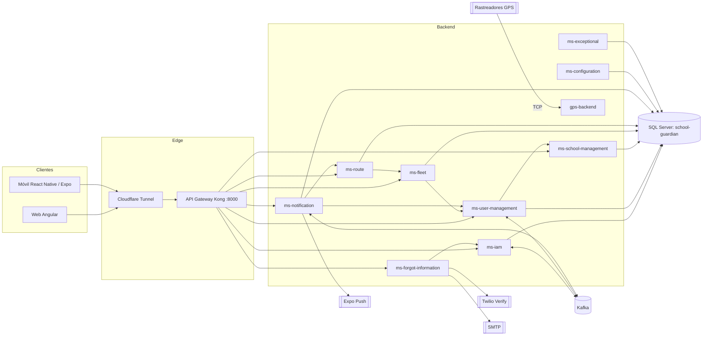

### 2.3 Tecnologías, lenguajes, frameworks y versiones

**Backend (microservicios).** El backend es **políglota**: la mayoría de servicios están en **.NET 10 (C#)** y dos en **Java 21 (Spring Boot)**.

| Componente | Lenguaje / Runtime | Framework y versiones clave | Evidencia |
|---|---|---|---|
| ms-configuration, ms-exceptional, ms-fleet, ms-notification, ms-route, ms-school-management, ms-user-management, sg-ms-forgot-information | C# / .NET `net10.0` | ASP.NET Core; EF Core 10.0.12; AutoMapper 16.2.0; Confluent.Kafka 2.15.1; Grpc.AspNetCore 2.84.0; JwtBearer 10.0.12; Scalar.AspNetCore 2.17.10 | `backend/*/src/*/*.Api.csproj` |
| ms-iam | Java 21 | Spring Boot 4.1.1; Spring Data JPA; Spring Security; Spring Kafka; jjwt 0.12.5; springdoc-openapi 3.0.0; scalar-webmvc 0.6.63 | `backend/ms-iam/pom.xml` |
| gps-backend | Java 21 | Spring Boot 4.1.1; Spring Web MVC; Spring Data JPA; mssql-jdbc; Lombok | `scholl-guardian-project/gps-backend/gps-backend/pom.xml` |
| API Gateway | — | Kong 3.9 (DB-less, config declarativa) | `backend/ms-api-gateway/docker-compose.yml` |
| Mensajería | — | Apache Kafka 4.1.0 en modo KRaft | `backend/kafka/docker-compose.yml` |
| Base de datos | — | Microsoft SQL Server 2022 | `database/docker-compose.yaml` |

**Frontend.**

| Componente | Tecnología | Versiones clave | Evidencia |
|---|---|---|---|
| Web | Angular (SPA + SSR) | Angular 21.2.9; Angular Material 21.2.3; Angular CDK 21.2.3; RxJS 7.8.2; TypeScript 5.9.x; NGX-Translate 17.0.0; Leaflet 1.9.4; Express 5.2.1 | `scholl-guardian-project/dvlp-front/dvlp-web/package.json` |
| Móvil | React Native + Expo | Expo 57.0.27; React 19.2.3; React Native 0.86.3; React Navigation 7; react-native-maps 1.27.2; i18next 26 | `scholl-guardian-project/dvlp-front/dvlp-movil/guardian-escolar/package.json` |
| Pruebas web | Vitest 4.1.0 sobre builder `@ngx-env/builder:unit-test` (jsdom) | — | `package.json`, `angular.json` |

**Contenedores e infraestructura.**

| Elemento | Imagen / versión | Evidencia |
|---|---|---|
| Runtime .NET | `mcr.microsoft.com/dotnet/aspnet:10.0` | `backend/*/src/*/Dockerfile` |
| SDK .NET (build) | `mcr.microsoft.com/dotnet/sdk:10.0` | ídem |
| Runtime Java (build) | `maven:3.9-eclipse-temurin-21` → `eclipse-temurin:21-jre` | `backend/ms-iam/Dockerfile` |
| Node (build web) | `node:20-alpine`; producción `nginx:alpine` | `dvlp-front/dvlp-web/{Dockerfile,dev.Dockerfile}` |
| Túnel | `cloudflare/cloudflared:2026.9.3` | `scholl-guardian-project/docker-compose.yml` |
| Red Docker compartida | `sg-services-network` (externa) | composes de cada servicio |

### 2.4 Resumen de la arquitectura (diagrama general)

El sistema se organiza en **cuatro planos**: clientes, borde (Edge), dominio (microservicios) e infraestructura (mensajería y datos). Los clientes sólo conocen el **API Gateway** (Kong), que enruta por prefijo hacia cada servicio. Los servicios colaboran de forma **síncrona** (REST y gRPC) y **asíncrona** (eventos Kafka). Cada servicio posee su propio esquema dentro de una única base de datos SQL Server.

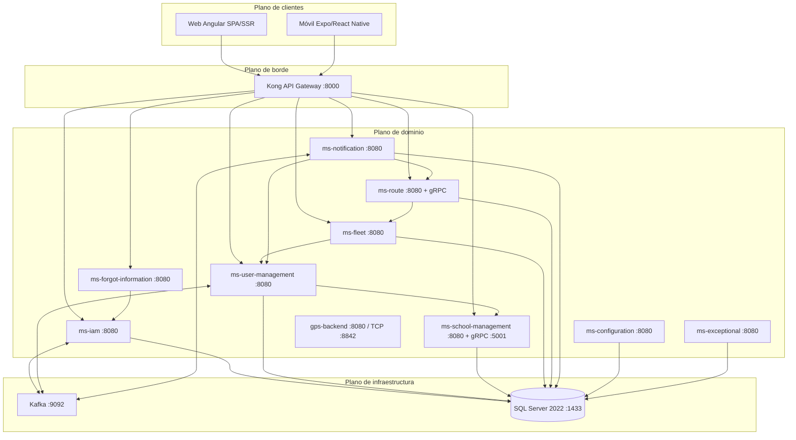

**Figura 2.1 — Diagrama general de la arquitectura.** La numeración de figuras sigue el estándar APA; cada figura se cita en el texto.

---

## 3. Arquitectura del sistema

### 3.1 Estilo arquitectónico y justificación

El sistema combina tres decisiones estructurales:

1. **Microservicios con arquitectura hexagonal (Ports & Adapters).** Cada servicio separa estrictamente:
   - **Dominio** (`Domain`): modelos y reglas de negocio, sin dependencias de frameworks.
   - **Aplicación** (`Application`): casos de uso que orquestan el dominio.
   - **Infraestructura** (`Infrastructure`): adaptadores de entrada (controladores REST, gRPC, consumidores Kafka) y de salida (persistencia, clientes HTTP, productores Kafka).

   La estructura de carpetas lo evidencia en todos los servicios (por ejemplo, `backend/ms-user-management/src/ms-user-management.Api/{Domain,Application,Infrastructure}` y, en Java, `backend/ms-iam/src/main/java/com/school_guardian/ms_iam/{domain,application,infrastructure}`). La **justificación** es la testabilidad del núcleo de negocio, el desacoplamiento de la tecnología y la posibilidad de cambiar un adaptador (por ejemplo, de motor de base de datos o de broker) sin tocar el dominio.

2. **Arquitectura orientada a eventos (event-driven) para la integración asíncrona.** Los eventos de creación de personas y de abordaje viajan por **Kafka**, desacoplando productores y consumidores y permitiendo que las notificaciones no bloqueen la operación principal.

3. **API Gateway único (Kong).** Centraliza el enrutamiento, CORS y control de tasa, y oculta la topología interna de los servicios a los clientes.

Como hallazgos de consistencia (ver secciones 3.5 y 9): el emisor real de JWT de ms-iam usa **HS256** simétrico (no RS256/JWKS), el *deny-list* de tokens es **en memoria** (no hay Redis en el repositorio) y ms-notification está implementado en **.NET**. Este manual documenta la realidad del código.

### 3.2 Diagrama de componentes y de despliegue

**Diagrama de componentes** (relaciones lógicas entre servicios, sus puertos y sus adaptadores externos):

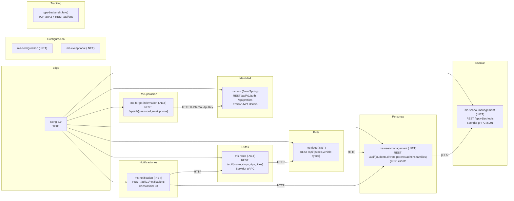

**Figura 3.1 — Diagrama de componentes.**

**Diagrama de despliegue** (contenedores Docker sobre la red `sg-services-network`):

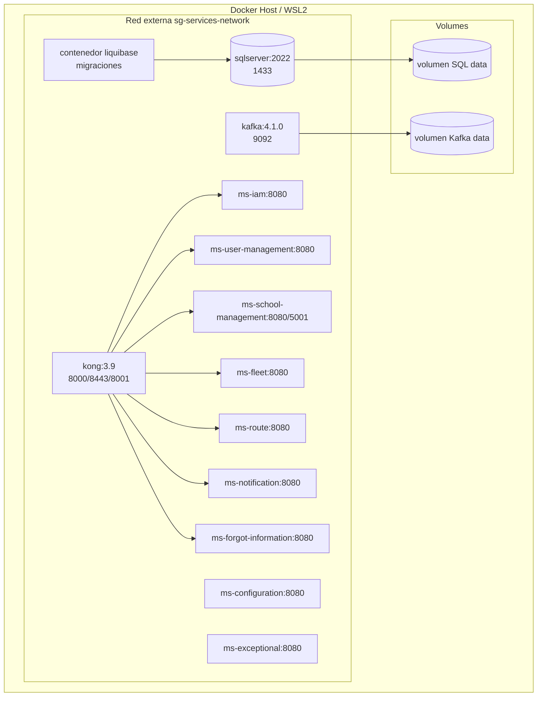

**Figura 3.2 — Diagrama de despliegue.** Cada servicio se ejecuta en su propio contenedor sobre la red compartida; Kong resuelve los servicios por nombre DNS de contenedor, no por puertos de host.

### 3.3 Descripción de módulos, capas y servicios

| Servicio | Bounded context | Esquema BD | Puerto(s) | Rol |
|---|---|---|---|---|
| **ms-iam** | Identidad y acceso | `Iam` | 8080 | Autenticación, perfiles, roles, términos, emisor de JWT |
| **ms-user-management** | Personas y familias | `UserManagement` | 8080 | Person, Profile (datos personales), familias, licencias |
| **ms-school-management** | Institucional | `School` (+`Geographic`) | 8080 / gRPC 5001 | Colegios, sedes y vínculo admin↔colegio |
| **ms-fleet** | Flota | `Fleet` | 8080 | Buses, marcas/modelos, asignación de conductores |
| **ms-route** | Rutas y viajes | `Route` | 8080 (+gRPC) | Rutas, paradas, asignaciones, ejecuciones y viajes |
| **ms-notification** | Notificaciones | `Notification` | 8080 | Alertas de abordaje, destinatarios, tokens de push |
| **ms-forgot-information** | Recuperación | `Settings`(*) | 8080 | OTP por correo/SMS y cambios de correo/teléfono |
| **ms-configuration** | Configuración | `Settings` | 8080 | Ajustes de plataforma y política de contraseñas |
| **ms-exceptional** | Usos excepcionales | `Settings`(†) | 8080 | Novedades de conductor/ruta (driver-usages, route-usages) |
| **gps-backend** | Tracking | `Gps` | 8080 / TCP 8842 | Ingesta de tramas GPS y consulta de posiciones |
| **ms-api-gateway** | Borde | — | 8000 | Gateway Kong |

(*) `sg-ms-forgot-information` usa su propia conexión; el esquema asociado en la documentación de datos no está aislado de forma explícita. (†) ms-exceptional persiste en su propia conexión; su esquema no figura como grupo independiente en el DBML (ver sección 4.3).

**Capas internas por servicio .NET.** El layout estándar es:

```
<servicio>/src/<servicio>.Api/
├── Domain/
│   ├── Model/          # Entidades y value objects
│   └── Ports/          # Interfaces (In = casos de uso, Out = repositorios/servicios)
├── Application/
│   ├── UseCase/        # Implementación de casos de uso
│   ├── Mapper/         # Perfiles AutoMapper
│   └── Dto/            # Objetos de transferencia
├── Infrastructure/
│   ├── Controller/     # Adaptadores de entrada REST
│   ├── Persistence/    # DbContext EF Core y repositorios
│   ├── External/       # Clientes HTTP a otros servicios
│   ├── Messaging/      # Productores/consumidores Kafka
│   ├── Grpc/           # Servicios y clientes gRPC
│   ├── Security/       # Autenticación/JWT
│   ├── Configuration/  # Tenant provider, DI
│   └── DependencyInjection/   # ServiceCollectionExtensions
├── Protos/             # Contratos .proto (si aplica)
├── Program.cs          # Composición de la aplicación
└── Dockerfile
```

### 3.4 Flujo de datos entre componentes

**Flujo A — Autenticación y consumo autenticado.**

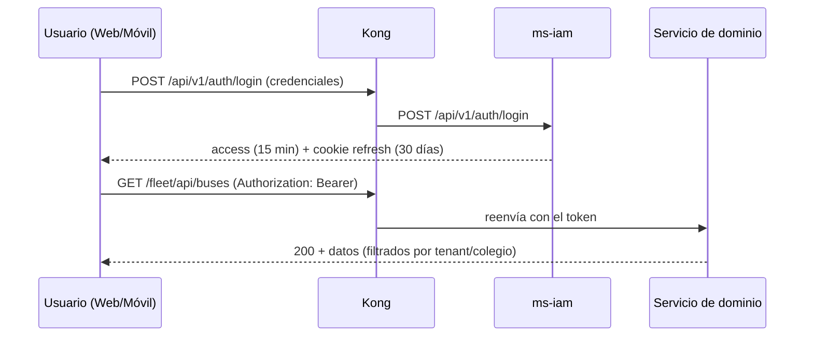

**Flujo B — Creación de persona y sincronización de identidad (event-driven).**

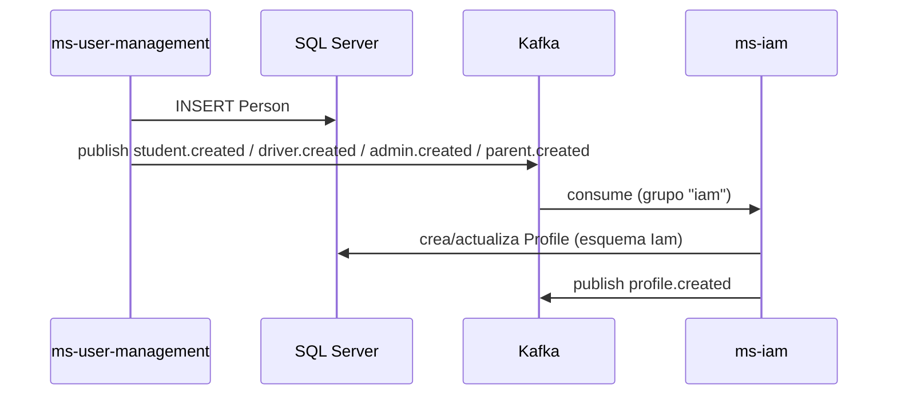

**Flujo C — Abordaje (escaneo) y notificación al acudiente.**

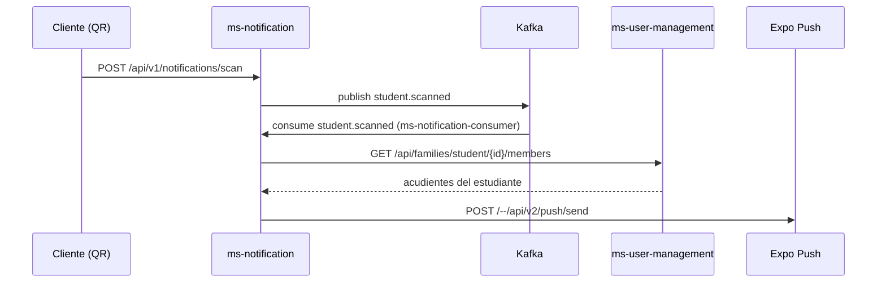

**Flujo D — Rastreo GPS en tiempo real.**

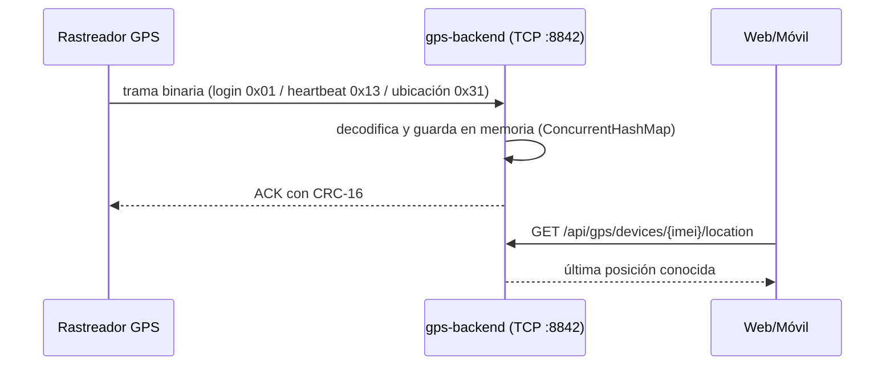

### 3.5 Patrones de diseño aplicados

| Patrón | Dónde se aplica | Evidencia |
|---|---|---|
| **Ports & Adapters (Hexagonal)** | Todos los microservicios | Carpetas `Domain/Ports`, `Application/UseCase`, `Infrastructure/…` |
| **Dependency Injection** | .NET (`ServiceCollectionExtensions`) y Java (Spring) | `Infrastructure/DependencyInjection/ServiceCollectionExtensions.cs`; `@Service`, `@Repository` |
| **Repository** | Acceso a datos detrás de interfaces de puerto | `IBusRepository`, `IPersonRepository`, repositorios Spring Data |
| **DTO + Mapper (AutoMapper)** | Traducción dominio↔API | `Application/Mapper`, `AddAutoMapper` en `Program.cs` |
| **API Gateway** | Enrutamiento, CORS, rate limiting | `backend/ms-api-gateway/kong/kong.yml` |
| **Publish/Subscribe (eventos)** | Integración vía Kafka | `KafkaEventPublisher`, consumidores `*.Consumer` |
| **gRPC (RPC síncrono)** | Comunicación entre servicios internos | `SchoolManagementGrpcClient`, `RouteGrpcService`, `FamilyGrpcService` |
| **Strategy** | Estrategias de búsqueda | `PlateSearchStrategy`, `NameSearchStrategy` (ms-fleet/ms-user-management) |
| **Provider / Tenant resolver** | Filtrado multi-colegio | `ITenantProvider`, `HttpContextTenantProvider`, `JwtTenantProvider` |
| **Hosted Service (Background)** | Consumo Kafka en segundo plano | `StudentScannedConsumer` como `IHostedService` |
| **Problem Details (RFC 7807)** | Errores uniformes en API y cliente | Middleware de excepciones; `core/http/problem-detail.ts` |
| **Rate Limiting** | Protección de endpoints | Middleware ASP.NET Core (`writes`, `registration`, `otp-public`) y plugin Kong |

> **Hallazgos de consistencia** (registrados): (1) el emisor de JWT de ms-iam firma con **HS256** simétrico (no RS256/JWKS); (2) el *deny-list* de tokens es **en memoria** (`InMemoryTokenDenyList`), sin Redis; (3) el servicio de notificaciones está implementado en **.NET**; (4) la configuración gRPC de ms-iam está **declarada pero no implementada** (`application.properties` referencia `grpc.school-management.*` sin dependencia ni cliente gRPC en `pom.xml`).

---

## 4. Modelo de datos

### 4.1 Diagrama entidad–relación

El modelo se materializa en **una base de datos SQL Server** llamada `school-guardian`, organizada por **esquema-por-servicio** (patrón *schema-per-service*). El DBML canónico es `database/db-school-guardian.dbml` (34 tablas agrupadas en 9 esquemas). Por su extensión, el ER se presenta por dominios.

**Dominio de identidad y acceso (esquema `Iam`):**

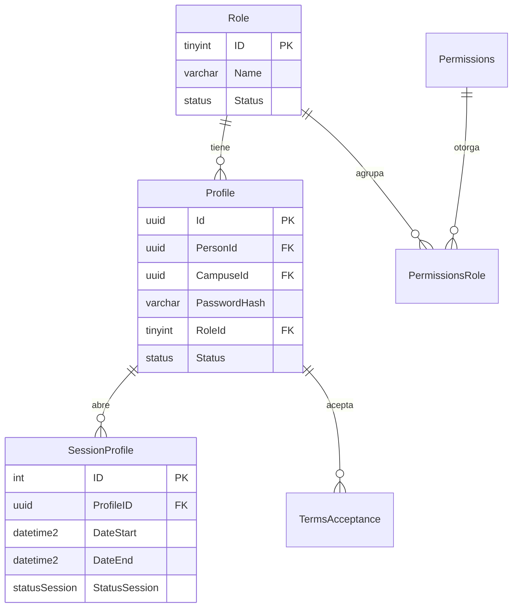

**Figura 4.1 — ER del dominio de identidad.**

**Dominio de personas y familias (esquema `UserManagement`):**

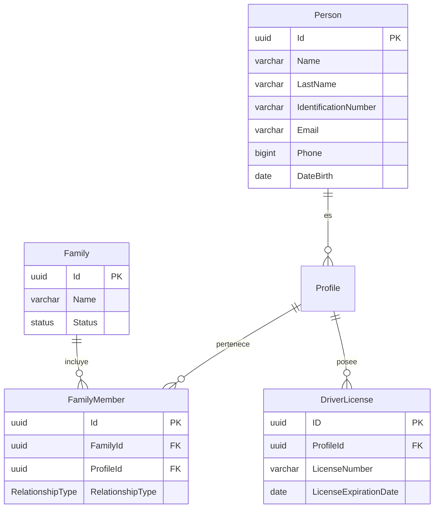

**Figura 4.2 — ER de personas y familias.**

**Dominio institucional (`School` + `Geographic`):**

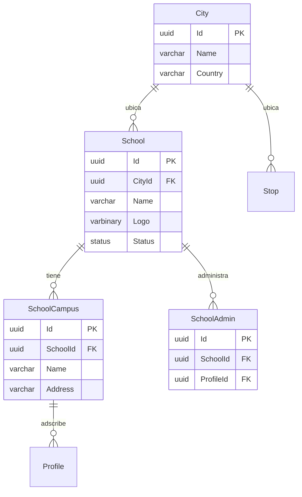

**Figura 4.3 — ER institucional y geográfico.**

**Dominio de rutas, flota y seguimiento (`Route`, `Bus`, `Gps`, `Notification`):**

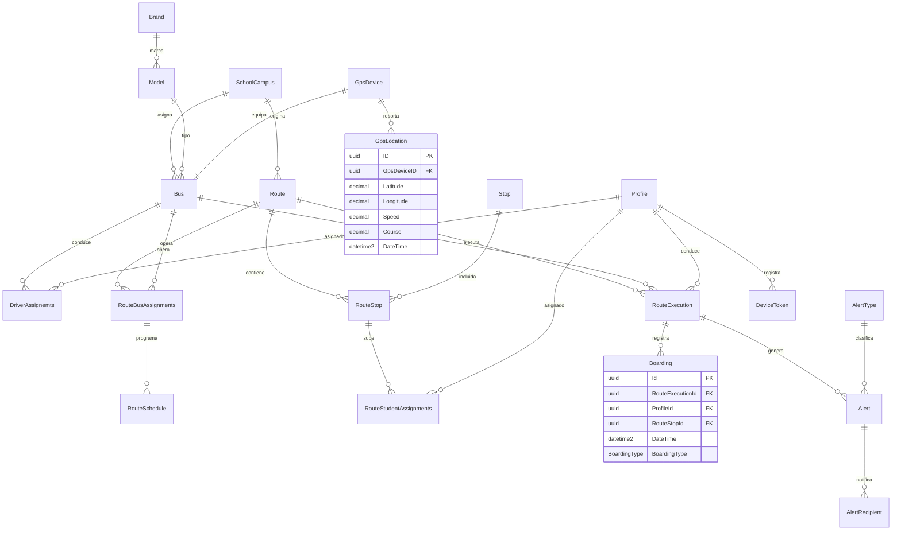

**Figura 4.4 — ER de rutas, flota, GPS y notificaciones.**

### 4.2 Diccionario de datos

A continuación se documentan las tablas principales con sus campos, tipos y restricciones. La fuente única es `database/db-school-guardian.dbml`.

**Esquema `Iam`.**

| Tabla | Campo | Tipo | Restricciones | Descripción |
|---|---|---|---|---|
| **Profile** | Id | uuid | PK, not null | Identificador del perfil (cuenta de acceso). |
| | PersonId | uuid | FK → Person.Id, not null | Persona asociada. |
| | CampuseId | uuid | FK → SchoolCampus.Id, null | Sede a la que se adscribe el perfil. |
| | PasswordHash | varchar(100) | not null | Hash de contraseña (BCrypt). |
| | RoleId | tinyint | FK → Role.Id, not null | Rol del perfil. |
| | Status | status | not null, default `Active` | Estado lógico. |
| **Role** | ID | tinyint | PK, not null | Identificador del rol (1=Admin, 2=Student, 3=Driver, 4=Parent, 5=SuperAdmin). |
| | Name | varchar(20) | not null, unique | Nombre del rol. |
| | Description | varchar(100) | not null | Descripción. |
| | Status | status | not null, default `Active` | Estado. |
| **SessionProfile** | ID | int | PK, increment | Identificador de sesión. |
| | ProfileID | uuid | FK → Profile.ID, not null | Perfil. |
| | DateStart / DateEnd | datetime2 | not null | Vigencia de la sesión. |
| | IPAddress | varchar(50) | not null | IP de origen. |
| | StatusSession | StatusSession | not null, default `Active` | Estado de la sesión. |
| **Permissions** | Id | tinyint | PK, increment | Permiso. |
| | TypePermissions | varchar(100) | not null | Tipo/nombre del permiso. |
| | Description | varchar(150) | not null | Descripción. |
| **PermissionsRole** | Id | tinyint | PK, increment | Relación permiso-rol. |
| | PermissionsId | tinyint | FK → Permissions.Id, not null | Permiso. |
| | RoleId | tinyint | FK → Role.Id, not null | Rol. |
| **TermsAcceptance** | Id | uuid | PK | Identificador. |
| | ProfileId | uuid | FK → Profile.Id, not null | Quien acepta. |
| | StudentProfileId | uuid | FK → Profile.Id, null | Estudiante en cuyo nombre se acepta. |
| | TermsVersion | varchar(20) | not null | Versión de términos. |
| | AcceptedAt | datetime2 | not null | Fecha/hora de aceptación. |
| | IpAddress | varchar(50) | null | IP. |
| | Channel | varchar(20) | not null, default `mobile` | Canal (mobile/web). |

**Esquema `UserManagement`.**

| Tabla | Campo | Tipo | Restricciones | Descripción |
|---|---|---|---|---|
| **Person** | Id | uuid | PK, not null | Identificador de la persona. |
| | Name / LastName | varchar(50) | not null | Nombres y apellidos. |
| | IdentificationType | Identificationtype | not null, default `TI` | Tipo de documento. |
| | IdentificationNumber | varchar(20) | not null, unique | Número de documento. |
| | Email | varchar(50) | not null, unique | Correo. |
| | Phone | bigint | not null | Teléfono. |
| | ResidenceAddress | varchar(50) | not null | Dirección. |
| | DateBirth | date | not null | Fecha de nacimiento. |
| **Family** | Id | uuid | PK | Identificador de familia. |
| | Name | varchar(50) | not null | Nombre. |
| | Observations | varchar(100) | not null | Observaciones. |
| | Status | status | not null, default `Active` | Estado. |
| **FamilyMember** | Id | uuid | PK | Identificador de miembro. |
| | FamilyId | uuid | FK → Family.Id, not null | Familia. |
| | ProfileId | uuid | FK → Profile.Id, not null | Perfil miembro. |
| | RelationshipType | RelationshipType | default `Parent` | Parent o Student. |
| **DriverLicense** | ID | uuid | PK | Identificador de licencia. |
| | ProfileId | uuid | FK → Profile.Id, not null | Conductor. |
| | LicenseNumber | varchar(20) | not null, unique | Número de licencia. |
| | LicenseExpirationDate | date | not null | Vencimiento. |

**Esquema `School`.**

| Tabla | Campo | Tipo | Restricciones | Descripción |
|---|---|---|---|---|
| **School** | Id | uuid | PK | Colegio. |
| | CityId | uuid | FK → City.Id, not null | Ciudad. |
| | Logo | varbinary(max) | not null | Logo. |
| | Name | varchar(30) | not null | Nombre. |
| | Address | varchar(30) | not null | Dirección. |
| | Phone | int | not null | Teléfono. |
| | Email | varchar(50) | not null | Correo. |
| | Website | varchar(100) | null | Sitio web. |
| | Theme | varchar(20) | null | Tema visual. |
| **SchoolCampus** | Id | uuid | PK | Sede. |
| | SchoolId | uuid | FK → School.Id, not null | Colegio. |
| | Name / Address | varchar(30) | not null | Nombre y dirección. |
| **SchoolAdmin** | Id | uuid | PK | Vínculo admin-colegio. |
| | SchoolId | uuid | FK → School.Id, not null | Colegio. |
| | ProfileId | uuid | FK → Profile.Id, not null, unique | Administrador. |

**Esquema `Geographic`.**

| Tabla | Campo | Tipo | Restricciones | Descripción |
|---|---|---|---|---|
| **City** | Id | uuid | PK | Ciudad. |
| | Name | varchar(40) | not null | Nombre. |
| | Country | varchar(30) | not null | País. |

**Esquema `Fleet` (grupo *Bus*).**

| Tabla | Campo | Tipo | Restricciones | Descripción |
|---|---|---|---|---|
| **Bus** | Id | uuid | PK, not null | Bus. |
| | CampuseId | uuid | FK → SchoolCampus.Id, not null | Sede. |
| | SoatValidity | date | not null | Vigencia SOAT. |
| | GpsDeviceId | uuid | FK → GpsDevice.Id, not null, unique | Dispositivo GPS. |
| | Capacity | tinyint | not null | Capacidad. |
| | Plate | varchar(15) | not null, unique | Placa. |
| | ModelId | tinyint | FK → Model.Id, not null | Modelo. |
| **Brand** | Id / Name | tinyint / varchar(30) | PK / — | Marca. |
| **Model** | Id / BrandId / Name | tinyint / tinyint / varchar(30) | PK / FK / — | Modelo. |
| **DriverAssignemts** | Id | uuid | PK | Asignación conductor-bus. |
| | ProfileId | uuid | FK → Profile.Id, not null | Conductor. |
| | BusId | uuid | FK → Bus.Id, not null | Bus. |
| | AssignedFrom / AssignedTo | date | not null / null | Vigencia. |

> Se conserva el nombre físico `DriverAssignemts` (tal como está en la base y el DBML), aunque contiene una errata ortográfica.

**Esquema `Route`.**

| Tabla | Campo | Tipo | Restricciones | Descripción |
|---|---|---|---|---|
| **Route** | Id | uuid | PK | Ruta. |
| | CampuseId | uuid | FK → SchoolCampus.Id, not null | Sede. |
| | Name / TargetSector | varchar(30) | not null | Nombre y sector objetivo. |
| | StartTime / EndTime | time | not null | Horario. |
| **Stop** | Id | uuid | PK | Parada. |
| | CityId / SchoolId | uuid | FK, not null | Ciudad y colegio. |
| | Name | varchar(30) | not null | Nombre. |
| | Address | varchar(100) | not null | Dirección. |
| | Longitude / Latitude | decimal(10,7) | not null | Coordenadas. |
| **RouteStop** | Id | uuid | PK | Parada dentro de la ruta. |
| | RouteId / StopId | uuid | FK, not null | Ruta y parada. |
| | OrderSequence | int | not null | Orden de la parada. |
| **RouteStudentAssignments** | Id | uuid | PK | Asignación estudiante→parada. |
| | ProfileId | uuid | FK → Profile.Id, not null | Estudiante. |
| | RouteStopId | uuid | FK → RouteStop.Id, not null | Parada. |
| **RouteBusAssignments** | Id | uuid | PK | Asignación bus→ruta. |
| | BusId / RouteId | uuid | FK, not null | Bus y ruta. |
| **RouteSchedule** | Id | uuid | PK | Programación. |
| | RouteBusAssignmentsId | uuid | FK, not null | Asignación bus-ruta. |
| | DayOfWeek | DayOfWeek | not null, default `Monday` | Día. |
| | Direction | varchar(10) | not null | Sentido. |
| | StartTime | time | not null | Hora. |
| **RouteExecution** | ID | uuid | PK | Ejecución/viaje. |
| | BusId / DriverId | uuid | FK, not null | Bus y conductor. |
| | RouteId | uuid | FK, null | Ruta. |
| | StartDateTime / EndDateTime | datetime2 | not null / null | Inicio y fin. |

**Esquema `Gps`.**

| Tabla | Campo | Tipo | Restricciones | Descripción |
|---|---|---|---|---|
| **GpsDevice** | ID | uuid | PK | Dispositivo GPS. |
| | Imei | varchar(20) | not null, unique | IMEI. |
| | LastConnection | datetime2 | not null | Última conexión. |
| | GpsStatus | bit | not null | Estado. |
| **GpsLocation** | ID | uuid | PK | Lectura de posición. |
| | GpsDeviceID | uuid | FK → GpsDevice.ID, not null | Dispositivo. |
| | Latitude / Longitude | decimal(10,7) | not null | Coordenadas. |
| | Speed / Course | decimal(8,2) | not null | Velocidad y rumbo. |
| | DateTime | datetime2 | not null | Marca temporal. |

**Esquema `Notification`.**

| Tabla | Campo | Tipo | Restricciones | Descripción |
|---|---|---|---|---|
| **Boarding** | Id | uuid | PK | Abordaje/descenso. |
| | RouteExecutionId / ProfileId / RouteStopId | uuid | FK, not null | Ejecución, estudiante y parada. |
| | DateTime | datetime2 | not null | Fecha/hora (automática). |
| | BoardingType | BoardingType | not null, default `ON_BOARD` | ON_BOARD / OFF_BOARD. |
| **Alert** | Id | uuid | PK | Alerta. |
| | RouteExecutionId / ProfileId | uuid | FK, not null | Contexto y origen. |
| | AlertTypeId | tinyint | FK → AlertType.Id, not null | Tipo. |
| | Description / AcknowledgedAt | varchar(100) / datetime2 | null | Detalle y acuse. |
| **AlertType** | Id | tinyint | PK, increment | Tipo de alerta. |
| | Name / Description | varchar / varchar | not null | Detalle. |
| | UrgencyLevel | tinyint | not null | Urgencia. |
| **AlertRecipient** | ID | uuid | PK | Destinatario de alerta. |
| | AlertId / ProfileId | uuid | FK, not null | Alerta y perfil. |
| | DateTimeRead | datetime2 | not null | Lectura. |
| **DeviceToken** | Id | uuid | PK | Token push. |
| | ProfileId | uuid | FK → Profile.Id, not null | Perfil. |
| | ExpoToken | varchar(300) | not null, unique | Token de Expo. |
| | UpdatedAt | datetime2 | not null | Actualización. |

**Esquema `Settings` (grupo *Configuration*).**

| Tabla | Campo | Tipo | Restricciones | Descripción |
|---|---|---|---|---|
| **SecuritySettings** | Id | tinyint | PK, increment | Ajuste. |
| | NameSettings | varchar(100) | not null, unique | Clave del ajuste. |
| | ValueSettings | varchar(100) | not null | Valor. |
| | Description | varchar(150) | not null | Descripción. |
| **PasswordPolicies** | Id | tinyint | PK, increment | Política. |
| | MinLongitude / MaxLongitude | tinyint | not null | Longitud mínima/máxima. |
| | RequiresCapitalLetters / RequiresNumbers / RequiresSymbols | tinyint | not null | Requisitos. |
| | ExpirationDays | tinyint | not null | Días de expiración. |

### 4.3 Índices, vistas, procedimientos almacenados y triggers

Se verificaron los *changelogs* de Liquibase de cada módulo (`database/ms-*-db/`). La conclusión es explícita:

- **Vistas:** no existen. Los changelogs `05-view` de todos los módulos contienen `databaseChangeLog: []`.
- **Funciones:** no existen. Changelogs `06-functions` vacíos.
- **Procedimientos almacenados:** no existen. Changelogs `07-procedure` vacíos.
- **Triggers:** no existen. Changelogs `08-triggers` vacíos.
- **Tipos definidos por usuario:** no existen. Changelogs `02-types` vacíos.
- **Índices:** no se declaran índices explícitos adicionales a las claves primarias y restricciones `unique` definidas en el DDL de tablas. Las claves foráneas generan los índices implícitos propios del motor.

> **Hallazgos del modelo de datos:** (1) existe una carpeta `ms-audit-db` **vacía** (el servicio de auditoría fue eliminado del proyecto, ver commits `58ddf08` y `102fbb2`), por lo que **no hay esquema `Audit`**; (2) no hay un grupo `Exceptional` independiente en el DBML aunque el microservicio ms-exceptional persiste datos; (3) el diccionario se documenta a nivel de tipo y restricción del DBML; los detalles de colación, `NULL`/`NOT NULL` a nivel de columna y precisión se conservan en los changelogs Liquibase.

### 4.4 Estrategia de respaldo y recuperación

El repositorio **no incluye** scripts de respaldo ni política de retención documentada para la base de datos. Por transparencia, se documenta la limitación y se recomienda la siguiente estrategia basada en las capacidades del motor:

- **Respaldo completo diario** de la base `school-guardian` (SQL Server `BACKUP DATABASE`).
- **Respaldos diferenciales** cada 6 horas y **respaldos de log** cada 15 minutos en modo de recuperación completa (reduce el RPO a menos de 15 minutos).
- **Persistencia del volumen** de datos SQL Server mediante volumen Docker dedicado (el `docker-compose.yaml` de `database/` usa un volumen para los datos).
- **Validación de restauración** periódica en un entorno aislado.
- **Recuperación ante desastres:** el SRS (RNF-08) fija objetivos de **RTO/RPO** por escenario (servicio < 2 min / 0; BD primaria < 5 min / < 1 s; zona de disponibilidad < 15 min / < 5 min; región < 4 h / < 1 h). *Nota:* estos objetivos provienen del requisito, no de una configuración verificada en el repositorio.

---

## 5. Estructura del código fuente

### 5.1 Repositorios y estrategia de ramas

El proyecto **no vive en un único repositorio**: el código se distribuye en repositorios git independientes (`backend`, `database`, `scholl-guardian-project`, entre otros). El proyecto usa **Conventional Commits** y ramas por propósito: `main` (estable), `dev` (integración), `feat/*`, `fix/*`, `chore/*`, `hotfix/*`.

| Área | Contenido | Rama observada |
|---|---|---|
| Documentación | Entregables bilingües y este manual | `main` |
| Base de datos | DBML, changelogs Liquibase y compose de SQL Server | trabajo sobre una única rama (`database`) |
| Backend | 10 microservicios, Kafka y gateway | ramas por microservicio/feature |
| Frontend | Web, móvil y gps-backend | ramas por feature (p. ej. `fix/legal-page-shared-imports`) |

### 5.2 Árbol de carpetas y paquetes

**Backend (por servicio):**

```
backend/
├── ms-api-gateway/           # Kong (config declarativa kong/kong.yml, docker-compose.yml)
├── ms-iam/                   # Java 21 + Spring Boot 4.1.1 (hexagonal)
│   ├── pom.xml
│   ├── Dockerfile
│   └── src/main/java/com/school_guardian/ms_iam/
│       ├── domain/{model,port/{in,out},event,exception}
│       ├── application/{dto,usecase}
│       └── infrastructure/{config,messaging,persistence,security,web}
├── ms-user-management/       # .NET 10
├── ms-school-management/     # .NET 10 (+ servidor gRPC)
├── ms-fleet/                 # .NET 10
├── ms-route/                 # .NET 10 (+ servidor gRPC)
├── ms-notification/          # .NET 10 (consumidor Kafka + push Expo)
├── sg-ms-forgot-information/ # .NET 10 (OTP por correo/SMS)
├── ms-configuration/         # .NET 10
├── ms-exceptional/           # .NET 10
└── kafka/                    # Broker + init/create-topics.sh + topics.conf
```

Cada servicio .NET repite el layout estándar descrito en la sección 3.3.

**Base de datos (`database/`):**

```
database/
├── db-school-guardian.dbml       # Modelo canónico (34 tablas, 9 esquemas)
├── docker-compose.yaml           # SQL Server 2022 + contenedores Liquibase
├── .env / .env.example
├── ms-iam-db/        {01-ddl,02-types,05-view,06-functions,07-procedure,08-triggers}/changelog.yaml
├── ms-user-management-db/
├── ms-school-db/
├── ms-geographic-db/
├── ms-fleet-db/
├── ms-route-db/
├── ms-gps-db/
├── ms-notification-db/
├── ms-settings-db/
└── ms-audit-db/                  # VACÍA (servicio eliminado)
```

**Frontend (`scholl-guardian-project/`):**

```
scholl-guardian-project/
├── dvlp-front/
│   ├── dvlp-web/                 # Angular 21 (src/app/{core,features,shared})
│   └── dvlp-movil/guardian-escolar/  # React Native + Expo
├── gps-backend/gps-backend/      # Java 21 + Spring Boot (TCP + REST /api/gps)
├── scripts/verify-api.sh         # Smoke test frontend→Kong→microservicios
├── docs/                         # Material de gestión/análisis
└── docker-compose.yml            # Solo frontend web + túneles Cloudflare
```

**Frontend web (Angular), estructura de `src/app/`:**

```
src/app/
├── core/
│   ├── guards/role.guard.ts
│   ├── services/  (auth, buses, routes, stops, students, …, auth.interceptor.ts)
│   ├── http/problem-detail.ts
│   ├── models/    (bus, city, family, route, school, stop, student)
│   └── validators/form-validators.ts
├── features/
│   ├── public/    (home, contact, auth/login, auth/forgot-password, legal/terms, legal/privacy)
│   ├── admin/     (users/pages/{students,guardians,drivers,families}, routes-buses/pages/{buses,routes,stops})
│   ├── dashboard/ (dashboard-admin, dashboard-superadmin)
│   ├── profile/pages/ (information-admin, change-email, change-password, change-contact)
│   └── superadmin/ (admins/pages/admins, schools/pages/schools)
├── shared/        (components/{cards,modal,navbar,location-map,…}, directives, footer, main)
├── app.config.ts  (router, Http con interceptor, hydration, i18n)
└── app.routes.ts  (rutas con roleGuard)
```

### 5.3 Convenciones de codificación y nomenclatura

| Aspecto | Convención | Evidencia |
|---|---|---|
| API REST | Sustantivos en plural, versión en el prefijo (`/api/v1/…`) | controladores de todos los servicios |
| Rutas internas Kong | Prefijo por servicio (`/user`, `/fleet`, `/school-management`, `/route`, `/notification`) | `kong.yml` |
| Entidades/BD | PascalCase en tablas y columnas; esquemas por servicio | `db-school-guardian.dbml` |
| .NET | C# con `PascalCase` para tipos/métodos; puertos con prefijo `I` (`IBusRepository`) | `Domain/Ports` |
| Java | Paquete base `com.school_guardian.ms_iam`; `camelCase` en métodos; Spring stereotypes | `ms-iam/src/main` |
| Angular | Componentes standalone; alias de rutas `@core/*`, `@features/*`, `@shared/*` | `tsconfig.json` |
| Commits | Conventional Commits (`feat:`, `fix:`, `chore:`) | historial de los repositorios |
| Documentación | `kebab-case.md`, IDs estables (`RF`, `RNF`, `HU`, `UC`…) | repositorios del proyecto |
| Frontend (móvil) | Componentes por tipo (`buttons`, `cards`, `inputs`, `modals`) y `features` | `guardian-escolar/src` |

### 5.4 Dependencias y librerías (versión y licencia)

**Backend .NET (común):** ASP.NET Core (`net10.0`), Entity Framework Core 10.0.12, AutoMapper 16.2.0, Confluent.Kafka 2.15.1, Grpc.AspNetCore 2.84.0, Microsoft.AspNetCore.Authentication.JwtBearer 10.0.12, Scalar.AspNetCore 2.17.10, Twilio 8.0.2 (solo forgot-information). Licencias: mayoría **MIT**; EF Core y ASP.NET Core **MIT**; AutoMapper **MIT**; Confluent.Kafka **Apache-2.0**; Grpc.AspNetCore **Apache-2.0**; Twilio **MIT**.

**Backend Java:** Spring Boot 4.1.1 (Apache-2.0), Spring Data JPA / Security / Kafka (Apache-2.0), jjwt 0.12.5 (Apache-2.0), springdoc-openapi 3.0.0 (Apache-2.0), scalar-webmvc 0.6.63 (MIT), Lombok (MIT), mssql-jdbc (MIT).

**Web (Angular):**

| Paquete | Versión | Licencia |
|---|---|---|
| @angular/core, common, router, forms, platform-browser, platform-server | 21.2.9 | MIT |
| @angular/material / @angular/cdk | 21.2.3 | MIT |
| @angular/ssr | 21.2.10 | MIT |
| @angular/cli / @angular/build | 21.2.7 | MIT |
| @ngx-translate/core / http-loader | 17.0.0 | MIT |
| rxjs | 7.8.2 | Apache-2.0 |
| tslib | 2.8.1 | 0BSD |
| zone.js | 0.16.3 | MIT |
| leaflet | 1.9.4 | BSD-2-Clause |
| @phosphor-icons/web | 2.1.2 | MIT |
| express | 5.2.1 | MIT |
| typescript | 5.9.3 | Apache-2.0 |
| vitest | 4.1.0 | MIT |
| prettier | 3.8.1 | MIT |
| jsdom | 28.1.0 | MIT |

**Móvil (React Native / Expo):**

| Paquete | Versión | Licencia |
|---|---|---|
| expo | 57.0.27 | MIT |
| react / react-dom | 19.2.3 | MIT |
| react-native | 0.86.3 | MIT |
| @react-navigation/native / stack / bottom-tabs | 7.x | MIT |
| react-native-maps | 1.27.2 | MIT |
| react-native-svg | 15.15.4 | MIT |
| react-native-qrcode-svg | 6.3.26 | MIT |
| i18next / react-i18next | 26.x / 17.x | MIT |
| @react-native-async-storage/async-storage | 2.2.0 | MIT |
| expo-location | 57.0.20 | MIT |

**GPS backend:** Spring Boot (Apache-2.0), mssql-jdbc (MIT), Lombok (MIT).

> **Nota de licencias:** la tabla anterior se verificó directamente en los `package.json`/`pom.xml`/`.csproj` del proyecto.

---

## 6. Descripción de módulos y componentes

Esta sección describe cada servicio: su responsabilidad, los casos de uso y clases principales, sus entradas/salidas y sus dependencias. Los endpoints concretos se detallan en la sección 7.

### 6.1 ms-iam (identidad y acceso)

- **Responsabilidad:** autenticación, emisión y validación de JWT, perfiles/roles, sesiones, términos y aceptaciones; expone endpoints internos de gestión de perfil.
- **Casos de uso y clases clave:** `SignInService`/`AuthController` (login), `RefreshTokenService`, `LogoutService` (`TokenDenyList` → `InMemoryTokenDenyList`), `CreateProfileService` (publica `profile.created`), `PersonCreatedConsumer` (consume `*.created` y `admin.school.updated`), `JwtTokenProvider`, `InternalApiKeyFilter`, `SecurityConfig`.
- **Entradas/salidas:** entrada REST (`/api/v1/auth/*`, `/api/profiles/*`) y eventos Kafka de entrada/salida; salida a la base `Iam`.
- **Dependencias:** Spring Data JPA (SQL Server), Spring Security, Spring Kafka, jjwt.
- **Reglas de negocio:** contraseña cifrada con BCrypt y validada contra un patrón (8–72 caracteres, al menos mayúscula, minúscula, dígito y símbolo); token de acceso 15 min y refresh 30 días; versión de términos vigente `2026.08`; los endpoints `/api/profiles/**` exigen el rol interno (`ROLE_INTERNAL_SERVICE`) mediante la cabecera `X-Internal-Api-Key`.

### 6.2 ms-user-management (personas y familias)

- **Responsabilidad:** CRUD de personas por rol (estudiantes, conductores, acudientes, administradores), familias y licencias de conducción; es el **dueño del dato de la persona**.
- **Casos de uso/controladores:** `Admin/Driver/Parent/Student` controllers; `FamilyController`; `DriverLicenseController`; `ProfileLookupController` (`/api/profiles/{id}/exists`, `/name`). Publica eventos `student.created`, `driver.created`, `parent.created`, `admin.created` y `admin.school.updated`.
- **Entradas/salidas:** REST (`/api/{students,drivers,parents,admins,families,driver-licenses}`); cliente gRPC `SchoolManagementGrpcClient`; productor Kafka.
- **Dependencias:** EF Core (pool 60), AutoMapper, Confluent.Kafka, Grpc.Net.Client.
- **Reglas de negocio:** el colegio/sede se valida contra ms-school-management vía gRPC antes de crear; los datos se filtran por el colegio del token (tenant). Ejemplo de asignación: un administrador se vincula a un colegio (`LinkAdminSchool`).

### 6.3 ms-school-management (institucional)

- **Responsabilidad:** colegios y sedes; vínculo administrador↔colegio; **directorio escolar** consumido por otros servicios.
- **Casos de uso/controladores:** `SchoolController` (`/api/v1/schools`, incluido `with-campuses`), `CampusController`; servidor gRPC `SchoolManagementService` (RPC `GetAdminSchool`, `GetCampus`, `GetCampusByName`, `LinkAdminSchool`, `GetSchool`).
- **Entradas/salidas:** REST y **gRPC en `:5001` (h2c)**; salida a esquema `School`.
- **Dependencias:** EF Core (pool 64), AutoMapper, Grpc.AspNetCore.
- **Reglas de negocio:** una sede pertenece a un colegio; un administrador se vincula a un colegio mediante `SchoolAdmin`; el servicio es la **fuente autoritativa** de sedes/colegios para el resto del sistema.

### 6.4 ms-fleet (flota)

- **Responsabilidad:** parque automotor: buses, marcas/modelos y asignación de conductores a buses.
- **Casos de uso/controladores:** `BusController` (`/api/buses`), `VehicleTypesController`/`VehicleTypeController` (`/api/vehicle-types`).
- **Entradas/salidas:** REST; salida HTTP a ms-user-management (`IamService`, para validar perfil/nombre) y a un servicio GPS (`GpsDeviceService`).
- **Dependencias:** EF Core, AutoMapper, cliente HTTP tipado.
- **Reglas de negocio:** placa única; un bus tiene un GPS único y una capacidad; la asignación de conductor tiene vigencia (`AssignedFrom`/`AssignedTo`).
- **Hallazgos:** controladores duplicados (`VehicleTypeController` y `VehicleTypesController`); `GpsDeviceService` sin `BaseAddress` configurado; dependencia `Grpc.AspNetCore` y `Protos/profile.proto` no usados.

### 6.5 ms-route (rutas y viajes)

- **Responsabilidad:** rutas, paradas, asignaciones (bus, estudiantes), programación, ejecuciones y viajes.
- **Casos de uso/controladores:** `RouteController`, `RouteDetailController`, `RouteAssignmentController`, `StopController`, `TripController`, `CityController`; **servidor gRPC** `RouteService` (12 RPC).
- **Entradas/salidas:** REST (`/api/{routes,stops,trips,cities}`) y gRPC; salida HTTP a ms-fleet (`/api/buses/assigned/{profileId}`).
- **Dependencias:** EF Core, AutoMapper, Grpc.AspNetCore, cliente HTTP tipado.
- **Reglas de negocio:** las paradas de una ruta tienen orden (`OrderSequence`); un viaje (`RouteExecution`) asocia bus y conductor; `GET /api/routes/current` devuelve la ruta vigente del usuario según el token.
- **Hallazgo:** `Confluent.Kafka` referenciado pero **no usado** en el código.

### 6.6 ms-notification (notificaciones)

- **Responsabilidad:** registro de escaneos de abordaje y notificación a acudientes (push Expo); almacén de tokens de dispositivos.
- **Casos de uso/controladores:** `NotificationController` (`/api/v1/notifications`, `/scan`, `/guardian/{profileId}`, `/devices`); `ProcessScanService` (publica `student.scanned`); `StudentScannedConsumer` (consume `student.scanned` y hace push).
- **Entradas/salidas:** REST; consumo/producción Kafka; HTTP a ms-user-management (`/api/families/student/{id}/members`) y a Expo.
- **Dependencias:** EF Core, Confluent.Kafka, HttpClient.
- **Reglas de negocio:** al recibir un escaneo se determina el conjunto de destinatarios (familia del estudiante) y se crean `AlertRecipient`; luego se envía la notificación push.
- **Hallazgo:** `MapOpenApi()`/`MapScalarApiReference()` se registran dos veces (duplicación).

### 6.7 sg-ms-forgot-information (recuperación y cambio de datos)

- **Responsabilidad:** recuperación de contraseña anónima y flujos de cambio de correo y de teléfono mediante OTP.
- **Casos de uso/controladores:** `PasswordController` (`/api/v1/password/{forgot,forgot/verify,reset}`), `EmailChangeController` (`/api/v1/email/change/*`), `PhoneChangeController` (`/api/v1/phone/change/*`), servicio `VerificationCodeService`.
- **Entradas/salidas:** REST (anónimo); salida HTTP a ms-iam con cabecera `X-Internal-Api-Key`; integración con SMTP y Twilio.
- **Dependencias:** EF Core, HttpClient, Twilio, SMTP.
- **Reglas de negocio:** los códigos OTP se validan con *pepper* (`OTP_HASH_PEPPER`); límite de 10 req/min por IP y un limitador interno por perfil; los flujos de teléfono responden `503` si Twilio no está configurado; validación *fail-fast* de SMTP/clave interna fuera de `Development`.

### 6.8 ms-configuration (configuración)

- **Responsabilidad:** ajustes de la plataforma y políticas de contraseñas.
- **Casos de uso/controladores:** `SettingController` (`/api/settings`), `PasswordPolicyController` (`/api/password-policies`).
- **Entradas/salidas:** REST; salida al esquema `Settings`.
- **Dependencias:** EF Core.
- **Reglas de negocio:** las operaciones de escritura están limitadas a 30 req/min (`writes`).

### 6.9 ms-exceptional (usos excepcionales)

- **Responsabilidad:** registrar novedades de conductores y rutas (eventos excepcionales).
- **Casos de uso/controladores:** `DriverUsageController` (`/api/driver-usages`), `RouteUsageController` (`/api/route-usages`).
- **Entradas/salidas:** REST; persistencia propia.
- **Dependencias:** EF Core.
- **Nota:** el servicio no tiene ruta en Kong (no es accesible desde el exterior en la configuración actual).

### 6.10 gps-backend (ingesta GPS)

- **Responsabilidad:** recibir tramas binarias de rastreadores GPS por **TCP** y exponer la última posición por REST.
- **Componentes clave:** `GpsTcpServer` (puerto TCP **8842**), `GpsFrameDecoder`, `GpsPacketRouter`, handlers por protocolo (`0x01` login, `0x13` heartbeat, `0x31` ubicación, `0x32` alarma, `0x50` LBS, `0x80` comando, `79 79` legacy), `GpsLocationService`/`GpsDeviceService` en memoria, `GpsAckService` (ACK con CRC-16).
- **Entradas/salidas:** entrada TCP de dispositivos y REST `GET /api/gps/devices/{imei}/{connected|location|history}`.
- **Dependencias:** Spring Web MVC (el DataSource/JPA están **desactivados** en `application.properties`).
- **Limitación:** la persistencia es **en memoria** (mapas concurrentes), no SQL Server; el puerto REST es 8080 y el TCP 8842; no tiene Dockerfile propio.

### 6.11 API Gateway (Kong) y Kafka

- **Kong:** expone 7 servicios (ms-iam, ms-user-management, ms-fleet, ms-school-management, ms-notification, ms-route, ms-forgot-information) con plugins `cors` y `rate-limiting`.
- **Kafka:** broker `apache/kafka:4.1.0` (KRaft, nodo único), tópicos declarados en `kafka/init/topics.conf`: `student.created`, `driver.created`, `admin.created`, `parent.created`, `profile.created`, `student.scanned`. Además se produce/consume `admin.school.updated` **sin declararse** en `topics.conf`.

### 6.12 Frontend web y móvil

- **Web (Angular 21):** SPA con *roleGuard*; rutas públicas (home, contacto, login, recuperación, términos, privacidad), de administrador (usuarios, flota, rutas, perfil, cambios de datos) y de superadministrador (admins, colegios). Servicios REST por dominio contra Kong. SSR/pre-render configurable; i18n con 4 idiomas (es, en, fr, pt); interceptor que añade el token y renueva ante 401.
- **Móvil (React Native/Expo):** login, datos personales, familia, notificaciones, ruta, perfil, seguridad, recuperación, idioma y apariencia; consumo de API mediante `apiClient` con renovación de token; mapa (`react-native-maps`), cámara/QR (`expo-camera`, `react-native-qrcode-svg`) y ubicación (`expo-location`).
- **Hallazgos:** no hay *lazy loading* real en la web (todos los componentes se importan directamente); `core/interceptors/auth.interceptor.ts` está **vacío** (el interceptor real es `core/services/auth.interceptor.ts`).

---

## 7. Documentación de APIs e integraciones

### 7.1 Endpoints

La puerta de entrada pública es **Kong** en `http://<host>:8000`. Kong enruta por prefijo; los servicios reciben las peticiones en su puerto interno `8080`. La tabla siguiente resume los servicios expuestos y su prefijo.

| Servicio | Prefijo en Kong | Upstream |
|---|---|---|
| ms-iam | `/api/v1/auth` (strip_path = false) | `http://ms-iam:8080` |
| ms-user-management | `/user` | `http://ms-user-management:8080` |
| ms-fleet | `/fleet` | `http://ms-fleet:8080` |
| ms-school-management | `/school-management` | `http://ms-school-management:8080` |
| ms-notification | `/notification` (solo GET/POST) | `http://ms-notification:8080` |
| ms-route | `/route` | `http://ms-route:8080` |
| ms-forgot-information | `/api/v1/password` (strip_path = false) | `http://ms-forgot-information:8080` |

**ms-iam.**

| Método | Ruta | Descripción |
|---|---|---|
| GET | `/api/v1/auth/profile` | Perfil del usuario autenticado. |
| POST | `/api/v1/auth/login` | Inicia sesión; devuelve access token y cookie de refresh. |
| POST | `/api/v1/auth/refresh` | Renueva el access token usando la cookie. |
| POST | `/api/v1/auth/logout` | Cierra sesión e invalida el token. |
| GET | `/api/v1/auth/terms/status` | Estado de aceptación de términos. |
| GET | `/api/v1/auth/terms/acceptances` | Historial de aceptaciones. |
| POST | `/api/v1/auth/terms/accept` | Acepta términos vigentes. |
| GET | `/api/profiles/by-email` | (Interno) Busca perfil por correo. |
| PUT | `/api/profiles/{id}/password` | (Interno) Cambia contraseña. |
| PUT | `/api/profiles/{id}/email` | (Interno) Cambia correo. |
| POST | `/api/profiles/{id}/phone/matches` | (Interno) Verifica coincidencia de teléfono. |
| PUT | `/api/profiles/{id}/phone` | (Interno) Cambia teléfono. |

**ms-user-management** (prefijo `/user`).

| Método | Ruta | Descripción |
|---|---|---|
| POST/GET | `/api/admins` | Crea / lista administradores. |
| GET/PUT/DELETE | `/api/admins/{id}` | Consulta / actualiza / elimina administrador. |
| GET | `/api/admins/search` | Búsqueda. |
| POST/GET | `/api/drivers` · `/api/parents` · `/api/students` | Mismos verbos que admins. |
| GET/PUT/DELETE | `/api/drivers/{id}` · `/api/parents/{id}` · `/api/students/{id}` | Detalle/actualización/eliminación. |
| POST/GET | `/api/driver-licenses` | Crea / lista licencias. |
| GET/PUT/DELETE | `/api/driver-licenses/{id}` | Detalle/actualización/eliminación. |
| POST/GET | `/api/families` | Crea / lista familias. |
| GET | `/api/families/search` · `/api/families/{id}` | Búsqueda / detalle. |
| GET | `/api/families/student/{studentProfileId}/members` | Miembros acudientes de un estudiante. |
| PUT/DELETE | `/api/families/{id}` | Actualiza / elimina familia. |
| GET | `/api/profiles/{id}/exists` · `/api/profiles/{id}/name` | (Interno) Existencia y nombre de perfil. |

**ms-school-management** (prefijo `/school-management`).

| Método | Ruta | Descripción |
|---|---|---|
| POST | `/api/v1/schools` · `/api/v1/schools/with-campuses` | Crea colegio (con o sin sedes). |
| GET | `/api/v1/schools` · `/api/v1/schools/search` · `/api/v1/schools/{id}` | Lista / búsqueda / detalle. |
| GET | `/api/v1/schools/{id}/campuses` · `/api/v1/schools/{schoolId}/campuses` | Sedes del colegio. |
| PUT | `/api/v1/schools/{id}` · `/with-campuses` | Actualiza colegio. |
| DELETE | `/api/v1/schools/{id}` | Elimina colegio. |

**ms-fleet** (prefijo `/fleet`).

| Método | Ruta | Descripción |
|---|---|---|
| GET | `/api/vehicle-types/brands` · `/api/vehicle-types/models` | Marcas y modelos. |
| POST/GET | `/api/buses` | Crea / lista buses. |
| GET | `/api/buses/search` · `/api/buses/{id}` · `/api/buses/assigned/{profileId}` | Búsqueda / detalle / buses de un conductor. |
| PUT/PATCH/DELETE | `/api/buses/{id}` · `/api/buses/{id}/status` | Actualiza / cambia estado / elimina. |
| PUT/DELETE | `/api/buses/{busId}/driver` | Asigna / retira conductor. |

**ms-route** (prefijo `/route`).

| Método | Ruta | Descripción |
|---|---|---|
| POST/GET | `/api/routes` · `/api/routes/search` · `/api/routes/{id}` | Crea / lista / busca / detalle de rutas. |
| PUT/DELETE | `/api/routes/{id}` | Actualiza / elimina ruta. |
| GET | `/api/routes/current` · `/api/routes/today` · `/api/routes/student/{id}` | Ruta vigente / del día / de un estudiante. |
| POST | `/api/routes/{routeId}/stops` · `/api/routes/{routeId}/students` | Añade parada / estudiante. |
| PUT | `/api/routes/{routeId}/bus` | Asigna bus a la ruta. |
| GET | `/api/routes/{routeId}/students/{studentProfileId}` | Verifica asignación de estudiante. |
| POST/GET | `/api/stops` · `/api/stops/search` · `/api/stops/{id}` | CRUD de paradas. |
| POST | `/api/trips/start` · `/api/trips/end` | Inicia / finaliza viaje. |
| GET | `/api/trips/current` | Viaje en curso. |
| GET | `/api/cities` | Ciudades. |

**ms-notification** (prefijo `/notification`).

| Método | Ruta | Descripción |
|---|---|---|
| POST | `/api/v1/notifications/scan` | Registra un escaneo (abordaje) y dispara notificación. |
| GET | `/api/v1/notifications/guardian/{profileId}` | Notificaciones de un acudiente. |
| POST | `/api/v1/notifications/devices` | Registra token de dispositivo (Expo). |

**sg-ms-forgot-information** (prefijo `/api/v1/password` externo; internamente `/api/v1/{password,email/change,phone/change}`).

| Método | Ruta | Descripción |
|---|---|---|
| POST | `/api/v1/password/forgot` | Solicita OTP de recuperación. |
| POST | `/api/v1/password/forgot/verify` | Verifica OTP. |
| POST | `/api/v1/password/reset` | Restablece contraseña. |
| POST | `/api/v1/email/change/request` · `/verify` · `/new` · `/resend-new` · `/verify-new` · `/confirm` | Flujo de cambio de correo. |
| POST | `/api/v1/phone/change/request` · `/verify` · `/verification/request` · `/verification/resend` · `/verification/check` | Flujo de cambio de teléfono. |
| GET | `/health` | Salud del servicio. |

**ms-configuration** (no expuesto por Kong).

| Método | Ruta | Descripción |
|---|---|---|
| GET | `/api/settings` · `/api/settings/{name}` | Lista / consulta ajuste. |
| PUT | `/api/settings/{name}` | Actualiza ajuste. |
| GET/PUT | `/api/password-policies` · `/api/password-policies/{id}` | Políticas de contraseña. |

**ms-exceptional** (no expuesto por Kong).

| Método | Ruta | Descripción |
|---|---|---|
| GET/POST | `/api/driver-usages` | Novedades de conductor. |
| GET/POST | `/api/route-usages` | Novedades de ruta. |

**gps-backend.**

| Método | Ruta | Descripción |
|---|---|---|
| GET | `/api/gps/devices/{imei}` | Estado del dispositivo. |
| GET | `/api/gps/devices/{imei}/connected` | ¿Está conectado? |
| GET | `/api/gps/devices/{imei}/location` | Última ubicación. |
| GET | `/api/gps/devices/{imei}/history` | Historial. |
| POST | `/api/gps/test/{imei}` | Inyección de prueba. |

**Ejemplo de petición y respuesta — inicio de sesión.**

Solicitud:

```json
POST /api/v1/auth/login
Content-Type: application/json

{
  "email": "admin@colegio.edu.co",
  "password": "Adm1n!Segura"
}
```

Respuesta `200 OK`:

```json
{
  "token": "eyJhbGciOiJIUzI1NiJ9.eyJzdWIiOiI3YzE...",
  "expiresIn": 900,
  "roleId": 1,
  "personId": "3f2b8c10-...",
  "email": "admin@colegio.edu.co",
  "schoolId": "a1b2c3d4-..."
}
```

La respuesta establece además la cookie `refresh_token` (`HttpOnly`, `Secure`, `SameSite=Strict`, ruta `/api/v1/auth/refresh`, 30 días).

**Ejemplo de petición y respuesta — creación de un bus (a través de Kong).**

Solicitud:

```json
POST /fleet/api/buses
Authorization: Bearer <access_token>
Content-Type: application/json

{
  "plate": "ABC123",
  "capacity": 40,
  "modelId": 3,
  "campuseId": "9d8c7b6a-...",
  "gpsDeviceId": "1a2b3c4d-...",
  "soatValidity": "2027-05-31"
}
```

Respuesta `201 Created`:

```json
{
  "id": "b7e6d5c4-...",
  "plate": "ABC123",
  "capacity": 40,
  "modelId": 3,
  "status": "Active"
}
```

**Ejemplo de respuesta de error (RFC 7807).**

```json
{
  "type": "https://httpstatuses.com/400",
  "title": "Solicitud inválida",
  "status": 400,
  "detail": "La placa 'ABC123' ya está registrada.",
  "instance": "/fleet/api/buses"
}
```

### 7.2 Códigos de estado y errores

El backend adopta un esquema REST convencional; los errores de aplicación se exponen como **Problem Details (RFC 7807)** y el cliente web los interpreta mediante `core/http/problem-detail.ts`.

| Código | Significado | Uso típico |
|---|---|---|
| 200 | OK | Consulta/actualización exitosa. |
| 201 | Created | Recurso creado (buses, rutas, estudiantes…). |
| 204 | No Content | Eliminación exitosa. |
| 400 | Bad Request | Validación de entrada fallida. |
| 401 | Unauthorized | Token ausente/expirado (el cliente intenta *refresh*). |
| 403 | Forbidden | Rol/permiso insuficiente o clave interna inválida. |
| 404 | Not Found | Recurso inexistente. |
| 409 | Conflict | Duplicado (placa, identificación, correo). |
| 429 | Too Many Requests | Límite de tasa excedido (Kong o middleware). |
| 500 | Internal Server Error | Error no controlado. |
| 503 | Service Unavailable | Dependencia externa no configurada (p. ej. Twilio). |

### 7.3 Autenticación y autorización

- **Emisor:** únicamente **ms-iam**; firma **HS256** con clave simétrica configurable.
- **Claims del access token:** `sub` (ProfileId), `personId`, `roleId`, `type=access`, `jti`, y según el caso `email`, `campusId`, `schoolId`.
- **Refresh token:** `sub`, `type=refresh`, sin `jti`; viaja en cookie `HttpOnly`/`Secure`/`SameSite=Strict`.
- **Vigencia:** access **15 minutos**, refresh **30 días**.
- **Revocación:** lista de tokens denegados **en memoria** (`InMemoryTokenDenyList`); no se comparte entre réplicas (limitación de escalado).
- **Consumo en servicios .NET:** todos los servicios validan el JWT con `JwtBearer` para **filtrado por tenant** (el colegio/sede del token), pero **no** declaran políticas de autorización `[Authorize]` ni `UseAuthorization`. Es decir, la autenticación se usa para el aislamiento de datos, no para bloquear el endpoint a nivel de servicio.
- **Autorización interna entre servicios:** la cabecera `X-Internal-Api-Key` protege `/api/profiles/**` de ms-iam (cabecera validada en tiempo constante con `MessageDigest.isEqual`), otorgando `ROLE_INTERNAL_SERVICE`. La usa `sg-ms-forgot-information`.
- **Roles del sistema:** `ADMIN=1`, `STUDENT=2`, `DRIVER=3`, `PARENT=4`, `SUPER_ADMIN=5` (semillas `001-insert-roles.sql` y `002-insert-rol-super-admin.sql`). El frontend aplica `roleGuard` para restringir rutas por rol.

### 7.4 Integraciones con sistemas externos

| Integración | Protocolo / Formato | Credenciales | Notas |
|---|---|---|---|
| Rastreadores GPS → gps-backend | TCP binario (protocolo propietario, tramas con CRC-16) | — | Puertos `0x01` login, `0x13` heartbeat, `0x31` ubicación, `0x32` alarma, `0x50` LBS, `0x80` comando, `79 79` legacy. |
| Servicios ↔ Kafka | TCP Kafka (KRaft) | — | Tópicos de dominio (sección 7.5). |
| ms-user-management → ms-school-management | gRPC (HTTP/2) | — | `http://ms-school-management:5001`. |
| ms-fleet → ms-user-management | HTTP/JSON | JWT/tenant | Valida existencia y nombre de perfil. |
| ms-route → ms-fleet | HTTP/JSON | JWT/tenant | Buses asignados a un conductor. |
| ms-notification → ms-user-management | HTTP/JSON | JWT/tenant | Miembros de familia del estudiante. |
| sg-ms-forgot-information → ms-iam | HTTP/JSON | `X-Internal-Api-Key` | Cambios de correo/contraseña/teléfono. |
| ms-notification → Expo | HTTPS/JSON | — | `https://exp.host/--/api/v2/push/send`. |
| sg-ms-forgot-information → Twilio | HTTPS/JSON | `TWILIO_*` | Verificación por SMS; 503 si no está configurado. |
| sg-ms-forgot-information → SMTP | SMTP/TLS | `SMTP_*` | Envío de códigos OTP por correo. |
| Clientes → Edge | HTTPS (Cloudflare Tunnel en desarrollo) | — | `cloudflared` expone Kong y el servicio de contraseñas. |

**Gestión de credenciales:** las credenciales externas se inyectan por **variables de entorno** y **no** se exponen a los clientes. La sección 8.4 y la sección 9 detallan el estado de la gestión de secretos y los hallazgos asociados.

### 7.5 Mensajería (Kafka)

| Tópico | Productor | Consumidor | Propósito |
|---|---|---|---|
| `student.created` | ms-user-management | ms-iam | Sincronizar perfil del estudiante. |
| `driver.created` | ms-user-management | ms-iam | Sincronizar perfil del conductor. |
| `parent.created` | ms-user-management | ms-iam | Sincronizar perfil del acudiente. |
| `admin.created` | ms-user-management | ms-iam | Sincronizar perfil del administrador. |
| `admin.school.updated` | ms-user-management | ms-iam | Actualizar vínculo admin↔colegio (**no declarado** en `topics.conf`). |
| `profile.created` | ms-iam | *(ninguno en el repo)* | Notifica creación de perfil (sin consumidor). |
| `student.scanned` | ms-notification | ms-notification | Dispara la notificación de abordaje. |

Tópicos declarados con 1 partición y factor de replicación 1 (entorno de desarrollo). La serialización en .NET usa `System.Text.Json`; ms-iam usa un deserializador JSON con paquetes de confianza abiertos.

---

## 8. Configuración

### 8.1 Archivos de configuración y su propósito

| Archivo | Ámbito | Propósito |
|---|---|---|
| `appsettings.json` / `appsettings.Development.json` | Servicios .NET | Configuración (cadenas de conexión, JWT, URLs internas, Kestrel). |
| `.env` / `.env.example` | Cada servicio y la BD | Variables de entorno (se inyectan al contenedor). |
| `docker-compose.yml` / `docker-compose.yaml` | Cada servicio, Kafka y BD | Definición de contenedores, puertos, redes y variables. |
| `application.properties` | ms-iam y gps-backend | Configuración Spring (datasource, JPA, JWT, Kafka). |
| `launchSettings.json` | Servicios .NET (algunos) | Perfiles de ejecución local y puertos de desarrollo. |
| `kong/kong.yml` | ms-api-gateway | Config declarativa DB-less de Kong (servicios, rutas, plugins). |
| `kafka/init/topics.conf` + `create-topics.sh` | Kafka | Creación de tópicos al iniciar. |
| `.env`, `environment.ts`, `angular.json` | Web Angular | URL de API y configuración de build. |
| `.env`, `app.json`, `eas.json` | Móvil Expo | URL de API, permisos y perfiles EAS. |

### 8.2 Variables de entorno

| Variable | Servicio(s) | Descripción | Valor por defecto | ¿Obligatoria? |
|---|---|---|---|---|
| `ConnectionStrings__DefaultConnection` | Servicios .NET | Cadena de conexión SQL Server (`school-guardian`). | — | Sí |
| `Kafka__BootstrapServers` | Varios .NET | Dirección del broker Kafka. | `kafka:9092` (según compose) | Según servicio |
| `Jwt__Secret` / `JWT_SECRET` | Servicios .NET / ms-iam | Clave de firma JWT. | Literal de ejemplo (`your-256-bit-...`) | Sí en producción |
| `Services__UserManagement__BaseUrl` | ms-notification | URL de ms-user-management. | — | Sí |
| `Services__Route__BaseUrl` | ms-notification | URL de ms-route. | — | Sí |
| `Iam__BaseUrl` | ms-fleet | URL del servicio de perfiles (apunta a ms-user-management). | `http://ms-user-management:8080` | Sí |
| `Fleet__BaseUrl` | ms-route | URL de ms-fleet. | `http://ms-fleet:8080` | Sí |
| `SchoolManagement__GrpcAddress` | ms-user-management | Dirección gRPC de ms-school-management. | `http://ms-school-management:5001` | Sí |
| `APP_INTERNAL_API_KEY` / `INTERNAL_API_KEY` | ms-iam / forgot-information | Clave de API interna. | — | Sí (ms-iam la exige) |
| `OTP_HASH_PEPPER` | sg-ms-forgot-information | *Pepper* para hashing de OTP. | — | Sí |
| `SMTP__*` (host, port, user, password) | sg-ms-forgot-information | Servidor de correo. | — | Sí en prod |
| `TWILIO_*` (account Sid, api key, secret) | sg-ms-forgot-information | Verificación SMS. | — | No (503 si falta) |
| `CORS_ALLOWED_ORIGIN` | sg-ms-forgot-information | Origen CORS permitido. | `http://localhost:4200` | No |
| `MSSQL_DATABASE` / `MSSQL_USER` / `MSSQL_SA_PASSWORD` | ms-iam / BD | Parámetros de SQL Server. | — | Sí |
| `KAFKA_BOOTSTRAP_SERVERS` | ms-iam | Broker para Spring Kafka. | — | Sí |
| `APP_URL` / `ASPNETCORE_URLS` | Servicios .NET | URL/endpoint de escucha. | `:8080` | No |
| `API_URL` | Web Angular | URL del gateway (Kong). | `http://localhost:8000` | Sí |
| `EXPO_PUBLIC_API_URL` | Móvil | URL pública del backend (túnel). | — | Sí |
| `Kestrel__Endpoints__*` | ms-route / ms-school-management | Endpoints HTTP/1 y HTTP/2 (gRPC). | `8080` / `5001` | No |

### 8.3 Configuración por ambiente

| Ambiente | Red | Base de datos | Gateway | Observaciones |
|---|---|---|---|---|
| **Desarrollo** | Docker Compose + red `sg-services-network` | SQL Server 2022 en contenedor (`1433`), base `school-guardian` | Kong `:8000` | Túneles Cloudflare; HTTPS no requerido; se usa el secreto JWT de ejemplo. |
| **Pruebas** | Igual que desarrollo; datos aislados | Instancia separada o esquema recreado por Liquibase | Kong | Se usa en la verificación posdespliegue. |
| **Producción** | Orquestación (Docker/Kubernetes; K8s es aspiracional) | SQL Server gestionado con respaldos; TLS | Kong con TLS | Requiere secretos reales, HTTPS/TLS 1.2+, escalado y observabilidad. |

La aplicación **se configura exclusivamente por variables de entorno** (RNF-07), lo que permite promover el mismo artefacto entre ambientes.

### 8.4 Gestión de secretos

El diseño prevé inyección de secretos por entorno. **Hallazgo crítico:** en el árbol de trabajo existen archivos `.env` con **credenciales reales** (contraseña `sa` de SQL Server, clave de API interna, secretos SMTP/Twilio y *pepper* de OTP). Aunque los `.env` están excluidos por `.gitignore` en algunos casos, el hallazgo es que **deben rotarse** las credenciales potencialmente comprometidas y migrarse a un gestor de secretos (por ejemplo, secretos de Docker/Kubernetes, Vault o secretos del proveedor de nube). Los `.env.example` usan *placeholders* y son la referencia correcta.

---

## 9. Seguridad

### 9.1 Roles, permisos y control de acceso

- **Roles de negocio:** `SUPER_ADMIN` (operador de plataforma), `ADMIN` (administrador escolar), `DRIVER` (conductor), `PARENT` (acudiente) y `STUDENT` (estudiante). La semilla de la base fija sus identificadores 1–5.
- **Control de acceso en el cliente:** el `roleGuard` de la web restringe rutas por rol (`dashboard-admin` para ADMIN/SUPER_ADMIN, `dashboard-superadmin` y gestión de colegios/admins solo SUPER_ADMIN).
- **Control de acceso en el backend:** el JWT identifica al usuario y su colegio; los servicios filtran los datos por **tenant** (`ITenantProvider`). El aislamiento entre colegios depende de esta resolución del tenant a partir del token.
- **Autorización entre servicios:** clave interna (`X-Internal-Api-Key`) para los endpoints sensibles de ms-iam.
- **Limitación documentada:** los servicios .NET no aplican `[Authorize]` a nivel de endpoint; la autenticación se usa para multi-tenant, no como barrera explícita de autorización. Se recomienda endurecer esto antes de producción.

### 9.2 Cifrado de datos y comunicaciones

- **Contraseñas:** se almacenan con **BCrypt** (`PasswordEncoderConfig` en ms-iam) y se validan contra una política (longitud 8–72 y combinación de mayúscula, minúscula, dígito y símbolo).
- **Tokens:** el access token es un JWT firmado; el refresh token viaja en cookie `HttpOnly`/`Secure`/`SameSite=Strict` (mitiga XSS y CSRF en el flujo de refresh).
- **OTP:** los códigos se almacenan hasheados con *pepper* (`OTP_HASH_PEPPER`).
- **Transporte:** se prevé HTTPS/TLS 1.2+ (RNF-04); en desarrollo el tráfico interno es HTTP dentro de la red Docker y el acceso externo se realiza vía Cloudflare Tunnel (HTTPS en el borde).
- **Datos de menores (PII):** el SRS incluye requisitos de protección de datos personales (Ley 1581 de 2012 y Decreto 1377 de 2013) y la aceptación de términos con consentimiento parental (`TermsAcceptance` con `StudentProfileId`).

### 9.3 Auditoría y registro de actividad

- El diseño original contemplaba un microservicio de **auditoría** (esquema `Audit` y carpeta `ms-audit-db`), pero **fue eliminado** del proyecto (la carpeta está vacía y no hay esquema `Audit`). Por tanto, **no existe un servicio de auditoría dedicado** en la versión actual.
- Persisten mecanismos parciales de trazabilidad: `SessionProfile` (sesiones con IP y vigencia), `TermsAcceptance` (aceptaciones con IP y canal), `AlertRecipient` (lectura de alertas) y los campos de fecha/hora en las entidades.
- Los servicios registran mediante el sistema de logging estándar (.NET `ILogger`/Serilog y Spring `Logback`); el **formato JSON con *correlation ID*** está previsto en el requisito de observabilidad (RNF-05) pero **no se verificó** su implementación en el código.

### 9.4 Buenas prácticas y vulnerabilidades mitigadas

**Buenas prácticas aplicadas.**

- Arquitectura hexagonal y separación de responsabilidades (superficie de ataque y de cambio reducida).
- Hashing de contraseñas con BCrypt y política de complejidad.
- Validación de clave interna en **tiempo constante** (`MessageDigest.isEqual`) para evitar *timing attacks*.
- Cookies de refresco `HttpOnly`+`Secure`+`SameSite`.
- **Rate limiting** en dos capas: Kong (300 req/min por credencial; 10 req/min por IP en recuperación) y middleware por servicio (`writes` 30/min, `registration` 30/min, `otp-public` 10/min).
- Manejo uniforme de errores con Problem Details (evita filtración de *stack traces* al cliente).
- Validación de entrada (Spring Validation / DataAnnotations) y CORS restringido por origen.
- Contenedores multi-stage con imágenes base oficiales y mínimas (runtime sin SDK).

**Vulnerabilidades y riesgos identificados (deuda técnica).**

| # | Hallazgo | Riesgo | Recomendación |
|---|---|---|---|
| 1 | Secretos reales en `.env` del árbol de trabajo | Compromiso de credenciales | Rotar y migrar a gestor de secretos. |
| 2 | Secreto JWT de ejemplo como literal por defecto | Falsificación de tokens si no se sobreescribe | Exigir `JWT_SECRET` en producción (fail-fast). |
| 3 | *Deny-list* de tokens en memoria | Logout no efectivo con múltiples réplicas | Migrar a un almacén compartido (p. ej., Redis). |
| 4 | Servicios .NET sin `[Authorize]` | Endpoints solo protegidos por el borde | Añadir autorización por rol/scope en cada servicio. |
| 5 | Exposición GPS no enrutada por Kong | Posible dependencia de acceso directo inseguro | Definir ruta/autenticación para la API GPS. |
| 6 | Firma **HS256** (simétrica) en lugar del RS256 previsto | Clave compartida en cada validador | Adoptar RS256/JWKS (clave privada solo en ms-iam). |
| 7 | Controladores duplicados y config muerta (gRPC ms-iam, Kafka ms-route) | Superficie/errores sutiles | Depurar rutas y dependencias no usadas. |
| 8 | Sin *outbox* transaccional en Kafka | Eventos perdidos si falla el broker tras el commit | Patrón outbox + `acks=all` + DLQ. |
| 9 | `admin.school.updated` fuera de `topics.conf` | Depende de autocreación de tópicos | Declarar el tópico explícitamente. |
| 10 | GPS con persistencia en memoria | Pérdida de datos al reiniciar | Persistir en SQL Server (JPA está desactivado). |

---

## 10. Referencias

Las referencias siguen el estilo **APA 7.ª edición**.

Becker, C., & Beck, K. (s. f.). *Conventional Commits 1.0.0*. https://www.conventionalcommits.org/

Fielding, R., & Reschke, J. (2014). *Hypertext Transfer Protocol (HTTP/1.1): Semantics and content* (RFC 7231). Internet Engineering Task Force. https://doi.org/10.17487/RFC7231

Google. (s. f.). *API design guide*. https://cloud.google.com/apis/design

International Organization for Standardization. (2011). *Systems and software quality requirements and evaluation (SQuaRE) — System and software quality models* (ISO/IEC 25010:2011). https://www.iso.org/standard/35733.html

International Organization for Standardization. (2017). *Systems and software engineering — Software life cycle processes* (ISO/IEC/IEEE 12207:2017). https://www.iso.org/standard/63712.html

Internet Engineering Task Force. (2015). *JSON Web Token (JWT)* (RFC 7519). https://doi.org/10.17487/RFC7519

Internet Engineering Task Force. (2016). *Problem Details for HTTP APIs* (RFC 7807). https://doi.org/10.17487/RFC7807

Kong Inc. (s. f.). *Kong Gateway documentation*. https://docs.konghq.com/

Liquibase. (s. f.). *Liquibase documentation*. https://docs.liquibase.com/

Microsoft. (s. f.). *ASP.NET Core documentation*. https://learn.microsoft.com/aspnet/core

Microsoft. (s. f.). *Entity Framework Core documentation*. https://learn.microsoft.com/ef/core

OWASP Foundation. (2021). *OWASP Top 10:2021 — The ten most critical web application security risks*. https://owasp.org/Top10/

Pivotal Software. (s. f.). *Spring Boot reference documentation*. https://docs.spring.io/spring-boot/

Tolk, A. (s. f.). *gRPC documentation*. https://grpc.io/docs/

Apache Software Foundation. (s. f.). *Apache Kafka documentation*. https://kafka.apache.org/documentation/

Apache Software Foundation. (s. f.). *Apache License 2.0*. https://www.apache.org/licenses/LICENSE-2.0

OpenJS Foundation. (s. f.). *Node.js documentation*. https://nodejs.org/docs/

---

*Fin del Manual Técnico — Parte A.*

